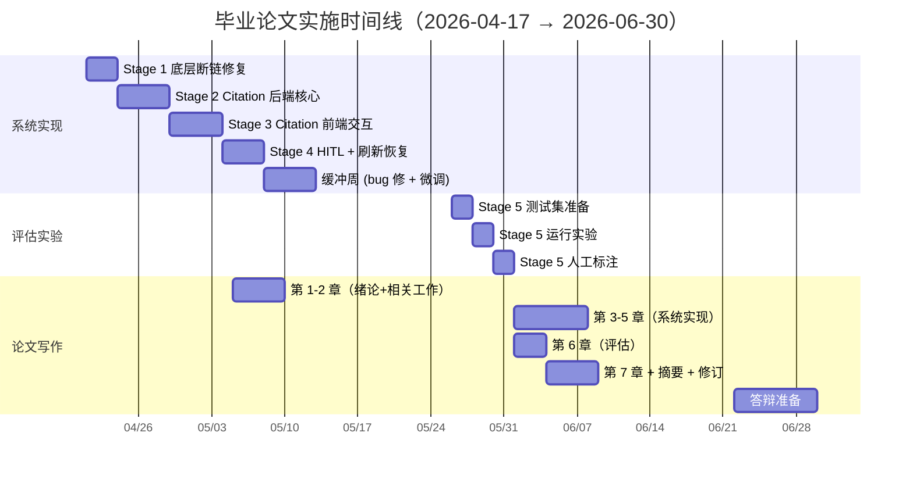

# IMPLEMENTATION_PLAN.md — Evidence-Grounded BMC System

> **基于**：`docs/architecture-evidence-grounded-bmc.md` v1.0
> **版本**：v1.0 (2026-04-17)
> **答辩目标**：2026-06-30 前系统 + 评估 + 论文完成
> **总工作量**：约 22 个有效工作日 + 论文写作时间

---

## 0. 假设与时间线

### 0.1 采纳假设（见架构文档 §0）

```
A. 专硕（软件工程硕士）
B. 答辩 2026-06-30
C. 导师无硬要求（能跑 + 规范 + 创新点讲清楚）
D. 方向 ① Evidence-Grounded BMC with Cell-Level Citation
E. Meflex (2026) 真实存在，Related Work 对比
```

### 0.2 采纳的 5 条关键设计决策

| 决策 ID | 内容 | 默认 | 如翻转影响 |
|---|---|---|---|
| **DEC-1** | LangGraph Checkpointer 用 `MemorySaver` | ✅ 采纳 | 翻转 → Stage 4 需要加 PostgresSaver 部署（+2 天） |
| **DEC-2** | Revision 只重跑受影响 agent | ✅ 采纳 | 翻转（全量重跑）→ 代码更简单，但 token 成本上升 50%、Stage 4 -0.5 天 |
| **DEC-3** | 卡片版本软删除保留历史 | ✅ 采纳 | 翻转（硬删除）→ Stage 2 数据模型简化（-0.5 天），但论文演示少一个加分点 |
| **DEC-4** | HITL 默认 `timeoutMs=null`（不超时） | ✅ 采纳 | 翻转 → Stage 4 加定时器模块（+0.5 天） |
| **DEC-5** | Workspace 单活跃会话软锁 | ✅ 采纳 | 翻转（允许多并发）→ Stage 4 需要多 conversation state 管理（+1.5 天） |

**Review 指引**：每个 Stage 标注依赖的 DEC-x。你要翻转哪条，告诉我"翻转 DEC-N"即可，我会改对应 Stage。

### 0.3 时间线（总 10 周，4/17 → 6/30）



**关键里程碑**：

| 日期 | 里程碑 |
|---|---|
| 2026-04-21 | 开始 Stage 1 |
| 2026-05-09 | 系统实现完成（Stage 1-4） |
| 2026-05-16 | 缓冲周结束 |
| 2026-05-29 | 评估实验完成（Stage 5） |
| 2026-06-20 | 论文初稿完成 |
| 2026-06-25 | 答辩 PPT 初版 |
| 2026-06-30 | 答辩 |

---

## 1. Stage 1：修复底层断链 + KB 入口打通

**目标**：把架构文档 §8 的 P0 任务全部完成，让"canvas 发问 → 选 KB → 后端检索 → 前端渲染 evidence"主链路从"断裂"变为"贯通"。**此阶段无创新，但是所有后续工作的前提**。

**时长**：3 工作日（2026-04-21 → 2026-04-23）
**依赖决策**：无
**阻塞后续**：所有 Stage 都依赖本阶段产出

### 1.1 任务清单

| # | 任务 | 位置 | 产出 | 工作量 |
|---|---|---|---|---|
| 1.1 | 补 `General_Agent` 的 `buildKnowledgePrompt` 注入 | `packages/server/src/services/business-langgraph.ts` | general_agent 也能用 KB 上下文 | 0.2 d |
| 1.2 | 实现 `ConversationPhase` enum + 状态机模块 | `packages/server/src/application/conversation-phase.ts` (新增) | 统一 phase 定义 + `canTransition(from, to)` 函数 | 0.5 d |
| 1.3 | comfy-store 扩展：`watcher` 注册 `onInit`，调用 `setKnowledgeEvidence` | `apps/web/src/features/comfy/store/comfy-store.ts` | store 里 evidence 字段非空 | 0.3 d |
| 1.4 | 新建 `KbSelector` 组件 | `apps/web/src/features/knowledge/components/KbSelector.tsx` | 下拉选 KB，默认"不挂载" | 0.5 d |
| 1.5 | Canvas 页面 chat 输入区集成 `KbSelector`；`callLangGraph` 调用点加第三个参数 | `apps/web/app/(app)/workspace/[id]/canvas/page.tsx:1236, 1990` | 前端真正传 kbId | 0.5 d |
| 1.6 | Stream 协议补 `EvidenceEvent` 和 `PhaseEvent` 定义（先只做数据结构，不做逻辑） | `business-langgraph.ts` + `type-defs.ts` | 类型定义 + 空实现 | 0.5 d |
| 1.7 | 单元测试：`conversation-phase.test.ts` 状态转换合法性 | `packages/server/src/application/__tests__/` | 测试通过 | 0.3 d |
| 1.8 | 手工端到端验证 | - | 在 canvas 选 KB 发问 → evidence 徽章数量 = 检索到的 evidence 数量 | 0.2 d |

### 1.2 验收标准（Definition of Done）

- [ ] 前端选一个预设 KB，输入"分析某新能源车初创"，点发送
- [ ] 开发者工具 Network 面板能看到 `startConversation` mutation 的 `kbId` 参数非 null
- [ ] Chrome devtools Redux/Zustand 面板能看到 `knowledgeEvidence` 字段数组非空（至少 5 条）
- [ ] Canvas 页面的 evidence 徽标显示非零数字
- [ ] Evidence Drawer（即使还没做，只要有占位）或现有 sidebar 能显示 evidence 原文
- [ ] 切换到 kbId=null 发问，evidence 数量为 0（对照）
- [ ] `vitest run packages/server` 全绿
- [ ] 旧功能无回归：不挂 KB 的 BMC 生成仍正常

### 1.3 产出

- 5 个文件修改，1 个新增（KbSelector）
- 1 个新增后端模块（conversation-phase）
- 1 个 commit（可拆分为 2-3 个小 commit）
- 运行时 trace 日志里能看到 `phase=retrieving-evidence` 转换

---

## 2. Stage 2：Citation 后端核心

**目标**：**创新点 1/2**——实现 Cell-level Citation 的后端链路：数据模型、Parser、Prompt 改造、持久化、GraphQL 扩展。这是整个论文第 4 章"Evidence-Grounded BMC 生成"的后端部分。

**时长**：5 工作日（2026-04-24 → 2026-04-30）
**依赖决策**：DEC-3（版本软删除影响 2.5 的数据模型字段）
**阻塞后续**：Stage 3 前端渲染依赖本阶段的 `citations` 字段

### 2.1 任务清单

| # | 任务 | 位置 | 工作量 |
|---|---|---|---|
| 2.1 | 定义共享类型：`Evidence` / `EvidenceRef` / `CitationSpan` / `CardCitation` / `BmcCard` | `packages/shared/src/types/{evidence,citation,bmc}.ts` (新增) | 0.5 d |
| 2.2 | 实现 `CitationParser` + 单元测试（≥15 个 case：正常、相邻合并、invalid ref、no-ref、跨句、标点边界） | `packages/server/src/services/citation-parser.ts` + `__tests__/` | 2 d |
| 2.3 | 改造 Market/Product/Finance Agent 的 prompt：注入 citation 规则 + few-shot + evidence index block | `packages/server/src/services/business-langgraph.ts` | 0.8 d |
| 2.4 | Agent 输出后调 Parser，生成 `CardCitation[]` 和 `groundingRate` | 同上 | 0.3 d |
| 2.5 | `ConversationStore` 扩展：`citations` 字段持久化 + `cardHistory` 软删除链（如 DEC-3 采纳） | `packages/server/src/application/conversation-store.ts` + `conversation-runtime-repository.ts` | 0.5 d |
| 2.6 | GraphQL Schema 扩展（§5.1 的完整增量） | `packages/server/src/graphql/type-defs.ts` | 0.3 d |
| 2.7 | GraphQL Resolver 实现：`evidence(id)` / `cardsReferencingEvidence` / 扩展 `BmcCard.citations` | `packages/server/src/graphql/resolvers.ts` | 0.5 d |
| 2.8 | Stream 协议新增 `CardEvent` + `EvidenceEvent`（实际发送） | `business-langgraph.ts` | 0.4 d |
| 2.9 | Snippet 稳定化：KB 导入时分配并持久化 `snippetId` | `backend/src/routes/kb.ts` + `kb-task-service.ts` | 1 d |
| 2.10 | 集成测试：`smoke-citation-pipeline.ts` 脚本，跑一次真实 LLM 调用，验证 end-to-end | `packages/server/src/scripts/` | 0.5 d |

### 2.2 验收标准

- [ ] 运行 smoke script，后端打印出的 BmcCard.content 里包含 `[[ref:docId#snippetId]]` 标记
- [ ] Parser 单元测试覆盖 ≥15 个 case，全绿
- [ ] GraphQL Playground 执行 `query evidence(id: "...")` 返回正确的 evidence
- [ ] `query cardsReferencingEvidence` 返回至少 1 张卡片
- [ ] `BmcCard.groundingRate` > 0 且 ≤ 1
- [ ] 输入一个 LLM 会编造 ref 的测试 prompt，验证 parser 将 invalid ref 降级为 noRefRanges（日志有 `invalidRefs` 记录）
- [ ] Snippet ID 在两次独立的 KB 检索中保持一致（稳定性验证）

### 2.3 关键技术细节

**Prompt 改造前后对照**：

改造前（现有代码 `business-langgraph.ts:808-820`）：
```
用户问题：{question}
{crossContext}{knowledgeContext}{getRevisionSuffix(state)}

请生成 3 个 cc-bmc-card 节点（JSON 数组格式）...
```

改造后：
```
用户问题：{question}
{crossContext}{knowledgeContext}{getRevisionSuffix(state)}

## 重要规则：证据引用
- 每个具体判断必须带 [[ref:docId#snippetId]]
- 无 evidence 支撑的判断标记 [[no-ref]]
- 禁止编造 docId/snippetId

## Few-shot Example
（见架构文档 §6.2）

请生成 3 个 cc-bmc-card 节点（JSON 数组格式）...
```

**Parser 单元测试的 15 个关键 case**：
1. 空文本
2. 无 citation 的纯文本
3. 单个 `[[ref:d1#s1]]` 标记
4. 多个不同 ref 相邻
5. 多个相同 ref 相邻（应合并为一个 span）
6. 跨句（句号前后各一个 ref）
7. 分号边界
8. 引用不存在的 evidence（invalid ref）
9. `[[no-ref]]` 单独出现
10. `[[no-ref]]` 和 `[[ref:...]]` 混合
11. 标记在段首（textStart=0）
12. 标记在段末
13. 格式错误：`[[ref: d1#s1]]`（有空格）
14. 嵌套错误：`[[ref:d1[[ref:d2#s1]]#s2]]`
15. 超长文本（≥ 5000 字符）

---

## 3. Stage 3：Citation 前端交互

**目标**：**创新点 2/2**——实现 Cell-level Citation 的前端 UI：引用徽章、Evidence Drawer、反向高亮。这是答辩演示时最直观的创新表现。

**时长**：5 工作日（2026-05-01 → 2026-05-07）
**依赖决策**：DEC-3（历史版本切换）、架构文档 ADR-05（Drawer 而非 Modal）
**阻塞后续**：Stage 4 HITL 冲突面板 UI 可复用本阶段的 Drawer 模式

### 3.1 任务清单

| # | 任务 | 位置 | 工作量 |
|---|---|---|---|
| 3.1 | comfy-store 状态扩展：`citations Map` / `evidenceDrawer state` / 新增 actions | `apps/web/src/features/comfy/store/comfy-store.ts` | 0.5 d |
| 3.2 | watcher 处理 `CardEvent`：把 `citations` 存入 store | 同上 | 0.3 d |
| 3.3 | `CitationBadge` 组件 | `apps/web/src/features/canvas/components/CitationBadge.tsx` (新增) | 0.5 d |
| 3.4 | `CardFieldWithCitations` 组件：根据 spans 渲染"文本 + 徽章"混合序列 | 同路径 (新增) | 1 d |
| 3.5 | `EvidenceDrawer` 组件：右侧 side drawer，显示原文 + 元数据 + 操作按钮 | 同路径 (新增) | 1 d |
| 3.6 | `useCitationHighlight` hook：管理被高亮卡片 state | `apps/web/src/features/canvas/hooks/` (新增) | 0.3 d |
| 3.7 | Canvas 页面集成：BMC 卡片用 `CardFieldWithCitations` 替换原纯文本渲染；Drawer 挂载到 layout | `canvas/page.tsx` | 0.8 d |
| 3.8 | 反向高亮：Evidence Drawer 点"定位相关卡片" → 调 `cardsReferencingEvidence` query → canvas 高亮 | 多文件 | 0.6 d |

### 3.2 验收标准

- [ ] BMC 卡片的 content 字段里每个 `[[ref]]` span 位置显示 `[1] [2] [3]` 蓝色徽章
- [ ] `[[no-ref]]` span 显示橙色 ⚠️ 图标
- [ ] 悬停徽章：tooltip 显示 docId 和相关度分数
- [ ] 点击徽章：右侧 Drawer 滑入，显示 evidence 原文 + 来源文件名 + 上下文
- [ ] Drawer 里点"定位相关卡片"：canvas 上所有引用该 evidence 的卡片边框高亮（rose-400 3px），其他卡片 opacity=0.4
- [ ] 点画布空白或按 Esc：清除高亮
- [ ] 刷新页面：evidence 徽章仍然显示（持久化生效）

### 3.3 UI 细节规范

**徽章样式**：
- 背景：`bg-sky-100 dark:bg-sky-900/20`
- 文字：`text-sky-700 dark:text-sky-300`
- 尺寸：`h-5 px-1.5 text-[10px] rounded`
- 悬停：`hover:bg-sky-200 cursor-pointer`

**Drawer 布局**：
```
┌── Evidence 证据来源 ──────────── [×]─┐
│ 来源：新能源行业白皮书 2025         │
│ docId: d42                          │
│ snippetId: s3                       │
│ 相关度: 0.89                        │
│ ─────────────────────────────────── │
│ 原文片段：                          │
│ ┌─────────────────────────────┐    │
│ │ 18-26 岁的 Z 世代群体展现出  │    │
│ │ 强烈的品牌认同需求...        │    │
│ └─────────────────────────────┘    │
│ ─────────────────────────────────── │
│ [📄 查看完整文档]                   │
│ [🎯 定位相关卡片]                   │
└─────────────────────────────────────┘
```

**反向高亮动画**：
- 目标卡片：`transition-all duration-300 ring-4 ring-rose-400/80 ring-offset-2`
- 其他卡片：`transition-opacity duration-300 opacity-40`

---

## 4. Stage 4：HITL 闭环 + 刷新恢复

**目标**：实现架构文档 §12 的运行时核心——HITL 中断/恢复、LangGraph checkpoint、刷新续订、workspace 软锁。这是 proposal §3.5"前后端闭环集成"的落地。

**时长**：4 工作日（2026-05-08 → 2026-05-13）
**依赖决策**：DEC-1（MemorySaver）、DEC-2（局部重跑）、DEC-4（不超时）、DEC-5（单活跃会话锁）

### 4.1 任务清单

| # | 任务 | 位置 | 工作量 |
|---|---|---|---|
| 4.1 | 引入 LangGraph `MemorySaver`，改造 `streamAnalysis` 在关键 phase 转换时 save | `packages/server/src/services/business-langgraph.ts` | 0.8 d |
| 4.2 | Interrupt 机制：Supervisor 检测到 conflict 时抛 `GraphInterrupt`，记录 `interruptId` | 同上 + `conversation-store.ts` | 0.5 d |
| 4.3 | GraphQL Mutation `approveDecision(interruptId, decision)` | `resolvers.ts` + `type-defs.ts` | 0.3 d |
| 4.4 | GraphQL Mutation `skipDecision(interruptId)` / `cancelConversation(id)` | 同上 | 0.3 d |
| 4.5 | `resumeConversation` 逻辑：从 checkpoint load state，apply decision，decide revision scope（DEC-2） | `conversation-store.ts` + `business-langgraph.ts` | 0.8 d |
| 4.6 | Revision scope 决策：根据 conflict.dimension 映射到受影响 agent | `business-langgraph.ts` | 0.4 d |
| 4.7 | Workspace 软锁实现：`startConversation` 检查 active conversation | `conversation-store.ts` | 0.3 d |
| 4.8 | 前端 `ConflictPanel` 组件：显示 conflicts + 3 个方案选择 | `apps/web/src/features/canvas/components/ConflictPanel.tsx` (新增) | 0.6 d |
| 4.9 | 前端 `restoreLatestConversation` 函数：query snapshot + 续订 stream | `comfy-store.ts` | 0.5 d |
| 4.10 | GraphQL Subscription `conversationStream(id)` 实现 | `resolvers.ts` + `type-defs.ts` | 0.5 d |
| 4.11 | 前端 Workspace 软锁错误处理：`WORKSPACE_HAS_ACTIVE_CONVERSATION` 显示确认弹窗 | `comfy-store.ts` | 0.3 d |
| 4.12 | 端到端测试：跑一次完整的 Round 0 → conflict → 用户选方案 → Round 1 → done | 手工 + 脚本 | 0.5 d |

### 4.2 验收标准

- [ ] 在画布发起一次会分析（预置一个会触发 conflict 的测试问题，如"分析一个低价高质的车企"）
- [ ] Critic 检测到"定价 ↔ 成本"冲突，前端显示 ConflictPanel
- [ ] ConflictPanel 展示 3 个方案（产品分化 / 提价 / 外包）
- [ ] 用户点方案 A，后端 resume，只重跑 Product + Finance Agent（不重跑 Market）
- [ ] Round 1 完成后 phase = 'done'，UI 显示修订后的卡片
- [ ] 卡片的 metadata.producedInRound = 1；原 Round 0 版本保留（DEC-3）
- [ ] 浏览器刷新：页面恢复到 done 状态，所有卡片和 evidence 仍在
- [ ] 浏览器刷新时机在 HITL 中：恢复到 awaiting-hitl，ConflictPanel 仍可见
- [ ] 同一 workspace 再发起新分析，前端提示"已有进行中分析" + 允许取消

### 4.3 关键实现决策细化

**Revision Scope 映射表**（任务 4.6）：

| Conflict.dimension | 需重跑的 Agent |
|---|---|
| PRICING × COST_STRUCTURE | Product + Finance |
| CHANNELS × CUSTOMER_SEGMENTS | Market |
| VALUE_PROPOSITIONS × KEY_RESOURCES | Product |
| REVENUE_STREAMS × CUSTOMER_RELATIONSHIPS | Market + Finance |
| 其他 × 其他 | 降级为全量重跑 |

**Checkpoint 触发点**：
- phase 进入 `critic-review` 时
- phase 进入 `awaiting-hitl` 时
- Revision 前（以便 rollback）

---

## 5. 缓冲周（Bug 修复 + 微调）

**时长**：5 工作日（2026-05-14 → 2026-05-20）

### 5.1 预期问题

1. LLM 输出不稳定（忘标 ref / 标错格式）→ 调整 prompt / few-shot
2. Citation Parser 边界 case 发现 bug → 补测试 + 修复
3. 前端 UI 细节：字体大小、颜色对比度、响应式
4. 性能：evidence 多时 Drawer 渲染卡顿
5. GraphQL schema 类型冲突（特别是 union type）
6. LangGraph Checkpointer 在并发调用时的行为
7. Stream 订阅断线重连的边界 case

### 5.2 产出

- Bug list + 修复记录
- 系统稳定版 tag：`v1.0-system-done`

---

## 6. Stage 5：评估实验

**目标**：跑出论文第 6 章需要的所有数据——对比表、citation accuracy、hallucination rate、可选用户研究。

**时长**：6 工作日（2026-05-26 → 2026-06-02）
**依赖决策**：无

### 6.1 实验设计

**测试集**：25 个商业问题（见架构文档 §12.2 stats）

| 行业 | 问题数 | 样例 |
|---|---|---|
| 新能源 / 新能源车 | 5 | "分析某新能源电池初创的商业模型" |
| 互联网 / SaaS | 5 | "评估 SaaS CRM 产品的盈利能力" |
| 零售 / 电商 | 5 | "分析社区团购模式的可持续性" |
| 制造业 | 5 | "分析精密仪器小批量制造商业模型" |
| 服务业 | 5 | "评估高端美容连锁的客户获取策略" |

**预设 KB（2 个）**：
- KB-A "新能源行业资料包"：8 份资料（2 份 PDF 白皮书 + 3 份新闻 + 3 份公司报告）
- KB-B "互联网 SaaS 资料包"：7 份资料

**实验组**：

| 组别 | 配置 | 用途 |
|---|---|---|
| S | 单 Agent 一次性生成 BMC | Baseline 1 (对应 DEC 之外) |
| M | 多 Agent，无 KB | Baseline 2 |
| MK | 多 Agent + KB，无 citation | Baseline 3 |
| **MKC** | **多 Agent + KB + Cell-level Citation** | **创新方案** |

4 组 × 25 问题 = 100 次 LLM 调用总次数（MKC 使用对应行业的 KB）

### 6.2 任务清单

| # | 任务 | 产出 | 工作量 |
|---|---|---|---|
| 5.1 | 写 `testset.json`（25 个问题，每个含行业标签 + 对应 KB ID） | 数据文件 | 0.5 d |
| 5.2 | 准备 2 个 KB 的资料（从公开数据集 + 手工整理） | KB 快照 | 1 d |
| 5.3 | 实现 `scripts/eval-baseline.ts`：批量运行 4 组实验，输出 JSON 结果 | 脚本 | 1.5 d |
| 5.4 | 自动指标计算：维度覆盖度、字段完整率、grounding rate、hallucination rate、citation accuracy（需对齐评分规则） | 同上 | 0.5 d |
| 5.5 | 人工标注：50 个 citation 样本打分（2 人盲标 + kappa） | 标注结果 | 1 d |
| 5.6 | 整理 3 个对比表（Stage 5.7 的模板填数据） | 表格 + figure | 0.5 d |
| 5.7 | （可选）小型用户研究 n=8：MK vs MKC 盲测信任度 | 用户反馈表 | 1 d |

### 6.3 论文表格模板（§6 章）

**表 6-1** 多智能体协同对分析完整性的影响（n=25）

| 组别 | 维度覆盖(/9) | 字段完整率(%) | 整体质量(1-5) |
|---|---|---|---|
| S | _ | _ | _ |
| M | _ | _ | _ |
| Δ | +_ | +_ | +_ |

**表 6-2** 知识增强对分析相关性的影响（n=25）

| 组别 | KB 引用贴合度(1-5) | 事实错误/问题 |
|---|---|---|
| M | _ | _ |
| MK | _ | _ |
| Δ | +_ | -_ |

**表 6-3** Cell-level Citation 对可溯源性的影响（n=25）

| 组别 | Grounding Rate(%) | Hallucination Rate(%) | Citation Accuracy(%) |
|---|---|---|---|
| MK | 0 | _ | N/A |
| **MKC** | **_** | **_** | **_** |

**表 6-4**（可选）用户信任度对比（n=8）

| 组别 | 信任度(1-7) | 易理解度(1-7) | 可修改度(1-7) |
|---|---|---|---|
| MK | _ | _ | _ |
| **MKC** | **_** | **_** | **_** |

---

## 7. 论文写作节奏

**总体 6 周，与系统实现并行**：

| 周次 | 日期 | 任务 |
|---|---|---|
| W1-W2 | 4/17 - 5/2 | 论文不动，专注系统 Stage 1-2 |
| W3 | 5/5 - 5/11 | 第 1 章 绪论 + 第 2 章 相关工作（含 Meflex 对比段落） |
| W4 | 5/12 - 5/18 | Stage 4 系统完成后，写第 3 章 整体架构 |
| W5 | 5/19 - 5/25 | 第 4 章 Evidence-Grounded BMC 方法 + 第 5 章 系统实现 |
| W6 | 5/26 - 6/1 | 评估实验 + 第 6 章 实验评估 |
| W7 | 6/2 - 6/15 | 第 7 章 总结 + 摘要 + 修订 |
| W8 | 6/16 - 6/29 | 答辩 PPT + 预答辩 + 修订 |
| W9 | 6/30 | 正式答辩 |

**第 2 章 相关工作结构**（Meflex 对比段落模板）：

```markdown
2.3 LLM-based 商业分析工具

近年来，基于 LLM 的商业分析工具逐步涌现。其中，Meflex [X] 提出
了一种基于 LLM 的非线性商业计划书写作脚手架系统，通过 reflection
和 meta-reflection 机制降低新手创业学生的认知负担。其 n=30 用户
研究证实该方法能有效促进发散思维并降低认知负荷。然而，Meflex
聚焦于**教育场景下的写作脚手架**，采用单一 LLM 架构且未引入
外部知识约束，与本研究面向**专业决策支持场景**的多智能体 +
知识增强 + 结构化画布系统存在本质差异。特别地，本研究关注的
"证据可追溯性"问题——即每个 BMC 字段应能溯源至具体知识库资料——
在 Meflex 及其他现有工具中均未得到系统化处理（见表 2-1）。
```

**表 2-1** 本研究与 Meflex 对比（填入架构文档附录 B 的完整表格）

---

## 8. 风险矩阵

| 风险 | 概率 | 影响 | 缓解 |
|---|---|---|---|
| LLM API 限流影响实验 | 中 | 中 | 提前申请更高 quota；必要时降级 sample size |
| Citation Parser 边界 case 比预期多 | 中 | 中 | 缓冲周专项修复；Parser 不完美时降级为 segment-level |
| LangGraph MemorySaver 有未知问题 | 低 | 高 | Stage 4 第一天先 POC；问题多则降级为显式 state 传递 |
| 人工标注样本不一致 | 中 | 中 | 2 人盲标 + kappa；kappa < 0.6 则重设标注指南 |
| 用户研究招不到人 | 高 | 低 | DEC-3 外定为可选实验；招不够就砍 |
| Meflex 论文细节可能影响自己定位 | 低 | 中 | 拿到原文后第一时间读，如有重叠立刻调整 Related Work |
| 导师临时要求改方向 | 低 | 高 | 本文档 §0.2 假设清单可快速更新 |

---

## 9. 决策反转影响矩阵（快速查阅）

如你 review 后要翻转某条决策，对应 Stage 调整：

| 决策 | 翻转影响 Stage | 工作量 Delta |
|---|---|---|
| DEC-1 翻转（用 Postgres） | Stage 4 任务 4.1 改为 PostgresSaver，加部署步骤 | +2 d |
| DEC-2 翻转（全量重跑 Revision） | Stage 4 任务 4.5/4.6 简化 | -0.5 d |
| DEC-3 翻转（硬删除版本） | Stage 2 任务 2.5 简化；Stage 3 任务 3.7 不做版本切换 | -1 d |
| DEC-4 翻转（HITL 超时） | Stage 4 加定时器模块和超时事件 | +0.5 d |
| DEC-5 翻转（多并发会话） | Stage 4 任务 4.7 改为 conversation list 管理；前端 state 重构 | +1.5 d |

---

## 10. 立即行动项（按 4/21 开工算）

本周剩余时间（4/17-4/20）可以提前做的事：

- [ ] 你回复翻转哪些决策（如无，按默认走）
- [ ] 创建新分支 `feat/evidence-grounded-bmc`
- [ ] 安装可能缺少的依赖：`@langchain/langgraph`（若未含 MemorySaver）
- [ ] 准备评估用的 25 个测试问题初稿（Stage 5 任务 5.1 提前做）
- [ ] 收集 2 个 KB 的原始资料（Stage 5 任务 5.2 提前做）

---

## 附录：Stage-DEC 依赖索引

```
Stage 1  -  无
Stage 2  -  DEC-3
Stage 3  -  DEC-3 + ADR-05
Stage 4  -  DEC-1 + DEC-2 + DEC-4 + DEC-5
Stage 5  -  无
```

---

**文档维护**：本 PLAN 与 `docs/architecture-evidence-grounded-bmc.md` 配套使用。任何架构变更先改架构文档，再同步回本 PLAN。
