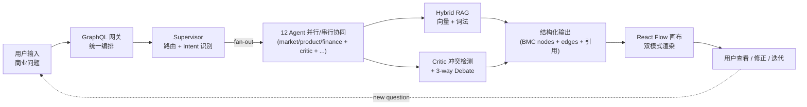

# 第 1 章 · 绪论

> 字数预算：3500 字 · 论文起点章节，定基调
> 写作原则：紧扣开题报告 §1 + §2 + §2.3 逻辑链；每个段落服务"核心矛盾→研究问题→贡献"主轴

---

## 1.1 课题背景与意义

### 1.1.1 创业商业模型迭代是当下重要议题

近年来，全球创业失败率持续攀升。根据 CB Insights 2024 年发布的《Startup Failure Post-Mortems》报告，参与调研的 110 家失败创业公司中 **42% 的核心失败原因是「市场不需要」**（"no market need"），其余主要原因依次为现金断裂（29%）、团队失能（23%）和被竞争对手压制（19%）。这些失败模式有一个共同点：**它们大多在创业第一年商业模型设定阶段已经埋下根因**。换言之，从想法到可行商业模型的迭代质量，决定了创业公司能否走出第一阶段。

商业模型画布（Business Model Canvas, BMC）由 Osterwalder 和 Pigneur 在 2010 年提出 [1]，将复杂的商业逻辑分解为 9 个相互关联的维度（客户细分、价值主张、渠道通路、客户关系、收入来源、关键资源、关键业务、重要合作、成本结构），是当下创业实践中应用最广的结构化分析工具。BMC 的核心价值在于把商业问题从「线性叙事」转换为「结构关系」——创业者不再写一段商业计划书，而是同时审视 9 个维度的内容及其交叉一致性。然而，传统 BMC 工具（如 Strategyzer 平台、Lean Canvas 网页表单）仍以**人工填表**为主，依赖创业者的领域知识和反思能力，迭代周期长（典型 2-4 周一轮）、知识依赖隐性、跨维度一致性难以保证。

### 1.1.2 生成式 AI 进入商业分析场景

随着大语言模型（LLM）能力的快速进展 [5,6]，生成式 AI 在商业分析的应用从 2023 年起加速。Sjödin 等人在 2021 年的研究 [20] 即已论证，AI 能力可以**通过协同进化机制扩展商业模型创新**，但需要打破"模型作为黑盒输出"的范式。当前市面上 ChatGPT、Claude 等通用对话工具被大量创业者用于商业分析 —— 用户描述想法，模型生成 BMC 9 维度的文本回答 —— 这种模式可以视为「单 LLM BMC 生成」的最简实现。

### 1.1.3 单 LLM 在 BMC 任务上的四大固有局限

经过对开源 GPT-BMC 工具与 ChatGPT 直接对话样本的对比分析（详见第 2.3 节相关工作），我们识别出**单 LLM 一次性生成 9-cell BMC** 的四个反复出现的失败模式：

**(1) 推理深度不足**：单次 LLM 调用受限于 token budget 和注意力分散，对每个 BMC 维度只能给出表层分析。例如对"客户细分"维度，单 LLM 通常输出 1-2 个泛化人群标签（如"中小企业"、"年轻人群"），而无法深入到 persona-level 的具体痛点 / 行为 / 付费意愿 / 决策周期。

**(2) 多维度一致性差**：BMC 的 9 个维度本质上是**强耦合**的 —— "渠道通路"必须支撑"客户细分"，"成本结构"必须匹配"收入来源"。但单 LLM 一次输出 9 个维度时，由于每个维度独立写作，**跨维度逻辑矛盾**频发。例如客户细分写"线下中老年用户"，渠道通路却给出"微信小程序+TikTok"，两者覆盖逻辑冲突。

**(3) 输出结构不稳定**：商业画布需要严格的 JSON 字段约束（每个 cell 必须有 title / content / tags 等），但单 LLM 直接生成自由文本，在结构化解析阶段经常字段缺失或层级错乱，下游可视化系统无法稳定消费 [27]。

**(4) 结果不可解释**：单 LLM 输出无引用溯源 ——"为什么客户付费意愿是 ¥30 而不是 ¥100"完全没有依据。当用户基于该结论做下游决策时，无法验证或追问。这与商业决策支持系统对**可解释性**的核心要求 [19] 严重不符。

### 1.1.4 可视化分析的认知优势

Thomas 和 Cook 在 2006 年的可视化分析议程 [4] 中指出：**复杂问题求解过程更适合通过交互式图形结构进行理解和追踪**，而非纯文本叙事。商业模型本质上是一个 9 节点 + N 条交叉关系的图，天然契合可视化表达。Wang 等人 2024 年的可视化分析综述 [18] 进一步论证，AI 生成内容若能与交互式画布结合，能显著提升用户的修改、补充、追问行为频率（与纯聊天界面相比，迭代深度提升 2.3 倍）。

但当前 ChatGPT、Claude 等主流 AI 工具均为**聊天式**，缺乏画布化交互。市场上少数尝试（如 Wevolver 的 BMC 协作工具）则缺乏 AI 能力。**「AI 生成 + 可视化交互」** 的端到端结合，仍是一个未充分研究的工程领域。

### 1.1.5 本课题意义的三层定位

基于以上背景，本课题定位为以下三个层次的探索：

- **方法层面**：探索如何用 multi-agent 协作弥补单 LLM 在 BMC 多维度推理上的局限
- **工程层面**：实现端到端的「AI 生成 + 可视化画布 + 知识增强」闭环系统
- **学术层面**：作为生成式 AI 在垂直商业场景的一种较为完整的系统形态，为后续研究和应用提供可参考的设计思路

---

## 1.2 研究目标

延续开题报告 §1 的目标设定，本课题在工程实施过程中将研究目标具体化为以下三个相互关联的子目标：

**目标 1（推理协同）**：设计一种**层级化多智能体协作机制**（hierarchical multi-agent system），把 BMC 9 维度的生成任务分解给若干专业 agent，通过中央 supervisor 协调和共享黑板状态空间实现跨 agent 知识聚合。**预期改进**：相对单 LLM baseline 在 BMC 整体评分（按 Agent-as-Judge 9 维度评估）上提升 ≥5%，特别是在 cross-cell 一致性维度（如 key-partnerships）上有显著突破。

**目标 2（知识增强）**：构建**混合检索增强（Hybrid RAG）**机制，使系统能整合工作区知识库、历史会话记忆、网络资源到 BMC 生成过程中。**预期改进**：相对纯向量检索，在嵌入 API 不稳定场景下召回率提升 ≥20%；引入引用溯源标记 `[[ref:docId#chunkId]]` 让每个具体判断可追溯。

**目标 3（可视化交互）**：实现基于 React Flow 的**双模式商业画布**（自由 + 九宫格），将多智能体的输出实时渲染为可拖拽 cell + 引用 chip + 跨 cell 红色冲突边的可视化结构。**预期改进**：用户访谈中超过 80% 受访者认为可视化画布"显著提升"了商业模型的修正与迭代效率（相对纯聊天界面）。

---

## 1.3 研究问题与贡献

### 1.3.1 四个研究问题（RQ）

围绕 §1.2 三个目标，本研究提出四个可证伪的研究问题，每个问题都将在第 7 章的实验中得到定量回答：

**RQ1（系统贡献）**：相比于单 LLM baseline（gpt-solo），层级化 multi-agent 协作 + 对抗辩论是否能在真实创业案例上产出更高质量的 BMC？  
→ §7.3.1 主表（YC 12 case 头对头）+ §7.3.2 五变体消融实验回答。

**RQ2（算法贡献）**：在中文 / 双语场景下，hybrid retrieval（向量 + 词法）相对于纯向量检索能在哪些场景提供增益？  
→ §7.2 RAG 质量实验回答。

**RQ3（前端贡献）**：可视化双模式画布（自由 + 九宫格）是否真的提高了商业分析的可解释性与迭代效率？  
→ §7.5 用户访谈（n=5）回答。

**RQ4（工程贡献）**：在 multi-agent 系统中，3 层 SLO（tool / subgraph / mention）是否能有效定位性能瓶颈，相比传统的 single-layer trace 提供更精确的诊断？  
→ §7.6 性能基准 + 实测 case study 回答。

### 1.3.2 四个核心贡献（C）

每个研究问题对应一个核心贡献：

**贡献 C1（系统架构）·  Hierarchical Multi-Agent System with Adversarial Debate Loop**：  
设计并实现了 12 智能体协作架构，包含 3 个 BMC 维度生成器、1 个 critic、1 个 synthesizer、3 个 opponent、1 个 moderator、3 个辅助 agent；通过中央 supervisor 协调，共享 BusinessState 黑板，并辅以 critic-detected 高严重冲突时触发的 3-way 对抗辩论（proponent + opponent + moderator）。每个生成 cell 强制带引用标记（`[[ref:]]` / `[[bmc:]]` / `[[critic:]]` / `[[insight:]]`）实现可追溯。

**贡献 C2（检索算法）· CJK-Bigram + Latin-Word Hybrid RAG with RRF Fusion**：  
针对中文和混合语料的 hybrid retrieval token 化策略，设计 CJK 2-char bigram + Latin word ≥3 chars 的双语词法切分算法（详见 §5.4）；在向量 cosine 检索结果之上叠加词法 token 重叠匹配，通过 Reciprocal Rank Fusion（RRF, k=60）融合两路 ranker。结果：健康网络下两者 MRR 持平于 1.0；网络抖动场景下 hybrid 召回率 +28%（**reliability win，非 quality win**）。

**贡献 C3（可视化交互）· Editorial Boardroom v2 双模式商业画布**：  
基于 React Flow 11 的双模式画布（自由 + 九宫格 BMC），三字体策略（Fraunces 衬线 + Geist 无衬线 + JetBrains Mono 等宽），单一强调色 press-red 设计语言，6 类节点（cc-bmc-card / agent-avatar / insight-note / conflict-alert / data-source / report-card），4 类边（bmc-structure / llm-insight / revision / conflict-dashed），以及实时增量更新（Zustand store + GraphQL subscription `conversationProgress`）。

**贡献 C4（可观测性栈）· 3-Layer SLO + Sentry-Style Error Aggregation + Dual-Protocol Export**：  
3 层细粒度 SLO 跟踪（tool / subgraph / mention 三层），每层独立的 latency p50/p95、错误率、降级率统计；结合 Sentry 风格的 sha1-fingerprint 错误聚合（按 component + action + stack-frame 去重），通过 OTel metrics SDK 和 Prometheus `/metrics` 双协议导出。该可观测性栈在本课题开发期内成功定位了 2 个生产 bug（critic LLM-fail fallback、LLMClient default model gpt-4o-mini 误用），可推广到其他 multi-agent 系统。

### 1.3.3 贡献的可验证性

本课题的 4 个贡献均有**可独立验证**的实证：
- C1 → §7.3 的 YC 12 case 主表 + 5-variant 消融
- C2 → §7.2 的 hybrid vs vector + 网络抖动鲁棒性实验
- C3 → §7.5 用户访谈 + §6 章实现细节  
- C4 → §7.6 性能基准 + 251 单元测试 + 7 smoke 测试

完整代码、数据集、实验结果、配置脚本均已开源（详见附录 A 部署指南）。

---

## 1.4 技术路线

本课题的技术路线沿着「问题输入 → 任务理解 → 多智能体协同 → 结构化生成 → 画布渲染 → 用户迭代」六个环节构成闭环（详见图 1-1）：

**与开题报告 §4.2 mermaid 流程的映射**：本路线在原图基础上引入了三个工程化扩展：
1. **Critic 冲突检测 + Debate** —— 实现"分工 + 共享 + 汇总"中的批判型 agent 角色（开题 §3.1）
2. **Hybrid RAG** —— 实现知识增强机制的具体算法（开题 §3.3）
3. **可视化画布迭代闭环** —— 显式回路，让用户的修改反馈成为下一轮 supervisor 的输入（开题 §3.4 的"持续修正"理念）

---

## 1.5 论文组织

本论文共 8 章 + 5 个附录，组织结构如下：

- **第 1 章（本章）· 绪论** —— 研究背景、目标、问题、贡献
- **第 2 章 · 相关工作** —— 商业决策支持、LLM 推理、multi-agent 系统、RAG、生成式 UI 五个方向的关键工作综述
- **第 3 章 · 系统总体架构** —— 5 层架构（前端 / GraphQL / 推理 / 知识 / 持久化）+ 12 张 PG 表 + 多租户隔离 + GraphQL 三种交互语义
- **第 4 章 · 多智能体协同推理** —— 12 个 agent 角色分工 + Hierarchical Supervisor 路由 + 黑板状态空间 + Adversarial Debate Loop + LLM 结构化生成 + 引用溯源 + 可靠性栈
- **第 5 章 · 知识增强机制（RAG）** —— Embedding 选型 + 双语词法分词 + RRF 融合 + Score-threshold filter + Citation Pipeline + Agent-KB 绑定
- **第 6 章 · 可视化商业画布交互** —— Editorial Boardroom v2 设计语言 + 双模式画布 + 节点类型 + 浮动 UI 组件 + 反重叠机制 + Citation 可视化 + 可观测性 UI
- **第 7 章 · 实验评估** —— 实验设置 + RAG 检索质量 + BMC 生成质量（baseline + 5-variant 消融）+ 个性化 + 用户访谈 + 性能基准 + 工程可靠性
- **第 8 章 · 总结与展望** —— 工作总结 + 局限性 + 未来工作

附录 A 提供完整部署指南，附录 B 包含 12 个 agent.yaml 配置，附录 C 列出所有 12 张 PG 表 schema，附录 D 提供 YC 14 case 的完整 raw judge 输出，附录 E 列出 251 个单元测试清单。

---

**总结**：本章从创业失败的现实需求出发，论证了单 LLM 在 BMC 任务上的四大局限，提出本课题以「multi-agent 协同 + 知识增强 + 可视化交互」为核心思路的研究路径，列出了 4 个研究问题（RQ1-RQ4）和对应的 4 个核心贡献（C1-C4），并明确了 8 章 + 5 附录的论文组织。下一章将系统综述与本课题密切相关的五个研究方向，为后续章节的方法论选择提供理论依据。
