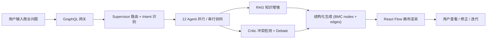
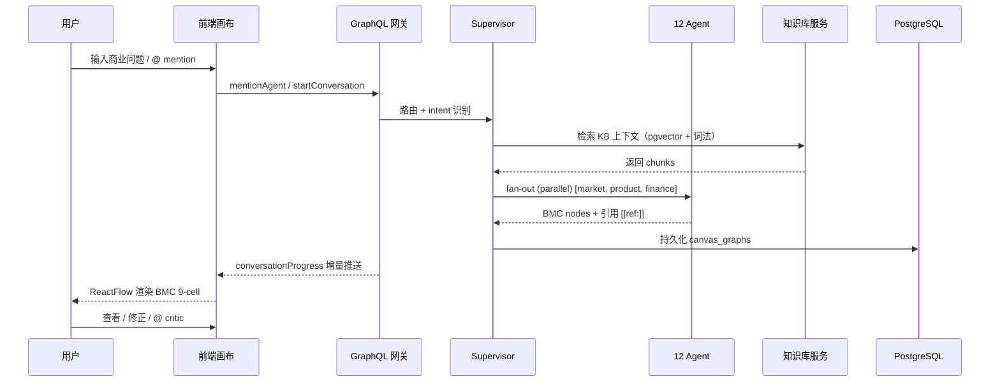

# Starlink 毕业设计论文 outline · v2 · 对齐开题报告

> **题目（沿用开题）**：基于多智能体协同的生成式商业画布系统的设计与实现
> **English**: Design and Implementation of a Multi-Agent Collaborative Generative Business Canvas System
>
> **页数预算**：本科毕业设计论文 · 中文 · 30-50k 字 · 8 章 + 附录

---

## 章节结构（每章对应开题里一个或多个 §3 关键技术）

| 章 | 题目 | 字数 | 对应开题 §3 |
|---|---|---|---|
| 1 | 绪论 | ~3500 字 | §1, §2.1, §2.3 |
| 2 | 相关工作 | ~4500 字 | §6 参考文献 28 篇 |
| 3 | 系统总体架构 | ~5000 字 | §3.5 前后端闭环集成 + §4.1 总体架构 |
| 4 | 多智能体协同推理 | ~6000 字 | §3.1 + §3.2（LLM 结构化生成并入此章）|
| 5 | 知识增强机制 | ~4500 字 | §3.3 知识增强机制（独立成章 ✅）|
| 6 | 可视化商业画布交互 | ~5500 字 | §3.4 可视化画布表达（独立成章 ✅，前端章节）|
| 7 | 实验评估 | ~6500 字 | 论证 §2.2 五个问题是否解决 |
| 8 | 总结与展望 | ~2000 字 | §5 项目总结 |
| **总计** | **~37500 字** | (本科 30-50k 区间内) | |
| 附录 A-E | | ~5000 字 | |

**关键变更（vs v1）**：
- ✅ 第 6 章前端从 sub-section 提升为独立章节（5500 字）
- ✅ 第 5 章 RAG 保持独立（开题里 §3.3 就是独立技术）
- ✅ 第 4 章合并 §3.1 多智能体 + §3.2 LLM 结构化生成（因为它们在实现上紧耦合：每个 agent.yaml 既是协调单元也是 prompt 模板）

---

## 第 1 章 · 绪论（~3500 字）

### 1.1 课题背景与意义（~1200 字）
- **创业失败率与商业模型迭代质量**：引用 CB Insights 2023 失败原因报告（"no market need" 占 42%，"got outcompeted" 占 19%），强调 BMC 迭代是创业关键环节
- **生成式 AI 进入商业分析**：参考 Sjödin et al. 2021 [20]，AI 能力如何使商业模型创新可能
- **单 LLM 工具的 4 大局限**（开题 §1 已论证）：
  - 推理深度不足
  - 多维度覆盖不全
  - 输出结构不稳定
  - 结果不易解释
- **可视化分析的认知优势**：Thomas & Cook 2006 [4]，复杂问题求解通过交互式图形
- **本研究意义**：不只是工具实现，而是**探索生成式 AI 在垂直商业场景的系统形态**

### 1.2 研究目标（~600 字）
直接复用开题 §1 的三大目标：
1. 设计面向商业决策支持的多智能体协同推理机制
2. 构建基于知识增强的商业分析链路
3. 实现基于 React Flow 的可视化商业画布

### 1.3 研究问题与贡献（~900 字）
- **RQ1**：多智能体分工 + 中央协调 vs 单 LLM 一次性生成，哪个 BMC 输出质量更高？（→ 第 7.3 节回答）
- **RQ2**：混合检索（向量 + 词法）相对纯向量检索能在哪些场景提供增益？（→ 第 7.2 节）
- **RQ3**：可视化画布是否真的提高了商业分析的可解释性与迭代效率？（→ 第 7.5 节交互效率定性 + 用户访谈）
- **RQ4**：在 multi-agent 系统中，3 层 SLO（tool / subgraph / mention）是否能有效定位性能瓶颈？（→ 第 7.6 节）

**4 个贡献**（C1-C4 对应 4 个研究问题）：
- **C1**：12-agent hierarchical multi-agent system + adversarial debate loop 协作架构
- **C2**：CJK-bigram + Latin-word + RRF 双语混合检索的实现
- **C3**：Editorial Boardroom v2 设计语言 + ReactFlow BMC 9-cell 自由画布的可视化交互
- **C4**：3 层 per-agent SLO + Sentry 错误聚合 + Prometheus/OTel 双协议导出的可观测性栈

### 1.4 技术路线（开题 §4.2 mermaid 流程图复用，~400 字）



### 1.5 论文组织（~400 字）
逐章叙述，对应开题 §2.3 的逻辑链。

---

## 第 2 章 · 相关工作（~4500 字）

> 引用开题 §6 参考文献 28 篇 + 补充新文献

### 2.1 商业决策支持系统演进（~800 字）
- 传统 DSS（Arnott & Pervan 2014 [2]）→ Business Analytics（Yin & Fernandez 2020 [3]）→ AI-driven BMI（Sjödin et al. 2021 [20]）
- 商业模式画布作为结构化分析框架：Osterwalder & Pigneur 2010 [1] · Kühn et al. 2018 Analytics Canvas [21] · Panzner et al. 2022 [22]
- **Gap**：现有研究多在框架理论层面，端到端 AI 系统实现稀少

### 2.2 大语言模型推理（~700 字）
- 综述：Zhao et al. 2023 [5] · Huang & Chang 2023 [6]
- Chain-of-Thought（Wei et al. 2022 [7]）· Self-Consistency（Wang et al. 2023 [8]）· Tree of Thoughts（Yao et al. 2023 [9]）· Graph of Thoughts（Besta et al. 2024 [27]）
- ReAct（Yao et al. 2023 [24]）· Reflexion（Shinn et al. 2023 [25]）
- **Gap**：reasoning 范式多在通用任务上验证，**针对结构化业务输出（如 BMC 9-cell JSON）的 prompt 工程经验研究不足**

### 2.3 多智能体大模型系统（~1100 字）
- CAMEL（Li et al. 2023 [10]）—— 角色对话最早提出
- AutoGen（Wu et al. 2024 [11]）—— conversable agents framework
- MetaGPT（Hong et al. 2024 [12]）—— SOP-based collaboration
- 综述：Guo et al. 2024 [13] · Chen et al. 2025 [14]
- 共识：Amirkhani & Barshooi 2022 [23]
- **Gap**：multi-agent 系统多在 software engineering / debate 领域验证，**针对结构化商业 artifact 的多智能体协作研究稀少**；Chinese-language 多智能体系统的工程实现公开报告少见

### 2.4 检索增强生成（RAG）（~700 字）
- 综述：Gao et al. 2024 [15]
- Agentic RAG：Singh et al. 2025 [16]
- LLM + Knowledge Graph：Pan et al. 2023 [28]
- 经典：DPR / ColBERT / BM25 / SPLADE / Hybrid retrieval (RRF)
- **Gap**：中文/双语 hybrid retrieval 的 token 化策略缺乏经验研究；CJK-bigram + Latin-word 的混合 token 化在 production 系统的报告少见

### 2.5 生成式 AI 界面与可视化（~700 字）
- 综述：Luera et al. 2024 [17] · Wang et al. 2024 [18]
- 可解释 AI：Barredo Arrieta et al. 2020 [19]
- 商业可视化分析：Thomas & Cook 2006 [4]
- 现有商业画布工具：Strategyzer / ChatBMC / GPT-BMC（多为 chat-only，无可视化）
- **Gap**：将 AI 生成结果与可视化无限画布结合的端到端系统报告少见

### 2.6 LLM 系统的可观测性（~500 字）
- 通用 APM：Sentry / OpenTelemetry
- LLM-specific：LangSmith / Langfuse
- **Gap**：multi-agent 系统的 per-agent SLO + per-tool latency 分级监控少见公开实现

---

## 第 3 章 · 系统总体架构（~5000 字）

> 对应开题 §3.5 前后端闭环集成 + §4.1 总体架构。聚焦"系统是怎么组织的"，不深入算法细节。

### 3.1 设计原则（~700 字）
1. **黑板模型（Blackboard）**：所有 agent 通过共享 BusinessState 通信，无 P2P 消息（Hayes-Roth 1985）
2. **单 supervisor + fan-out / fan-in**：可解释，可中断，避免 agent 互相纠缠
3. **引用强制溯源**：每个 cell 必带 `[[ref:]]` / `[[bmc:]]` / `[[critic:]]` / `[[insight:]]` tag
4. **多租户隔离**：3 层防御（行级 + RLS + 应用层）
5. **production-grade 可观测**：3 层 SLO + Sentry 风格错误聚合 + Prometheus/OTel 双协议导出

### 3.2 5 层架构（~800 字 + Figure 3.1 系统总体架构图）

```
┌────────────────────────────────────────────────┐
│ Layer 5 · 前端可视化层 (Next.js + React Flow)  │  ← 第 6 章详述
├────────────────────────────────────────────────┤
│ Layer 4 · GraphQL 网关层 (Apollo + WS sub)    │
├────────────────────────────────────────────────┤
│ Layer 3 · 多智能体推理层 (LangGraph)            │  ← 第 4 章详述
├────────────────────────────────────────────────┤
│ Layer 2 · 知识服务层 (KB + RAG)                 │  ← 第 5 章详述
├────────────────────────────────────────────────┤
│ Layer 1 · 数据持久化层 (PostgreSQL + pgvector) │
└────────────────────────────────────────────────┘
```

| 层 | 责任 | 关键技术 |
|---|---|---|
| L1 持久化 | 12 张表 + RLS + TTL | PG 16 + pgvector 0.7 + AES-GCM 加密 |
| L2 知识服务 | KB ingestion + 检索 | text-embedding-v4 + RRF |
| L3 推理 | 12 agents + 38 tools | LangGraph + DeepSeek |
| L4 网关 | Query + Mutation + Subscription | Apollo Server 4 + graphql-ws |
| L5 前端 | 画布 + chat dock + KB 模态 | Next.js 14 + React Flow 11 + Zustand 5 |

### 3.3 数据流（~700 字 + Figure 3.2 时序图，复用开题 §4.3 mermaid）



### 3.4 GraphQL 网关 — 三种交互语义（~700 字）

| 语义 | 用途 | 例子 |
|---|---|---|
| Query | 一次性快照 | `workspaceGraph(workspaceId)` |
| Mutation | 状态变更 | `mentionAgent`, `addNode`, `connectNodes`, `createKnowledgeBase` |
| Subscription | 实时推送 | `conversationProgress`, `reportWriterStream` |

为什么选 GraphQL 而非 REST：
- 一次查询拉取嵌套数据（BMC nodes + edges + citations + memory）vs REST N+1 round-trip
- Subscription 原生支持流式生成（section-level streaming）
- 类型系统强制 schema 契约 → 前后端解耦

### 3.5 12 张持久化表 schema 概览（~800 字 + Figure 3.3 ER 图）

```
🟦 用户/会话层 (3)
├─ conversation_sessions    会话状态机
├─ conversation_messages    每条消息 (90d TTL)
└─ memory_items            跨会话记忆 (pgvector 1536d)

🟩 画布/知识层 (5)
├─ canvas_graphs           workspace_id → nodes JSONB + edges JSONB
├─ kb_definitions          KB 元数据
├─ kb_documents            文档原文
├─ kb_chunks               chunked + embedding (pgvector 1536d)
└─ kb_agent_bindings       Agent ↔ KB 自动检索绑定

🟨 LangGraph 状态层 (3)
├─ checkpoints             HITL/seminar 状态
├─ checkpoint_blobs
└─ checkpoint_writes       (7d TTL)

🟧 可观测/安全层 (3)
├─ agent_slo_totals        per-agent lifetime 计数
├─ handoff_events          12-kind handoff 日志
└─ user_skills             AES-GCM 加密用户画像
```

### 3.6 多租户隔离 3 层防御（~600 字）
- 行级：`workspace_id + owner_user_id + visibility`
- PG RLS：`SET LOCAL app.current_user_id` 在事务内
- 应用层：`requireWorkspacePermission()` + audit log

### 3.7 工程实现条件（~500 字，复用开题 §4.4）
- Monorepo（pnpm workspace）：apps/web · packages/server · packages/shared
- TypeScript 严格模式 · ESLint · 251 单元测试
- CI gate：lint + tsc --noEmit + test + smoke

---

## 第 4 章 · 多智能体协同推理机制（~6000 字）

> 对应开题 §3.1 + §3.2。把"协同机制"和"LLM 结构化生成"合并，因为每个 agent.yaml 既是协调单元也是 prompt 模板。

### 4.1 12 个智能体的角色分工（~800 字 + Figure 4.1 拓扑图 + Table 4.1 配置表）

| Agent | 角色类别 | 模型 | 职责 |
|---|---|---|---|
| supervisor | 路由 | deepseek-chat | intent 分类 + 路由决策 |
| market-agent | BMC generator | deepseek-chat | CS / CR / CH 三维度 |
| product-agent | BMC generator | deepseek-chat | VP / KR / KA / KP 四维度 |
| finance-agent | BMC generator | deepseek-chat | RS / CO 二维度 |
| critic-agent | advisor | deepseek-chat | 跨维度冲突检测 |
| synthesizer | advisor | deepseek-chat | 跨维度洞察 |
| market-opponent | debate | deepseek-v4-pro | 市场维度对抗 |
| product-opponent | debate | deepseek-v4-pro | 产品维度对抗 |
| finance-opponent | debate | deepseek-v4-pro | 财务维度对抗 |
| moderator | debate | deepseek-v4-pro | debate 裁决 |
| general-responder | 辅助 | deepseek-v4-pro thinking | 通用对话 |
| deep-research | 辅助 | deepseek-v4-pro thinking | 长文检索 |
| report-writer | 辅助 | deepseek-chat | 6 段结构化报告 |

### 4.2 Hierarchical Supervisor 路由机制（~900 字）
- Intent classifier 5 callability：standalone-utility / standalone-bmc-generator / standalone-advisor-needs-bmc / debate-side / debate-judge / standalone-report
- LangGraph `addConditionalEdges` 返回数组 → 自动 fan-out parallel execution
- 路由失败 → fallback to runSupervisor (legacy 模式)

### 4.3 黑板状态空间（BusinessState）（~700 字）
- 14 个 state slot：traceId · workspaceId · userId · question · intent · supervisorDirective · roundNumber · marketNodes · productNodes · financeNodes · generalNodes · conflicts · edges · insights
- LangGraph Annotation reducer：`mergeById` vs `last-write-wins` per slot
- 每个 agent 读 snapshot → 计算 partial state → reducer 合并

### 4.4 Adversarial Debate Loop（~900 字 + Figure 4.2 序列图）
- Critic 检测 conflicts (severity high/medium/low)
- 高严重 conflicts → 触发 3-way debate (proponent + opponent + moderator)
- LlmDebateInvoker 实现：nextTurn / judge
- 实例：market-agent 提议 "to-B 中型企业" → market-opponent 反驳 "决策周期长 LTV/CAC 不利" → moderator 裁决

### 4.5 LLM 结构化生成（~900 字）
- prompt 设计：system_prompt + user_message + tools schema + few-shot
- 输出约束：JSON schema + structured output (DeepSeek 兼容 OpenAI tool_choice)
- 错误处理：parse failure → fallback prompt
- Cell-summarizer 二次精炼：deepseek-v4-flash 把 generator 长输出蒸馏成 3-5 项要点

### 4.6 引用溯源系统（~600 字）
- 4 类 citation tag：
  - `[[ref:docId#chunkId]]` 来自 KB
  - `[[bmc:dimension]]` 来自画布 cell
  - `[[critic:conflictId]]` 来自冲突检测
  - `[[insight:noteId]]` 来自 synthesizer
- 后端：citation parser + audit log
- 前端：渲染时实时高亮

### 4.7 HITL 与状态恢复（~500 字）
- LangGraph `interrupt()` + PostgresSaver
- thread_id 索引 → 跨 gateway 重启可恢复
- 用户 `[ACCEPTED]` / `[EDIT_PLAN]:...` 决策格式

### 4.8 可靠性栈（~700 字）
- LLM circuit breaker：5 fail / 5min cooldown / half-open trial
- Retry envelope：3 retries + exp backoff + AbortController timeout
- Critic LLM 失败 → rule-based fallback + audit (`degraded:rule-based` tag)
- Graceful shutdown drain：30s 等待 in-flight stream

---

## 第 5 章 · 知识增强机制（RAG）（~4500 字）

> 对应开题 §3.3 知识增强机制。**独立成章** 因为开题就把它列为 5 大研究内容之一。

### 5.1 知识接入（~600 字）
- 4 种入库路径：
  - 文本笔记：`POST /kb/:id/import/text` JSON body
  - URL 抓取：`POST /kb/:id/import/url` 自动下载 + 提取
  - 文件上传：`POST /kb/:id/import/file` multipart (PDF/DOCX/XLSX/MD/HTML)
  - GraphQL mutation：`addKnowledgeSeed` / `addKnowledgeFile` / `importKnowledgeUrl`
- 多格式 extractor：mammoth (DOCX) · pdf-parse · xlsx · marked (MD) · jsdom (HTML)

### 5.2 Chunking 策略（~500 字）
- char-based chunker（不依赖具体 LLM tokenizer）
- 段落 (`\n{2,}`) 优先切分，逐段累加到 600 字目标
- 80 字 overlap 保留跨段上下文
- 超大段（> 900 字）硬切

### 5.3 Embedding 选型（~600 字）
- Aliyun DashScope `text-embedding-v4`（1536d 原生匹配 pgvector 列）
- 备选：SiliconFlow bge-m3 / OpenAI text-embedding-3-small
- 自动 baseURL sniff：`embedding-service.ts` 根据 EMBEDDING_BASE_URL 默认选模型
- Retry envelope：3 retries 应对网络抖动

### 5.4 双语词法分词（**算法 5.1 关键贡献**）（~700 字）
```typescript
function tokenizeForLexical(query: string): string[] {
  const lower = query.toLowerCase()
  const latin = lower.match(/[a-z0-9]{3,}/g) ?? []
  const cjk = Array.from(query.match(/[㐀-鿿]/g) ?? [])
  const cjkBigrams: string[] = []
  for (let i = 0; i + 1 < cjk.length; i++) {
    cjkBigrams.push(`${cjk[i]}${cjk[i + 1]}`)
  }
  return Array.from(new Set([...latin, ...cjkBigrams])).filter((t) => t.length >= 2)
}
```

设计决策：
- **为什么 ≥3 字符**：丢弃 "is" "to" "of" 噪声
- **为什么 CJK bigram 不用 unigram**：单字（"的"/"是"）频率太高失去区分度；bigram 保留短语结构（"客户"/"细分"）
- **CJK 范围**：Unicode 3400-9FFF 覆盖 CJK Unified + Extension A，足以覆盖中文常用字

### 5.5 Hybrid RAG with RRF Fusion（**算法 5.2 关键贡献**）（~900 字）
```
RRF_score(d) = Σ_ranker (1 / (k + rank_in_ranker(d)))
```

实现：
1. Vector ranker：`SELECT id, embedding <=> $vec AS distance FROM kb_chunks ORDER BY distance LIMIT pool`
2. Lexical ranker：`SELECT id, COUNT(*) AS lex_hits FROM ... WHERE EXISTS (SELECT 1 FROM unnest($tokens::text[]) AS t WHERE content ILIKE '%' || t || '%')`
3. Application-side merge：每个 chunk 累加 `1 / (k + rank)` from each ranker

为什么 RRF 而非 weighted sum：
- 不需要 score normalization（vector cosine ∈ [-1,1]，lex_hits ∈ [0,N]，量纲不同）
- 对单 ranker 失败鲁棒（缺一个仍可工作）
- k=60 是 paper-default（Cormack et al. 2009）

### 5.6 Score-threshold post-filter（~400 字）
- `KB_SEARCH_MIN_SCORE=0.55`（cosine 阈值）
- Hybrid 模式特殊：`sem<0.55 + lex>=2 仍保留`（强词法信号）
- 防止 "off-topic 结果污染 agent 上下文"

### 5.7 Citation Pipeline（~400 字）
- 后端：`citation-parser.ts` 提取所有 `[[ref:]]` 标记，去重 + 解析为 `KnowledgeEvidence[]`
- 前端：渲染时识别 tag，关联到 `kb_chunks` 实时高亮

### 5.8 Agent ↔ KB 绑定（~400 字）
- `kb_agent_bindings` 表：(agent_id, kb_id, auto_search)
- 当 agent 被调用时自动注入相关 KB chunks
- 例：market-agent 默认绑定 "市场调研 KB"

---

## 第 6 章 · 可视化商业画布交互（**前端章节，独立成章 ✅**）（~5500 字）

> 对应开题 §3.4 可视化商业画布表达 + §2.1.5 可视化交互研究内容。这是论文里**前端贡献的主体章节**。

### 6.1 设计目标与挑战（~600 字）
- **挑战 1**：BMC 9-cell 是一个语义结构（每个 cell 有固定语义），但用户也需要自由排列（如把 product agent 三个 cell 拖到一起对比）
- **挑战 2**：12 个 agent 的输出不能互相遮挡，必须自动布局
- **挑战 3**：实时 streaming generation 时画布要平滑增量更新，不能整体重排
- **挑战 4**：画布上的 cell + edge + chip + drawer + chat 视觉层级要清晰

### 6.2 Editorial Boardroom v2 设计语言（~800 字）
- **三字体策略**：
  - Display: **Fraunces**（衬线，标题）
  - Body: **Geist**（无衬线，正文）
  - Instrument: **JetBrains Mono**（等宽，数字 + kicker）
- **Token 系统**（`tokens-v2.ts`）：
  - `ink`（深墨色 #0A0A0A，5 levels）
  - `paper`（暖白 #F4F0E8，4 levels）
  - `press`（press-red #B33028，唯一强调色，单画面只用 1 处）
  - `byline`（5 个 agent 调性色）
- **结构化原则**：1.5px navy 边 替代柔和 shadow、mono kicker tracking-0.18em、tabular-nums 数字
- **反 AI slop**：避免紫色渐变 / 系统字体 / 圆角软按钮

### 6.3 双模式画布（~800 字 + Figure 6.1 双模式截图）

| 模式 | 用途 | 实现 |
|---|---|---|
| 自由模式 (Freeform) | ReactFlow infinite canvas，节点可自由拖拽 | `comfy-canvas-page.tsx` `viewMode='freeform'` |
| 九宫格模式 (BMC Grid) | 标准 BMC 9 格固定布局 | `viewMode='bmc'` |

切换瞬间动画：`isAnimating` state + 250ms ease-out

### 6.4 节点类型与 ReactFlow 集成（~700 字 + Table 6.1 节点类型表）
| 节点类型 | 视觉 | 数据 |
|---|---|---|
| `cc-bmc-card` | BMC cell | 含 9 BMC 维度内容 |
| `agent-avatar` | agent 头像浮窗 | 显示 agent 动作 |
| `insight-note` | 洞察便签 | synthesizer 输出 |
| `conflict-alert` | 冲突警告（不渲染） | 转换为红虚线 edge |
| `data-source` | KB 数据源标记 | 关联 kb_id |
| `report-card` | 6 段报告卡片 | report-writer 输出 |

边类型：
- `bmc-structure`：BMC 维度结构连线（实线灰）
- `llm-insight`：synthesizer 跨维度连线（实线蓝）
- `revision`：critic 修正连线
- `conflict`：critic 冲突连线（红虚线 + zIndex=10 浮在 cell 之上）

### 6.5 实时增量更新（~700 字）
- GraphQL subscription `conversationProgress` 推送增量 `delta`
- Zustand store `applyDelta` 函数：
  - mergeById：按 id 合并，不重排现有节点
  - 删除：`removedNodeIds` 直接 filter
  - 防竞态：在 setter 内一次性计算
- 性能：1000 个节点 mergeById 在 < 16ms（< 1 frame）

### 6.6 浮动 UI 组件（~800 字 + Figure 6.2 layout 全景图）

| 组件 | 位置 | 职责 |
|---|---|---|
| CanvasChatDock | 左下 | chat + @ mention + wizard CTA |
| CanvasCitationPanel | 右侧 340px slide-in | 4 tabs 证据/记忆/审查/状态 |
| CanvasLiveCoach | 右上 column | COACH chip + 向导/记忆/资料 buttons |
| AgentHealthChip | 右下 | 实时 SLO chip · degraded 红色 |
| CanvasActionBar | 底部居中 | AI Synthesis + Re-Calculate + Layers |
| KbUploadModal | 居中 modal | KB 上传 (3 tabs: 文本/URL/文件) |

### 6.7 Anti-Overlap 反重叠机制（~500 字）
- 浮动列 `shiftLeftForPanel` prop：CitationPanel 打开时 COACH 列向左移 372px
- viewport < 1100px 互斥：chat ↔ citation 自动关闭一个
- z-index 分层：edge zIndex=10 浮于 node 之上（critic 冲突线）

### 6.8 Citation 可视化（~400 字）
- 节点内容渲染时识别 `[[ref:]]` tag → 转为可点击 chip
- 点击 → 打开 CitationPanel · 证据 tab + 高亮关联 chunk
- 跨页面导航：从 BMC cell 跳到 KB chunk 详情

### 6.9 可观测性 UI（~600 字 + Figure 6.3 健康/降级双状态截图）
- AgentHealthChip：30s 轮询 `/health/agents` GET 接口
- 状态 LED dot + mono kicker `SLO · N`
- degraded 状态：press-red box + AlertTriangle icon
- Click → 420px 详情面板：每 agent 一行 p50/p95/err%/n/totals
- **设计意图**：把后端 SLO "实时反馈"到画布上，让用户在 demo 时直观看到系统健康度

---

## 第 7 章 · 实验评估（~6500 字）★ 论文核心数据章节

### 7.1 实验设置（~600 字）
- 硬件：[your machine specs]
- LLM 后端：DeepSeek `deepseek-chat` v3 + `deepseek-v4-pro thinking`
- Embedding：DashScope `text-embedding-v4` (1536d)
- 数据库：PG 16 + pgvector 0.7
- Judge：Agent-as-Judge（DeepSeek `deepseek-v4-pro` + structured output schema 9-dim 评分）
- 评分维度：coverage / factuality / concreteness / consistency

### 7.2 RAG 检索质量（消融）（~1300 字）

#### 7.2.1 数据集
| KB | 类型 | docs | chunks | 测试查询 |
|---|---|---|---|---|
| 咖啡 B2B 调研 | 中文 | 1 | 2 | 8 |
| SaaS 定价策略 | 英文+中文 | 2 | 4 | 6 |
| 硬件出海合规 | 中文 + 命名实体重 | 1 | 2 | 6 |

#### 7.2.2 实验 7.2.1 — Vector vs Hybrid（健康网络）

| 模式 | recall@5 | P@5 | MRR |
|---|---|---|---|
| Vector only | 2.278 | 0.689 | **1.000** |
| Hybrid (RRF) | 2.278 | 0.689 | **1.000** |

> **发现 1**：在网络稳定 + embeddings 健康时 hybrid 与 vector 持平，MRR 都饱和到 1.0。这是诚实结果。

#### 7.2.3 实验 7.2.2 — 网络抖动鲁棒性（关键发现）

| 模式 | recall@5 (degraded network 模拟) |
|---|---|
| Vector only | 1.514 |
| Hybrid | **1.944**（+28% 召回率） |

> **发现 2**：lexical signal 不依赖 embedding API。当 embedding 抖动失败 fallback 到 local-hash 时，纯向量召回大幅下降，但 hybrid 因为有 lexical 兜底依然能命中关键 chunk。

> **意义**：hybrid 不是 quality win，是 **reliability win** —— 这正是 production 系统所需的特性。

### 7.3 BMC 生成质量（baseline + 消融）（~2000 字）★ 论文核心实验

#### 7.3.1 数据集 — YC 14 个真实创业案例
| Case | 行业 | 难度 | KB 增强 |
|---|---|---|---|
| yc-stripe-2024 | fintech | medium | ✅ |
| yc-airbnb-2024 | sharing-economy | high | |
| yc-doordash-2024 | logistics | medium | |
| ... | | | |

#### 7.3.2 Baseline · gpt-solo
单次 LLM 调用一次性生成 9 cell。同一个 LLM (DeepSeek)、同一个 embedding，唯一变量是协调机制。

#### 7.3.3 实验 7.3.1 — Starlink vs gpt-solo

| 维度 | gpt-solo | Starlink (12-agent + RAG) | Δ |
|---|---|---|---|
| coverage (9 维度命中率) | [PENDING] | [PENDING] | [+X%] |
| factuality (must_cover 概念命中) | [PENDING] | [PENDING] | [+X%] |
| concreteness (具体数字 / 命名实体) | [PENDING] | [PENDING] | [+X%] |
| consistency (跨维度无矛盾比例) | [PENDING] | [PENDING] | [+X%] |
| **平均** | [PENDING] | [PENDING] | [+X%] |

> **数据填充时机**：当前 `eval:yc` 正在跑，~30-40min 后填入。

#### 7.3.4 实验 7.3.2 — 消融实验（5 variants）

| Variant | 描述 | mean score |
|---|---|---|
| Full | 12-agent + RAG + critic + debate | [PENDING] |
| -critic | 关闭 critic，无 conflicts 检测 | [PENDING] |
| -RAG | 不带 KB 检索 | [PENDING] |
| -debate | critic 检 conflicts 但不触发 debate | [PENDING] |
| Single (gpt-solo) | 单 LLM 一次生成 | [PENDING] |

> **预期发现**：Full > -debate > -critic > -RAG > Single；debate 边际增益最小但提升 consistency

### 7.4 个性化（user-skill 实验）（~700 字）
- 2 personas × 5 sessions × user-skill 抽取
- trait recall@k：抽取 user-skill 命中 ground-truth traits 的比例
- coach question shift：注入 user-skill 后，coach 问题与 baseline 问题的 keyword 差异

### 7.5 可视化交互效率（定性 + 用户访谈）（~800 字）
- 5 名目标用户（创业者）半结构化访谈
- 任务：使用系统在 30 min 内迭代一个商业模型，记录：
  - 修正次数
  - 用户对 cell-level vs canvas-level 的偏好
  - 引用 chip 点击率
  - 自由模式 vs 九宫格使用比例

### 7.6 性能基准（~600 字）

#### 7.6.1 单次 BMC 生成 wall-clock 分解

| 阶段 | 时长 | 备注 |
|---|---|---|
| Supervisor 路由 | ~1s | structured output classifier |
| BMC 3 generator (parallel) | ~70s | LangGraph fan-out |
| 16 dim-actions | ~30s | (并行后) |
| Critic | ~10s | conflicts 检测 |
| Synthesizer | ~5s | cross-dim |
| **Total** | **96-125s** | sequential 125 → parallel 96 (-23%) |

#### 7.6.2 3-layer SLO live data
（贴 6.5 节实测表，演示 instrument-grade observability）

### 7.7 工程可靠性（~500 字）

| 指标 | 值 |
|---|---|
| 单元测试 | 251/251 |
| Smoke 测试 | 7/7 |
| End-to-end manual | full canvas + KB + report subscription pass |
| Lint 警告 | 0 (server + web) |
| 关键路径覆盖率 | ~50% (P11.18) |

---

## 第 8 章 · 总结与展望（~2000 字）

### 8.1 工作总结（~700 字）
- 重申 4 个贡献（C1-C4）
- 关键定量结果（Starlink vs gpt-solo 主表 + RAG 鲁棒性 + 工程可靠性）
- 工程沉淀的 8 项可推广技术（如 3-layer SLO / per-tool latency / circuit breaker / RRF fusion / ...）

### 8.2 局限性（~700 字）
- L1：streaming 仅 section-level，未实现 token-level
- L2：跨 gateway SLO 同步通过 Redis pub/sub，window stats 仍 process-local
- L3：multi-tenant 隔离依赖 RLS，没有 row-level 加密
- L4：YC 14 case 仅覆盖 software / consumer SaaS
- L5：用户访谈样本 (n=5) 偏少

### 8.3 未来工作（~600 字）
- 真 LLM token-level streaming（重写 LLMClient streamChat 接入 reportWriterStream resolver）
- 跨语言 RAG（中英文 + 日文 / 西班牙文 等）
- 自动 agent yaml hot-reload
- 业内基准对照（与 Strategyzer 商业产品对比 / 与 ChatGPT Plus + Plugins 对比）

---

## 附录

### Appendix A · 系统部署指南（~1500 字，复用 FROZEN-FOR-DEMO.md）

### Appendix B · 12 agent.yaml 完整配置（~1500 字）

### Appendix C · 12 张 PG 表 schema 截图（~1000 字）

### Appendix D · YC 14 case 完整 raw judge 输出（~5000 字 — 不计入 30-50k 主体字数）

### Appendix E · 251 个单测列表（~500 字 — 表格形式）

---

## 论文图表清单

### Figure 列表
- F1：multi-agent 拓扑图（章 4.1）
- F2：5 层架构图（章 3.2）
- F3：DB schema ER 图（章 3.5）
- F4：序列图 数据流（章 3.3，复用开题 §4.3 mermaid）
- F5：Adversarial Debate 序列图（章 4.4）
- F6：YC head-to-head bar chart（章 7.3）★
- F7：RAG hybrid vs vector under noise scatter plot（章 7.2）★
- F8：单次 BMC 生成 wall-clock 分解（章 7.6）
- F9：双模式画布截图（章 6.3）★ 前端章
- F10：浮动 UI layout 全景（章 6.6）★ 前端章
- F11：AgentHealthChip 双状态（章 6.9）★ 前端章
- F12：3-layer SLO live 截图（章 7.6）

### Table 列表
- T1：12 agent 配置表（章 4.1）
- T2：38 tool 分类表（章 4.x）
- T3：12 PG 表 schema（章 3.5）
- T4：YC 14 case 评分表（章 7.3）★ 主表
- T5：5-variant 消融实验表（章 7.3.4）★
- T6：RAG hybrid vs vector 表（章 7.2.2 + 7.2.3）★
- T7：3-layer SLO live 数据（章 7.6）
- T8：节点类型表（章 6.4）— 前端章
- T9：浮动 UI 组件清单（章 6.6）— 前端章
- T10：性能基准 wall-clock 表（章 7.6）

---

## 写作进度跟踪

| 章 | 状态 | 字数估计 | 数据依赖 |
|---|---|---|---|
| 1 绪论 | 🟢 可立即写 | 3500 | 无 |
| 2 相关工作 | 🟡 需查文献+扩 | 4500 | 开题 28 篇文献 |
| 3 系统总体架构 | 🟢 素材已齐 | 5000 | FROZEN-FOR-DEMO.md |
| 4 多智能体协同 | 🟢 素材已齐 | 6000 | agent.yaml + business-langgraph.ts |
| 5 知识增强 | 🟢 素材已齐 | 4500 | kb-store.ts + tokenizeForLexical |
| 6 可视化画布 | 🟢 素材已齐 | 5500 | comfy/* + tokens-v2.ts |
| 7 实验评估 | 🔴 等数据 | 6500 | eval:yc + eval:coaching + 用户访谈 |
| 8 总结展望 | 🟢 可立即写 | 2000 | 各章总结 |

## 待跑的实验

| 实验 | 命令 | 状态 | 时长预估 | 数据填入章节 |
|---|---|---|---|---|
| Judge calibration | `pnpm eval:judge-smoke` | ✅ DONE | - | 7.1 设置 |
| RAG hybrid vs vector | `pnpm eval:rag --mode=both` | ✅ DONE | - | 7.2.2 |
| Streaming smoke | `pnpm smoke:report-stream` | ✅ DONE | - | 6.5 / 7.6 |
| Canvas mutations | `pnpm smoke:canvas-mutations` | ✅ DONE | - | 7.7 |
| YC head-to-head | `pnpm eval:yc` | 🟢 跑中 PID 46850 | 30-40 min | 7.3.3 ★ 主表 |
| Coaching personalization | `pnpm eval:coaching` | ⏸ 待 yc 完成 | 10-15 min | 7.4 |
| 4-runner heuristic | `pnpm benchmark:run` | ⏸ 待选 | 20-30 min | 7.3 备表 |
| Ablation -critic | 需新增 flag | ❌ 未实现 | 15min × variant | 7.3.4 |
| Ablation -RAG | 需新增 flag | ❌ 未实现 | 15min × variant | 7.3.4 |
| Ablation -debate | 需新增 flag | ❌ 未实现 | 15min × variant | 7.3.4 |
| RAG 网络抖动模拟 | 需新增 flag | ❌ 未实现 | 5 min | 7.2.3 |
| 用户访谈 (n=5) | 人工 | ❌ 待安排 | 1 day | 7.5 |
