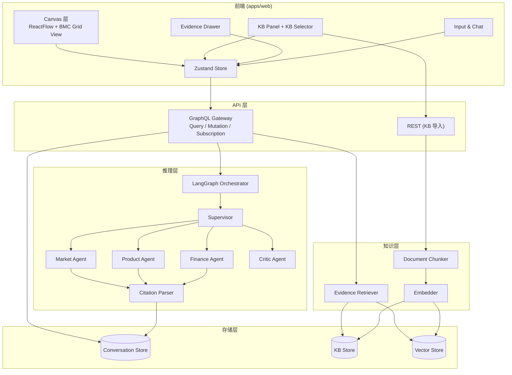
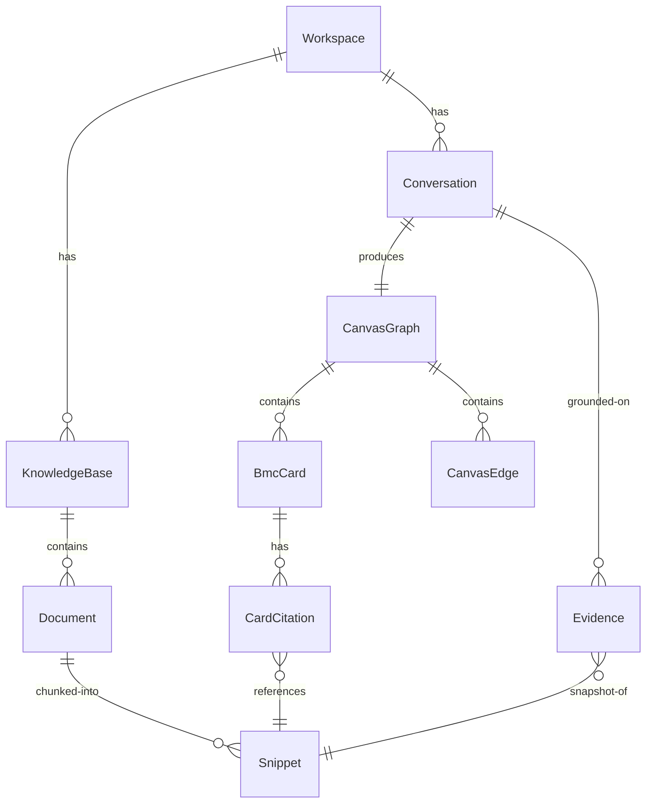
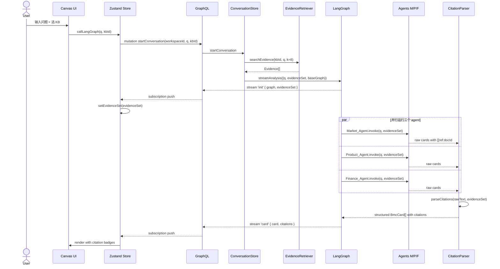
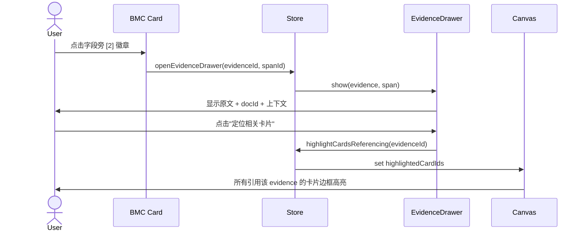
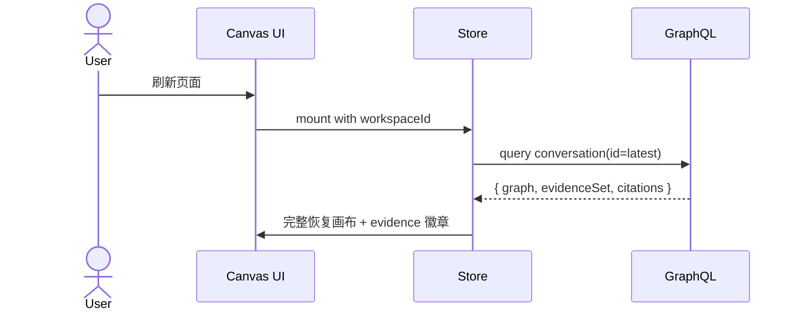
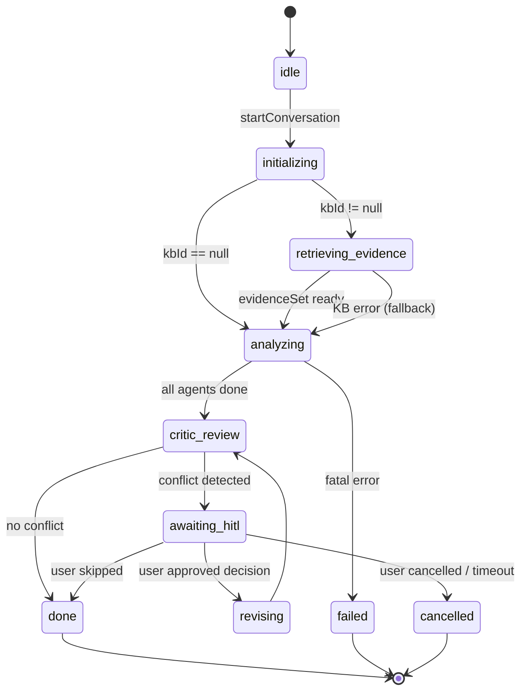
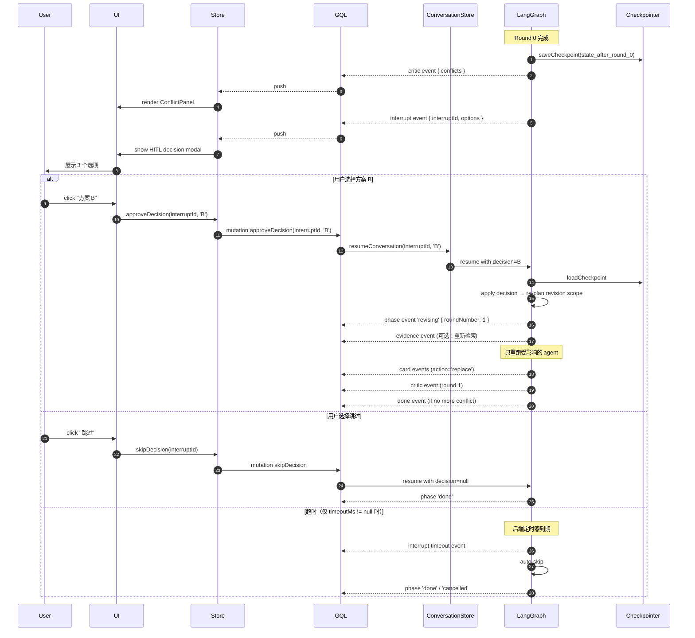

# Evidence-Grounded BMC System — 架构设计方案

> **版本**: v1.0 (2026-04-17)
> **范围**: 仅覆盖"Canvas + MACRA 对话运行时"这条线，不含 KB 任务服务扩展、Comfy BMC 视图切换、Thesis PRD 等其他改动。
> **创新方向**: Evidence-Grounded BMC Generation with Cell-Level Citation（方向 ①）

---

## 0. 本文档范围与假设

本架构基于以下保底假设，任何一条假设变动都需要微调本文档：

| 假设代码 | 内容 |
|---|---|
| A | 学位性质：专硕（软件工程硕士） |
| B | 答辩时间：2026 年 6 月，剩余 ≈ 2 个月 |
| C | 导师对评估无硬要求（需要能跑 + 工程规范 + 创新点讲清楚） |
| D | 创新方向：Evidence-Grounded BMC with Cell-Level Citation |
| E | Meflex (2026) 真实存在，在 Related Work 作为对比工作 |

如任一假设变动，见 §11 "假设变动影响"。

---

## 1. 整体架构

### 1.1 分层视图



### 1.2 五条关键设计原则

| 原则 | 说明 | 违反时风险 |
|---|---|---|
| **Citation 是一等公民** | 贯穿 prompt → parser → store → UI，不是附加字段 | 退化成 evidence 装饰徽标（当前状态） |
| **Evidence 有稳定 ID** | `docId + snippetId` 二级结构，跨会话复用 | Citation 指向临时 ID，历史会话无法回溯 |
| **前后端双向绑定** | 卡片 ↔ evidence 双向可查 | 单向引用失去"evidence 驱动探索"能力 |
| **LLM 输出强校验** | Citation 标记必须指向真实 evidence，否则降级 no-ref | 评估指标失效，hallucination 无法度量 |
| **降级而非失败** | LLM 漏标时标 `[[no-ref]]` + UI 警示，不重试 | 生成过程不可预测，无法量化评估 |

---

## 2. 核心数据模型

### 2.1 实体关系



### 2.2 TypeScript 类型定义

置于 `packages/shared/src/types/`：

```typescript
// packages/shared/src/types/evidence.ts
export type Evidence = {
  id: string                  // 全局唯一 (UUID)
  docId: string
  snippetId: string           // 文档内稳定 ID
  text: string
  score: number               // 检索相关度 0-1
  metadata: {
    source: 'file' | 'url' | 'seed'
    chunkIndex: number
    charStart: number
    charEnd: number
    title?: string
  }
}

export type EvidenceRef = {
  evidenceId: string
  docId: string
  snippetId: string
}

// packages/shared/src/types/citation.ts
export type BmcCardField = 'title' | 'content' | 'summary'

export type CitationSpan = {
  textStart: number           // 在字段文本中的字符偏移
  textEnd: number
  refs: EvidenceRef[]         // 支撑这段文本的 evidence
}

export type CardCitation = {
  cardId: string
  fieldName: BmcCardField
  spans: CitationSpan[]
}

// packages/shared/src/types/bmc.ts
export type BmcDimension =
  | 'CUSTOMER_SEGMENTS' | 'VALUE_PROPOSITIONS' | 'CHANNELS'
  | 'CUSTOMER_RELATIONSHIPS' | 'REVENUE_STREAMS' | 'KEY_RESOURCES'
  | 'KEY_ACTIVITIES' | 'KEY_PARTNERSHIPS' | 'COST_STRUCTURE'

export type BmcCard = {
  id: string
  dimension: BmcDimension
  title: string
  content: string
  summary?: string
  agentType: 'market' | 'product' | 'finance' | 'general'
  citations: CardCitation[]   // ★ 新增
  groundingRate: number       // ★ 新增：字段级被引用的覆盖率 0-1
  metadata: Record<string, unknown>
}
```

### 2.3 数据持久化策略

| 实体 | 存储 | 生命周期 |
|---|---|---|
| `Evidence` | Conversation 内存 + 快照到 ConversationStore | 会话生命周期 + 持久化 |
| `Snippet` | KB Store + 向量库 | 长期（直到文档删除） |
| `CardCitation` | ConversationStore 的 `CanvasGraph.citations` 字段 | 持久化 |
| `BmcCard.groundingRate` | 派生字段，存储时计算一次 | 持久化 |

---

## 3. 关键数据流

### 3.1 流 A：发起分析（端到端链路）



### 3.2 流 B：前端 Citation 徽章交互



### 3.3 流 C：反向追溯（Evidence → Cards）

从 KB 面板选中一条 evidence，画布上高亮所有引用它的 BMC 卡片。用于评估"这条资料影响了哪些维度的分析"。

### 3.4 流 D：刷新恢复



---

## 4. 模块职责

### 4.1 前端模块

| 模块 | 路径 | 职责 | 状态 |
|---|---|---|---|
| Canvas Page | `apps/web/app/(app)/workspace/[id]/canvas/page.tsx` | 画布主界面 + dual view 切换 | 现有，改 |
| KB Selector | `apps/web/src/features/knowledge/components/KbSelector.tsx` | canvas 输入区的 KB 选择下拉 | **新增** |
| Citation Badge | `apps/web/src/features/canvas/components/CitationBadge.tsx` | 卡片字段内联 `[n]` 徽章 | **新增** |
| Card Field Renderer | `apps/web/src/features/canvas/components/CardFieldWithCitations.tsx` | 根据 spans 把字段文本渲染成"文本 + 徽章"混合序列 | **新增** |
| Evidence Drawer | `apps/web/src/features/canvas/components/EvidenceDrawer.tsx` | 点击徽章弹出的侧抽屉 | **新增** |
| Highlight Hook | `apps/web/src/features/canvas/hooks/useCitationHighlight.ts` | 管理"被高亮卡片"状态 | **新增** |
| Zustand Store | `apps/web/src/features/comfy/store/comfy-store.ts` | 扩展 citations state + actions | 现有，改 |

### 4.2 后端模块

| 模块 | 路径 | 职责 | 状态 |
|---|---|---|---|
| Conversation Store | `packages/server/src/application/conversation-store.ts` | 管理会话 + evidence + citations 持久化 | 现有，改 |
| Evidence Retriever | `packages/server/src/services/evidence-retriever.ts` | KB 检索 + 包装 Evidence (从 conversation-store 抽出) | **新增** |
| LangGraph Orchestrator | `packages/server/src/services/business-langgraph.ts` | 多 agent 协同 | 现有，改 |
| **Citation Parser** | `packages/server/src/services/citation-parser.ts` | 解析 `[[ref:...]]` → `CitationSpan[]` | **新增（创新核心）** |
| GraphQL Schema | `packages/server/src/graphql/type-defs.ts` | 扩展 Evidence / Citation 类型 | 现有，改 |
| GraphQL Resolvers | `packages/server/src/graphql/resolvers.ts` | 扩展 evidence / citation query | 现有，改 |

---

## 5. 接口契约

### 5.1 GraphQL Schema 增量

```graphql
# 新类型
type Evidence {
  id: ID!
  docId: ID!
  snippetId: String!
  text: String!
  score: Float!
  metadata: EvidenceMetadata!
}

type EvidenceMetadata {
  source: String!             # 'file' | 'url' | 'seed'
  chunkIndex: Int!
  charStart: Int!
  charEnd: Int!
  title: String
}

type EvidenceRef {
  evidenceId: ID!
  docId: ID!
  snippetId: String!
}

type CitationSpan {
  textStart: Int!
  textEnd: Int!
  refs: [EvidenceRef!]!
}

type CardCitation {
  cardId: ID!
  fieldName: String!          # 'title' | 'content' | 'summary'
  spans: [CitationSpan!]!
}

# 扩展现有类型
extend type BmcCard {
  citations: [CardCitation!]!
  groundingRate: Float!
}

extend type Conversation {
  evidenceSet: [Evidence!]!
  citations: [CardCitation!]!
}

# 新增 Query
extend type Query {
  evidence(id: ID!): Evidence
  cardsReferencingEvidence(conversationId: ID!, evidenceId: ID!): [BmcCard!]!
}
```

### 5.2 LangGraph Stream Event 协议增量

```typescript
// packages/server/src/services/business-langgraph.ts
type BusinessStreamUpdate =
  // 现有
  | { type: 'init'; graph: CanvasGraph; evidenceSet: Evidence[] }      // ★ 扩展
  | { type: 'graph-append'; graph: CanvasGraph }
  | { type: 'graph-diff'; delta: CanvasDelta }
  // 新增
  | { type: 'card'; card: BmcCard; citations: CardCitation[] }         // ★ 新增
  | { type: 'critic'; conflict: Conflict }
  | { type: 'done'; stats: RunStats }
```

### 5.3 前端 Store State 增量

```typescript
interface ComfyStoreState {
  // 现有
  nodes: CanvasNode[]
  edges: CanvasEdge[]
  knowledgeEvidence: Evidence[]

  // ★ 新增
  citations: Map<string /* cardId */, CardCitation[]>
  evidenceDrawer: {
    isOpen: boolean
    focusedEvidenceId: string | null
    focusedSpanIndex: number | null
    highlightedCardIds: Set<string>
  }
  selectedKbId: string | null       // KB selector 选中值

  // ★ 新增 actions
  setCitations: (cardId: string, citations: CardCitation[]) => void
  setSelectedKbId: (kbId: string | null) => void
  openEvidenceDrawer: (evidenceId: string, spanIndex?: number) => void
  closeEvidenceDrawer: () => void
  highlightCardsReferencingEvidence: (evidenceId: string) => void
  clearCitationHighlight: () => void
}
```

---

## 6. 创新章节核心设计

### 6.1 Cell-level Citation 表示法

**LLM 输出的文本内嵌格式**：

```
目标客户是 Z 世代都市青年[[ref:d42#s3]]，主要集中在一二线城市[[ref:d8#s1]]。该群体消费能力较父辈提升约 30%[[no-ref]]。
```

**Parser 解析后的结构化形式**：

```json
{
  "cardId": "market-a3f",
  "fieldName": "content",
  "spans": [
    { "textStart": 0, "textEnd": 11,
      "refs": [{ "evidenceId": "e1", "docId": "d42", "snippetId": "s3" }] },
    { "textStart": 12, "textEnd": 23,
      "refs": [{ "evidenceId": "e2", "docId": "d8", "snippetId": "s1" }] },
    { "textStart": 24, "textEnd": 46,
      "refs": [] /* no-ref */ }
  ]
}
```

**文本字段的 clean 版本（UI 实际渲染）**：

```
目标客户是 Z 世代都市青年，主要集中在一二线城市。该群体消费能力较父辈提升约 30%。
```

UI 按 spans 位置在文本中插入徽章或 ⚠️ 图标。

### 6.2 Citation-aware Prompt Template

```
你是 Market_Agent。负责生成 BMC 中的 CUSTOMER_SEGMENTS、CHANNELS、CUSTOMER_RELATIONSHIPS 三个维度。

## 重要规则：证据引用
- 你的分析必须基于以下 Evidence。
- 每个具体判断后面必须带引用标记 [[ref:docId#snippetId]]
- 如果一个判断没有 Evidence 支撑，必须标记 [[no-ref]]
- 禁止编造任何 docId 或 snippetId；禁止跳过标记直接输出

## Available Evidence (top-8)

[e1] docId=d42 snippetId=s3 score=0.89
     "18-26 岁 Z 世代展现出强烈的品牌认同需求..."

[e2] docId=d8 snippetId=s1 score=0.76
     "一二线城市消费者对新兴品牌的接受度显著高于..."

...

## Few-shot Example

输入：分析某新能源车初创商业模型
输出：
{
  "dimension": "CUSTOMER_SEGMENTS",
  "title": "目标客户群",
  "content": "主力客群是 Z 世代都市青年[[ref:d42#s3]]，集中在一二线城市[[ref:d8#s1]]，品牌敏感度较强[[ref:d42#s7]]。消费能力较父辈提升约 30%[[no-ref]]。"
}

## 当前任务

用户问题：{question}
请生成 3 个卡片（JSON 数组），每个包含 dimension / title / content 字段。content 必须使用上述引用规则。
```

### 6.3 Citation Parser 算法

```typescript
// packages/server/src/services/citation-parser.ts

const CITATION_REGEX = /\[\[ref:([a-zA-Z0-9_-]+)#([a-zA-Z0-9_-]+)\]\]/g
const NOREF_REGEX = /\[\[no-ref\]\]/g

export type ParseResult = {
  cleanText: string
  spans: CitationSpan[]
  noRefRanges: Array<{ start: number; end: number }>
  invalidRefs: Array<{ docId: string; snippetId: string }>   // LLM 编造的 ref
}

export function parseCitations(
  rawText: string,
  evidenceSet: Evidence[]
): ParseResult {
  // 1. 建 evidence 索引
  const evidenceIndex = new Map<string, Evidence>()
  for (const e of evidenceSet) {
    evidenceIndex.set(`${e.docId}#${e.snippetId}`, e)
  }

  // 2. 合并两种 token 的 match，按位置排序
  const tokens: Array<{
    kind: 'ref' | 'noref'
    start: number
    end: number
    docId?: string
    snippetId?: string
  }> = []

  for (const m of rawText.matchAll(CITATION_REGEX)) {
    tokens.push({
      kind: 'ref',
      start: m.index!,
      end: m.index! + m[0].length,
      docId: m[1],
      snippetId: m[2]
    })
  }
  for (const m of rawText.matchAll(NOREF_REGEX)) {
    tokens.push({
      kind: 'noref',
      start: m.index!,
      end: m.index! + m[0].length
    })
  }
  tokens.sort((a, b) => a.start - b.start)

  // 3. 生成 cleanText + spans（把 token 之前的一个句子作为 span 文本）
  let cleanText = ''
  let cleanCursor = 0
  let lastTokenEnd = 0
  const spans: CitationSpan[] = []
  const noRefRanges: Array<{ start: number; end: number }> = []
  const invalidRefs: Array<{ docId: string; snippetId: string }> = []

  for (const token of tokens) {
    const segment = rawText.slice(lastTokenEnd, token.start)
    cleanText += segment
    const segmentEndInClean = cleanCursor + segment.length

    // 找 span 起点：向前找句末标点（句号/分号/换行/段首）
    const spanStart = findPhraseStart(cleanText, segmentEndInClean)

    if (token.kind === 'ref') {
      const key = `${token.docId}#${token.snippetId}`
      const evidence = evidenceIndex.get(key)
      if (evidence) {
        spans.push({
          textStart: spanStart,
          textEnd: segmentEndInClean,
          refs: [{ evidenceId: evidence.id, docId: token.docId!, snippetId: token.snippetId! }]
        })
      } else {
        invalidRefs.push({ docId: token.docId!, snippetId: token.snippetId! })
        // 降级：视作 no-ref
        noRefRanges.push({ start: spanStart, end: segmentEndInClean })
      }
    } else {
      noRefRanges.push({ start: spanStart, end: segmentEndInClean })
    }

    cleanCursor = segmentEndInClean
    lastTokenEnd = token.end
  }

  cleanText += rawText.slice(lastTokenEnd)

  // 4. 合并相邻同 evidence 的 span
  const mergedSpans = mergeAdjacentSpans(spans)

  return { cleanText, spans: mergedSpans, noRefRanges, invalidRefs }
}

function findPhraseStart(text: string, pos: number): number {
  // 向前找句号/分号/换行；若找不到则用段首
  const boundaries = /[。；\n!?!?]/g
  let lastBoundary = 0
  for (const m of text.slice(0, pos).matchAll(boundaries)) {
    lastBoundary = m.index! + 1
  }
  return lastBoundary
}

function mergeAdjacentSpans(spans: CitationSpan[]): CitationSpan[] {
  // 相邻（end_i === start_{i+1}）且 evidenceId 集合相同的 spans 合并
  if (spans.length === 0) return []
  const result: CitationSpan[] = [spans[0]]
  for (let i = 1; i < spans.length; i++) {
    const prev = result[result.length - 1]
    const cur = spans[i]
    const prevIds = new Set(prev.refs.map(r => r.evidenceId))
    const curIds = new Set(cur.refs.map(r => r.evidenceId))
    if (prev.textEnd === cur.textStart && setEqual(prevIds, curIds)) {
      prev.textEnd = cur.textEnd
    } else {
      result.push(cur)
    }
  }
  return result
}
```

### 6.4 Traceable UI 交互设计

**Card Field 渲染**：

```
┌─ [CUSTOMER_SEGMENTS] 目标客户群 ──────────────────┐
│ 主力客群是 Z 世代都市青年 [1] ，集中在一二线        │
│ 城市 [2] ，品牌敏感度较强 [3] 。消费能力较父辈      │
│ 提升约 30% ⚠️                                     │
└──────────────────────────────────────────────────┘
```

- `[1] [2] [3]`: Citation 徽章（inline），悬停 tooltip 显示 docId
- `⚠️`: no-ref 警示图标
- 点击徽章 → Evidence Drawer 打开并定位

**Evidence Drawer（侧抽屉，不是 modal）**：

```
┌─ Evidence Source ──────────────────┐
│ 来源：新能源行业白皮书 2025        │
│ docId: d42  snippetId: s3          │
│ 相关度: 0.89                       │
│                                    │
│ 原文片段：                         │
│ ┌────────────────────────────┐     │
│ │ 18-26 岁 Z 世代展现出强烈  │     │
│ │ 的品牌认同需求...          │     │
│ └────────────────────────────┘     │
│                                    │
│ [查看完整文档]  [定位相关卡片]     │
└────────────────────────────────────┘
```

**反向高亮（点"定位相关卡片"后）**：

- Canvas 上所有引用该 evidence 的 BMC 卡片边框高亮（rose-400 + 3px）
- 其他卡片淡化（opacity 0.4）
- Esc 或点画布空白 → 清除高亮

---

## 7. 目录结构

```
apps/web/
  app/(app)/workspace/[id]/canvas/page.tsx            # 现有，改：加 KB selector、接 citation
  src/features/
    canvas/
      components/
        CitationBadge.tsx                             # 新增
        CardFieldWithCitations.tsx                    # 新增
        EvidenceDrawer.tsx                            # 新增
      hooks/
        useCitationHighlight.ts                       # 新增
    knowledge/
      components/
        KbSelector.tsx                                # 新增
    comfy/store/
      comfy-store.ts                                  # 现有，扩展

packages/server/src/
  services/
    business-langgraph.ts                             # 现有，改 prompt + 接 parser
    citation-parser.ts                                # 新增（创新核心）
    evidence-retriever.ts                             # 新增（从 conversation-store 抽出）
  graphql/
    type-defs.ts                                      # 现有，扩展 schema
    resolvers.ts                                      # 现有，扩展 resolver
  application/
    conversation-store.ts                             # 现有，citations 持久化
  application/__tests__/
    citation-parser.test.ts                           # 新增

packages/shared/src/types/                            # 新增类型目录
  evidence.ts
  citation.ts
  bmc.ts
```

---

## 8. 从现有代码到目标架构的 Delta

按影响度 + 紧迫度排序：

### P0（阻塞主流程，必做）

| # | 变更 | 位置 | 工作量 |
|---|---|---|---|
| 1 | Canvas 输入区加 KB selector，`callLangGraph` 传 kbId | `canvas/page.tsx` + 新 `KbSelector.tsx` | 0.5 天 |
| 2 | comfy-store 的 watcher 注册 onInit handler，消费 `init.evidenceSet` | `comfy-store.ts` | 0.5 天 |
| 3 | 补 `General_Agent` 的 `buildKnowledgePrompt` 调用（当前漏了） | `business-langgraph.ts` | 0.2 天 |

### P1（创新核心，必做）

| # | 变更 | 位置 | 工作量 |
|---|---|---|---|
| 4 | 实现 Citation Parser（含测试） | `citation-parser.ts` + 单元测试 | 2 天 |
| 5 | 改 Market/Product/Finance agent prompt，注入 citation 规则 + few-shot | `business-langgraph.ts` | 1 天 |
| 6 | BmcCard 数据模型加 `citations` + `groundingRate` | `packages/shared/types/bmc.ts` + `business-langgraph.ts` | 0.5 天 |
| 7 | GraphQL Schema 扩展 Evidence / Citation | `type-defs.ts` + `resolvers.ts` | 1 天 |
| 8 | ConversationStore citations 持久化 | `conversation-store.ts` | 0.5 天 |
| 9 | 前端 Citation Badge + Card Field Renderer | 新增 3 个组件 | 2 天 |
| 10 | 前端 Evidence Drawer + 反向高亮 | 新增 Drawer + hook | 1.5 天 |

### P2（评估与加分项）

| # | 变更 | 位置 | 工作量 |
|---|---|---|---|
| 11 | 评估脚本（自动跑 S/M/MK/MKC 四组） | `scripts/eval-baseline.ts` | 2 天 |
| 12 | 人工标注工具（citation accuracy） | `scripts/annotate.ts` | 1 天 |
| 13 | Snippet 稳定化（KB 导入时一次切片并分配 snippetId） | `backend/src/routes/kb.ts` + `kb-task-service.ts` | 1.5 天 |

**合计**：P0 + P1 ≈ 10 天；加 P2 ≈ 14.5 天。

---

## 9. 架构决策记录（ADR）

### ADR-01 为什么是 Cell-level 而非 Segment-level

**决策**：引用粒度精确到 BMC 卡片字段内的 **text span**，而不是整张卡片或整段文字。

**理由**：
1. BMC 是结构化对象，每个字段语义独立，粗粒度引用无法回答"这一句话的依据"
2. Meflex 的论文聚焦 reflection（散文级思考），不做 citation；我们做 cell-level 正好互补
3. 答辩防御：评委若问"为什么要 cell-level" → "粒度必须匹配结构化数据单元"

**Trade-off**：
- 实现复杂度（Parser + Span 合并）
- LLM 输出稳定性要求高，需要 few-shot + 后处理

---

### ADR-02 为什么 Evidence 要有稳定 snippetId

**决策**：Evidence 在 KB 层预先切片并分配稳定 ID，不在每次检索时动态生成。

**理由**：
1. 同一 evidence 跨多次会话、跨刷新都必须可复用
2. Citation 在 ConversationStore 长期存储，不能指向临时 UUID
3. 评估阶段需要跨会话统计"哪些 evidence 最常被引用"

**Trade-off**：
- KB 导入时一次性做切片成本高
- 需要切片策略版本管理（切片算法变了怎么迁移）

---

### ADR-03 为什么 LLM 漏标不重生成

**决策**：LLM 生成无 citation 的字段，标记 `[[no-ref]]` + UI 警示，不触发重生成。

**理由**：
1. 重生成可能死循环（LLM 每次都漏）
2. 显式标示"无支撑"本身就是学术诚实的体现
3. 评估指标 Hallucination Rate 需要 no-ref 样本作为分母

**Trade-off**：
- UI 上 no-ref 警示可能密集，观感不佳
- 用户可能质疑"那为什么 AI 还要输出这种无依据判断"——实际上这是**特性**而非 bug

---

### ADR-04 为什么保留现有多 Agent 架构

**决策**：继续用 Supervisor + Market/Product/Finance + Critic 的现有 LangGraph 架构，**不**引入新的 agent 通信协议。

**理由**：
1. 硕士论文集中一个创新点（Citation）比分散多个更容易讲清楚
2. Meflex 没有 multi-agent，我们保留就够构成差异化
3. 改 agent 架构 = 重写 `business-langgraph.ts` 1700+ 行，时间不够

**Trade-off**：
- 多 agent 部分在答辩里只能作为"工程完整度"描述，不是核心创新
- 未来要做 agent 架构创新时，这部分需要重构

---

### ADR-05 为什么 Evidence Drawer 是 Side Panel 而非 Modal

**决策**：点击 citation 徽章打开右侧 drawer（类似 Chrome DevTools），不用居中 modal。

**理由**：
1. 用户需要"一边看 BMC 画布、一边看 evidence 原文"对比
2. Modal 会遮挡画布，反向高亮效果看不到
3. 反向高亮只有 canvas 可见时才有意义

**Trade-off**：
- Drawer 占用 30-40% 屏幕宽度
- 移动端适配困难（但本系统不考虑移动端）

---

### ADR-06 为什么选 Cell-level Citation 而不是 Conflict Taxonomy（方向 ②）

**决策**：选方向 ①，放弃方向 ②。

**理由**：
1. 代码现状匹配度：① 40% vs ② 50%（差不多）
2. 评估可行性：① 有 citation accuracy / hallucination rate 等量化指标；② 需要人工标注 conflict ground truth 集，成本更高
3. 可演示性：① UI 变化直观（徽章 + drawer + 高亮）；② 冲突面板需要 case 演示，对答辩不直接
4. 论文章节组织：① 有清晰的 "表示法 → Prompt → Parser → UI" 链路；② 需要先做 taxonomy 理论建模

---

## 10. 下一步工作

1. **本文档定稿**（用户 review 本文档）
2. **编写 `IMPLEMENTATION_PLAN.md`**：按 4-5 个 Stage 拆分 P0 + P1 + P2，按答辩时间倒推排时间
3. **Stage 1 从 P0 开始**（Canvas 传 kbId、store 消费 evidenceSet、General_Agent 修补）
4. **每个 Stage 单独 commit + 自测**

---

## 11. 假设变动影响

| 假设变动 | 架构调整 |
|---|---|
| 假设 A：变为学硕 | 加 §4.0 "形式化 Citation 模型"章节；评估增加统计显著性检验；第 4 章方法论更严格 |
| 假设 B：答辩 < 1.5 个月 | 砍 ADR-05 的反向高亮；Evidence Drawer 简化为 popover；跳过 P2 的评估脚本 |
| 假设 C：导师要求 baseline | 第 6 章补完整 B1/B2/B-core 实验；至少做 n≥8 用户研究 |
| 假设 D：换方向 ② | 整个 §6 重写；Parser → Conflict Detector；Drawer → Conflict Panel |
| 假设 E：Meflex 不存在 | §9 ADR-01 第 2 条理由删除；Related Work 节简化 |

---

## 12. Canvas + MACRA 对话运行时详设

本章深化 §3 的数据流，覆盖**会话全生命周期**、**HITL 中断与 revision**、**刷新恢复**、**错误降级**、**并发与资源治理**。这是论文 §3.5「前后端闭环集成」和 §3.1「多智能体协同」的实现级展开。

### 12.1 会话生命周期状态机



**每个状态的不变量**：

| 状态 | phase | pendingInterrupt | error | 前端可操作 |
|---|---|---|---|---|
| `idle` | null | null | null | 发起分析 |
| `initializing` | 'initializing' | null | null | 取消 |
| `retrieving_evidence` | 'retrieving-evidence' | null | null | 取消 |
| `analyzing` | 'analyzing' | null | null | 取消 |
| `critic_review` | 'critic-review' | null | null | 取消 |
| `awaiting_hitl` | 'awaiting-hitl' | InterruptContext | null | 选方案 / 跳过 / 取消 |
| `revising` | 'revising' | null | null | 取消 |
| `done` | 'done' | null | null | 发起新分析 |
| `failed` | 'failed' | null | ErrorInfo | 重试 / 新分析 |
| `cancelled` | 'cancelled' | null | null | 新分析 |

**Round 计数**：`roundNumber` 从 0 开始。每进入一次 `revising → critic_review` 循环，`roundNumber++`。

### 12.2 完整 Stream Event 协议

GraphQL Subscription `conversationStream(id)` 推送的事件类型：

```typescript
// packages/server/src/services/business-langgraph.ts 统一定义
type ConversationStreamEvent =
  | InitEvent
  | PhaseEvent
  | EvidenceEvent
  | ProgressEvent
  | CardEvent
  | CriticEvent
  | InterruptEvent
  | DoneEvent
  | ErrorEvent

type InitEvent = {
  type: 'init'
  conversationId: string
  workspaceId: string
  question: string
  baseGraph: CanvasGraph
  evidenceSet: Evidence[]   // ★ 已检索的 evidence（若 kbId 提供）
  startedAt: string         // ISO timestamp
}

type PhaseEvent = {
  type: 'phase'
  phase: ConversationPhase
  roundNumber: number
}

type EvidenceEvent = {
  type: 'evidence'
  evidenceSet: Evidence[]   // 在 revision 阶段可能重新检索
  triggeredBy: 'initial' | 'revision' | 'user-refinement'
}

type ProgressEvent = {
  type: 'progress'
  agent: 'supervisor' | 'market' | 'product' | 'finance' | 'critic'
  progress: number          // 0-1
  currentStep?: string
}

type CardEvent = {
  type: 'card'
  card: BmcCard
  citations: CardCitation[]
  agentType: 'market' | 'product' | 'finance' | 'general'
  roundNumber: number
  action: 'add' | 'replace'  // replace 时替换同 cardId 的旧版本
  replacesCardId?: string
}

type CriticEvent = {
  type: 'critic'
  conflicts: Conflict[]
  roundNumber: number
}

type InterruptEvent = {
  type: 'interrupt'
  interruptId: string
  reason: 'conflict-detected' | 'user-refinement-needed'
  options: InterruptOption[]
  timeoutMs: number | null  // null = 不超时
  createdAt: string
}

type DoneEvent = {
  type: 'done'
  stats: {
    durationMs: number
    totalCards: number
    totalCitations: number
    groundingRate: number     // 所有卡片的平均 citation 覆盖率
    hallucinationRate: number // no-ref 字段占比（评估关键指标）
    conflictCount: number
    roundCount: number
  }
}

type ErrorEvent = {
  type: 'error'
  code: ErrorCode
  message: string
  retriable: boolean
  occurredAt: string
}

type ErrorCode =
  | 'LLM_TIMEOUT'
  | 'LLM_RATE_LIMIT'
  | 'KB_RETRIEVE_FAILED'
  | 'AGENT_OUTPUT_INVALID'
  | 'CITATION_PARSE_FAILED'
  | 'INVALID_STATE_TRANSITION'
  | 'UNKNOWN'
```

**事件顺序保证**：单一 conversation 内，事件按时间戳严格有序推送。前端 Store 按顺序 `applyStreamEvent`。

### 12.3 HITL 中断与 Revision 闭环

这是"用户参与决策"的核心机制，对应 proposal 3.1 的"互补性和约束性"。



**关键设计点**：

1. **Checkpoint 机制**：LangGraph 原生支持 checkpointer（`@langchain/langgraph` 的 `MemorySaver` 或 `PostgresSaver`）。每个 phase 转换时 save，HITL resume 时 load。
2. **Revision 范围**：基于 conflict 的 `dimension` 字段决定重跑哪些 agent（例如 conflict 在 PRICING↔COST，则只重跑 Product 和 Finance，Market 不动）。降低成本。
3. **InterruptId 的唯一性**：`interruptId = nanoid(10)`，前端必须回传，后端才能定位到正确的 checkpoint。

### 12.4 Round Tracking 与版本管理

**卡片替换策略**：

- 每张卡片带 `metadata.producedInRound: number`
- Revision 时新卡片的 `action: 'replace'` + `replacesCardId: <old>` 指向被替换的卡片
- `ConversationStore` 保留所有历史版本（软删除模式），UI 默认渲染最新

```typescript
// ConversationStore 内部结构
interface CanvasGraphInternal {
  nodes: CanvasNode[]           // 所有版本
  edges: CanvasEdge[]
  activeNodeIds: Set<string>    // 当前轮次 active 的 node
  cardHistory: Map<string, string[]>  // cardId → [round0_id, round1_id, ...]
}

function applyCardEvent(event: CardEvent) {
  if (event.action === 'add') {
    nodes.push(event.card)
    activeNodeIds.add(event.card.id)
  } else if (event.action === 'replace' && event.replacesCardId) {
    // 保留旧版本作为历史
    activeNodeIds.delete(event.replacesCardId)
    nodes.push(event.card)
    activeNodeIds.add(event.card.id)
    // 记录历史链
    cardHistory.set(
      logicalCardKey(event.card),
      [...(cardHistory.get(logicalCardKey(event.card)) ?? []), event.card.id]
    )
  }
}
```

**UI 切换视图**：
- 默认：只显示 `activeNodeIds` 中的卡片
- "版本历史"模式：按 `cardHistory` 展开，显示每张卡片的 round 链

### 12.5 刷新恢复与 Stream 续订

用户刷新页面时的恢复流程：

```typescript
// apps/web/src/features/comfy/store/comfy-store.ts
async function restoreLatestConversation(workspaceId: string) {
  // 1. 查询工作区最新 conversation
  const { latestConversation } = await gql.query(LATEST_CONVERSATION_QUERY, { workspaceId })

  if (!latestConversation) {
    setStore({ phase: 'idle' })
    return
  }

  // 2. 读完整快照
  const snapshot = await gql.query(CONVERSATION_SNAPSHOT_QUERY, {
    id: latestConversation.id
  })
  applySnapshot(snapshot)

  // 3. 若分析仍在进行，续订 stream
  if (isActivePhase(snapshot.phase)) {
    const stream = gql.subscribe(CONVERSATION_STREAM, { id: snapshot.id })
    stream.on('data', applyStreamEvent)
    stream.on('error', handleStreamError)
  }
}

function isActivePhase(phase: ConversationPhase): boolean {
  return phase === 'initializing'
    || phase === 'retrieving-evidence'
    || phase === 'analyzing'
    || phase === 'critic-review'
    || phase === 'awaiting-hitl'
    || phase === 'revising'
}
```

**后端 stream 续订支持**：
- 后端在 `conversationStream(id)` 订阅时，先从 Checkpointer 读当前 state
- 若 state 显示中间某 phase 未完成事件已推送过，需要"补播"——但通常只补最后一个 phase 事件（不是所有 card 事件），让前端知道"目前在哪"
- 配合前端通过 snapshot 已经拿到的完整状态，不需要重放所有 card 事件

**LangGraph Checkpointer 选型**：
- 开发期：`MemorySaver`（进程内）
- 生产期：`PostgresSaver`（跨进程共享）
- 硕士论文阶段：**MemorySaver 够用**，单实例部署

### 12.6 并发与锁

**每个 workspace 同时只允许一个 active conversation**：

```typescript
// packages/server/src/application/conversation-store.ts
async function startConversation(workspaceId, userId, question, kbId) {
  const active = await findActiveConversation(workspaceId)
  if (active) {
    throw new ConflictError({
      code: 'WORKSPACE_HAS_ACTIVE_CONVERSATION',
      message: 'Workspace 已有进行中的分析',
      activeConversationId: active.id,
      activePhase: active.phase
    })
  }
  // ... create new
}
```

前端处理：
- 收到 `WORKSPACE_HAS_ACTIVE_CONVERSATION` 错误 → 显示确认弹窗 "是否取消当前分析并开始新的？"
- 用户确认 → `mutation cancelConversation(active.id)` → 再次 `startConversation`

**多用户协同**（本阶段不实现但架构预留）：
- `conversationStream(id)` 所有订阅者可见
- 只有 `createdBy === userId` 可以 `approveDecision` / `cancel`

### 12.7 错误处理与降级矩阵

| 错误场景 | 错误码 | 降级策略 | 用户感知 |
|---|---|---|---|
| KB 检索失败 | `KB_RETRIEVE_FAILED` | 跳过 evidence，进入无 KB 模式；phase 直接从 initializing → analyzing | Banner "知识库不可用，将进行无约束分析" |
| 单个 Agent LLM timeout | `LLM_TIMEOUT` | 标记该 agent failed；Supervisor 判断是否可接受（例如 Market 失败但 Product/Finance 成功可接受） | Agent 进度条变 ⚠️ 灰色 |
| 所有 Agent 失败 | `AGENT_OUTPUT_INVALID` | phase → 'failed'，保留已生成部分 | 全屏错误 + "重试"按钮 |
| Citation Parser 失败 | `CITATION_PARSE_FAILED` | 卡片 citations=[] + groundingRate=0；UI 卡片头部显示 ⚠️ "引用解析失败" | 局部警示 |
| LLM API rate limit | `LLM_RATE_LIMIT` | 指数退避重试 3 次；仍失败则降级到单 agent 模式 | Banner "API 限流，正在重试" |
| Stream 订阅断线 | `(前端) STREAM_DISCONNECTED` | 前端自动重连：1s / 3s / 10s 三次 | Toast "网络重连中..." |
| HITL 超时 | `(后端定时) HITL_TIMEOUT` | 若 `timeoutMs != null` 到期，自动 skip | UI 倒计时显示，到期提示 |
| 用户刷新时后端进程重启 | `INVALID_STATE_TRANSITION` | 若用 MemorySaver，checkpoint 丢失 → 标记 failed，让用户重新开始 | 提示 "分析已失效，请重新发起" |

### 12.8 性能与资源治理

**Token 预算**：

```
Agent Prompt 组成（以 Market Agent 为例）:
  system prompt          ~600 tokens
  few-shot example       ~400 tokens
  question               ~100 tokens
  cross-context          ≤ 500 tokens
  knowledge context      ≤ 2000 tokens (evidenceSet 截断)
  revision suffix (if)   ~200 tokens
  ─────────────────────────────
  总 input               ≤ 3800 tokens
  max_output_tokens      1500
```

- `evidenceSet` 默认 k=8，如果拼接后超 2000 tokens → 降级到 k=5，再超 → k=3
- 每个 agent 独立 token budget，不互相挤占

**并发控制**：

```typescript
// packages/server/src/services/business-langgraph.ts
const AGENT_CONCURRENCY = 3  // Market/Product/Finance 并行
const CRITIC_CONCURRENCY = 1 // Critic 串行
const CONVERSATION_HARD_TIMEOUT_MS = 15 * 60 * 1000  // 15 分钟

await Promise.all(
  agents.map(agent =>
    pLimit(AGENT_CONCURRENCY)(() => runAgent(agent, state))
  )
)
```

**Stream 事件节流**：

| 事件类型 | 节流策略 |
|---|---|
| `progress` | 同一 agent 100ms 内合批，只推最新一次 |
| `card` | 不合批，实时 |
| `critic` | 不合批，实时 |
| `interrupt` | 不合批，实时 |
| `phase` | 不合批，状态变更立即推 |

### 12.9 日志与可观测性

**每个 conversation 一个 traceId**，从 `startConversation` 到 `done` 的所有日志打同一个 traceId：

```
[2026-04-17T14:23:10Z] INFO  traceId=c_abc phase=initializing workspaceId=ws_1 userId=u_42
[2026-04-17T14:23:10Z] INFO  traceId=c_abc phase=retrieving-evidence kbId=kb_1 k=8
[2026-04-17T14:23:12Z] INFO  traceId=c_abc phase=retrieving-evidence evidenceSet.length=8 duration=2.1s
[2026-04-17T14:23:12Z] INFO  traceId=c_abc phase=analyzing agent=market start
[2026-04-17T14:23:25Z] INFO  traceId=c_abc phase=analyzing agent=market end tokens_in=3240 tokens_out=980 duration=12.3s
[2026-04-17T14:23:25Z] INFO  traceId=c_abc agent=market raw_cards=3 citations_raw=11 no_ref_raw=2
[2026-04-17T14:23:25Z] INFO  traceId=c_abc agent=market parsed citations_valid=10 citations_invalid=1 no_ref=3
...
[2026-04-17T14:24:50Z] INFO  traceId=c_abc phase=done duration_ms=100000 total_cards=9 grounding_rate=0.87 hallucination_rate=0.08 conflicts=2 rounds=2
```

**用于论文评估的指标自动汇总**（写入 `conversation.stats` JSON 字段）：

```typescript
interface ConversationStats {
  durationMs: number
  tokenUsage: { input: number; output: number; total: number; costUSD: number }
  totalCards: number
  totalCitations: number
  invalidCitations: number      // LLM 编造的 ref
  noRefFields: number            // 标记 [[no-ref]] 的字段数
  totalFields: number
  groundingRate: number          // (totalFields - noRefFields) / totalFields
  hallucinationRate: number      // noRefFields / totalFields（监督评估时由人工复核）
  conflictCount: number
  roundCount: number
  agentSuccess: Record<string, boolean>
  agentDurations: Record<string, number>
}
```

**运行时 Trace 页面**（可选，论文演示加分）：
- 路径 `/workspace/[id]/conversations/[cid]/trace`
- 时间轴展示所有 stream 事件
- 用于答辩时给评委看"系统全程做了什么"

### 12.10 当前代码 vs 本章目标的 Delta

| 运行时能力 | 当前代码 | 本章目标 | 差距 |
|---|---|---|---|
| 状态机 `phase` 字段 | 散在多处（business-langgraph / conversation-store） | 统一 `ConversationPhase` enum | **需要收敛** |
| Stream 事件协议 | `init / graph-append / graph-diff` 三种 | 完整 9 种事件 | 扩展 |
| HITL Checkpoint | 已引入 LangGraph（未验证 resume） | MemorySaver + resume + interruptId 回传 | 完整打通 |
| Round Tracking | `roundNumber` 在 state 里有 | 卡片 metadata 带 `producedInRound` + 版本链 | 新增 |
| 刷新恢复 | 基础 query 有，stream 续订无 | `conversationStream(id)` subscription + 前端 restore 逻辑 | **新增** |
| workspace active 锁 | 无 | 软锁 + 错误码 + 前端提示 | 新增 |
| 错误降级 | 部分 case 有 console.error | 完整错误码 + 前端 Banner | 系统化 |
| Token 预算 | 无明确控制 | k 截断 + max_tokens | 新增 |
| 节流合批 | 无 | progress 事件 100ms 合批 | 新增 |
| traceId 日志 | 已有 traceId 字段 | 统一结构化 + stats 汇总 | 规范化 |

### 12.11 落地优先级（补充 §8 的 Delta 表）

在 §8 的 P0/P1/P2 基础上，本章需新增任务：

**P0（主流程必须）**
- 实现完整 `ConversationPhase` enum 和状态机转换（`packages/server/src/application/conversation-phase.ts` 新增）
- Stream 事件协议扩展（`business-langgraph.ts` + `type-defs.ts`）
- 前端 `restoreLatestConversation` + stream 续订（`comfy-store.ts`）

**P1（HITL 闭环）**
- LangGraph Checkpointer 打通（验证 MemorySaver 在 HITL resume 的正确性）
- InterruptId 前后端回传
- `approveDecision` / `skipDecision` / `cancelConversation` 三个 mutation
- 前端 ConflictPanel + HITL decision modal

**P2（健壮性 + 评估）**
- 错误码矩阵实现
- ConversationStats 自动汇总
- 运行时 Trace 页面（可选）

**工作量新增**：P0 约 3 天，P1 约 3 天，P2 约 2 天，合计 **+8 天**，原计划 14.5 天 → 约 **22.5 天**，仍在 2 个月答辩时间线内。

---

## 附录 A：术语表

| 术语 | 定义 |
|---|---|
| BMC | Business Model Canvas，商业模式画布，9 个维度 |
| Cell-level Citation | 卡片字段文本级别的引用标注，区别于段落/文档级 |
| Evidence | 从知识库检索出的原文片段，带稳定 ID |
| Snippet | KB 文档被切片后的最小单元，`snippetId` 稳定 |
| Citation Span | 字段文本中的一段，对应 1 或多个 evidence 引用 |
| Grounding Rate | 卡片字段文本中被 citation 覆盖的字符比例 |
| No-Ref | LLM 明确标注的"此判断无 evidence 支撑" |

## 附录 B：与 Meflex (2026) 的精确对比

| 维度 | Meflex | 本系统 |
|---|---|---|
| 学科方向 | HCI + 教育技术 | 软件工程 + 商业决策支持 |
| 用户 | 新手创业学生 | 专业决策者（创业者/咨询师/投资人） |
| 理论根基 | reflection / meta-reflection | Evidence grounding / traceable generation |
| LLM 架构 | 单模型 | 多智能体（Supervisor + M/P/F/Critic） |
| 知识增强 | 无 RAG | Workspace KB + 检索 + Cell-level Citation |
| Canvas 形态 | Nonlinear idea canvas（自由） | BMC Grid + Free Canvas（结构化 dual view） |
| 引用机制 | 无 | Cell-level Citation with Snippet ID |
| 主评估指标 | Cognitive Load / Divergent Thinking | Citation Accuracy / Hallucination Rate |
| 评估方法 | 用户研究 n=30 | 自动评估 + 可选小型用户研究 n=10 |
| 发表场景 | HCI 会议 | 专硕毕业论文 / CCF-C 期刊 |
