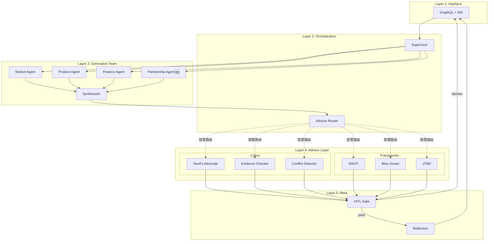

# 后端架构 v2 — Capability-Driven Multi-Agent on LangGraph

> **版本**：v2.0（2026-04-21）
> **范围**：`packages/server/`（Node.js + LangGraph + pgvector）
> **基础**：保留现有 LangGraph StateGraph 结构，引入 Capability Registry + Agent-as-Subgraph + 可插拔 Advisor 层
> **目标**：单 2034 行 god file 拆为模块化多 agent 架构；毕业论文答辩可讲、可扩展新 critic/advisor 而不改 supervisor
> **学术定位**：Capability-driven adversarial collaboration architecture for evidence-grounded BMC generation

---

## 0. 为什么需要 v2

### 0.1 现状快照

当前后端的核心文件 `packages/server/src/services/business-langgraph.ts`：

```
BusinessLangGraphService (class, 2034 行)
├── StateGraph 定义
│   ├── supervisor    (路由决策)
│   ├── generalResponder  (闲聊分支)
│   ├── marketAgent   (CS / CH / CR → 3 维)
│   ├── productAgent  (VP / KA / KR → 3 维)
│   ├── financeAgent  (RS / CS → 2 维)
│   ├── synthesizer   (合并 3 agent 输出)
│   └── critic        (批判 → revise 或 done)
└── 2000+ 行方法、工具函数、状态工厂
```

基础结构已经对了（LangGraph + StateGraph + Annotation），但有 **4 个硬痛点**。

### 0.2 四个硬痛点

| # | 痛点 | 症状 | 影响 |
|---|---|---|---|
| 1 | **God File 2034 行** | 所有 agent 以 `runMarketAgent / runProductAgent / runCritic` 方法形式塞进一个 class | 单文件修改容易牵一发动全身；新 agent 没地方放；论文讲架构没切片 |
| 2 | **Critic 硬编码单 node** | 只有一个 `critic` node，内部 prompt 固定；想加 "devils-advocate / evidence-checker / conflict-detector" 得改 class 源码 | 不满足"可扩展 critic 模式"诉求；每种模式都要改核心文件 |
| 3 | **9 维不完整** | `financeAgent` 只生成 RS / CS（Revenue Streams + Cost Structure），**Key Partnerships 无 agent 生成** | 对齐 `cc-bmc-agent-evolution-plan.md` §1 的"structural mismatch"；9 维生成目标缺一维 |
| 4 | **无 Advisor 层 / 无 Capability Registry** | SWOT / Blue Ocean / JTBD 这些外部透镜无处可插；supervisor 路由硬编码 `if intent == '...'` | 毕业论文要讲"可扩展性"没架构支撑；加一个新 framework 要改 supervisor + state + graph 三处 |

### 0.3 论文诉求映射

| 论文章节 | v2 架构对应 |
|---|---|
| §3 多智能体协同生成 | §3 Agent-as-Subgraph 每个 agent 独立 subgraph |
| §4 对抗式批判（adversarial collaboration） | §4 Advisor Layer，Critic Modes + Framework Advisors 正交设计 |
| §5 可扩展性 / capability-driven | §2 Capability Registry |
| §6 HITL 冲突裁决 | §6 HITL 基于 severity 路由 |
| §7 元反思 / 演化历史 | §5 Event-Sourced Evolution |
| §8 证据落地 | 现有 KB + pgvector，每个 claim 强制 cite |

---

## 1. 分层架构（5 层）

```
┌──────────────────────────────────────────────────────────────┐
│  Layer 1: GraphQL / HTTP Interface                           │
│    Apollo + WebSocket + routes/kb-proxy                      │
├──────────────────────────────────────────────────────────────┤
│  Layer 2: Supervisor + Event Bus                             │
│    Top-level StateGraph orchestration                        │
│    Advisor Router（按 capability 智能选 1-2 个 Advisor）     │
├──────────────────────────────────────────────────────────────┤
│  Layer 3: BMC Generation Team（固定骨架，3 + 1 agent）       │
│    MarketAgent / ProductAgent / FinanceAgent / Synthesizer   │
│    → 输出 9 维 BMC 卡片                                      │
├──────────────────────────────────────────────────────────────┤
│  Layer 4: Advisor Layer（可插拔，registry-driven）           │
│    ├─ Critic Modes（BMC-internal 透镜）                      │
│    │   devils-advocate / evidence-checker / conflict-detector│
│    └─ Framework Advisors（external 透镜）                    │
│        SWOT / Blue Ocean / JTBD                              │
├──────────────────────────────────────────────────────────────┤
│  Layer 5: Infrastructure + Storage                           │
│    Adapters: LLM / Embedding / Supabase / Dify              │
│    Stores: Workspace / Conversation / Memory / Event        │
│    Event Store: agent decisions + HITL + evolution history  │
└──────────────────────────────────────────────────────────────┘
```

**依赖方向（硬规则）**：

```
GraphQL → Supervisor → Advisor Router → Generation Team
                    → Advisor Layer       → Shared State
                    → Event Store          ← Private State

Supervisor 不直接 import agent 实现
Advisor 必须通过 registry 注册
Generation 层不 call Advisor（反向只通过 supervisor）
所有 agent 都不直接访问 storage 层 — 通过 repo 注入
```

---

## 2. Capability Registry（核心抽象）

**设计哲学**：把 agent / advisor 都抽象为 "capability provider"。Supervisor 按 capability 路由，不按 agent name 路由。

### 2.1 Capability DSL

```typescript
// packages/server/src/capabilities/types.ts

export type Capability =
  // 生成能力（谁能生成哪个 BMC 维度）
  | { kind: 'generate'; dimension: BMCDimension }
  // 批判能力（谁能以什么视角批判）
  | { kind: 'critique'; mode: CriticMode }
  // 框架透镜（用什么商业分析框架审视）
  | { kind: 'advise'; framework: AdvisorFramework }
  // 反思能力（单轮 / 多轮演化）
  | { kind: 'reflect'; scope: 'single_round' | 'multi_round_evolution' }
  // 提炼能力（对已生成内容做修订）
  | { kind: 'refine'; strategy: 'minimal_change' | 'full_rewrite' }

export type BMCDimension =
  | 'CUSTOMER_SEGMENTS' | 'VALUE_PROPOSITIONS' | 'CHANNELS'
  | 'CUSTOMER_RELATIONSHIPS' | 'REVENUE_STREAMS' | 'KEY_RESOURCES'
  | 'KEY_ACTIVITIES' | 'KEY_PARTNERSHIPS' | 'COST_STRUCTURE'

export type CriticMode =
  | 'devils-advocate'
  | 'evidence-checker'
  | 'conflict-detector'

export type AdvisorFramework =
  | 'swot'
  | 'blue-ocean'
  | 'jtbd'
```

### 2.2 Agent Descriptor

```typescript
// packages/server/src/capabilities/registry.ts

export type AgentDescriptor = {
  id: string
  name: string
  role: 'generator' | 'advisor' | 'meta'
  capabilities: Capability[]
  // LangGraph subgraph 工厂
  subgraph: () => CompiledStateGraph
  // 输入契约（从顶层 state 投影出 agent 所需）
  projectInput: (state: SharedState) => AgentInput
  // 输出契约（agent 输出合并到顶层 state 的方式）
  mergeOutput: (state: SharedState, output: AgentOutput) => Partial<SharedState>
  // 运行时元数据
  runtime: {
    timeout: number
    retries: number
    cacheable: boolean
  }
}

export const agentRegistry = createRegistry<AgentDescriptor>()

export function registerAgent(descriptor: AgentDescriptor) {
  agentRegistry.register(descriptor)
}
```

### 2.3 Advisor Descriptor（基于 Agent Descriptor 扩展）

```typescript
export type AdvisorDescriptor = AgentDescriptor & {
  role: 'advisor'
  // Advisor Router 用这个判断是否相关
  relevanceScorer: (state: SharedState) => number  // 0-1
  // 批判输出标准化 schema
  critiqueSchema: z.ZodType<Critique>
  // 触发条件（state 满足什么时激活）
  triggerPredicate?: (state: SharedState) => boolean
}

export const advisorRegistry = createRegistry<AdvisorDescriptor>()

export function registerAdvisor(descriptor: AdvisorDescriptor) {
  advisorRegistry.register(descriptor)
}
```

### 2.4 扩展示例：加一个新的 "Lean Canvas Advisor"

```typescript
// packages/server/src/advisors/lean-canvas-advisor.ts

registerAdvisor({
  id: 'lean-canvas-advisor',
  name: 'Lean Canvas Advisor',
  role: 'advisor',
  capabilities: [{ kind: 'advise', framework: 'lean-canvas' }],
  subgraph: () => buildLeanCanvasSubgraph(),
  projectInput: (state) => ({ bmcCards: state.dimensions }),
  mergeOutput: (state, out) => ({ critiques: [...state.critiques, ...out.critiques] }),
  relevanceScorer: (state) => state.dimensions.VALUE_PROPOSITIONS?.confidence ?? 0,
  critiqueSchema: critiqueSchema,
  runtime: { timeout: 30000, retries: 1, cacheable: true }
})
```

**收益**：新加 advisor = 1 个文件 + 1 次 register；零改动到 supervisor / state schema / 顶层 graph。

### 2.5 扩展示例：加一个新 Critic Mode "bias-detector"

```typescript
// packages/server/src/advisors/critics/bias-detector.ts

registerAdvisor({
  id: 'critic-bias-detector',
  name: 'Bias Detector',
  role: 'advisor',
  capabilities: [{ kind: 'critique', mode: 'bias-detector' }],
  subgraph: () => buildBiasDetectorSubgraph(),
  projectInput: (state) => ({ allCards: state.dimensions }),
  mergeOutput: (state, out) => ({ critiques: [...state.critiques, ...out.critiques] }),
  relevanceScorer: (state) => state.roundNumber >= 2 ? 0.8 : 0.3,
  critiqueSchema: critiqueSchema,
  triggerPredicate: (state) => state.roundNumber >= 2,
  runtime: { timeout: 20000, retries: 0, cacheable: false }
})
```

**不改** supervisor / capability types（如果 `CriticMode` 已扩展为开放联合类型）/ state schema / Advisor Router 逻辑。

---

## 3. Agent-as-Subgraph（每个 agent 独立）

### 3.1 顶层 Supervisor Graph

```typescript
// packages/server/src/orchestrators/business-graph.ts

const topGraph = new StateGraph(SharedStateAnnotation)
  .addNode('supervisor', runSupervisor)
  .addNode('generation-team', generationTeamSubgraph.compile())
  .addNode('advisor-router', runAdvisorRouter)
  .addNode('advisor-runner', runAdvisors)   // 动态调用 1-2 个 advisor subgraph
  .addNode('reflection', reflectionSubgraph.compile())
  .addNode('hitl-gate', runHitlGate)
  .addEdge(START, 'supervisor')
  .addConditionalEdges('supervisor', (state) => {
    if (state.intent === 'chitchat') return 'end'
    if (!hasSeedState(state)) return 'generation-team'
    return 'advisor-router'
  })
  .addEdge('generation-team', 'advisor-router')
  .addEdge('advisor-router', 'advisor-runner')
  .addConditionalEdges('advisor-runner', (state) => {
    if (hasBlockerCritique(state)) return 'hitl-gate'
    if (state.roundNumber >= MAX_ROUNDS) return 'reflection'
    return 'generation-team'  // 让 agent 基于 critique 修订
  })
  .addEdge('hitl-gate', 'reflection')  // 用户决策后进反思
  .addEdge('reflection', END)
  .compile()
```

### 3.2 Generation Team Subgraph

```typescript
// packages/server/src/agents/generation-team.ts

const generationTeamSubgraph = new StateGraph(GenerationTeamState)
  .addNode('market', marketAgentSubgraph.compile())
  .addNode('product', productAgentSubgraph.compile())
  .addNode('finance', financeAgentSubgraph.compile())
  .addNode('partnership', partnershipAgentSubgraph.compile()) // 🆕 补齐 Key Partnerships
  .addNode('synthesizer', runSynthesizer)
  .addEdge(START, 'market')
  .addEdge(START, 'product')
  .addEdge(START, 'finance')
  .addEdge(START, 'partnership')  // 四个并行
  .addEdge('market', 'synthesizer')
  .addEdge('product', 'synthesizer')
  .addEdge('finance', 'synthesizer')
  .addEdge('partnership', 'synthesizer')
  .addEdge('synthesizer', END)
```

**BMC 9 维归属**：

| Agent | 生成维度 |
|---|---|
| MarketAgent | CUSTOMER_SEGMENTS / CHANNELS / CUSTOMER_RELATIONSHIPS |
| ProductAgent | VALUE_PROPOSITIONS / KEY_ACTIVITIES / KEY_RESOURCES |
| FinanceAgent | REVENUE_STREAMS / COST_STRUCTURE |
| **PartnershipAgent** | **KEY_PARTNERSHIPS**（🆕 v2 新增） |

**为什么 PartnershipAgent 独立**：
- Key Partnerships 的推理范式不同（关注外部依赖 / 联盟 / 生态位）
- 独立 agent 便于论文说明"9 维完整性设计决策"
- 轻量 agent（只 1 维），subgraph 可以只有 1 个 node

### 3.3 Agent Subgraph 内部结构（以 MarketAgent 为例）

```typescript
// packages/server/src/agents/market-agent.ts

const marketAgentSubgraph = new StateGraph(MarketAgentPrivateState)
  .addNode('kb-retrieval', runKBRetrieval)        // 查 KB 找证据
  .addNode('generate-draft', runGenerateDraft)    // 基于证据生成 3 维草稿
  .addNode('self-validate', runSelfValidate)      // 内部自检
  .addEdge(START, 'kb-retrieval')
  .addEdge('kb-retrieval', 'generate-draft')
  .addEdge('generate-draft', 'self-validate')
  .addConditionalEdges('self-validate', (s) => s.passed ? END : 'generate-draft')
```

**每个 agent subgraph 标准结构**（不强制，但推荐）：
1. **KB Retrieval**：查询工作区 KB，获取相关证据
2. **Generate Draft**：LLM 基于 seed + 证据生成维度卡片
3. **Self Validate**：检查 schema 合规 + 必填字段 + citation 存在

### 3.4 Shared State + Private State

```typescript
// 顶层共享状态（所有 agent 可读，按契约写）
interface SharedState {
  workspaceId: string
  conversationId: string
  roundNumber: number
  seed: SeedInput
  dimensions: Record<BMCDimension, DimensionCard>
  critiques: Critique[]
  evolutionHistory: EvolutionEntry[]
  intent: Intent
  pendingInterrupt?: HitlInterrupt
}

// 每个 agent 的私有状态（只在 subgraph 内部）
interface MarketAgentPrivateState {
  retrievedChunks: KnowledgeChunk[]
  draftCards: DimensionCard[]
  validationErrors: string[]
  attemptCount: number
}
```

**规则**：
- Agent 只能**读** SharedState 的指定字段（projectInput 声明）
- Agent 只能**通过 mergeOutput** 写回 SharedState（不直接 mutate）
- Private state 不泄漏给 SharedState

### 3.5 Handoff：用 `Command` 替代隐式状态修改

LangGraph 0.2+ 支持 `Command` 对象做 handoff：

```typescript
// advisor-runner 里
const critique = await runDevilsAdvocate(state)
if (critique.severity === 'blocker') {
  return new Command({
    goto: 'hitl-gate',
    update: {
      pendingInterrupt: buildHitlInterrupt(critique),
      critiques: [...state.critiques, critique]
    }
  })
}
return { critiques: [...state.critiques, critique] }  // 走默认边
```

---

## 4. Advisor Layer（可插拔批判层）

### 4.1 Critic Modes（BMC-internal 透镜）

5 种候选，**MVP 先做 3 种**（按你的决策）：

| Mode | 职责 | Prompt 核心指令 | 触发时机 |
|---|---|---|---|
| **devils-advocate** | 反事实推理：质疑核心假设 | "列出至少 3 个使该 Value Prop 不成立的反事实场景" | 每轮都跑 |
| **evidence-checker** | 要求每个 claim 有 KB 证据支撑 | "对每个 claim 标注证据来源 chunk ID，无证据的打 low confidence" | 每轮都跑 |
| **conflict-detector** | 9 维之间逻辑冲突 | "检查 Value Propositions 是否匹配 Customer Segments；Revenue Streams 是否匹配 Cost Structure" | roundNumber >= 2 |

**MVP stretch goals**（论文 future work 或 v2.1）：

| Mode | 职责 |
|---|---|
| logical-auditor | 检查因果链是否完整 |
| gap-hunter | 找被假设掉的隐含前提 |

### 4.2 Framework Advisors（external 透镜）

基于你选的 3 个框架，每个实现为一个 Advisor：

| Advisor | 框架 | 攻击什么 | 输出形态 |
|---|---|---|---|
| **SWOT Advisor** | SWOT 分析 | 列出当前 BMC 对应的 S/W/O/T，标出弱项 | `{ strengths, weaknesses, opportunities, threats }` + critiques |
| **Blue Ocean Advisor** | Blue Ocean Strategy | 质疑 Value Prop 是否红海；建议"消除/减少/提升/创造"四动作 | `{ redOceanRisk, fourActions }` + critiques |
| **JTBD Advisor** | Jobs-to-be-Done | 质疑 Customer Segment 的真实 job 是否被识别；检查是否混淆 job 和 solution | `{ identifiedJobs, jobSolutionConfusion }` + critiques |

**每个 Advisor = 一个 subgraph + 一次 LLM 调用**（简单起见，可后续细化）。

### 4.3 Advisor Router（Supervisor 智能选择）

```typescript
// packages/server/src/orchestrators/advisor-router.ts

async function runAdvisorRouter(state: SharedState): Promise<Command> {
  const candidates = advisorRegistry.all()
    .filter((advisor) => advisor.triggerPredicate?.(state) ?? true)
    .map((advisor) => ({
      advisor,
      relevance: advisor.relevanceScorer(state)
    }))
    .sort((a, b) => b.relevance - a.relevance)
    .slice(0, MAX_ACTIVE_ADVISORS)  // 默认 2

  return new Command({
    goto: 'advisor-runner',
    update: { activeAdvisorIds: candidates.map((c) => c.advisor.id) }
  })
}
```

**路由逻辑**：
- 读 registry 里所有 advisor
- 过滤触发条件（如 bias-detector 要 round >= 2）
- 按 `relevanceScorer` 打分排序
- 取 top N（可配置，默认 2）

**为什么这样**：supervisor 本身不知道 advisor 列表（registry 动态），新加 advisor 无需改 router。

### 4.4 Critic Output Schema

```typescript
interface Critique {
  id: string
  advisorId: string
  mode: CriticMode | AdvisorFramework
  severity: 'low' | 'medium' | 'high' | 'blocker'
  confidence: number  // 0-1
  targetDimension?: BMCDimension
  targetCardId?: string
  claim: string         // 批判的核心观点
  counterfactual?: string   // 反事实假设
  evidence: EvidenceReference[]   // 必须有（除非 severity = 'low'）
  suggestedAction?: 'revise' | 'remove' | 'add_evidence' | 'escalate_hitl'
}
```

**Prompt 级硬约束**：
- severity >= medium **必须** 提供 evidence
- `counterfactual` 字段是 devils-advocate 模式的必填
- 所有 critique 走 Zod schema 校验，违规的 critique 被丢弃

---

## 5. Event-Sourced Evolution History

### 5.1 设计原则

所有 agent / advisor / HITL 决策**全入 event store**。元反思 agent 的输入就是 event 序列。

### 5.2 事件类型

```typescript
type EvolutionEvent =
  | { type: 'generation.started'; agentId: string; dimension: BMCDimension; round: number }
  | { type: 'generation.completed'; agentId: string; cardId: string; card: DimensionCard }
  | { type: 'critique.produced'; advisorId: string; critique: Critique }
  | { type: 'critique.accepted' | 'critique.rejected'; critiqueId: string; by: 'supervisor' | 'user'; reason: string }
  | { type: 'revision.applied'; cardId: string; from: DimensionCard; to: DimensionCard; trigger: string }
  | { type: 'hitl.requested'; interruptId: string; reason: string; snapshot: SharedStateSnapshot }
  | { type: 'hitl.resolved'; interruptId: string; decision: HitlDecision }
  | { type: 'reflection.completed'; summary: ReflectionSummary }
```

### 5.3 Reflection Agent 消费

```typescript
// packages/server/src/agents/reflection-agent.ts

async function runReflection(state: SharedState): Promise<Partial<SharedState>> {
  const events = await eventStore.listEvents({
    conversationId: state.conversationId,
    orderBy: 'ts ASC'
  })

  const summary = await llm.generate({
    prompt: REFLECTION_PROMPT,
    input: {
      events,
      currentBmc: state.dimensions,
      seed: state.seed
    }
  })

  // 反思输出：演化路径摘要 + 未来建议
  return {
    evolutionHistory: [...state.evolutionHistory, summary]
  }
}
```

**反思产出论文可讲的东西**：
- "从 round 1 到 round 3，Value Proposition 经历了从 X 到 Y 的演化，触发原因是 SWOT Advisor 标记的 weakness"
- "本次 BMC 生成共经历 2 次 HITL 干预，主要发生在 Revenue Streams 维度的 critic 冲突"
- "对比其他 case，本 BMC 的 Key Partnership 维度证据密度较低，建议补充"

---

## 6. HITL 设计

### 6.1 触发条件

| 条件 | 行为 |
|---|---|
| `critique.severity === 'blocker'` | 自动触发 HITL，等用户裁决 |
| 同一 card 被 >= 3 个 critique 标记 | 触发 HITL |
| Supervisor 检测到 critic 与 generator 循环对立（>= 3 轮未收敛） | 升级到 HITL |
| 用户前端手动点 "ask me"（可选） | 立即触发 HITL |

### 6.2 HITL Interrupt Schema

```typescript
interface HitlInterrupt {
  id: string
  createdAt: string
  reason: string
  snapshot: SharedStateSnapshot
  critiques: Critique[]
  options: HitlOption[]
}

interface HitlOption {
  id: string
  label: string  // "接受 Critic 建议" / "忽略并继续" / "手动修改"
  action: 'accept_critique' | 'reject_critique' | 'manual_edit' | 'escalate'
  payload?: unknown
}
```

### 6.3 前端对接

复用你前端 `frontend-architecture-v2.md` §6 里的 `HITLDialog overlay`：
- 后端 emit `seminar.decision.requested` event（已有基础设施，见 `runtime-event-store`）
- 前端订阅 subscription，弹 `HitlDecisionOverlayPanel`（你已经建好）
- 用户决策后，前端 call `resolveHitl` mutation，后端从 `hitl-gate` node 继续

---

## 7. 目录重构方案

### 7.1 新目录结构

```
packages/server/src/
├── index.ts
├── context/                # GraphQL context
├── graphql/                # type-defs + resolvers
├── routes/                 # HTTP routes
│
├── orchestrators/          # 🆕 顶层 graph（replace partial services/）
│   ├── business-graph.ts       # 顶层 supervisor graph
│   ├── advisor-router.ts       # Advisor Router 逻辑
│   └── supervisor.ts           # 路由决策
│
├── agents/                 # 🆕 Generation Team（每个一个文件）
│   ├── market-agent.ts
│   ├── product-agent.ts
│   ├── finance-agent.ts
│   ├── partnership-agent.ts    # 🆕 补齐 Key Partnerships
│   ├── synthesizer.ts
│   └── reflection-agent.ts     # 🆕 元反思
│
├── advisors/               # 🆕 Advisor Layer
│   ├── critics/
│   │   ├── devils-advocate.ts
│   │   ├── evidence-checker.ts
│   │   └── conflict-detector.ts
│   └── frameworks/
│       ├── swot-advisor.ts
│       ├── blue-ocean-advisor.ts
│       └── jtbd-advisor.ts
│
├── capabilities/           # 🆕 Capability Registry
│   ├── types.ts
│   ├── registry.ts
│   └── loader.ts           # 启动时加载所有 agent/advisor
│
├── engine/                 # 保留（graph-compiler / graph-executor / execution-cache）
│
├── tools/                  # 保留（4 类 tool 实现）
├── tool-registry/          # 保留
│
├── adapters/               # 🆕 replace 部分 services/
│   ├── llm-client.ts
│   ├── llm-service.ts
│   ├── embedding-service.ts
│   ├── dify-service.ts
│   └── supabase.ts         # 从 lib/ 移过来
│
├── stores/                 # 🆕 rename application/
│   ├── conversation-store.ts
│   ├── conversation-memory-store.ts
│   ├── workspace-graph-store.ts
│   ├── canvas-persistence.ts
│   ├── task-event-store.ts
│   └── ...
│
├── services/               # 🆕 slim down：只剩纯领域服务
│   ├── citation/           # 保留
│   └── kb-task-service.ts  # 保留（是 KB 领域服务）
│
├── infrastructure/
│   └── db/                 # pool / migrate / 保留
│
├── scripts/                # 保留（smoke tests）
├── seeds/                  # 保留
└── types/                  # 废弃（太空，类型放各模块）
```

### 7.2 Rename / Move 对照表

| v1 路径 | v2 路径 | 动作 | 理由 |
|---|---|---|---|
| `services/business-langgraph.ts` | `orchestrators/business-graph.ts` + `agents/*` + `advisors/*` | **拆分** | 2034 行 god file 拆为 ~15 文件 |
| `services/llm-client.ts` | `adapters/llm-client.ts` | move | 是 infrastructure adapter |
| `services/llm-service.ts` | `adapters/llm-service.ts` | move | 同上 |
| `services/embedding-service.ts` | `adapters/embedding-service.ts` | move | 同上 |
| `services/dify-service.ts` | `adapters/dify-service.ts` | move | 同上 |
| `services/kb-task-service.ts` | `services/kb-task-service.ts` | **保留** | 是 KB 领域服务（orchestration 业务） |
| `services/citation/` | `services/citation/` | **保留** | 已模块化 |
| `application/*` | `stores/*` | **rename** | 诚实命名（80% 是 store） |
| `lib/supabase.ts` | `adapters/supabase.ts` | move | adapter |
| `types/` | 删除 | 空目录 |
| `data/` | 保留 or 移到 `seeds/` | 数据文件 |
| `context/` | 保留 | GraphQL context |

### 7.3 Event Store 合并

现在有 3 个事件相关 store，v2 审视后合并：

| v1 | v2 | 职责 |
|---|---|---|
| `application/conversation-event-bus.ts` | `stores/conversation-events.ts` | 在线 event bus（短期消息传递） |
| `application/runtime-event-store.ts` | `stores/runtime-events.ts` | 运行时事件持久化 |
| `application/task-event-store.ts` | `stores/task-events.ts` | 任务生命周期事件持久化 |

**先保持拆分**，但在 `stores/index.ts` 里加文档说明三者的职责边界。合并的决策留到 Week 3 评估时做（看实际是否有重复）。

---

## 8. 2-4 周 Roadmap（实施计划）

### Week 1 — 基础设施 + 目录重构

**目标**：capability registry 跑起来，目录结构落地，最小闭环能工作。

| Day | 工作 | 交付 |
|---|---|---|
| 1-2 | 目录 rename + move（见 §7.2） | `orchestrators/` / `agents/` / `advisors/` / `capabilities/` / `adapters/` / `stores/` 创建 |
| 2-3 | 实现 `capabilities/registry.ts` + `capabilities/types.ts` | Capability DSL + Agent Descriptor + Advisor Descriptor 可注册 |
| 3-4 | 把现有 `business-langgraph.ts` 的 `marketAgent` 提取为 `agents/market-agent.ts`（subgraph 模式） | `MarketAgentSubgraph` 注册到 `agentRegistry` 并能被 `orchestrators/business-graph.ts` 调用 |
| 5 | 同样拆 `productAgent` + `financeAgent` + `synthesizer` | 4 个 agent subgraph 注册，端到端跑通原有 BMC 生成流程（无 critic，无 advisor） |

**验收标准**：
- [ ] `pnpm test` 通过
- [ ] 前端能看到 BMC 9 维（8 维 + TODO KP）
- [ ] `business-langgraph.ts` 缩到 < 500 行（只剩 graph 组装逻辑）

### Week 2 — PartnershipAgent + 3 Critic Modes + HITL

**目标**：9 维完整；3 种 Critic 可运行；HITL 闭环打通。

| Day | 工作 | 交付 |
|---|---|---|
| 1 | 新建 `agents/partnership-agent.ts`，生成 KEY_PARTNERSHIPS 维度 | 9 维完整，`validateNineBmcDimensions` 通过 |
| 2-3 | 实现 `advisors/critics/devils-advocate.ts` + `evidence-checker.ts` | 2 个 critic 能注册 + 跑出 Critique[] |
| 3-4 | 实现 `advisors/critics/conflict-detector.ts` + critique Zod schema 校验 | 第 3 个 critic；critique schema 拒绝无证据的 critique |
| 5 | HITL 接入：`hitl-gate` node + 前端 `HitlDecisionOverlayPanel` 对接 | severity=blocker 触发 HITL，前端弹窗，用户决策后回写 |

**验收标准**：
- [ ] 输入一个 seed（一句话 idea），系统生成 9 维 + critique 列表
- [ ] 前端能看到 critique（复用现有 critic-action-panel）
- [ ] HITL 弹窗能触发 + 决策能影响后续流程

### Week 3 — 3 个 Framework Advisor + Advisor Router + Reflection

**目标**：可插拔 Advisor 跑通；Reflection 产出演化摘要。

| Day | 工作 | 交付 |
|---|---|---|
| 1-2 | 实现 `advisors/frameworks/swot-advisor.ts` + `blue-ocean-advisor.ts` + `jtbd-advisor.ts` | 3 个 framework advisor 注册，输出 `Critique[]` |
| 3 | 实现 `orchestrators/advisor-router.ts`（relevanceScorer + top-N 选择） | Supervisor 按需激活 1-2 个 advisor |
| 4 | 实现 `agents/reflection-agent.ts` + event store 消费 | Reflection 产出演化路径摘要 + future suggestion |
| 5 | 端到端联调 + 小数据集测试 | 3 个 seed 跑通完整流程，生成完整 BMC + advisor critiques + reflection |

**验收标准**：
- [ ] Advisor Router 能根据 state 选 2 个最相关的 advisor
- [ ] Reflection 摘要出现在最终结果中
- [ ] 在 3 个典型 seed 上能跑出论文级 quality 输出

### Week 4 — 数据集 + 评估 + 论文图表

**目标**：测试数据集落地；评估指标跑通；论文图表产出。

| Day | 工作 | 交付 |
|---|---|---|
| 1-2 | Tier 1 数据集：自构 20 个场景（覆盖医疗/教育/电商/AI 工具/SaaS 等） | `packages/server/test-data/self-constructed/` 下 20 个 JSON case |
| 3 | Tier 2 数据集：YC / Product Hunt 挖 10 个 | `packages/server/test-data/yc-ph/` 下 10 个 JSON case |
| 4 | 批量跑 case + 生成评估报告 | `scripts/eval-bmc-generation.ts` 输出表格：9 维完整性、citation 密度、critique 分布、HITL 触发率 |
| 5 | 论文用图：系统架构图、evolution timeline、critic mode 分布 | `docs/paper-figures/` 下产出 mermaid + 截图 |

**验收标准**：
- [ ] 30 个 case 能批量跑通
- [ ] 评估报告给出数字：e.g. "9 维完整性 93.3%"、"avg critique per case 4.7"、"HITL 触发率 16.6%"
- [ ] 论文可用图表 3 张以上

---

## 9. 数据集方案

### 9.1 Tier 划分（按优先级排序）

| Tier | 来源 | 数量 | 工作量 | 用途 |
|---|---|---|---|---|
| **Tier 1** | 自构 | 20 | 2 天 | 论文主评测；可针对性测试每个 critic/advisor |
| **Tier 2** | YC / Product Hunt | 10 | 1 天 | 补充真实性；作 "apply to real-world ideas" 段落 |
| **Tier 3**（能做则做） | Stripe/Airbnb/Notion 知名公司 | 3-5 | 1 天 | 论文中 "full case study" 部分 |
| ~~MBA / HBR~~ | — | — | 砍掉 | ROI 最低 |

### 9.2 Case Schema（标准化）

```typescript
// packages/server/test-data/case-schema.ts

export interface BmcTestCase {
  id: string
  source: 'self-constructed' | 'yc' | 'product-hunt' | 'public-company'
  industry: 'saas' | 'healthcare' | 'education' | 'ecommerce' | 'fintech' | 'ai-tool' | 'other'
  seed: {
    oneLiner: string          // 一句话 idea
    detailedSeed?: string     // 详细描述（可选）
    referenceDocuments?: Array<{ kind: 'pdf' | 'url'; path: string }>  // 参考资料
  }
  groundTruth?: {
    // 人工标注的"理想" BMC（如果有）
    expectedDimensions?: Partial<Record<BMCDimension, { keyPoints: string[]; keywords: string[] }>>
    // 已知的 well-known critiques（用来测 critic 召回率）
    knownWeaknesses?: string[]
  }
  // 元数据
  meta: {
    createdAt: string
    constructedBy?: string
    tags: string[]
  }
}
```

### 9.3 自构 20 个场景的分布（Tier 1）

| 行业 | 数量 | 示例 |
|---|---|---|
| SaaS | 4 | AI 代码审查 / 多人协作白板 / 合同管理 / 低代码表单 |
| 健康医疗 | 3 | 心理健康 app / 远程医疗 / 慢病管理 |
| 教育 | 3 | K12 AI 助教 / 语言学习 / 职业培训 |
| 电商 / 消费 | 3 | 二手奢侈品 / 订阅鲜花 / DTC 小家电 |
| AI Tool | 3 | 研究助手 / 自动化 agent / 专业垂直 AI |
| FinTech | 2 | 个人理财 app / 跨境支付 |
| 其他 | 2 | 宠物社交 / 社区团购 |

**每个 case 的构造原则**：
- 包含至少 1 个"隐藏弱点"（让 critic 能发现）
- 包含至少 1 个"维度冲突点"（如 VP 和 CS 不匹配，给 conflict-detector 练手）
- 包含足够 seed 信息让 KB 可以检索到相关证据（自配 2-3 篇 mock 参考文档）

### 9.4 评估指标

| 指标 | 计算方式 | 目标值 |
|---|---|---|
| **9 维完整性** | `generated_dimensions / 9` | ≥ 95% |
| **Citation 密度** | `citations_per_card 平均值` | ≥ 1.5 |
| **Critique 召回率** | `critic 发现的弱点 / groundTruth.knownWeaknesses` | ≥ 60% |
| **HITL 触发率** | `触发 HITL 的 case / 总 case` | 10-30%（太低说明 critic 弱；太高说明系统自信不够） |
| **平均 Round 数** | 收敛所需的平均迭代次数 | 2-3 |
| **Advisor 覆盖度** | `不同 advisor 被激活的次数 / 应激活次数` | 每个 advisor 至少被激活 3 次 |

**论文表格模板**：

| Case ID | Industry | 9-Dim Complete | Citations | Critiques | HITL | Rounds |
|---|---|---|---|---|---|---|
| case-001 | SaaS | ✓ 9/9 | 1.8 | 5 (2H/3M) | No | 2 |
| case-002 | Healthcare | ✓ 9/9 | 2.1 | 7 (1B/3H/3M) | Yes | 3 |
| ... | ... | ... | ... | ... | ... | ... |
| **Avg** | — | **96%** | **1.76** | **4.7** | **16.6%** | **2.4** |

---

## 10. 与 v1 的 Delta（迁移清单）

### 10.1 `business-langgraph.ts` 2034 行拆分到哪里

| v1 内容 | v2 去向 | 代码量估计 |
|---|---|---|
| `BusinessLangGraphService` class 框架 | `orchestrators/business-graph.ts` | ~200 行 |
| `runSupervisor` | `orchestrators/supervisor.ts` | ~150 行 |
| `runMarketAgent` | `agents/market-agent.ts` | ~250 行 |
| `runProductAgent` | `agents/product-agent.ts` | ~250 行 |
| `runFinanceAgent` | `agents/finance-agent.ts` | ~200 行 |
| `runSynthesizer` | `agents/synthesizer.ts` | ~150 行 |
| `runCritic` | 废弃（v2 走 advisor layer） | — |
| `runGeneralResponder` | `agents/general-responder.ts` | ~80 行 |
| `validateNineBmcDimensions` / `normalizeDomainNodes` / `buildDeterministicNodeId` | `agents/shared/bmc-utils.ts` | ~200 行 |
| Graph 构建 | `orchestrators/business-graph.ts` 的 `buildGraph` | ~100 行 |
| LLM 调用工具函数 | `adapters/llm-service.ts`（合并） | ~50 行 |
| 状态工厂 / canvas node 转换 | `stores/canvas-persistence.ts`（合并） | ~100 行 |
| 其他杂项 | `agents/shared/` | ~150 行 |
| **新增** `agents/partnership-agent.ts` | 新文件 | ~150 行 |
| **新增** `advisors/*/*` | 6 个新文件 | ~150 行 × 6 = 900 行 |

**总估算**：
- v1: 2034 行 single file
- v2: ~3080 行分散在 ~18 个文件（因为新增了 advisor 层 + partnership agent）
- **单文件平均从 2034 → ~170 行**

### 10.2 现有 tool-registry 和 tools 保留

你现有的 `tools/analysis|control-flow|data-source|llm-agent/*` 和 `tool-registry/` **完全保留**。它们解决的是"agent 内部调用什么工具"，和 v2 的 capability registry（解决"谁提供什么能力"）正交。

### 10.3 Capability Registry vs Tool Registry

**两者不是同一件事**：

| Registry | 管什么 | 颗粒度 | 示例 |
|---|---|---|---|
| `tool-registry/` | Agent 内部的**工具调用** | 细 | `kb-search` / `vector-retrieval` / `llm-complete` |
| `capabilities/registry.ts` | Agent / Advisor 的**能力声明** | 粗 | `generate:VALUE_PROPOSITIONS` / `critique:devils-advocate` |

**关系**：
- 一个 Agent 声明它有 capability `generate:VALUE_PROPOSITIONS`
- 它的 subgraph 内部可能 call 5-6 个 tool（`kb-search`, `llm-complete`, ...）
- Tool 是执行层，Capability 是契约层

---

## 11. 不做的事（硬性边界）

- ❌ **不造 agent 框架的轮子** — LangGraph 就是框架，我们只在上面做领域抽象
- ❌ **不引入 MCP / A2A / 其他 agent 间协议** — 单进程内 LangGraph handoff 够用
- ❌ **不引入 DI 容器**（tsyringe / InversifyJS） — GraphQL context 已经够用
- ❌ **不做多租户 / RBAC** — 毕业论文 demo 不是 SaaS
- ❌ **不做分布式 agent / 跨进程执行** — LangGraph Platform 是未来的事
- ❌ **不引入新 LLM 框架** — 保留 LangChain + LangGraph，不引 CrewAI / AutoGen
- ❌ **不做 domain/ 目录** — 单人 demo 规模，DDD 过度工程
- ❌ **不在同一次重构里引入 tRPC / gRPC** — 保持 GraphQL
- ❌ **不做 LangSmith / LangFuse 接入**（除非论文评估需要）— 延后

---

## 12. 成功的标志

v2 完成后，以下问题能用**一句话**回答：

| 问题 | 答案 |
|---|---|
| "加一个新 agent 要多少工作量？" | 一个文件 + 一次 `registerAgent`；零改动到 supervisor 和 state schema |
| "加一个新 critic mode 呢？" | 一个文件 + 一次 `registerAdvisor`；零改动到 supervisor 和 advisor router |
| "加一个新商业分析框架（比如 OKR）？" | 一个文件 + 一次 `registerAdvisor`；零改动到其他 advisor |
| "加一个新 BMC 维度（比如 ESG）？" | 加维度到 `BMCDimension` enum + 一个 agent 声明 `generate:ESG`；数据 schema 迁移 |
| "为什么用 LangGraph 而不是 AutoGen？" | LangGraph 的 subgraph + state 抽象天然契合 BMC 生成；AutoGen 更适合 open-ended multi-agent |
| "为什么有 Capability Registry？" | 解耦 supervisor 和 agent 实现；agent 声明能力而不是名字 |
| "HITL 什么时候触发？" | critique severity=blocker / 同 card 多 critique / critic-generator 循环对立 / 用户手动 |
| "为什么 Partnership 单独 agent？" | 推理范式不同（关注外部联盟），保持 9 维完整性的同时便于论文讲述 |

**答辩 one-liner**：

> **"We implement a capability-driven adversarial collaboration architecture on LangGraph: BMC generation is performed by four specialized agents (Market, Product, Finance, Partnership) each as a LangGraph subgraph; critique is performed by a pluggable advisor layer combining three BMC-internal critic modes and three external framework advisors (SWOT, Blue Ocean, JTBD); advisor activation is routed by a capability-aware supervisor; all agent decisions are event-sourced to enable meta-reflection; human-in-the-loop escalation triggers on blocker-level critiques or unresolved agent disagreement."**

---

## 附录 A：Mermaid 架构图



## 附录 B：相关文档

- `docs/frontend-architecture-v2.md` — 前端架构 v2（对应 HITL overlay / Advisor 展示面板）
- `docs/cc-bmc-agent-evolution-plan.md` — BMC 9 维完整性演化规划（本文档 §3.2 实现了其目标）
- `docs/architecture-evidence-grounded-bmc.md` — 证据落地后端架构（KB + citation）

## 附录 C：论文章节对照

| 论文章节 | 本文档对应 |
|---|---|
| §3.1 总体架构 | §1 分层架构（5 层） |
| §3.2 Agent 设计 | §3 Agent-as-Subgraph |
| §3.3 对抗式批判 | §4 Advisor Layer |
| §3.4 可扩展性设计 | §2 Capability Registry |
| §3.5 HITL 机制 | §6 HITL 设计 |
| §3.6 元反思 | §5 Event-Sourced Evolution |
| §4 实验评估 | §9 数据集方案 + §8 Week 4 评估 |
| §5 讨论 | §11 硬性边界（限界讨论） |
