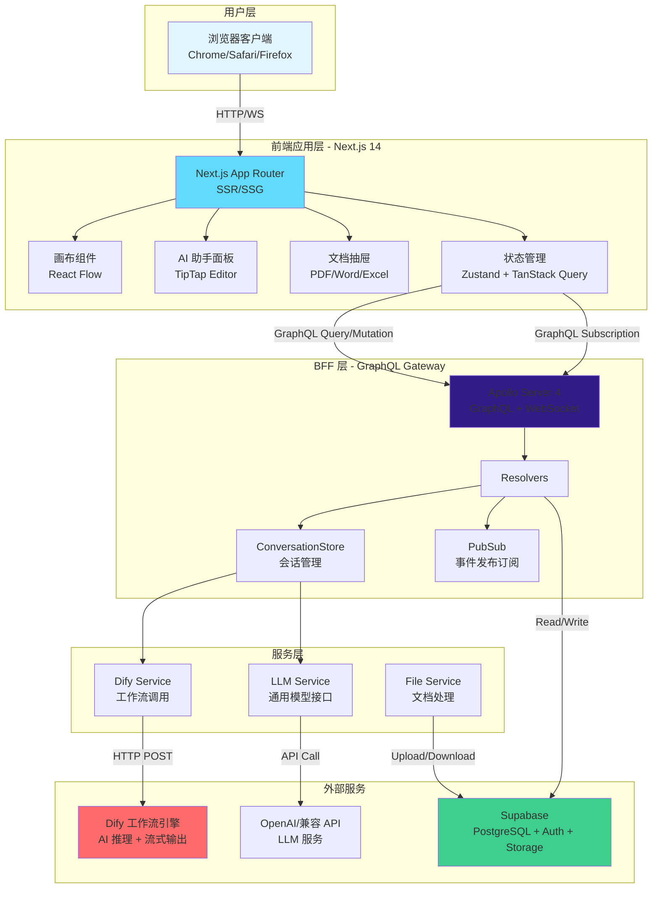
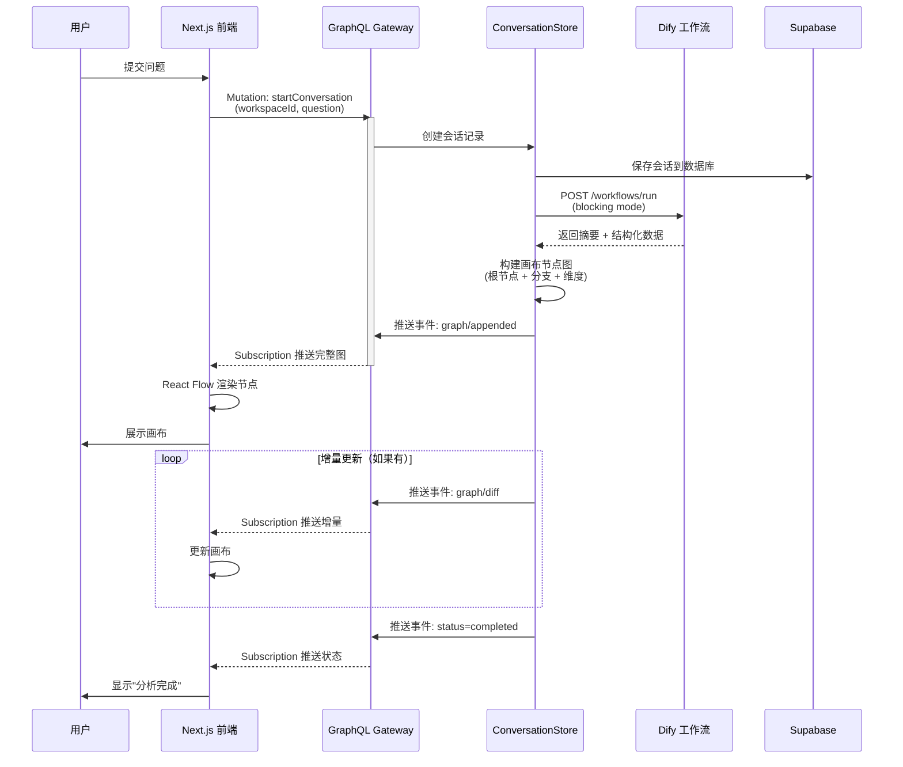
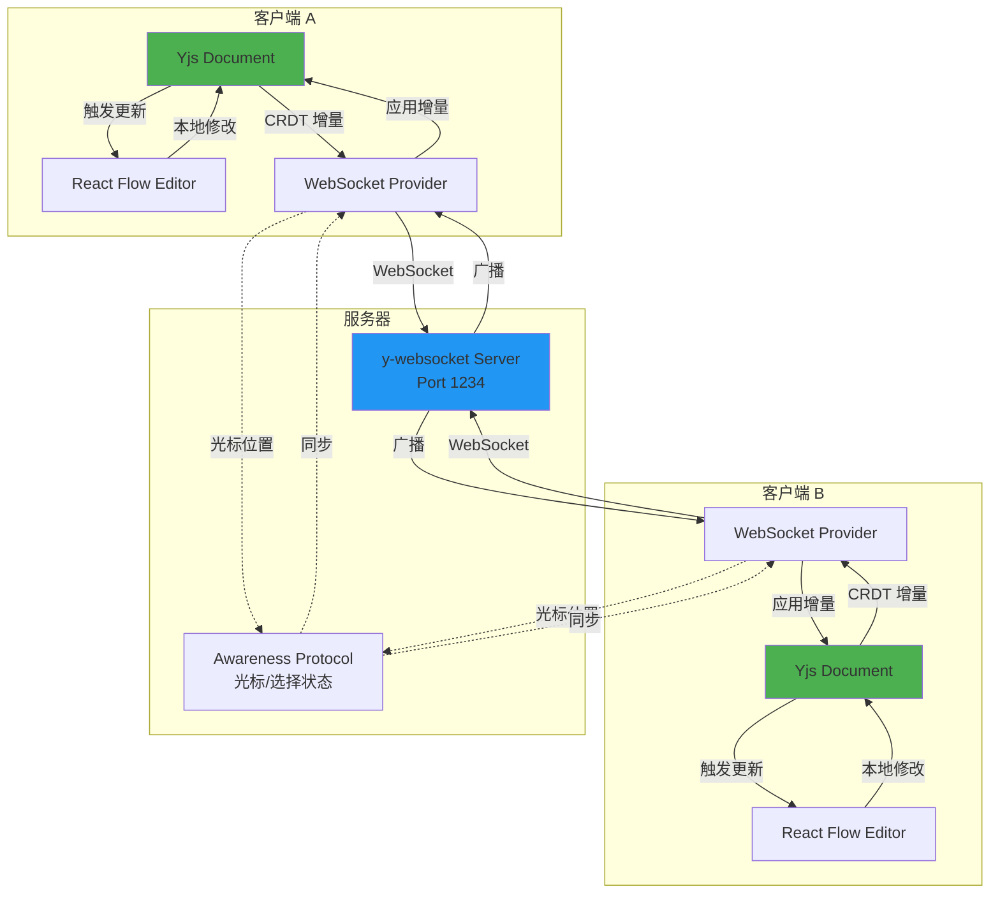
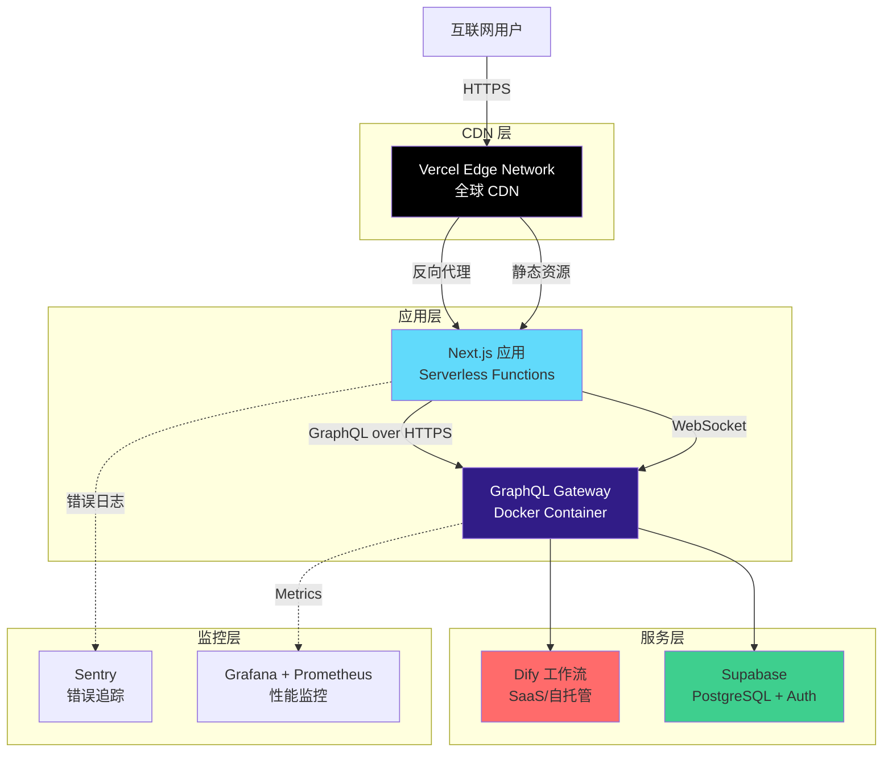
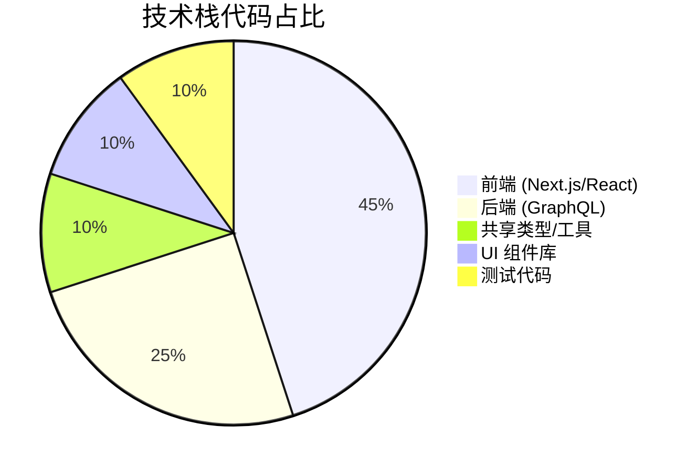

# Starlink 系统架构图说明

> 本文档提供可复制到绘图工具（如 draw.io、Excalidraw、Mermaid）的架构图代码

---

## 1. 整体系统架构图（Mermaid）

可以在 GitHub、Notion、Obsidian 等支持 Mermaid 的工具中直接渲染：



---

## 2. Monorepo 目录结构图

```
starlink/
├── apps/
│   └── web/                          # Next.js 前端应用
│       ├── src/
│       │   ├── app/                  # App Router 路由
│       │   │   ├── api/              # API Routes (BFF)
│       │   │   │   ├── dify/         # Dify 代理
│       │   │   │   ├── analyze/      # 问题分析
│       │   │   │   └── insights/     # 洞察生成
│       │   │   └── [locale]/         # 国际化路由
│       │   ├── features/             # 功能模块
│       │   │   ├── comfy/            # Comfy 画布
│       │   │   │   ├── components/   # 画布组件
│       │   │   │   │   ├── canvas.tsx
│       │   │   │   │   └── nodes/    # 自定义节点
│       │   │   │   │       ├── agent-avatar-node.tsx
│       │   │   │   │       ├── cc-bmc-card-node.tsx
│       │   │   │   │       └── insight-note-node.tsx
│       │   │   │   └── hooks/        # 画布相关 Hooks
│       │   │   └── assistant/        # AI 助手
│       │   ├── services/             # 服务层
│       │   │   ├── DifyService.ts    # Dify 封装
│       │   │   └── GraphQLClient.ts  # GraphQL 客户端
│       │   ├── store/                # 全局状态
│       │   │   └── canvas-store.ts   # Zustand Store
│       │   └── config/               # 配置文件
│       └── package.json
│
├── packages/
│   ├── server/                       # GraphQL 网关服务
│   │   ├── src/
│   │   │   ├── index.ts              # 服务器入口
│   │   │   ├── graphql/              # GraphQL 定义
│   │   │   │   ├── type-defs.ts      # Schema 定义
│   │   │   │   └── resolvers.ts      # Resolver 实现
│   │   │   ├── application/          # 应用层
│   │   │   │   └── conversation-store.ts  # 会话管理
│   │   │   ├── services/             # 服务层
│   │   │   │   ├── dify-service.ts   # Dify 调用
│   │   │   │   └── llm-service.ts    # LLM 接口
│   │   │   ├── context/              # Context 管理
│   │   │   └── lib/                  # 工具函数
│   │   │       └── supabase.ts       # Supabase 客户端
│   │   └── package.json
│   │
│   ├── shared/                       # 共享包
│   │   ├── src/
│   │   │   ├── schemas/              # Zod Schema
│   │   │   │   ├── canvas.ts         # 画布数据结构
│   │   │   │   ├── conversation.ts   # 会话数据结构
│   │   │   │   └── dify.ts           # Dify 请求/响应
│   │   │   ├── types/                # TypeScript 类型
│   │   │   └── utils/                # 工具函数
│   │   └── package.json
│   │
│   └── ui/                           # UI 组件库
│       ├── src/
│       │   ├── components/           # 基础组件
│       │   │   ├── button.tsx
│       │   │   ├── dialog.tsx
│       │   │   └── select.tsx
│       │   └── lib/
│       │       └── utils.ts          # 样式工具
│       └── package.json
│
├── backend/                          # 遗留 REST 服务
│   └── (旧代码，逐步迁移中)
│
├── docs/                             # 文档
│   ├── 技术报告-答辩版.md
│   ├── 架构图说明.md
│   └── dify-integration.md
│
├── package.json                      # Workspace 根配置
├── pnpm-workspace.yaml               # pnpm 工作区配置
└── tsconfig.base.json                # TypeScript 基础配置
```

---

## 3. 数据流图（问题分析流程）



---

## 4. Dify 工作流调用架构

```mermaid
graph LR
    subgraph "前端调用"
        UI[React 组件]
        DifyClient[DifyService]
        RouteHandler[/api/dify Route]
    end

    subgraph "限流层"
        RateLimit[InMemoryRateLimiter<br/>IP/User/Workflow]
    end

    subgraph "Dify API"
        WorkflowEngine[工作流引擎]
        LLMNode[LLM 节点]
        ToolNode[工具节点]
    end

    UI -->|executeWorkflow| DifyClient
    DifyClient -->|POST /api/dify| RouteHandler
    RouteHandler --> RateLimit
    RateLimit -->|通过| WorkflowEngine
    RateLimit -->|拒绝| UI

    WorkflowEngine --> LLMNode
    WorkflowEngine --> ToolNode

    LLMNode -->|流式输出| RouteHandler
    RouteHandler -->|SSE| DifyClient
    DifyClient -->|更新 UI| UI

    style RateLimit fill:#ffeb3b
    style WorkflowEngine fill:#ff6b6b
```

---

## 5. 实时协作架构（Yjs）



---

## 6. GraphQL Schema 可视化

```graphql
# 核心类型
type CanvasNode {
  id: ID!
  type: String!              # "agent" | "bmc" | "insight" | "action"
  position: CanvasPosition!
  data: JSON!                # 节点自定义数据
}

type CanvasEdge {
  id: ID!
  source: ID!                # 起始节点 ID
  target: ID!                # 目标节点 ID
  label: String              # 连线标签
}

type CanvasGraph {
  workspaceId: ID!
  nodes: [CanvasNode!]!
  edges: [CanvasEdge!]!
}

# 会话事件
type ConversationEvent {
  type: String!              # "graph/appended" | "graph/diff" | "status"
  conversationId: ID!
  status: String             # "running" | "completed" | "failed"
  payload: JSON              # 事件携带的数据
}

# 查询
type Query {
  workspaceGraph(workspaceId: ID!): CanvasGraph!
  conversation(id: ID!): StartConversationPayload
}

# 变更
type Mutation {
  startConversation(
    workspaceId: ID!
    question: String!
  ): StartConversationPayload!

  addNode(
    workspaceId: ID!
    input: NodeInput!
  ): CanvasNode!

  connectNodes(
    workspaceId: ID!
    input: EdgeInput!
  ): CanvasEdge!
}

# 订阅
type Subscription {
  conversationProgress: ConversationEvent!
}
```

**关系图**：

```
Query.workspaceGraph ──> CanvasGraph ──┬──> CanvasNode[]
                                        └──> CanvasEdge[]

Mutation.startConversation ──> StartConversationPayload ──┬──> ConversationMetadata
                                                            └──> CanvasGraph

Subscription.conversationProgress ──> ConversationEvent ──> payload: CanvasGraph (diff)
```

---

## 7. 部署架构图



**部署清单**：

| 组件 | 部署方式 | 域名/端口 |
|------|---------|----------|
| Next.js 前端 | Vercel | https://starlink.com |
| GraphQL Gateway | Docker on VPS | https://api.starlink.com/graphql |
| WebSocket | 同 GraphQL | wss://api.starlink.com/graphql |
| Supabase | Cloud SaaS | https://xxx.supabase.co |
| Dify | 自托管/SaaS | https://dify.starlink.com |

---

## 8. 技术栈雷达图（可视化）

你可以用这个数据生成雷达图：

| 维度 | 成熟度 (1-10) |
|------|--------------|
| 前端框架 (Next.js) | 9 |
| 状态管理 (Zustand) | 8 |
| 可视化 (React Flow) | 9 |
| 后端框架 (Express) | 8 |
| GraphQL (Apollo) | 9 |
| 数据库 (Supabase) | 8 |
| AI 集成 (Dify) | 7 |
| 实时协作 (Yjs) | 8 |
| 测试覆盖 (Playwright) | 7 |
| 部署 (Docker) | 8 |

**Mermaid Pie Chart**（技术栈占比）：



---

## 9. 使用建议

### 9.1 在 PPT 中使用

1. **工具推荐**：PowerPoint + PlantUML 插件 或 draw.io
2. **导入方式**：
   - 复制 Mermaid 代码到 draw.io → File → Import → Mermaid
   - 或者截图后插入 PPT

### 9.2 在文档中使用

- **Markdown**：直接粘贴 Mermaid 代码块
- **Notion**：使用 `/code` 块并选择 Mermaid
- **Confluence**：安装 Mermaid 插件

### 9.3 在线渲染

- [Mermaid Live Editor](https://mermaid.live)
- [draw.io](https://app.diagrams.net)
- [Excalidraw](https://excalidraw.com)

---

## 10. 总结

以上架构图全面覆盖了 Starlink 项目的：

1. ✅ **整体架构**：用户层 → 前端 → BFF → 服务层 → 外部服务
2. ✅ **目录结构**：Monorepo 分层组织
3. ✅ **数据流**：问题分析的完整流程
4. ✅ **Dify 集成**：限流 + 流式输出
5. ✅ **实时协作**：Yjs CRDT 同步机制
6. ✅ **GraphQL Schema**：类型关系图
7. ✅ **部署架构**：CDN + 应用 + 服务 + 监控
8. ✅ **技术栈分布**：雷达图 + 占比图

答辩时可以根据评委提问重点展示对应的架构图，建议准备 3-4 张核心图即可：
- **整体架构图**（必备）
- **数据流图**（展示业务逻辑）
- **部署架构图**（体现工程能力）
- **Monorepo 结构图**（突出组织方式）

祝答辩顺利！🎉
