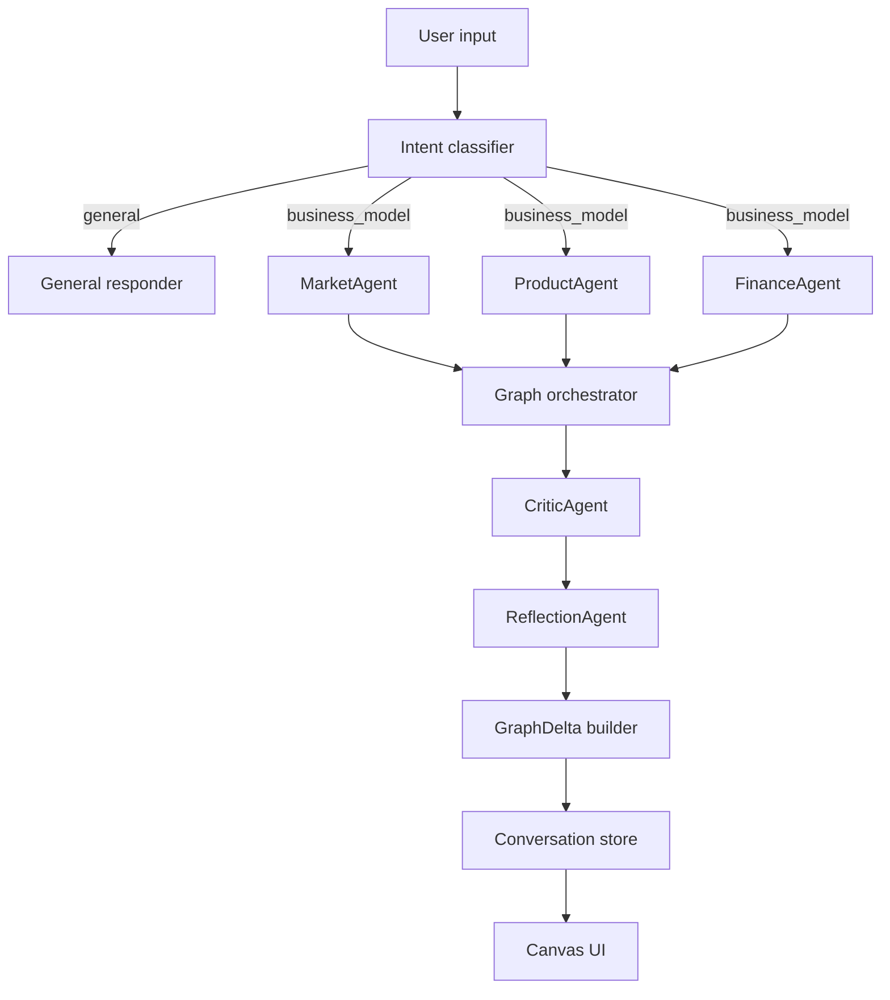
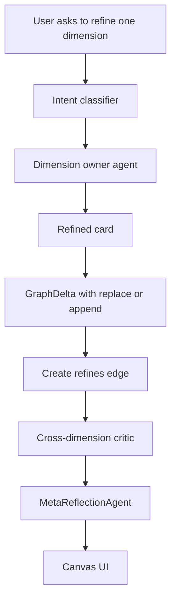

# CC-BMC Agent Evolution Plan

> Version: v1.0
> Date: 2026-04-19
> Scope: Upgrade the current MACRA business agent flow into a complete nine-dimension CC-BMC generation and evolution system.
> Inspiration: Meflex-style nonlinear ideation canvas, reflection prompts, and meta-reflection over idea evolution.

## 1. Problem Statement

The current service declares a full nine-dimension CC-BMC model, but the implemented agent flow only generates eight dimensions:

| Area | Generated dimensions |
|---|---|
| MarketAgent | Customer Segments, Channels, Customer Relationships |
| ProductAgent | Value Propositions, Key Activities, Key Resources |
| FinanceAgent | Revenue Streams, Cost Structure |

The missing dimension is **Key Partnerships**. This creates a structural mismatch:

- The constant list says the system supports nine CC-BMC dimensions.
- The edge-building logic still expects Key Partnerships.
- No agent owns or generates Key Partnerships.
- Tests can pass while the business model is semantically incomplete.

The target system should not be a one-shot "BMC generator". It should become a **multi-agent business model evolution canvas** that can generate, refine, critique, and explain the evolution of a business idea.

## 2. Design Goals

| Goal | Description | Acceptance signal |
|---|---|---|
| Complete CC-BMC generation | Every business idea must produce all nine CC-BMC dimensions. | Initial graph contains one valid card per dimension. |
| Stable graph updates | Repeated generation or refinement should not duplicate dimension cards. | Node IDs remain deterministic by dimension and workspace context. |
| Semantic graph edges | Edges should explain business reasoning, not only visual layout. | Edges include relation types such as `depends_on`, `supports`, `conflicts_with`, and `refines`. |
| Reflection loop | The system should guide users to improve weak assumptions. | Agent output includes actionable reflection questions. |
| Meta-reflection | The system should explain how an idea changed across turns. | Multi-turn sessions produce an evolution summary. |
| Testable contracts | Agent outputs should be structured and validated. | Zod schemas reject incomplete or malformed agent outputs. |

## 3. Target Agent Ownership

### 3.1 Dimension ownership

| Agent | Owned dimensions | Reason |
|---|---|---|
| MarketAgent | Customer Segments, Channels, Customer Relationships | These dimensions describe user targeting, acquisition, and retention. |
| ProductAgent | Value Propositions, Key Activities, Key Resources, Key Partnerships | Partnerships are strongly coupled with activities and resources. |
| FinanceAgent | Revenue Streams, Cost Structure | These dimensions define economic viability. |
| CriticAgent | Cross-dimensional consistency | It should not own a business dimension; it should inspect the whole graph. |
| ReflectionAgent | Current-turn reflection | It asks focused questions to deepen the current model. |
| MetaReflectionAgent | Multi-turn evolution | It summarizes pivots, branches, and convergence over time. |

### 3.2 Required dimensions

Use one canonical dimension set across server, shared schemas, tests, and UI:

```ts
export const CC_BMC_DIMENSIONS = [
  'customer_segments',
  'value_propositions',
  'channels',
  'customer_relationships',
  'revenue_streams',
  'key_resources',
  'key_activities',
  'key_partnerships',
  'cost_structure',
] as const
```

No code path should define a second local dimension list unless it imports or derives from the canonical source.

## 4. Meflex Features To Adapt

### 4.1 Nonlinear idea canvas

Meflex treats a canvas as a thinking space, not just a result display. The project should adopt this idea by making every graph edge semantically meaningful.

Recommended edge types:

| Edge type | Meaning | Example |
|---|---|---|
| `supports` | One node strengthens another claim. | Key Resources support Value Propositions. |
| `depends_on` | One dimension depends on another being true. | Revenue Streams depend on Customer Segments. |
| `conflicts_with` | Two cards contain incompatible assumptions. | Low-cost strategy conflicts with high-touch service. |
| `refines` | New card deepens or replaces an earlier version. | A refined channel strategy replaces the initial generic channel card. |
| `alternative_to` | Two cards are competing options. | Direct sales vs. platform marketplace. |
| `evidence_for` | Evidence supports a card or assumption. | User interview evidence supports a pain point. |

### 4.2 Reflection

Reflection should happen at the current-turn level. It should not rewrite the whole graph. It should identify:

- What assumption is weak.
- Which dimension needs more evidence.
- What question the user should answer next.
- Which card should be refined first.

Example output:

```ts
type ReflectionPrompt = {
  targetDimension: CCBMCDimension
  question: string
  reason: string
  expectedUserInput: 'example' | 'choice' | 'evidence' | 'constraint'
}
```

### 4.3 Meta-reflection

Meta-reflection should summarize idea evolution across turns. It should explain:

- What changed from the initial idea.
- Which assumptions were rejected or refined.
- Which branches were explored.
- Which business model path is currently strongest.

Example output:

```ts
type MetaReflection = {
  summary: string
  pivots: Array<{
    from: string
    to: string
    reason: string
  }>
  unresolvedQuestions: string[]
  recommendedNextStep: string
}
```

## 5. Target Runtime Flow

### 5.1 Initial generation



### 5.2 Dimension refinement



## 6. Output Contracts

### 6.1 Business card

Each dimension card should use a strict shape:

```ts
type BusinessCard = {
  id: string
  dimension: CCBMCDimension
  title: string
  summary: string
  assumptions: string[]
  risks: string[]
  evidenceNeeded: string[]
  confidence: number
}
```

Rules:

- `dimension` must be one of the canonical nine dimensions.
- `id` should be deterministic for stable replacement.
- `summary` must be user-facing and concise.
- `assumptions` should contain claims that may be false.
- `risks` should contain failure modes.
- `evidenceNeeded` should list validation data required next.
- `confidence` should be between `0` and `1`.

### 6.2 Critic finding

```ts
type CriticFinding = {
  type:
    | 'missing_dimension'
    | 'conflict'
    | 'weak_assumption'
    | 'needs_evidence'
    | 'low_specificity'
  severity: 'low' | 'medium' | 'high'
  relatedDimensions: CCBMCDimension[]
  message: string
  suggestedAction: string
}
```

Rules:

- `missing_dimension` must be high severity when any of the nine dimensions is absent.
- `conflict` must name at least two related dimensions.
- `suggestedAction` should be directly executable by the user or system.

### 6.3 Graph delta

```ts
type GraphDelta = {
  nodes: MacraNode[]
  edges: MacraEdge[]
  removedNodeIds?: string[]
  removedEdgeIds?: string[]
  metadata?: {
    reason?: string
    sourceAgent?: string
    roundNumber?: number
  }
}
```

Rules:

- New initial generation should add all nine cards.
- Refinement should replace or append only the target dimension unless the critic identifies a required cross-dimensional change.
- Removed IDs should be explicit. The UI should never infer deletion from absence.

## 7. Implementation Plan

### Phase 1: Complete nine-dimension generation

Status target: mandatory before adding new behavior.

Tasks:

- [ ] Add `key_partnerships` to ProductAgent output.
- [ ] Ensure the ProductAgent prompt explicitly asks for partnerships, external dependencies, suppliers, channels, technical platforms, and strategic collaborators.
- [ ] Ensure the graph builder maps `key_partnerships` into a card node.
- [ ] Ensure edge-building logic creates meaningful links involving Key Partnerships.
- [ ] Add a server test that fails if any CC-BMC dimension is missing.
- [ ] Add a regression test for the exact review finding: nine dimensions declared means nine dimensions generated.

Acceptance criteria:

- Initial business-model generation returns exactly nine dimension cards.
- `key_partnerships` is generated by ProductAgent, not CriticAgent.
- The test suite fails if any future edit drops one dimension.

### Phase 2: Stabilize graph semantics

Tasks:

- [ ] Define canonical graph edge relation types.
- [ ] Update edge builder to assign relation semantics.
- [ ] Add deterministic IDs for dimension cards.
- [ ] Add `replaceNodesByMacraType` or equivalent replacement behavior for dimension refinement.
- [ ] Ensure repeated generation does not create duplicate cards for the same dimension.

Acceptance criteria:

- Running generation twice does not duplicate the nine CC-BMC cards.
- Edges between ProductAgent-owned cards include `supports` or `depends_on`.
- Key Partnerships links to Key Activities and Key Resources.

### Phase 3: Add reflection loop

Tasks:

- [ ] Add ReflectionAgent after CriticAgent.
- [ ] Define `ReflectionPrompt` schema.
- [ ] Generate one to three focused reflection questions per run.
- [ ] Attach reflection prompts to graph metadata or dedicated insight nodes.
- [ ] Add tests for weak-assumption prompts.

Acceptance criteria:

- A generated business model includes at least one actionable reflection prompt.
- Reflection output targets a concrete CC-BMC dimension.
- Reflection does not mutate existing cards unless a refinement request is made.

### Phase 4: Add meta-reflection over idea evolution

Tasks:

- [ ] Track turn-level graph changes.
- [ ] Add MetaReflectionAgent for multi-turn sessions.
- [ ] Store pivots and rejected assumptions.
- [ ] Render or expose evolution summary through GraphQL.
- [ ] Add tests for multi-turn refinement history.

Acceptance criteria:

- After at least two refinement turns, the system can summarize what changed.
- The summary mentions old and new assumptions.
- Pivot edges or metadata are visible in the graph model.

### Phase 5: Evidence-grounded extension

This phase can be implemented after the core agent logic is stable.

Tasks:

- [ ] Attach evidence references to card assumptions.
- [ ] Distinguish generated claims from evidence-backed claims.
- [ ] Add `evidenceNeeded` indicators for unverified assumptions.
- [ ] Add UI affordances for evidence-backed and unverified cards.

Acceptance criteria:

- Every card can expose which claims are evidence-backed.
- Unsupported assumptions are explicitly visible.
- CriticAgent can flag high-risk assumptions without evidence.

## 8. Integration Test Matrix

| Test case | Input | Expected result |
|---|---|---|
| Generate complete CC-BMC | "我要做一个面向大学生的 AI 学习助手" | Nine cards exist, including Key Partnerships. |
| Detect missing dimension regression | Force ProductAgent to omit Key Partnerships in fixture | Test fails with missing `key_partnerships`. |
| Stable dimension IDs | Run same seed twice | Same dimension IDs, no duplicates. |
| General chat does not mutate graph | "你好，你是谁？" | No CC-BMC cards added or removed. |
| Refine one dimension | "把渠道通路具体化" | Channels card is refined; unrelated cards remain stable. |
| Partnership relation | Generate model with suppliers/platform dependency | Key Partnerships connects to Key Activities or Key Resources. |
| Conflict detection | "低成本自助服务，但提供一对一专家陪跑" | Critic emits a conflict or weak-assumption finding. |
| Reflection prompt | Initial generation with vague market | Reflection asks for specific user segment or evidence. |
| Meta-reflection | Initial idea plus two refinements | Evolution summary identifies pivot or refinement path. |
| Persistence | Save and reload conversation | Graph, findings, and reflection metadata remain consistent. |

## 9. Suggested File Areas

| Area | Expected changes |
|---|---|
| `packages/server/src/services/business-langgraph.ts` | Agent ownership, prompts, graph orchestration, critic/reflection flow. |
| `packages/server/src/application/graph-delta.ts` | Delta replacement and deletion semantics. |
| `packages/shared/src/schemas/*` | Shared Zod contracts for dimensions, cards, deltas, findings. |
| `packages/server/src/graphql/*` | Expose new graph metadata if needed. |
| `frontend/*` or `apps/web/*` | Render reflection/meta-reflection when implemented. |
| `packages/server/src/**/*.test.ts` | Unit and integration coverage for nine dimensions and graph semantics. |

## 10. Definition Of Done

The upgrade is complete only when all of the following are true:

- [ ] A fresh business-model run generates all nine CC-BMC dimensions.
- [ ] `key_partnerships` has a clear owner agent and test coverage.
- [ ] Graph updates support add, replace, and remove operations explicitly.
- [ ] Critic findings are structured and validated.
- [ ] Reflection questions are generated for weak or vague assumptions.
- [ ] Multi-turn refinement can produce an evolution summary.
- [ ] General conversation does not accidentally mutate the canvas.
- [ ] Server tests cover generation, refinement, conflict detection, and persistence.
- [ ] Frontend or e2e tests verify that the generated graph is visible and stable.

## 11. Recommended Execution Order

1. Fix the missing Key Partnerships dimension.
2. Add a dimension completeness test.
3. Stabilize graph node IDs and replacement behavior.
4. Add semantic edge types.
5. Add CriticAgent structured findings.
6. Add ReflectionAgent.
7. Add MetaReflectionAgent.
8. Add UI affordances for reflection and evolution.
9. Add evidence grounding after the agent pipeline is stable.

## 12. Verification Commands

Use the repository-specific commands that apply to the changed area:

```bash
pnpm --filter @starlink/server lint
pnpm --filter @starlink/server test
pnpm --filter @starlink/web test:e2e
```

If only the server agent logic changes, the minimum gate is:

```bash
pnpm --filter @starlink/server lint
pnpm --filter @starlink/server test
```

