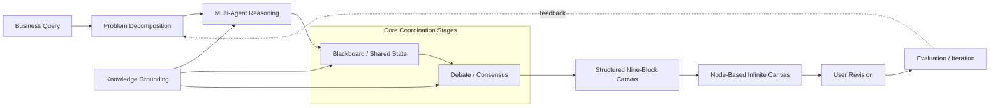
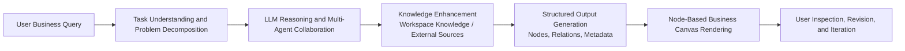
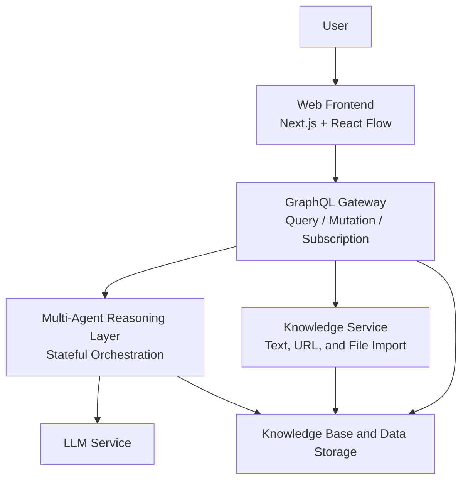
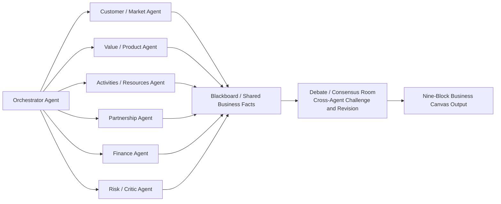
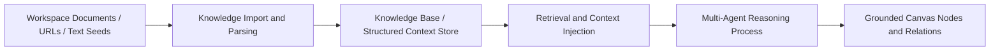
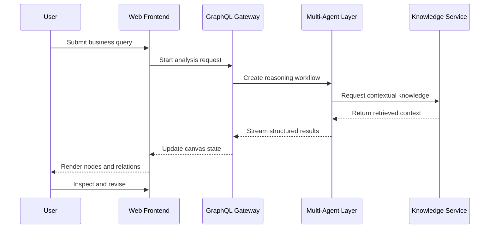

# Design and Implementation of a Generative Business Canvas System Based on Multi-Agent Collaboration

## 1. Introduction

In recent years, the rapid development of digital platforms, large-scale data processing, and generative artificial intelligence has changed the way business information is produced and consumed. Business analysis is no longer limited by the absence of information; more often, it is limited by the difficulty of organizing scattered information into a coherent basis for decision-making. In areas such as entrepreneurial planning, product strategy, and business model design, users are expected to compare multiple factors at the same time, including customer demand, value creation, channels, costs, revenue logic, and strategic risk [1][2][3]. This makes business decision support a problem of structured reasoning rather than simple answer generation.

Large language models have made it possible to automate part of this analytical process [5][10][11][19]. However, in practical business settings, a single model often produces output that is fluent but weakly structured, insufficiently grounded, and difficult to revise [16][25][36]. A chat-style interface makes these weaknesses more visible, because it presents the reasoning process as a linear conversation rather than as an inspectable analytical structure. For this reason, the present project proposes a generative business canvas system that combines multi-agent collaboration, knowledge enhancement, and visual interaction to support business decision-making in a more structured and revisable way.

### 1.1 Background

Traditional decision-support research has long emphasized that useful analytical systems should help users organize information, compare alternatives, and make judgments under uncertainty [2][3]. In business model analysis, this requirement is especially strong because the problem itself is multidimensional. Customer segments, value propositions, channels, customer relationships, resources, activities, partnerships, revenue streams, and cost structure are tightly connected, and a change in one dimension often affects several others [1]. As a result, business analysis is not merely a matter of generating a description. It requires structure, cross-dimensional reasoning, and a form of representation that users can understand and revise.

The recent development of LLMs has created new possibilities for business-oriented analytical systems. Models based on the Transformer architecture have shown strong capabilities in language understanding, reasoning, planning, and content generation [5][10][11][19]. Yet their direct use in business analysis remains limited. A single model response may sound persuasive, but it often lacks explicit decomposition, contextual grounding, and stable structure. This problem becomes more serious when the user needs not only a suggestion, but also a visible analytical process that can be questioned and improved. Research in visual analytics and canvas-based business modeling suggests that such tasks are better handled through structured visual representation than through text alone [4][13][14][38][39].

Against this background, the goal of the present project is to design and implement a generative business canvas system that can support business decision-making through coordinated reasoning and visual interaction. The system is centered on a multi-agent mechanism, a knowledge-enhanced reasoning process, and a canvas-based interface for presenting and editing business elements. In this way, the project aims to move from simple text generation to a more complete decision-support workflow.

### 1.2 Significance of the Research

The significance of this project can be understood from both practical and research perspectives. In practical terms, it responds to the growing need for AI systems that do more than draft suggestions. In business planning and business model innovation, users need a system that can organize complex reasoning, make assumptions visible, and support iterative revision. A generative business canvas can help transform AI assistance from a one-time answer into an interactive analytical process, thereby improving transparency and usability [1][23][34].

From a research perspective, the project can be understood through three connected directions. The first concerns structured business decision support and business-canvas modeling. The second concerns LLM reasoning, multi-agent collaboration, and knowledge grounding. The third concerns visual interaction, explainability, and user-centered revision. The contribution of the project is not simply to apply these directions side by side, but to integrate them into one system for business-oriented reasoning. In this sense, the project addresses both a practical need and a methodological gap.

### 1.3 Technical and Methodological Foundations

The technical and methodological basis of this project can also be summarized into three directions. The first is structured business decision support and canvas-based modeling, which provides the conceptual basis for representing business problems through explicit dimensions and relations [1][2][3][13][14]. The second is LLM reasoning, multi-agent collaboration, and knowledge enhancement. Work on Chain-of-Thought, Self-Consistency, ReAct, CAMEL, AutoGen, multi-agent debate, RAG, and graph-based reasoning and retrieval shows that complex tasks benefit from explicit reasoning procedures, role specialization, and grounded external context [6][7][8][9][12][15][16][17][18][21][22][24][25][26][27][28][31][32][33][37][41][51][52]. The third is visual analytics, explainability, and human-AI interaction, which supports the use of an interactive business canvas as a space where generated reasoning can be inspected, questioned, and revised [4][20][29][30][38][39][43][44][53].

## 2. Related Work

### 2.1 Business Decision Support and Canvas-Based Modeling

Decision support and business analytics research has long emphasized that managerial reasoning needs structured assistance rather than isolated predictions [2][3][34]. In this tradition, the value of a decision-support system does not lie only in computational accuracy, but also in its ability to help users frame problems, compare alternatives, and make judgments under uncertainty [2]. Business analytics research extends this concern by showing that valuable analysis emerges from the interaction among data, models, organizational context, and human interpretation [3][34]. This point is important for the present project because business model analysis is not a narrowly technical task. It is a strategic activity in which several dimensions must be considered at the same time, including user demand, value creation, revenue logic, operational resources, and external partnerships.

Business-oriented canvas frameworks make a similar argument from the perspective of representation. The Business Model Canvas provides a standardized way to describe a business through a set of interrelated building blocks rather than through disconnected observations [1]. The Analytics Canvas and the Business-to-Analytics Canvas further show how ambiguous business questions can be translated into structured analytical objects [13][14]. In other words, these frameworks do not simply summarize a business; they impose a form that makes business reasoning visible, discussable, and actionable.

For the present project, this line of work provides two direct insights. First, an AI system for business analysis should not be limited to producing narrative suggestions. It should be able to organize output according to explicit business dimensions. Second, the form of representation matters as much as the content itself, because decision support depends on whether the user can inspect and revise the resulting structure. What remains insufficiently addressed in this literature is the dynamic case: how such structures can be generated, updated, and interacted with in real time by an AI-driven system rather than filled in manually after analysis.

### 2.2 LLM Reasoning, Multi-Agent Collaboration, and Knowledge Grounding

Research on LLM reasoning suggests that complex tasks can be handled more reliably when reasoning is made explicit through intermediate steps, search strategies, or action-feedback loops [5][16][21][22][24][25][26][27][35][36]. Chain-of-Thought, Self-Consistency, ReAct, Reflexion, and graph-based reasoning approaches all point to the same broad conclusion: one-shot generation is often insufficient when a task requires decomposition, revision, or structured inference [16][21][22][24][25][26][27]. This body of work is directly relevant to business analysis, where conclusions often depend on a chain of assumptions rather than on a single factual retrieval. It also helps explain why a business-oriented generative system should preserve intermediate reasoning states instead of hiding them behind a final answer.

Multi-agent research adds another layer to this picture. Studies such as CAMEL, AutoGen, Magentic-One, and recent surveys on LLM-based multi-agent systems show that role specialization, coordination, and critique can improve performance on difficult tasks [6][7][12][15][17][18][31][37]. More recent work on debate-based agent interaction suggests that disagreement among agents can be productive when it exposes hidden assumptions or weak reasoning paths [40][51]. This is especially relevant in business scenarios, where market analysis, product strategy, financial evaluation, and risk critique often pull in different directions. A multi-agent design therefore fits the structure of the problem itself rather than serving as a purely technical embellishment.

Knowledge-enhanced generation is equally important. RAG research, Agentic RAG, tool learning, and graph-aware retrieval all show that domain-specific reasoning becomes more reliable when external knowledge is introduced in a structured way [8][9][28][32][33][41][52]. In business analysis, this matters because useful output must be grounded in project materials, contextual constraints, and sometimes domain-specific evidence that a model cannot be expected to memorize. The combination of deliberate reasoning, role-based collaboration, and contextual grounding provides a strong methodological basis for the present project.

At the same time, existing work in this area remains incomplete from the perspective of business-canvas generation. Most studies aim to improve reasoning quality, task success, or tool use, but they rarely explain how the resulting analytical fragments should be normalized into stable business entities that can later support interaction, editing, and further iteration. This is precisely the point at which the present project begins to differ from a general-purpose agent system.

### 2.3 Visual Interaction, Explainability, and Evaluation

Visual analytics and explainable AI research argues that complex reasoning needs to be made visible if users are expected to understand and revise it [4][20][38][39][43][44]. In this tradition, visualization is not treated as decoration added after analysis, but as a cognitive aid that allows users to inspect relations, trace causes, and identify uncertainty [4][38][39]. This argument becomes even more important in AI-assisted analysis, because generative systems often produce plausible output without making their internal structure obvious. For that reason, explainability research has consistently emphasized that users should be able to inspect, question, and contextualize what an AI system produces [20][43][44].

Recent work on generative-AI interfaces and human-AI interaction reinforces this point. Studies of AI-supported sense-making show that users need more than a text box when dealing with complex, revisable output [29][30]. Human-AI interaction research also argues that effective systems should support staged trust, orientation, and meaningful intervention rather than assume complete autonomy [53]. These arguments strongly support the design choice of the present project: a business canvas is not only a format for display, but also a working surface on which users can review and reshape generated analysis.

Evaluation research provides the final piece of the picture. Recent benchmarks such as BI-Bench, BizBench, FinanceBench, FinanceReasoning, FinQA, TAT-QA, and AgentBench show that business-oriented reasoning and agent behavior are increasingly treated as measurable research problems [45][46][47][48][49][50][54]. These benchmarks emphasize dimensions such as numerical consistency, contextual grounding, planning quality, task completion, and evidence-aware reasoning. Although the present project is not intended as a benchmark contribution, this literature is still important because it clarifies what a serious business-oriented generative system should be evaluated against. In other words, the system should not be assessed only by whether it generates fluent text, but also by whether it produces structurally coherent, contextually grounded, and interactively usable analysis.

### 2.4 Gap in Existing Research

Taken together, the existing literature provides strong support for each element of the proposed system. Business decision support and canvas modeling explain why business analysis should be structured. LLM reasoning, multi-agent collaboration, and knowledge grounding explain why complex tasks benefit from decomposition, coordination, and contextual evidence. Visual analytics, explainability, and evaluation research explain why the resulting analysis must be inspectable and judged by more than fluency alone.

What remains missing is the integration of these elements into one business-oriented workflow. Existing studies rarely show how a business question can move through the full chain from problem decomposition, to role-based reasoning, to grounded evidence use, to cross-agent critique, to normalized business-canvas output, and finally to interactive user revision. In most cases, one or two parts of this chain are studied in isolation: reasoning without stable structure, grounding without multi-agent coordination, or interface design without a deep reasoning backend.

The present project addresses this gap by treating business-canvas generation as an end-to-end system problem. Its aim is not only to improve the quality of generated business analysis, but also to make that analysis structurally explicit, contextually grounded, and open to user inspection and revision. This is the specific research space in which the project is positioned.

## 3. The Project

### 3.1 Research Content

This project focuses on the design and implementation of a generative business canvas system for business decision support. The basic idea is to turn a free-form business question into a structured analytical process whose intermediate reasoning and final output can both be inspected and revised. It therefore goes well beyond calling a model once: problem representation, role-based reasoning, knowledge grounding, structure generation, and interactive presentation are all part of the research scope. The overall workflow of the project is shown in Figure 1.

Figure 1. Overall workflow of the proposed generative business canvas system.

Figure 1 condenses the central logic of the project. A business query first needs to be decomposed into analyzable parts, then processed through multi-agent reasoning. The blackboard-style shared state and the debate-and-consensus stage serve as the core coordination mechanism, while knowledge grounding feeds business-specific context into those stages rather than appearing only after them. The output is then normalized into a structured nine-block canvas, rendered in a node-based infinite-canvas interface, and revised by the user through an iterative evaluation loop.

As shown in Figure 1, the research content of this project can be organized into five connected layers rather than five isolated modules: problem modeling and decomposition, analytical reasoning, coordination and consistency control, contextual grounding, and visual interaction and revision. Each layer addresses a different requirement of the system, and together they form one integrated analytical pipeline.

The first layer concerns business decision support modeling. Before a problem is sent to the generative system, it has to be formalized. In this project, a business query is not treated as a single sentence waiting for an answer, but as a structured object with dimensions, assumptions, dependencies, and possible tensions. This corresponds to the "Business Query" and "Problem Decomposition" stages in Figure 1. The modeling basis comes from the Business Model Canvas in *Business Model Generation*, which organizes business reasoning around nine core building blocks: customer segments, value propositions, channels, customer relationships, revenue streams, key resources, key activities, key partnerships, and cost structure [1]. This matters because downstream reasoning depends on whether the system can distinguish, for example, a customer problem from a market opportunity, a product position, a revenue mechanism, or a risk factor.

To make this modeling basis explicit, the project uses the nine business-model dimensions shown in Table 1.

| Business Model Dimension | Meaning in the Project | Typical Analytical Focus |
| --- | --- | --- |
| Customer Segments | The target users, buyers, or organizations the business aims to serve | target groups, pain points, segment differences, priority users |
| Value Propositions | The value the business intends to deliver to each segment | problem-solution fit, differentiation, user benefit, strategic value |
| Channels | The paths through which value reaches customers | acquisition, communication, delivery, access points |
| Customer Relationships | The way the business establishes and maintains interaction with users | retention, support, trust, engagement, service model |
| Revenue Streams | The mechanism through which the business captures value | pricing logic, payment model, monetization path, income stability |
| Key Resources | The critical assets required to operate the model | data, technology, talent, brand, capital, infrastructure |
| Key Activities | The main actions the business must perform | product development, operation, marketing, service, distribution |
| Key Partnerships | The external actors that support or enable the model | suppliers, channels, collaborators, ecosystem dependence |
| Cost Structure | The major cost categories implied by the model | fixed cost, variable cost, operational burden, scaling pressure |

Table 1. Nine business-model dimensions adapted from *Business Model Generation* [1].

In this project, the nine dimensions are not just a reference table. They define the target structure the system is expected to produce. The reasoning process therefore moves toward a normalized nine-block canvas, not toward an unstructured textual response. This first layer thus provides both the initial analytical frame and the final structural target of the system.

The second layer is LLM-based analytical reasoning. This layer corresponds to the "Multi-Agent Reasoning" stage in Figure 1. The question here is how to guide large language models to produce analysis that is not only fluent, but also structurally stable. The emphasis is on controlled reasoning rather than unconstrained generation. What the system needs is not a paragraph of generic advice, but a set of claims, relations, and explanatory fragments that can later be normalized into business-canvas entities. In other words, this layer produces candidate analytical content, but does not yet determine whether that content is sufficiently consistent or well grounded.

The third layer is multi-agent collaboration, which corresponds to the "Blackboard / Shared State" and "Debate / Consensus" stages in Figure 1. Different analytical responsibilities are distributed across specialized agents, including customer-market analysis, value and product analysis, operations and resources, partnerships, finance, and risk critique. An orchestrating mechanism allocates tasks, maintains shared state, and merges partial results. The point of this design is not stylistic variety. Business analysis is inherently multi-perspectival, and useful conclusions often emerge only after different viewpoints have been compared and reconciled. To make that coordination explicit, intermediate conclusions are written into a blackboard-style shared state and then subjected to a debate-and-consensus stage, where conflicting assumptions can be challenged before the final structure is produced. This layer therefore transforms separate analytical fragments into cross-checked and internally coordinated judgments.

The fourth layer is knowledge enhancement, represented in Figure 1 as a support layer that feeds the reasoning and coordination stages. Workspace knowledge, uploaded files, imported URLs, and user-provided textual seeds are brought into the reasoning process so that generation is both constrained and enriched. The knowledge layer narrows the reasoning space to the relevant business context while supplying evidence that a purely parametric model may not possess. This is crucial for avoiding generic output and making the generated canvas practically useful. More importantly, it ensures that the coordinated judgments produced by the reasoning process are anchored in business-specific materials rather than remaining generic model outputs.

The fifth layer is visual interaction and revision. It corresponds to the final stages in Figure 1: "Structured Nine-Block Canvas", "Node-Based Infinite Canvas", "User Revision", and "Evaluation / Iteration". At this point, analytical results are rendered as nodes, links, and metadata in a business canvas that supports inspection, revision, and iterative refinement. The interface is not a passive display layer. It is the environment in which generated reasoning becomes usable for decision support, because it allows users to see relations, identify missing elements, revise assumptions, and push the system into another round of analysis when necessary.

Taken together, these five layers form one chain of logic. Business decision support modeling defines the analytical target, LLM reasoning produces candidate analysis, multi-agent collaboration improves consistency across perspectives, knowledge enhancement supplies contextual reliability, and visual interaction turns the result into a usable and revisable decision-support environment. The aim is to connect them into a complete analytical pipeline rather than optimize any one of them in isolation.

Operationally, these five layers are realized through three core components. The first is a multi-agent collaboration mechanism based on a blackboard-style shared state and adversarial evaluation, so that agents can share information, check one another, and improve consistency. The second is a node-based infinite-canvas interaction system that can dynamically present and edit business elements and their relations. The third is a backend reasoning engine built around LangGraph-style state-machine logic, agent-specific prompt strategies, and node-transition rules for stable end-to-end reasoning.

### 3.2 Key Problems to Be Solved

The project addresses five closely related problems, each tied to a practical weakness in current business-oriented generative systems.

The first is analytical decomposition: how to break a complex business question into coordinated tasks for multiple specialized agents. This is difficult because market, product, financial, and risk reasoning overlap, so the system must support both division of labor and cross-role coordination.

The second is structural stability: how to convert LLM outputs into persistent business-canvas entities instead of leaving them as loosely organized text. Free-form language is flexible, but it is not a reliable internal data format. If the output cannot be normalized into stable nodes, links, and attributes, it cannot support downstream interaction or revision.

The third is contextual grounding: how to integrate external knowledge so that generated analysis remains relevant to the specific business setting. This goes beyond retrieving documents. It also involves deciding which evidence enters the reasoning process, how it is injected, and how irrelevant context is filtered out.

The fourth is interpretability: how to represent relationships, dependencies, and tensions among business dimensions through visual interaction. A business canvas should do more than display isolated items. It should reveal why certain elements support one another, where conflicts arise, and which assumptions still require user judgment.

The fifth is system integration: how to connect the interaction layer, orchestration layer, reasoning layer, and knowledge layer into one coherent end-to-end system. Even if each component works in isolation, the whole system fails if state transfer, schema alignment, and runtime communication are unstable.

These problems follow a clear progression. Analytical complexity motivates multi-agent decomposition; contextual dependence motivates knowledge enhancement; the need for persistence motivates structured generation; and the demand for usable decision support motivates visual interaction and end-to-end integration.

### 3.3 Research Objectives

The project has four main objectives, which collectively address the key problem groups identified above.

1. To design a multi-agent collaboration mechanism based on a blackboard-style shared state and adversarial evaluation, enabling specialized agents to share information, critique one another, and improve analytical consistency across different business dimensions.
2. To construct a context-aware knowledge enhancement pipeline that grounds the reasoning process in specific business realities by integrating workspace documents, URLs, and textual seeds, thereby reducing the system's reliance on generic parametric memory.
3. To develop a LangGraph-based backend reasoning engine with explicit state transitions and agent-specific prompt strategies, ensuring that unconstrained language outputs are reliably converted into stable, structured business-model entities.
4. To implement a node-based infinite-canvas frontend and evaluate the integrated system. This interaction layer will present generated elements and relations in a dynamic, interpretable way, allowing the system to be validated as a practical decision-support environment rather than a mere text generator.

### 3.4 Method, Frameworks, and Technical Route

This part explains how the project will be carried out in practice, including the main reasoning methods, the development frameworks, the system architecture, and the overall technical route. Methodologically, the system does not rely on one prompt or one model call. Instead, it follows a staged process in which business understanding, multi-agent reasoning, contextual grounding, structure generation, and visual interaction are treated as connected parts of the same analytical workflow.

At the reasoning level, the system adopts LLM-based generation with structured prompting, intermediate reasoning states, and role-based decomposition. The orchestrator is responsible for interpreting the input problem, dispatching subtasks, collecting intermediate judgments, and coordinating revision when conflicts or omissions appear. Specialized agents focus on customer-market reasoning, value-product reasoning, operations and resources, partnerships, finance, and risk critique. Their outputs are written into a blackboard-style shared state so that they can be compared across roles rather than evaluated in isolation. A debate-and-consensus stage then serves as an adversarial evaluation mechanism, allowing the agents to challenge weak assumptions, expose inconsistencies, and refine disputed conclusions before final assembly. This design is based on the view that business analysis is better handled through coordinated specialization than through one-step monolithic generation [6][7][8][15][17][18][31][51].

At the grounding level, the project builds a workspace-oriented knowledge module. Textual seeds, imported URLs, and uploaded files are used as external context, and relevant information is retrieved during reasoning rather than after it. In this design, knowledge enhancement is not a decorative supplement to the final answer, but a constraint on the analytical space itself [8][9][28][32][52]. Its role is to keep the generated analysis tied to business-specific materials and reduce overreliance on generic parametric memory.

At the structure level, explicit schemas are defined for business-canvas entities so that generated results can be normalized into nodes, relations, and metadata. This structural layer connects language-level reasoning with interface-level interaction. Without such normalization, multi-agent outputs would remain difficult to compare, update, or validate in later stages of the system.

At the system level, the project adopts a frontend-backend architecture with clear separation of concerns. The frontend is built with Next.js and React Flow to realize a node-based infinite canvas, allowing the business canvas to function as an interactive analytical surface rather than a static board. The backend uses a GraphQL gateway to manage graph queries, conversation initiation, and incremental subscriptions. The reasoning layer follows LangGraph-style state-machine logic for multi-agent coordination, and explicit node-transition rules are defined to keep agent outputs, blackboard updates, debate results, and final structure generation consistent across the workflow. The knowledge layer manages contextual resources. This architecture is chosen because it supports both initial structure loading and streaming analytical updates while preserving a clear separation among interaction, reasoning, and grounding.

The stage-level flow of this method is summarized in Figure 2, which shows how the system moves from business-query input to structured canvas rendering and user revision.

Figure 2. Technical route of the proposed system.

Where Figure 2 presents the analytical flow, Figure 3 highlights the architectural layering that supports it, including the frontend interaction layer, the GraphQL coordination layer, the reasoning layer, the knowledge service, and storage.

Figure 3. Overall framework of the proposed generative business canvas system.

Within that architecture, the reasoning layer is the core of the system. Figure 4 therefore focuses on the internal collaboration pattern among the orchestrator, the specialized agents, the blackboard-style shared state, and the debate-and-consensus stage that precedes final canvas assembly.

Figure 4. Multi-agent collaboration framework from role-based reasoning to nine-block canvas output.

Knowledge grounding is equally central, but it plays a different role from reasoning orchestration. Figure 5 isolates this part of the pipeline and shows how external materials are imported, transformed into retrievable context, and injected back into the reasoning process.

Figure 5. Knowledge enhancement pipeline for context-grounded business analysis.

Finally, Figure 6 presents the runtime interaction workflow of the whole system, clarifying how the user-facing interface, the GraphQL gateway, the reasoning layer, and the knowledge service cooperate during an actual analysis session.

Figure 6. Runtime interaction workflow of the proposed system.

### 3.5 Key Steps of the Project

As shown in Figures 1 and 2, the project will be carried out through the following key steps. These steps are not isolated implementation tasks. Together, they describe how the project moves from problem definition, to reasoning design, to system integration, and finally to validation.

1. Analyze the requirements of business decision support and identify the core business dimensions that should appear in the canvas representation. This step is guided by the standard nine-block Business Model Canvas logic in *Business Model Generation*. The main output of this stage is a clear analytical scope that defines what kinds of business elements, assumptions, and relations the later system must be able to represent.

2. Design the multi-agent workflow, including the roles of specialized agents, the logic of blackboard-based information sharing, the debate-and-consensus mechanism, and the rules used to resolve conflicts among partial judgments. The goal of this stage is to convert one undifferentiated reasoning task into a coordinated analytical process in which different business perspectives can be generated, compared, and revised.

3. Define structured output schemas so that generated analysis can be mapped to the nine business-model dimensions, their internal nodes, cross-block relations, and metadata. This stage is important because it determines whether free-form model output can be transformed into a stable internal representation that supports storage, rendering, and iterative updates.

4. Build the knowledge-enhancement pipeline by integrating workspace data, imported resources, and retrieval-based context injection. The purpose of this stage is to ensure that the reasoning process remains grounded in business-specific evidence rather than drifting toward generic recommendations. The expected result is a context-aware knowledge layer that can support the agents during analysis.

5. Implement the frontend interaction layer and the backend orchestration layer. The frontend will provide the node-based infinite canvas, while the backend will manage GraphQL coordination, state transitions, and communication with the reasoning and knowledge modules. At this stage, the project moves from methodological design to concrete system development.

6. Integrate the complete workflow into an end-to-end system that moves from business-query input to canvas generation, user revision, and iterative refinement. This integration step is necessary because the practical value of the project depends on whether the reasoning layer, knowledge layer, and interaction layer can operate as one coherent environment rather than as disconnected modules.

7. Evaluate the resulting system in terms of functional completeness, analytical usefulness, contextual relevance, interpretability, and engineering feasibility, with evaluation criteria informed by recent benchmark work in business- and finance-oriented reasoning [45][46][47][48][49][50][54]. The final aim of this step is to verify not only that the system runs correctly, but also that it functions as a practical decision-support environment rather than as a mere text generator.

### 3.6 Overall Logical Chain of the Project

The internal logic of the project can be summarized as a single causal chain. Business decision support requires structured, explainable, and revisable analysis rather than plain generated text. Since single-model LLM output tends to remain linear, weakly grounded, and weakly structured in complex business settings [5][16][24][35][36], the system must support role-based decomposition, contextual grounding, structural normalization, and interactive validation. This leads directly to a combined solution based on multi-agent collaboration, debate-and-consensus, knowledge enhancement, structured generation, and node-based infinite-canvas interaction [6][7][8][9][15][17][18][28][30][31][51][52][53]. These requirements are realized through an integrated architecture that links a node-based infinite-canvas frontend, a GraphQL gateway, a LangGraph-based reasoning layer, and a knowledge layer, so that open-ended business questions can be transformed into a stable nine-block canvas that users can inspect, revise, and evaluate. The system is then validated in terms of analytical completeness, contextual relevance, interpretability, and technical feasibility.

This logic can be compressed into the following chain:

Business decision support requires structured and revisable reasoning  
-> single-model LLM output is insufficient  
-> multi-agent collaboration and knowledge enhancement become necessary  
-> cross-agent debate is used to reconcile conflicting judgments  
-> structured generation and visual canvas interaction make the reasoning usable  
-> an integrated full-stack system is implemented  
-> the system is validated as a decision-support-oriented generative framework.

## 4. Timeline

The schedule of this project is shown in Table 2. The time arrangement follows the formal milestones given in the task specification, while the intermediate tasks are refined according to the actual development logic of the system.

Table 2. Proposed timeline of the project.

| No. | Time Periods | Tasks |
| --- | --- | --- |
| 1 | December 2025 - January 2026 | Confirm the research topic, collect and read relevant literature, analyze the existing project foundation, and clarify the overall research direction. |
| 2 | January 2026 - March 13, 2026 | Complete the literature review, opening report, and foreign-language translation; at the same time, refine the system requirements, research framework, and technical route. |
| 3 | March 14, 2026 - March 31, 2026 | Design the business-analysis framework based on the nine-block Business Model Canvas, define the multi-agent roles, and complete the preliminary design of prompts, blackboard logic, and structured output schemas. |
| 4 | April 1, 2026 - April 24, 2026 | Develop the main system functions, including the LangGraph-based reasoning workflow, knowledge-enhancement pipeline, GraphQL coordination layer, and node-based infinite-canvas frontend. |
| 5 | April 25, 2026 - May 10, 2026 | Complete end-to-end integration and functional testing, and optimize the consistency, grounding quality, and interaction performance of the system. |
| 6 | May 11, 2026 - May 31, 2026 | Complete thesis writing, organize experimental results and system screenshots, and revise the manuscript according to feedback. |
| 7 | June 1, 2026 - June 12, 2026 | Prepare the thesis defense, finalize all submission materials, and complete the final review of the system and documentation. |

## 5. References

[1] Osterwalder A, Pigneur Y. Business Model Generation: A Handbook for Visionaries, Game Changers, and Challengers[M]. Hoboken: Wiley, 2010.

[2] Arnott D, Pervan G. A critical analysis of decision support systems research revisited: the rise of design science[J]. Journal of Information Technology, 2014, 29(4): 269-293.

[3] Yin J, Fernandez V. A systematic review on business analytics[J]. Journal of Industrial Engineering and Management, 2020, 13(2): 283-297.

[4] Thomas J J, Cook K A. A Visual Analytics Agenda[M]. Piscataway: IEEE Computer Society, 2006.

[5] Zhao W X, Zhou K, Li J, et al. A Survey of Large Language Models[EB/OL]. arXiv:2303.18223, 2023.

[6] Wu Q, Bansal G, Zhang J, et al. AutoGen: Enabling Next-Gen LLM Applications via Multi-Agent Conversation[C/OL]//Proceedings of the First Conference on Language Modeling. 2024.

[7] Chen S, Liu Y, Han W, Zhang W, Liu T. A Survey on LLM-based Multi-Agent System: Recent Advances and New Frontiers in Application[EB/OL]. arXiv:2412.17481, 2025.

[8] Jiang Z, et al. Active Retrieval Augmented Generation[C]//Proceedings of the 2023 Conference on Empirical Methods in Natural Language Processing. 2023: 7969-7992.

[9] Singh A, Ehtesham A, Kumar S, Khoei T T. Agentic Retrieval-Augmented Generation: A Survey on Agentic RAG[EB/OL]. arXiv:2501.09136, 2025.

[10] Vaswani A, et al. Attention Is All You Need[J]. Advances in Neural Information Processing Systems, 2017, 30.

[11] Devlin J, Chang M-W, Lee K, Toutanova K. BERT: Pre-training of Deep Bidirectional Transformers for Language Understanding[C]//NAACL-HLT. 2019: 4171-4186.

[12] Li G, Hammoud H A A K, Itani H, et al. CAMEL: Communicative Agents for “Mind” Exploration of Large Language Model Society[J]. Advances in Neural Information Processing Systems, 2023, 36: 51991-52008.

[13] Kühn A, Joppen R, Reinhart F, et al. Analytics Canvas: A Framework for the Design and Specification of Data Analytics Projects[J]. Procedia CIRP, 2018, 70: 162-167.

[14] Panzner M, Meyer M, von Enzberg S, Dumitrescu R. Business-to-Analytics Canvas: Translation of Product Planning-Related Business Use Cases into Concrete Data Analytics Tasks[J]. Procedia CIRP, 2022, 109: 580-585.

[15] Guo T, Chen X, Wang Y, et al. Large Language Model Based Multi-Agents: A Survey of Progress and Challenges[C]//Proceedings of the Thirty-Third International Joint Conference on Artificial Intelligence. 2024: 8048-8057.

[16] Wei J, et al. Chain-of-Thought Prompting Elicits Reasoning in Large Language Models[J]. Advances in Neural Information Processing Systems, 2022, 35: 24824-24837.

[17] Liu Z, et al. A Survey on the Feedback Mechanism of LLM-based AI Agents[C]//Proceedings of the Thirty-Fourth International Joint Conference on Artificial Intelligence. 2025: 10582-10592.

[18] Yehudai A, et al. Survey on Evaluation of LLM-based Agents[EB/OL]. arXiv:2503.16416, 2025.

[19] Kumar P. Large Language Models (LLMs): Survey, Technical Frameworks, and Future Challenges[J]. Artificial Intelligence Review, 2024, 57(10): 260.

[20] Barredo Arrieta A, et al. Explainable Artificial Intelligence (XAI): Concepts, taxonomies, opportunities and challenges toward responsible AI[J]. Information Fusion, 2020, 58: 82-115.

[21] Jin B, et al. Graph Chain-of-Thought: Augmenting Large Language Models by Reasoning on Graphs[C]//Findings of ACL 2024. 2024: 163-184.

[22] Besta M, et al. Graph of Thoughts: Solving Elaborate Problems with Large Language Models[J]. Proceedings of the AAAI Conference on Artificial Intelligence, 2024, 38(16): 17682-17690.

[23] Sjödin D, Parida V, Palmié M, Wincent J. How AI capabilities enable business model innovation: Scaling AI through co-evolutionary processes and feedback loops[J]. Journal of Business Research, 2021, 134: 574-587.

[24] Huang J, Chang K C-C. Towards Reasoning in Large Language Models: A Survey[C]//Findings of ACL 2023. 2023: 1049-1065.

[25] Wang X, et al. Self-Consistency Improves Chain of Thought Reasoning in Language Models[C]//International Conference on Learning Representations. 2023.

[26] Yao S, et al. ReAct: Synergizing Reasoning and Acting in Language Models[C/OL]//ICLR. 2023.

[27] Shinn N, et al. Reflexion: Language Agents with Verbal Reinforcement Learning[J]. Advances in Neural Information Processing Systems, 2023, 36: 8634-8652.

[28] Gao Y, et al. Retrieval-Augmented Generation for Large Language Models: A Survey[EB/OL]. arXiv:2312.10997, 2024.

[29] Suh S, Min B, Palani S, Xia H. Sensecape: Enabling Multilevel Exploration and Sensemaking with Large Language Models[C]//Proceedings of the 36th Annual ACM Symposium on User Interface Software and Technology. 2023.

[30] Luera R, et al. Survey of User Interface Design and Interaction Techniques in Generative AI Applications[EB/OL]. arXiv:2410.22370, 2024.

[31] Huang X, et al. Understanding the Planning of LLM Agents: A Survey[EB/OL]. arXiv:2402.02716, 2024.

[32] Qu C, et al. Tool Learning with Large Language Models: A Survey[J]. Frontiers of Computer Science, 2025, 19(8): 198343.

[33] Schick T, et al. Toolformer: Language Models Can Teach Themselves to Use Tools[J]. Advances in Neural Information Processing Systems, 2023, 36: 68539-68551.

[34] Horani O M, Khatibi A, AL-Soud A R, Tham J, Al-Adwan A S. Determining the Factors Influencing Business Analytics Adoption at Organizational Level: A Systematic Literature Review[J]. Big Data and Cognitive Computing, 2023, 7(3).

[35] Luo J, et al. Large Language Model Agent: A Survey on Methodology, Applications and Challenges[EB/OL]. arXiv:2503.21460, 2025.

[36] Liu Y, et al. Trustworthy LLMs: A Survey and Guideline for Evaluating Large Language Models’ Alignment[EB/OL]. arXiv:2308.05374, 2024.

[37] Fourney A, et al. Magentic-One: A Generalist Multi-Agent System for Solving Complex Tasks[EB/OL]. 2024.

[38] Wang J, Liu S, Zhang W. Visual Analytics for Machine Learning: A Data Perspective Survey[J]. IEEE Transactions on Visualization and Computer Graphics, 2024, 30(12): 7637-7656.

[39] Hohman F, Kahng M, Pienta R, Chau D H. Visual Analytics in Deep Learning: An Interrogative Survey for the Next Frontiers[J]. IEEE Transactions on Visualization and Computer Graphics, 2019, 25(8): 2674-2693.

[40] Chan C-M, et al. ChatEval: Towards Better LLM-based Evaluators through Multi-Agent Debate[EB/OL]. arXiv:2308.07201, 2023.

[41] Pan J Z, Vetere G, Gomez-Perez J M, Wu H. Large Language Models and Knowledge Graphs: Opportunities and Challenges[J]. Transactions on Graph Data and Knowledge, 2023, 1(1): 2:1-2:38.

[42] Verma M, Bhambri S, Kambhampati S. On the Brittle Foundations of ReAct Prompting for Agentic Large Language Models[EB/OL]. arXiv:2405.13966, 2024.

[43] Doshi-Velez F, Kim B. Towards A Rigorous Science of Interpretable Machine Learning[EB/OL]. arXiv:1702.08608, 2017.

[44] Ribeiro M T, Singh S, Guestrin C. “Why Should I Trust You?”: Explaining the Predictions of Any Classifier[C]//Proceedings of the 22nd ACM SIGKDD International Conference on Knowledge Discovery and Data Mining. 2016: 1135-1144.

[45] Gupta A, Aggarwal A, Bithel S, Agarwal A. BI-Bench: A Comprehensive Benchmark Dataset and Unsupervised Evaluation for BI Systems[C]//Annual Meeting of the Association for Computational Linguistics. 2025.

[46] Krumdick M, Koncel-Kedziorski R, Lai V D, Reddy V, Lovering C, Tanner C. BizBench: A Quantitative Reasoning Benchmark for Business and Finance[C]//Proceedings of the 62nd Annual Meeting of the Association for Computational Linguistics. 2024: 8309-8332.

[47] Islam P, Kannappan A, Kiela D, Qian R, Scherrer N, Vidgen B. FinanceBench: A New Benchmark for Financial Question Answering[EB/OL]. arXiv:2311.11944, 2023.

[48] Tang Z, et al. FinanceReasoning: Benchmarking Financial Numerical Reasoning More Credible, Comprehensive and Challenging[C]//Proceedings of the 63rd Annual Meeting of the Association for Computational Linguistics. 2025: 15721-15749.

[49] Chen Z, et al. FinQA: A Dataset of Numerical Reasoning over Financial Data[C]//Proceedings of the 2021 Conference on Empirical Methods in Natural Language Processing. 2021: 3697-3711.

[50] Zhu F, et al. TAT-QA: A Question Answering Benchmark on a Hybrid of Tabular and Textual Content in Finance[C]//Proceedings of the 59th Annual Meeting of the Association for Computational Linguistics and the 11th International Joint Conference on Natural Language Processing. 2021: 3277-3287.

[51] Du Y, Li S, Torralba A, Tenenbaum J B, Mordatch I. Improving factuality and reasoning in language models through multiagent debate[EB/OL]. arXiv:2305.14325, 2023.

[52] Edge D, Trinh H, Cheng N, et al. From local to global: A graph RAG approach to query-focused summarization[EB/OL]. arXiv:2404.16130, 2024.

[53] Amershi S, Weld D, Vorvoreanu M, et al. Guidelines for human-AI interaction[C]//Proceedings of the 2019 CHI Conference on Human Factors in Computing Systems. 2019: 1-13.

[54] Liu X, Luo Y, Cohen K B, et al. AgentBench: Evaluating LLMs as agents[C/OL]//International Conference on Learning Representations. 2024.
