# 基于多智能体协同的生成式商业画布系统的设计与实现

Design and Implementation of a Generative Business Canvas System Based on Multi-Agent Collaboration

---

## 摘 要

商业模式画布是创业孵化、战略咨询与投资评估中广泛使用的结构化分析框架，其九个相互关联维度的内容生成本身就是一项典型的结构化人工产物生成任务。生成式人工智能为该任务提供了新的自动化路径，但基于单次大语言模型调用的主流方案存在三类系统性问题：**维度覆盖不全**——部分维度（如重要合作、关键资源）在长篇输出中被系统性忽略，被并入价值主张等强势维度；**结构化输出不稳定**——长篇中英混合提示下九维字段常缺失、错位或表达混乱，难以稳定落到可视化画布；**推理停留表层且证据链路缺失**——模型对复杂问题往往只做一轮浅层解析，从结论到证据的可追溯链路通常被压缩为单段结论。本文研究多智能体协同机制能否在覆盖完整性、输出稳定性与证据可追溯性三方面带来改进。

本文提出**声明式覆盖**作为核心设计原理：每一画布维度对应某智能体在系统启动时绑定的能力声明，其生成由系统机制保证，不再依赖模型在单次推理中的注意力分配。基于该原理设计了一套基于 LangGraph 的多智能体协同算法：十二个职责互不重叠的智能体通过共享可审计的黑板状态通信，由统一监督节点按能力声明调度；跨维度冲突由轮次受限的对抗式评审核验。知识层采用双语混合检索算法，将向量召回与基于 Unicode 范围的词法通道通过排名融合结合，定位为嵌入服务波动时的可靠性保障。控制变量实验支持上述设计：两类前沿能力 backend（强模型 DeepSeek-V3 与中等能力 MiniMax-M2.5）下，单 LLM 基线在 24 个 case 中均出现"重要合作"维度零覆盖，所设计算法在相同条件下保持完整九维覆盖；中等能力 backend 上算法平均得分较基线高 +6.8 分。嵌入服务受扰动时混合检索的召回率较纯向量基线提升 28.4%，健康条件下两者无差异。五条件机制消融将检索基底定位为覆盖性的承载机制，批评与对抗复审定位为一致性安全角色。

基于上述算法，本文设计并实现端到端的多智能体商业画布工作区 **Starlink**，采用三支柱架构：基于 LangGraph 的多智能体推理核心、双语混合检索知识层、以画布为中心的前端交互层。前端在 React Flow 之上承载九格结构化画布与自由布局两种模式；每条生成结论保留指向源文档片段的可点击引用，并支持反向溯源。聊天、引用、单元详情、构思教练、智能体健康等浮层叠加于画布之上，与三层 SLO 观测栈共同将生成结果、证据与运行状态置于同一工作区。

**关键词：** 多智能体大语言模型系统；声明式覆盖；检索增强生成；商业模式画布；引用溯源

---

## ABSTRACT

The Business Model Canvas is a structured analytical framework widely used in startup incubation, strategic consulting, and venture-investment evaluation, and generating its nine interrelated dimensions is a canonical instance of structured-artifact generation. Recent advances in generative AI have made it possible to automate parts of this task. The dominant single-call paradigm, in which one templated prompt drives one language-model invocation that returns nine cells of output, exhibits four recurring limitations in practice. Single-pass reasoning cannot jointly handle nine interdependent dimensions. Certain dimensions are systematically omitted from the output. Long Chinese-English mixed prompts make structured output unstable. The link from a generated claim back to its supporting evidence is not exposed. This work asks whether multi-agent collaboration can improve dimension coverage, evidence traceability, and interaction explainability for the canvas-generation task.

The design principle proposed in this work is declarative coverage. Each canvas dimension is bound to the registered capability of a specific agent at system start-up, so its production is enforced by mechanism rather than left to the language model's attention during a single forward pass. A LangGraph-orchestrated multi-agent collaboration algorithm realizes this principle. Twelve agents with disjoint responsibilities communicate through a shared inspectable blackboard, dispatched by a single supervisor according to their capability declarations. Cross-dimension conflicts are verified by a bounded adversarial-review process of at most three rounds. At the knowledge layer, a bilingual hybrid retrieval algorithm fuses a dense vector channel with a Unicode-class-aware lexical channel through rank-based combination, positioned as a reliability safeguard against embedding-service degradation. Controlled experiments support the algorithm. On two frontier-class backends spanning a capability gradient — DeepSeek-V3 as the strong backend and MiniMax-M2.5 as the mid-capability backend — the single-LLM baseline leaves the canvas-tail dimension empty in 24 of 24 cases while the proposed algorithm achieves full-9 coverage on the same cases. On the mid-capability backend the proposed algorithm leads by 6.8 points of rubric mean score. Under embedding-service jitter the hybrid retriever recovers 28.4 % more recall than a pure-vector baseline. Under healthy operation the two are statistically indistinguishable. A five-condition mechanism ablation identifies retrieval grounding as the load-bearing channel for must-cover coverage and characterizes the critic and the bounded debate loop as safety mechanisms rather than coverage boosters.

Building on this algorithm, this work designs and implements Starlink, an end-to-end multi-agent business-canvas workspace. The system follows a three-pillar architecture: a LangGraph-based multi-agent reasoning core, a bilingual hybrid retrieval knowledge layer, and a canvas-centered frontend interaction layer. Agent-to-agent communication runs over the shared blackboard, evidence retrieval over Reciprocal Rank Fusion, and the React Flow visualization layer supports both a structured nine-cell BMC mode and a free-form ideation canvas on the same content. Every generated claim carries a clickable citation chip back to its source span, and the workspace supports reverse audit from any source to every cell that cites it. Floating overlays for chat, citations, cell detail, ideation coach, and agent health — together with a three-layer SLO observability stack — place the generated artifact, the supporting evidence, and the running system's health on a single user-facing surface. Starlink is delivered as one integrated workspace rather than as a collection of features.

**Keywords:** multi-agent LLM systems. Declarative coverage. Retrieval-augmented generation. Business model canvas. Citation-grounded interaction

---

## CHAPTER 1: INTRODUCTION

### 1.1 Background

The Business Model Canvas of Osterwalder and Pigneur [1] decomposes a business model into nine interlocking dimensions, and is widely used in early-stage strategy work, startup incubation, and venture-investment evaluation. The combination of a fixed nine-cell structure with open content makes the canvas useful as both a workspace and a presentation medium. The quality of business-model iteration matters in practice. The CB Insights 2023 retrospective attributes 42 % of startup failures to "no market need", 38 % to running out of capital, and 19 % to being outcompeted [2], and weaknesses in the business model itself, not execution alone, account for most of these.

Recent language models have made it possible to automate parts of canvas generation. Existing AI-assisted tools follow the same general approach: a templated prompt is sent to a single language model and a nine-cell canvas is returned in one response. This *single-call paradigm* is convenient but ill-suited to a structured-artifact task. There is one continuous response, no intermediate state, no resumable checkpoints, and no inspectable handoff between stages, and several recurring failure modes follow from this mismatch.

Single-pass reasoning cannot jointly optimize nine interdependent dimensions, and explicit decomposition of structured tasks (reviewed in Chapter 2) has not been verified for the canvas setting. Coverage of certain dimensions fails systematically: in the case-based evaluation of Chapter 3, the single-LLM baseline produces no content on the partnership dimension in twelve cases out of twelve, an omission that is structural rather than statistical. Bilingual Chinese-English deployments add a separate engineering problem of structured-output instability, where long prompts return JSON wrapped in markdown fences or truncated at the closing brace. And generated claims carry no exposed link back to the documents that support them even when retrieval has run internally, so the canvas itself is not auditable.

These failures share a common cause: the model's attention allocation during a single forward pass, rather than the analytical structure of the task, decides which canvas dimensions get analyzed. The proposed system, named **Starlink**, relocates that decision from the model's decoding policy into the orchestration layer's capability declaration.

### 1.2 Purpose and Significance

This work investigates, by design and implementation, how multi-agent orchestration can address the four failure modes identified above. The investigation centers on a single design principle, **declarative coverage**, and on the deployable system that realizes it.

Declarative coverage holds that each canvas dimension should be enforced by a capability declaration made at the orchestration layer's start-up, rather than by the language model's attention during a single forward pass. Under this principle, whether a particular dimension gets produced is determined by the agent registry and is verifiable before any model is invoked. The same shift responds to all four failures at once. Single-pass reasoning is replaced by a structured route through specialized roles. Declared capabilities cannot be silently skipped at runtime. Each capability writes into its own typed slot rather than into one continuous response. And each capability declares which knowledge bases to consult, emitting citation tokens that the orchestration layer can parse into structured provenance. The principle generalizes beyond business-model analysis to any structured artifact with a known coverage contract. The Business Model Canvas serves as the test case here because it has both a known nine-dimension contract and a public corpus of YC company cases against which performance can be measured.

The system that realizes declarative coverage has three co-equal architectural pillars and an observability stack that exposes their behavior to the user. The reasoning core, built on LangGraph, decomposes the canvas-generation task across twelve specialized agents that share an inspectable blackboard rather than exchanging point-to-point messages. A supervisor dispatches them according to their capability declarations, and a bounded adversarial-review process verifies cross-dimension conflicts when the critic flags them. The retrieval layer fuses a dense vector channel and a Unicode-class-aware lexical channel through rank-based combination, positioned as a reliability safeguard against embedding-service degradation rather than as a quality lift under healthy operation. The interaction layer renders the artifact and its citations on a canvas-first frontend in which every claim carries a clickable link to the source document, and a reverse path from any source back to every cell that cites it is also supported. A three-layer observability stack measures service-level objectives at agent, tool, and mention granularity and renders the resulting signal on the same canvas the user reads, so an unexercised or failing capability becomes a visible anomaly without manual log inspection.

The significance of the work is intended to read along several dimensions. As a contribution to the design space, declarative coverage is articulated as a portable design principle for structured-artifact generation under language-model systems, validated by controlled experiments on two frontier-class backends spanning a capability gradient. As a contribution to engineering practice, the implementation is delivered as a deployable reference workspace whose monorepo layout, persistence schema, retrieval algorithm, streaming canvas, and observability stack are documented at the level a practitioner could re-implement. And in application terms, early-stage founders, strategic analysts, and venture-investment teams gain a canvas generator whose claims are evidence-grounded by construction, whose dimensional coverage is enforced by mechanism, and whose runtime health is observable on the same surface that displays the canvas.

### 1.3 About the System

Starlink is organized around three co-equal architectural pillars (Figure 3-1). The reasoning core is built on the **LangGraph** orchestration framework: specialized agents are realized as compiled subgraphs that share an inspectable blackboard state (`Annotation.Root` with per-slot reducers) and are dispatched through conditional-edge routing under a single supervisor. The bilingual hybrid retrieval layer grounds every generated claim in retrievable evidence, with its dense channel keyed by a commercial embedding service and a deterministic local-hash fallback, and its lexical channel built on Unicode-class-aware tokenization. The canvas-first interaction surface is built on **React Flow** as the infinite-canvas substrate, and exposes the analytical artifact and the provenance of each claim for inspection and editing. The deployable realization of these three pillars distributes across five engineering layers detailed in Chapter 4: a Next.js frontend, an Apollo **GraphQL** gateway over HTTP and WebSocket subscriptions, the LangGraph reasoning core, the knowledge layer, and a **PostgreSQL** persistence layer with a `pgvector` extension that holds canvases, citations, embeddings, agent traces, and judge scores. The reasoning core uses a heterogeneous language-model strategy in which different agent roles are assigned different model tiers, balancing latency-critical paths against reasoning-intensive ones. Specific library versions are not central to the research argument and are documented alongside the deployable architecture.

Figure 1-1 captures the difference between the dominant single-LLM workflow and Starlink at a glance. The contrast is the central design choice of this work.

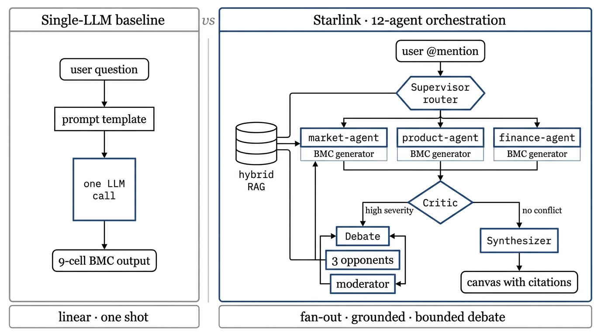

*Figure 1-1: Workflow comparison. **Left**: single-LLM baseline — one prompt, one call, coverage left to the model's attention. **Right**: proposed system — supervisor routes three bound generators, hybrid retriever supplies evidence, critic gates a bounded review loop, synthesizer closes the cycle.*

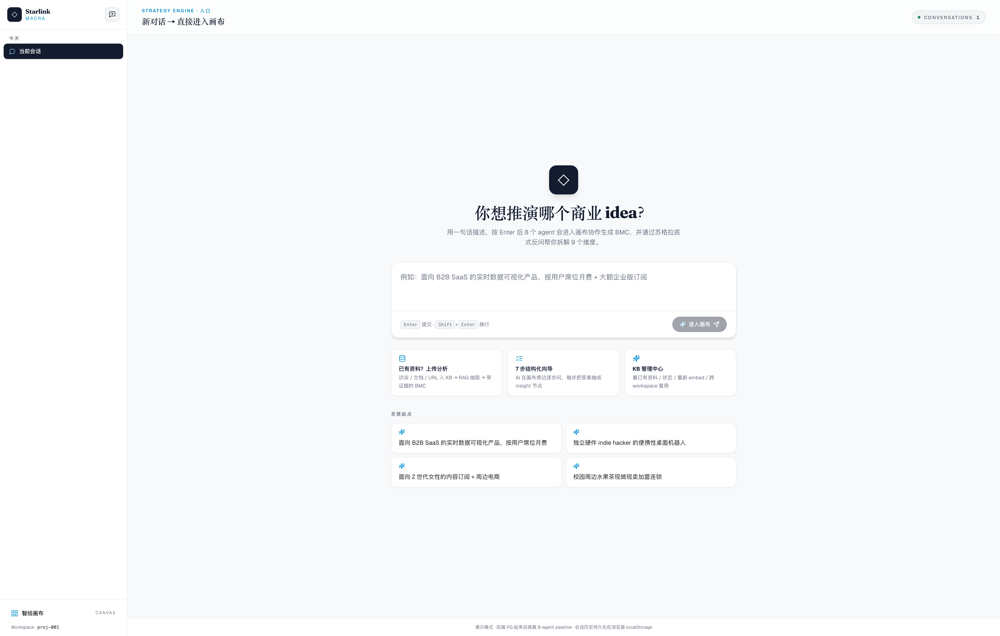
*Figure 1-2: System entry point. The prompt-first surface invites a one-sentence business idea; feature cards underneath route the user into knowledge-base ingestion, the Coach wizard pathway, or knowledge management.*

### 1.4 The Organization of This Article

Four more chapters follow. Chapter 2 surveys six lines of prior work that bear on declarative coverage: business decision support, language-model reasoning, multi-agent systems, retrieval-augmented generation, generative-AI interfaces, and observability. Chapter 3 details the multi-agent reasoning core and the bilingual hybrid retrieval layer, and reports the controlled experiments that examine coverage, retrieval reliability, and mechanism ablation. Chapter 4 details the canvas-first frontend together with the deployable five-layer architecture, the persistence schema, and the three-layer observability stack. Chapter 5 closes with limitations, threats to validity, and future work. The reference and acknowledgment sections come last.

### 1.5 Chapter Summary

This chapter identified the failure modes of the single-call paradigm in canvas generation, articulated declarative coverage as the design principle that responds to them, and introduced the system that realizes the principle. The delivered system organizes a LangGraph-based multi-agent reasoning core, a bilingual hybrid retrieval layer, and a canvas-first interaction surface into a single workspace, with a three-layer observability stack rendering per-capability service-level objectives on the same surface where the user reads the canvas. Chapters 3 and 4 detail the design and implementation of this system. The controlled experiments reported in Chapter 3 are positioned as supporting evidence that the implemented system behaves as the design predicts, not as the contribution itself.

---

## CHAPTER 2: RELATED WORK

This chapter reviews six lines of prior work that bear directly on this thesis: the evolution of business decision-support systems and the Business Model Canvas, reasoning capabilities of large language models, LLM-based multi-agent systems, retrieval-augmented generation, generative-AI interfaces and visualization, and observability for LLM-driven systems. Each section closes by locating Starlink in the field.

### 2.1 Evolution of Business Decision-Support Systems

Business decision-support systems have advanced through three broad phases. The first generation, surveyed by Arnott and Pervan [5], centered on rule-based and database-driven systems. These systems aggregated structured business data, generated reports, and presented numerical summaries. As enterprise analytics matured, the second generation shifted toward predictive and prescriptive analytics, and subsequent work documented how interactive analytics platforms support data-driven planning and operational decision-making [5][6].

The third generation introduces generative and AI-driven business-model design. Sjödin et al. [7] frame AI capabilities as enablers of co-evolutionary feedback loops in business-model design, and recent surveys argue that generative AI extends the analytical capacity of decision-support systems to unstructured documents, market narratives, and exploratory strategic questions [8][9].

The Business Model Canvas, proposed by Osterwalder and Pigneur [1], decomposes a business model into nine interlocking dimensions and remains the dominant artifact in early-stage strategy work. Extensions of the canvas have followed in the analytics direction. The Analytics Canvas of Kühn et al. [10] reframes the canvas as a structured medium for designing data-analytics projects, and the Business-to-Analytics Canvas of Panzner et al. [11] translates product-planning use cases into concrete data-analytics tasks. These extensions confirm that the canvas can function as a structured analytical workspace, not only as a presentation template.

In parallel, the explainable-AI literature has reframed DSS evaluation around trust, transparency, and interpretability. Barredo Arrieta et al. [12] propose broad taxonomies for explainability that treat user understanding and responsible deployment as central design requirements, and the recent review of explainable-AI-based DSS by Kostopoulos et al. [13] confirms that the trend has continued into the generative-AI era. The lesson for business DSS is that black-box analytical support is inadequate in settings where decisions must be justified to managers, regulators, or investors.

Most existing DSS work continues to focus on result presentation (dashboards, predefined views, post-hoc explanation), and rarely makes the analytical process itself visible, editable, and citation-grounded. End-to-end interactive AI BMC systems with quantitative evaluation are not well documented in the public record. Recent domain-specific benchmarks for business and finance (BizBench [14], FinanceBench [15], FinanceReasoning [16]) further confirm that current evaluation effort concentrates on isolated reasoning capability rather than on end-to-end structured-artifact production. Figure 2-1 places this work against the three broad generations sketched above. The configuration that Chapters 3 and 4 instantiate combines a deployed system, citation grounding, and controlled evaluation. Before such a system can be designed, the reasoning capabilities of current language models must be understood. This is the subject.

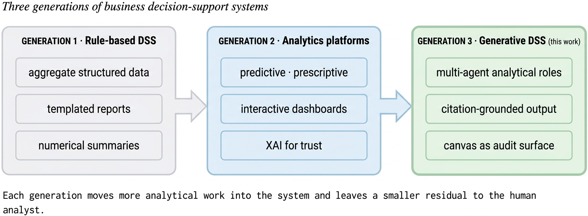
*Figure 2-1: Three generations of business decision-support systems. Reports [1] → predictive / interactive analytics with XAI [5][6][13] → language-model-orchestrated generation of structured analytical artifacts, of which this work is one instance.*

### 2.2 Reasoning in Large Language Models

A central line of recent research no longer treats large language models as one-shot generators and instead seeks to shape the inference process itself. The survey by Zhao et al. [8] catalogues the rapid expansion of LLM capabilities. Huang and Chang [9] focus specifically on reasoning, summarizing the dominant strategies and identifying open problems.

The reasoning lineage begins with **Chain-of-Thought (CoT) prompting** [17], which changes the prompt format from input-output examples to input-rationale-output demonstrations, encouraging the model to decompose a task into intermediate natural-language steps. **Self-Consistency** [4] samples multiple candidate reasoning paths and selects the most consistent final answer, reducing dependence on a single brittle trajectory. **Tree-of-Thoughts (ToT)** [3] treats reasoning as search over candidate "thoughts" with explicit generation, evaluation, and selection steps. **Graph-of-Thoughts (GoT)** [18] further generalizes the structure to a graph, allowing the system to represent dependencies and alternative routes among partial hypotheses. Action-oriented variants include **ReAct** [19], which interleaves reasoning traces with actions and observations, and **Reflexion** [20], which converts feedback into verbal self-reflections stored across trials.

These methods reframe the language model as a system that must decompose, branch, retrieve, or revise before a conclusion is accepted. Recent surveys [8][9] also caution that stronger reasoning behavior does not automatically imply higher reliability. The hallucination survey by Huang et al. [21] and the trustworthiness guideline by Liu et al. [22] document the same pattern: unstable multi-step inference and weak grounding persist even as reasoning quality improves, and the gap is most visible in domain-specific applications. When a single language model is insufficient for reliable structured-artifact production, the natural next step is to decompose the task across multiple specialized agents.

These reasoning techniques have been validated on mathematics, code, and open-domain dialogue. Their behavior on structured nine-cell BMC JSON output under long Chinese-English mixed prompts has received less attention. The practical recipe used in this work combines strict structured output with markdown-fence fallback parsing and a second distillation pass to control output length, documented later alongside the implementation.

### 2.3 Multi-Agent Large-Language-Model Systems

Multi-agent collaboration has become an active direction in post-LLM system design. Recent surveys [23][24] taxonomize the space along three broad functions: solving complex tasks, simulating specific scenarios, and evaluating generative agents. The 2025 survey by Luo et al. [24] further organizes the field along five interacting dimensions (Agent Constitution, Multi-Agent Orchestration, Evolution, Applications, Evaluation) that map onto the structure of this work: Agent Constitution corresponds to the agent-profile design. Multi-Agent Orchestration corresponds to the supervisor-routed coordination mechanism. Evolution corresponds to the memory layer. Applications corresponds to the BMC generation task. Evaluation corresponds to the controlled experiments reported later in this work.

Three foundational frameworks anchor the current landscape. **CAMEL** [25] introduces role-playing dialogue with task-driven messages, using role-consistent prompts to stabilize communication between agents. **AutoGen** [26] formalizes the Conversable Agent abstraction and the `GroupChat` topology, providing an extensible framework for tool-integrated multi-agent workflows. **MetaGPT** [27] applies Standardized Operating Procedures drawn from software-engineering practice to enforce structured handovers between specialized agent roles (Product Manager, Architect, Engineer, QA Engineer). Figure 2-A reproduces its system overview.


*Figure 2-A: MetaGPT system overview, from Hong et al. [27]. Coverage is enforced by the role sequence. Contrast with capability declaration in Table 2-1.*

Table 2-1 summarizes the design choices of these frameworks alongside the proposed system for the axes that matter most in this thesis.

**Table 2-1.** Cross-framework comparison of multi-agent language-model systems on axes relevant to this work. The final column highlights the coverage-enforcement strategy of each framework, which is the dimension along which this work makes its primary contribution.

| Framework        | Agent count           | Coordination               | Communication               | State model                | Output                       | Coverage enforcement                                            |
|------------------|------------------------|----------------------------|------------------------------|-----------------------------|-------------------------------|------------------------------------------------------------------|
| CAMEL [25]       | 2 (role pair)         | role-play dialogue         | direct messages              | per-agent prompt           | text                          | none — coverage emergent from dialogue                          |
| AutoGen [26]     | configurable          | `GroupChat`                | message queue                | per-conversation           | text + code                   | group chat — depends on prompt design                           |
| MetaGPT [27]     | 5 SOP roles           | publish/subscribe          | shared message pool          | per-role memory            | code + design docs            | Standardized Operating Procedures — coverage by role handoff    |
| Magentic-One [28] | configurable          | orchestrator + planner     | direct                       | shared task ledger         | task-specific                 | task ledger — coverage by orchestrator planning                  |
| Meflex [29]       | 9 (one per BP section) | user-driven navigation    | per-agent prompts            | per-section workspace      | non-linear business plan      | user checklist + section-specific prompts — coverage by user     |
| **Starlink**     | **12 (fixed)**        | **supervisor + fan-out**   | **blackboard reads/writes** | **shared blackboard**       | **9-cell canvas + citations** | **capability declaration at startup — coverage by mechanism**   |

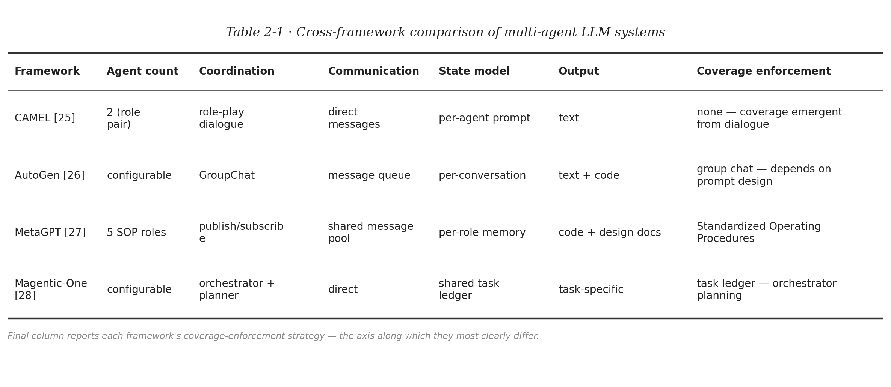

A particularly close contemporary point of reference is the Meflex system of Luo et al. [29], also published in 2026 and also targeting entrepreneurial business-plan writing through a multi-agent design with a non-linear idea canvas. The two systems share the broad design space — multi-agent decomposition over a business-planning artifact rendered on a free-form canvas — but differ on the coverage-enforcement axis. Meflex defines nine section-specific agents covering User Pain Points, Market Analysis, Product Overview, Competitive Analysis, Feasibility Analysis, Funding Plan, Team, Reflection, and Meta-Reflection, and exposes them as a checklist the user navigates manually; coverage of each section is enforced by the user clicking through the checklist, supported by section-specific prompts. Starlink removes the user from this loop: capability declarations made at startup ensure every dimension is dispatched on every run, regardless of how the user navigates the canvas. The two designs also differ on evaluation methodology — Meflex reports an exploratory user study at N = 30 measured on the System Usability Scale, while this work reports controlled comparisons against single-LLM baselines under an Agent-as-Judge protocol on two frontier-class backends. The contrast is informative because it shows that in 2026 multiple research groups have independently identified single-LLM canvas generation as inadequate for entrepreneurial planning and converged on multi-agent decomposition as the response; the design choice of how to enforce coverage on the structured artifact remains the differentiator.

Looking at the final column of Table 2-1, Starlink is supervisor-routed and surface-resembles Magentic-One, but its coverage-enforcement strategy is different in kind. CAMEL and AutoGen leave coverage emergent from conversation. MetaGPT enforces coverage through prompt-driven role handoffs. Magentic-One delegates coverage to the orchestrator's planner. Starlink moves coverage out of the conversation and out of planning, into the startup configuration: which dimensions must be produced is fixed when the capability registry loads, and the corresponding dimension-specific actions are bound into the relevant agent's tool surface. This is the declarative-coverage principle. The remaining columns follow as consequences. The agent count is fixed because the dimension partition is fixed. The state model is a blackboard because coverage must be slot-wise inspectable. The output is structured because the coverage object is itself structured. Figure 2-2 plots the five frameworks along this axis.

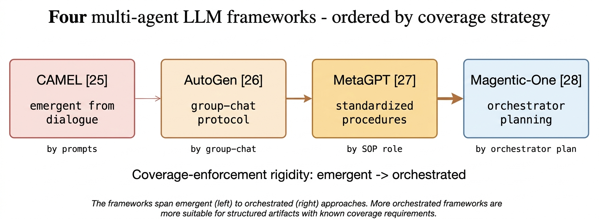
*Figure 2-2: Five multi-agent frameworks ordered by rigidity of coverage enforcement — from prompt-only (left) to startup-time declaration (right, Starlink). The ordering is not a ranking.*

Beyond these frameworks, the classical multi-agent-systems literature on consensus and coordination, surveyed by Amirkhani and Barshooi [30], reminds the community that collaboration quality depends on more than role diversity. Convergence conditions, agreement quality, and coordination cost are equally important and remain only weakly connected to current LLM-agent evaluation practice.

Representative application studies show how these mechanisms are deployed in different settings. ChatDev as a software-development simulator, ChatEval as an evaluation-through-debate framework, and Generative Agents as a social-simulation system illustrate that the unit of coordination — role, message, workflow stage, or debate round — varies markedly across systems.

This body of work rarely demonstrates multi-agent collaboration over bilingual, structured business artifacts such as the BMC, with provenance-grade output and an end-user-visible reasoning state. Most evaluations report benchmark completion rates rather than the visibility or controllability of the collaborative process. For business analysis, transparency is itself a first-class requirement. The twelve-agent topology presented, together with the bounded adversarial debate, the shared blackboard, and the four-class citation taxonomy, is this work's response to that requirement.

### 2.4 Retrieval-Augmented Generation

Retrieval-Augmented Generation, introduced by Lewis et al. [31] for knowledge-intensive tasks, conditions language-model output on retrieved external documents. It has emerged as the dominant remedy for the parametric-knowledge limits of stand-alone language models. The survey by Gao et al. [32] distinguishes three regimes: *naive RAG*, which follows an index-retrieve-generate pipeline; *advanced RAG*, which adds pre-retrieval rewriting, post-retrieval reranking, and context compression, and *modular RAG*, which introduces routing, memory, search, and task-specific adapters. Figure 2-B reproduces the comparison from the survey. The complementary evaluation literature, surveyed by Yu et al. [33], catalogues the failure modes that this taxonomy is designed to mitigate. Retrieval, in this framing, is no longer a prompt-attachment step but an architectural component with its own failure modes and optimization targets.


*Figure 2-B: Three RAG paradigms (naive / advanced / modular), from Gao et al. [32]. The bilingual hybrid retriever proposed sits closest to advanced, but treats the lexical channel as a reliability safeguard rather than a quality lift.*

The recent survey on agentic RAG by Singh et al. [34] elevates retrieval to a first-class agent-callable tool, integrating planning, reflection, and multi-agent collaboration directly into the retrieval workflow. Hybrid retrieval that fuses sparse (BM25, lexical) and dense (DPR, ColBERT) signals via Reciprocal Rank Fusion [35] is well studied for English corpora but rarely reported in production bilingual settings. On the storage side, dense vector retrieval in production now routinely uses the `pgvector` PostgreSQL extension as a single-store solution (in place of a separate vector-only database), since it allows transactional consistency between retrieved chunks and the application's relational state. The bilingual retrieval algorithm indexes embeddings in `pgvector` and supports three commercial embedding providers (Aliyun DashScope `text-embedding-v4`, SiliconFlow `bge-m3`, OpenAI `text-embedding-3-small`) plus a deterministic local-hash fallback for availability under provider failure. Knowledge-graph augmentation of large language models, surveyed by Pan et al. [36] and by the more recent review of Ibrahim et al. [37], offers a complementary line of work in which explicit relational structure supplements parametric knowledge. Table 2-2 positions the proposed retriever against the four mainline regimes.

**Table 2-2.** Retrieval-augmented generation regimes and where the hybrid retriever of this thesis is positioned.

| Approach              | Retrieval mode             | Fusion                              | Multilingual    | Empirical jitter behavior reported |
|-----------------------|-----------------------------|--------------------------------------|------------------|----------------------------------------|
| Naive RAG             | dense (vector) only         | n/a                                  | partial          | not reported                           |
| Advanced RAG [32]     | dense + rerank              | weighted score / reranker            | partial          | not reported                           |
| Modular RAG [32]      | routed per task             | task-specific                        | partial          | rarely reported                        |
| Agentic RAG [34]      | tool-callable, planned      | varies                               | partial          | emerging                               |
| **Starlink hybrid**   | **dense + CJK-bigram lexical** | **RRF, k = 60**                    | **CJK + Latin**  | **yes (jitter-injected)**                      |

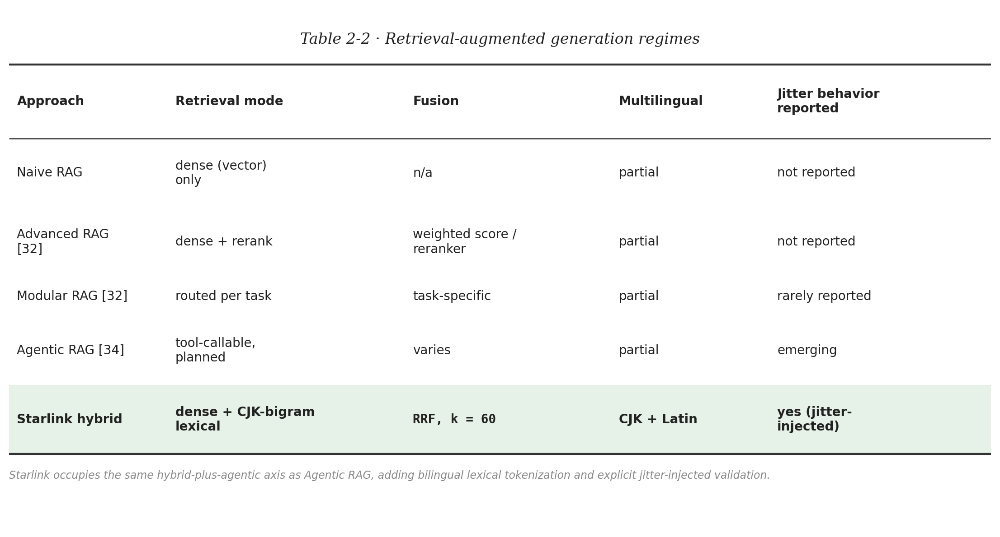

Starlink occupies the same hybrid-plus-agentic axis as Agentic RAG and adds two production-relevant properties not commonly reported in this regime: a bilingual lexical channel based on Unicode-class tokenization, and an explicit jitter-injected comparison that distinguishes reliability gains from quality gains.

For business analysis specifically, the case for retrieval is straightforward: business reasoning depends on current, verifiable, context-dependent information — annual reports, regulatory filings, market disclosures — that no parametric model can be expected to memorize and keep current.

The bilingual production setting has an open question. No published study combines a Unicode-class-aware tokenizer (CJK bigrams together with Latin words above a minimum length) with rank-based fusion and also reports the empirical behavior of that fusion when the embedding provider degrades. This is the regime in which hybrid retrieval is most often defended on intuitive grounds rather than on measured ones. The algorithm is documented in the retrieval chapter, with a jitter-injected comparison reported in the experiments chapter. Retrieval alone solves only the grounding half of the analyst's problem. The retrieved evidence must also be rendered in a way that is inspectable and editable, which motivates the user-interface literature reviewed next.

### 2.5 Generative-AI Interfaces and Visualization

Foundational work in visual analytics, exemplified by the research agenda of Thomas and Cook [38], framed visualization as an analytical workspace supporting reasoning, comparison, and intervention, rather than as decorative output. The recent survey by Wang et al. [39] on visual analytics for machine learning retains this framing in a contemporary context, emphasizing that visualization in intelligent systems supports understanding, diagnosis, and improvement, not only the presentation of final results.

For generative-AI interfaces specifically, Luera et al. [40] survey user-interface design and interaction techniques across generative-AI applications. They argue that interface design should not be reduced to prompting alone but also includes selection, parameter manipulation, object manipulation, and other user-guided interaction patterns. Text-only chat interfaces, in their analysis, are too narrow for complex analytical workflows that involve branching logic, long-term dependencies, and editable intermediate units. The same survey points toward canvas-style workspaces as a promising direction for sense-making and exploration.

In the business domain, the Analytics Canvas [10] and Business-to-Analytics Canvas [11] already use canvas-like structures as media for analytical formalization and stakeholder coordination, even though they are not generative reasoning systems themselves.

These observations motivate the canvas-centered design adopted in Chapter 4. The first is that canvas-style interfaces are repeatedly highlighted as more appropriate than linear chat for analytical sense-making, yet the empirical integration of an AI-generated, citation-grounded analytical output with a structured, infinite, dual-mode canvas in a single end-to-end system has rarely been reported. The second is that the canvas is rarely treated as the sole user-facing surface. Most reports retain a separate chat panel or dashboard layer alongside the canvas. Chapter 4 takes the stronger position that the canvas is the application, and chat, evidence, wizard, and system-health overlays are floating BMC-anchored components rendered on top of it. The canvas substrate is implemented on the **React Flow** library, which provides an infinite zoom-and-pan workspace with typed nodes, typed edges, and a `MiniMap` viewport overview. The same substrate supports both the structured nine-cell BMC layout and the free-form ideation mode on the same content.

### 2.6 Observability for LLM-Driven Systems

Observability has matured into a distinct sub-area of systems engineering. Generic application-performance-monitoring platforms provide call-level visibility, error fingerprinting, and trace propagation. Specialized platforms for language-model applications extend tracing to prompt, tool-call, and chain-execution granularity. The trustworthiness guideline of Liu et al. [22] frames observability as a prerequisite for any language-model system in production, and the agent-evaluation survey of Yehudai et al. [41] adds that without per-agent telemetry, attribution of an emergent failure in a multi-agent system is hard. The literature on observability *designs* for multi-agent systems, however, remains thin: most tracing tools assume a single chain and surface per-call latency rather than per-agent service-level objectives. The 2025 survey on multi-agent collaboration mechanisms categorizes inter-agent interaction by actors and types (cooperation, competition, coopetition), providing a vocabulary for describing the adversarial review loop as a cooperation-with-bounded-competition pattern.

A natural question is how the per-agent state should be exposed to the engineer and to the end user when twelve agents share one workspace. No published reference design is known to the authors for multi-agent SLO observability that combines three nested granularities (per-tool, per-subgraph, per-user-mention) with live agent-health exposure inside the application surface itself. Chapter 4 contributes such a design, implemented on top of an **OpenTelemetry** trace pipeline with a **Prometheus**-format metric export, with the resulting SLO signal rendered on the canvas as an always-visible agent-health chip.

### 2.7 Chapter Summary

Six lines of literature were surveyed in this chapter. The gaps they leave open are connected. The first is that no end-to-end multi-agent system in which coverage on a structured artifact is enforced by capability declaration rather than by prompt-driven role play has been quantitatively evaluated in the public record. The second is that no production recipe is reported for the environment around such a system: structured output under long bilingual prompts and hybrid retrieval under embedding-service degradation are both unresolved, and without them, declared coverage on the multi-agent side can still be silently broken at the parsing or grounding boundary. The third is that no observability design exposes, on the user-facing surface itself, which declared capabilities are being exercised by which agents, so the coverage mechanism remains a hidden invariant rather than an inspectable one. Chapter 3 takes up the first two gaps. Chapter 4 takes up the third, together with the canvas frontend. Declarative coverage is the response that ties them together.

---

## CHAPTER 3: PROPOSED METHOD

This chapter presents the first two pillars and the controlled experiments that test the design. To keep contribution boundaries clear, reused machinery and added machinery are separated explicitly. *Reused*: LangGraph orchestration primitives (compiled subgraphs, `Annotation.Root` shared state, conditional-edge routing, checkpointer-based replay); Reciprocal Rank Fusion; the `pgvector` extension. *Added by this work*: the declarative-coverage discipline applied across the reasoning core; the twelve-agent decomposition derived from the BMC task structure; the bounded adversarial-review loop; the typed citation taxonomy with reverse audit; the Unicode-class-aware bilingual lexical channel; the safety-net post-filter that keeps retrieval alive under embedding-service degradation. The third pillar and the observability stack appear in Chapter 4.

### 3.1 System Overview

The Starlink system in Figure 3-1 is organized around three co-equal pillars that together address the four failure modes identified: a LangGraph-orchestrated multi-agent reasoning core, a bilingual hybrid retrieval layer, and a canvas-first interaction surface. The three pillars are not a center plus two supporters. They are three faces of the same design.

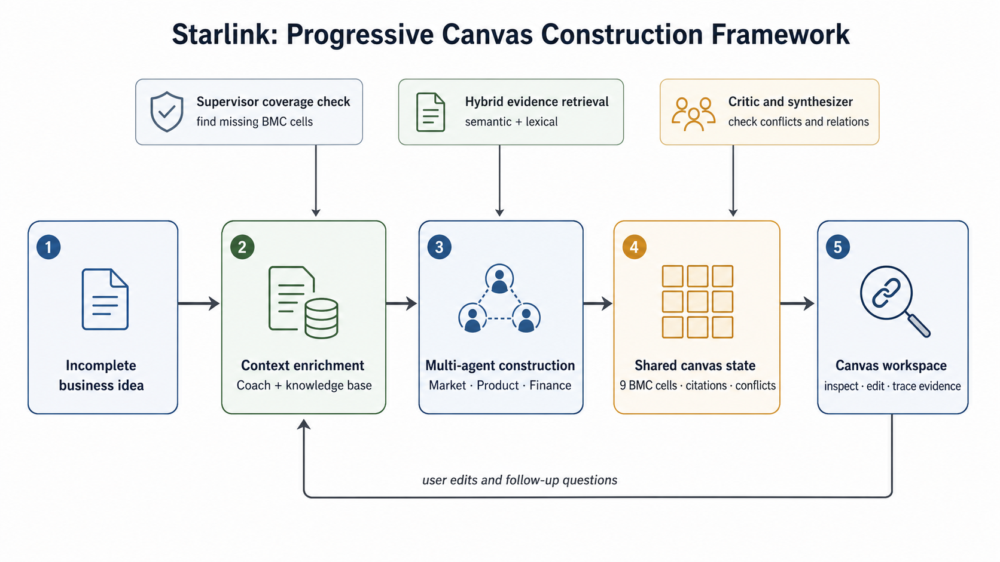

*Figure 3-1: Three-pillar overview. ① Multi-agent reasoning core (supervisor, generators, critic, synthesizer over a shared blackboard); ② Bilingual hybrid retrieval (RRF fusion of dense and lexical channels); ③ Canvas-first interaction (3×3 grid with citation chips and floating overlays).*

**Pillar ① · LangGraph-orchestrated multi-agent reasoning core.** The reasoning core decomposes the canvas-generation task across twelve specialized agents — one supervisor router, three domain generators bound to disjoint canvas-dimension subsets, one critic, one synthesizer, three role-specific opponents and one moderator for the bounded adversarial review loop, and three utility agents for dialogue and reporting modes. The agents are realized as LangGraph subgraphs that communicate exclusively through a shared blackboard (LangGraph's `Annotation.Root` state with per-slot reducers). The supervisor dispatches them through conditional-edge routing. Every state transition is persisted by the LangGraph checkpointer for replay. The main mechanism in this pillar is the declarative-coverage principle: each canvas dimension is bound to the capability declaration of a specific agent at startup, so that no declared dimension is omitted at runtime regardless of how the underlying language model would have allocated its attention.

**Pillar ② · Bilingual hybrid retrieval.** The retrieval layer ingests, chunks, and indexes documents uploaded as part of the workspace's knowledge base. On every agent invocation, the retrieval layer returns top-K evidence chunks under a fusion of two complementary channels: a dense vector channel keyed by an embedding-service provider, and a Unicode-class-aware lexical channel that handles bilingual Chinese-English content through CJK bigrams plus Latin words above a minimum length. The two channels are fused through Reciprocal Rank Fusion, and the lexical channel is positioned as a reliability safeguard against embedding-service degradation rather than as a quality lift under healthy operation. The retrieval layer keeps every declared dimension grounded in retrievable evidence.

**Pillar ③ · Canvas-first interaction surface.** The frontend is not a wrapper around the reasoning core. It is the surface on which the otherwise hidden coverage mechanism becomes inspectable and editable by the user. Each declared dimension occupies a typed cell of the canvas. Every generated claim carries a clickable citation chip that supports forward navigation to the source document and reverse navigation from a source back to every cell that cites it. Conflict edges flagged by the critic are rendered above the cells they relate. The agent-health indicator surfaces, on the canvas itself, which declared capabilities are being exercised by which agents. The canvas therefore carries the provenance and observability roles of the system: provenance as a first-class interaction element, and end-user-visible observability of the coverage mechanism.

The three pillars are co-equal by design — none supports the others. The reasoning core would have no inspectable surface without the canvas, the canvas would have nothing to render without the reasoning core, and both would degrade without the retrieval layer.

**The flow between Pillars ① and ③.** The reasoning core and the canvas surface exchange data through one outbound channel and one inbound channel. *Outbound (reasoning core → canvas):* every blackboard write triggers a typed delta event that the gateway pushes to the canvas over a subscription channel, and the canvas merges the delta by node identity within a single frame budget. Reasoning-side changes therefore reach the user incrementally rather than as a batch at the end of a run, and the canvas never re-layouts on partial updates. *Inbound (canvas → reasoning core):* user interactions on the canvas — typed `@`-mentions, cell edits, citation-chip clicks — are translated into typed mutations or queries on the gateway. A mention triggers the supervisor's routing decision. An edit writes back into the relevant blackboard slot under the same merge-by-identity reducer the agents use. A citation click issues a direct lookup against the knowledge layer without re-entering the reasoning core. The interaction surface is therefore a peer of the reasoning core within the same state machine, not a downstream consumer of it.

The end-to-end cycle from user request to first analytical update is sub-second on a warm path; a full canvas generation completes in roughly two minutes. Latency is dominated by language-model completion time at the reasoning hop, not by orchestration overhead — the orchestration layer is deliberately lightweight. The deployable architecture appears in Chapter 4.

### 3.2 Multi-Agent Reasoning Core

The reasoning core is implemented on **LangGraph**, a directed-acyclic-graph orchestration framework for language-model agents. Three of its native primitives map directly onto the declarative-coverage design: compiled *subgraphs* with typed I/O schemas provide the substrate for capability declaration at startup; the `Annotation.Root` shared-state construct with per-slot reducers gives blackboard semantics; the checkpointer persists every state transition, supplying replay for both audit trail and adversarial review. The mapping is one-to-one — *agent* = compiled subgraph, *blackboard* = `Annotation.Root` state, *routing* = supervisor's conditional-edge dispatch, *replay log* = checkpointer transitions — so LangGraph is a structural fit rather than an arbitrary choice over CAMEL [25] or AutoGen [26].

The agent count is derived from the analytical structure of the task rather than from hyperparameter search. The Business Model Canvas decomposes into three semantic groups (market-facing, product-facing, finance-facing) requiring one domain generator each. Parallel generation requires two cross-dimension advisors (a critic flagging conflicts by severity, a synthesizer deriving cross-cell insights). High-severity conflicts trigger a bounded adversarial review of three role-specific opponents plus a moderator. Three further utility roles handle free-form dialogue, exploratory research, and structured reporting. The arithmetic is therefore **12 = 3 generators + 2 advisors + 4 review agents + 3 utilities** worker agents plus a supervisor router. Risk analysis is folded into the critic's severity scoring and the synthesizer's cross-cell insights rather than realized as a fourth generator, keeping the BMC dimension partition disjoint while preserving the risk-surfacing function. Table 3-1 lists every agent.

**Table 3-1.** Roster of the twelve worker agents plus the supervisor router. Each row is a compiled LangGraph subgraph, grouped into five functional bands: router · BMC generators · advisors · adversarial review · utilities. The *capability declaration* column lists the bindings the supervisor uses to dispatch the agent at runtime — the column that realizes declarative coverage. The *model tier* column records the heterogeneous model assignment balancing latency-sensitive paths against reasoning-intensive ones. The *responsibility* column states each agent's contribution to a canvas generation.

| Agent role        | Capability declaration (LangGraph subgraph)                              | Model tier             | Responsibility in the canvas pipeline                                                       |
|-------------------|---------------------------------------------------------------------------|------------------------|---------------------------------------------------------------------------------------------|
| **Band 1 · Router** *(intent classification + dispatch)*                                                                                                                                                              ||||
| Supervisor        | router subgraph; callability classes = {bmc-generator, advisor, debate, utility, report} | base                   | Classifies user intent; dispatches active agents through conditional edges; bounds review loop |
| **Band 2 · BMC generators** *(parallel fan-out; disjoint capability subsets covering all nine canvas dimensions)*                                                                                                     ||||
| Market generator  | bmc-generator subgraph; capabilities = {CS, CH, CR}                       | base                   | Produces the three customer-facing dimensions of the canvas                                 |
| Product generator | bmc-generator subgraph; capabilities = {VP, KR, KA, KP}                   | base                   | Produces the four offering- and resource-facing dimensions                                  |
| Finance generator | bmc-generator subgraph; capabilities = {RS, CO}                           | base                   | Produces the two revenue- and cost-facing dimensions                                        |
| **Band 3 · Advisors** *(sequential cross-dimension quality control after generators write)*                                                                                                                          ||||
| Critic            | advisor subgraph; strict structured-output binding                        | base ★                 | Reviews the three generators' outputs and flags cross-dimension conflicts by severity        |
| Synthesizer       | advisor subgraph; cross-cell insight binding                              | base                   | Derives insights that link two or more canvas dimensions                                    |
| **Band 4 · Adversarial review** *(triggered only when the critic flags a high-severity conflict; bounded at three rounds)*                                                                                            ||||
| Market opponent   | debate-side subgraph; challenges market-generator content                 | reasoning-tier         | Argues against the market dimensions when a high-severity conflict involves them            |
| Product opponent  | debate-side subgraph; challenges product-generator content                | reasoning-tier         | Argues against the product dimensions when a high-severity conflict involves them           |
| Finance opponent  | debate-side subgraph; challenges finance-generator content                | reasoning-tier         | Argues against the finance dimensions when a high-severity conflict involves them           |
| Moderator         | debate-judge subgraph                                                     | reasoning-tier         | Reads the proponent-opponent exchange and returns an accept-or-reject verdict per dimension  |
| **Band 5 · Utilities** *(out-of-pipeline modes; do not write into canvas slots)*                                                                                                                                      ||||
| General responder | utility subgraph                                                          | reasoning-tier         | Handles free-form questions outside the canvas pipeline                                     |
| Deep researcher   | utility subgraph                                                          | reasoning-thinking     | Performs extended, exploratory analysis when the user requests a deeper investigation       |
| Report writer     | report subgraph                                                           | base                   | Produces an eight-section investor-grade narrative report from the populated canvas         |

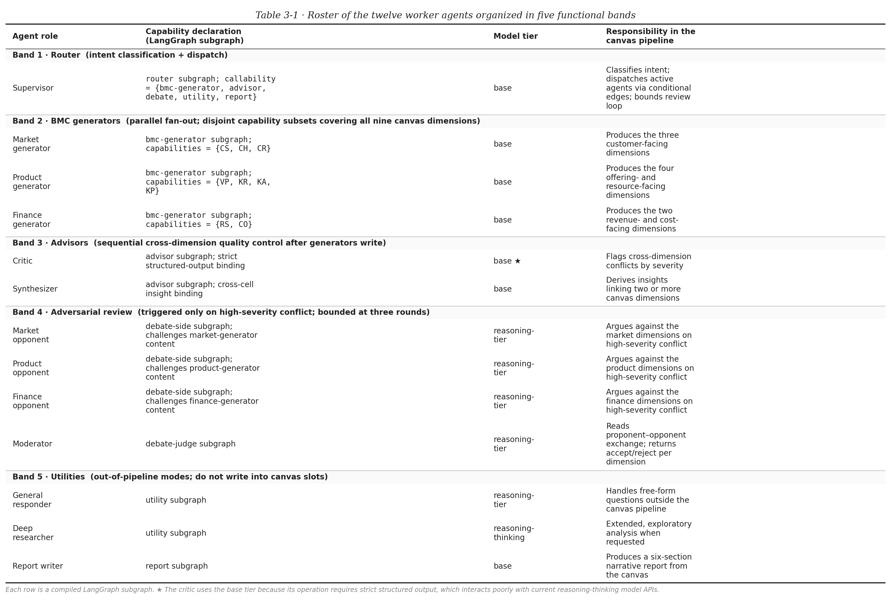

★ The critic uses the base tier rather than a reasoning-thinking variant because its operation requires strict structured output, a constraint that current reasoning-thinking model APIs handle poorly. This is a property of model APIs at the time of writing rather than a system-level choice.

**Visual proof of declarative coverage.** Table 3-2 presents the capability bindings of Table 3-1 as a matrix indexed by the nine canvas dimensions. Each cell records which kind of capability binding, if any, the row's agent declares for the column's dimension. The matrix makes the declarative-coverage property visually checkable: reading down any single column shows that at least one agent declares a *generate* binding (●G) on every canvas dimension, which is precisely what the declarative-coverage principle requires. The critic's *validate* binding (◐V) and the synthesizer's *insight* binding (◇I) extend coverage in a complementary way, since every dimension is subject to validation and is eligible for cross-cell synthesis. A single-LLM baseline has no analogous matrix. Coverage of each dimension in that baseline depends on whatever the model's attention chooses to address.

**Table 3-2.** Capability coverage matrix. Rows are the agents that touch the canvas blackboard slots (the BMC-generator band plus the advisor band. The adversarial-review and utility bands do not declare per-dimension capabilities directly). Columns are the nine canvas dimensions in their standard order: CS (customer segments), VP (value propositions), CH (channels), CR (customer relationships), RS (revenue streams), KR (key resources), KA (key activities), KP (key partnerships), CO (cost structure). Cell legend: **●G** = generate binding; **◐V** = validate binding; **◇I** = insight binding. Blank = no binding. **Coverage requirement: every column must contain at least one ●G binding**. This property is machine-checked at boot.

| Agent           | CS  | VP  | CH  | CR  | RS  | KR  | KA  | KP  | CO  |
|-----------------|:---:|:---:|:---:|:---:|:---:|:---:|:---:|:---:|:---:|
| market-gen      | ●G  |     | ●G  | ●G  |     |     |     |     |     |
| product-gen     |     | ●G  |     |     |     | ●G  | ●G  | ●G  |     |
| finance-gen     |     |     |     |     | ●G  |     |     |     | ●G  |
| critic          | ◐V  | ◐V  | ◐V  | ◐V  | ◐V  | ◐V  | ◐V  | ◐V  | ◐V  |
| synthesizer     | ◇I  | ◇I  | ◇I  | ◇I  | ◇I  | ◇I  | ◇I  | ◇I  | ◇I  |
| **Coverage check** | **●**  | **●**  | **●**  | **●**  | **●**  | **●**  | **●**  | **●**  | **●**  |

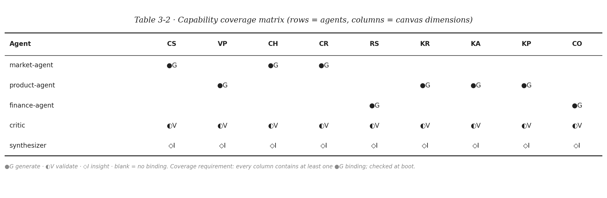

The final row reports the coverage check the supervisor performs at boot: each canvas dimension must be covered by at least one *generate* binding. If a future configuration removed one of the BMC-generator agents without re-assigning the freed dimensions, this row would have an empty cell, and the supervisor would refuse to start. The matrix is therefore not only a documentation aid but also the data structure against which the boot-time coverage check is evaluated.

The remaining subsections present the mechanism in five layers. The first covers agent profiles and the tool registry that realizes the declarative-coverage principle. The second covers the coordination mechanism that ties agents together: the shared blackboard, the supervisor's routing decision, and the bounded adversarial review loop. The third covers output stability and provenance: structured-output handling at the parsing boundary, and the typed citation taxonomy that exposes the audit surface. The fourth covers cross-conversation memory through which the system evolves. The fifth closes by tying the four mechanisms into a single canonical pipeline that produces one canvas from one user request.

#### 3.2.1 Agents and Capabilities

Figure 3-3 visualizes the agent topology summarized in Table 3-1. This subsection details how each agent's behavior is defined and how the tool registry binds dimension-specific actions to agents.

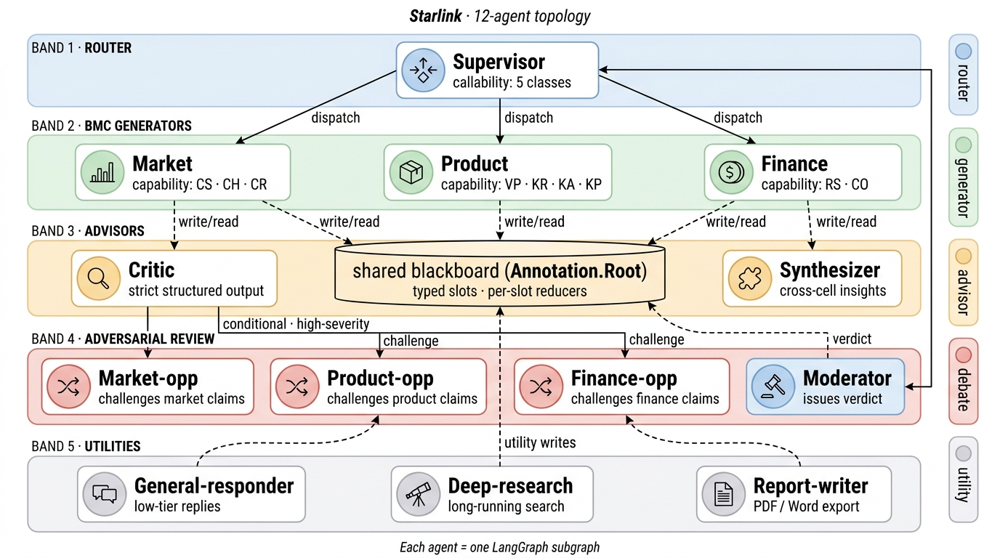
*Figure 3-3: Twelve-agent topology in four bands (generators · advisors · debate loop · utilities). All communication routes through the blackboard `BusinessState`. The supervisor is the sole routing entity. The blackboard is both shared memory and audit log.*

The model-tier column of Table 3-1 reflects a deliberate choice: latency-sensitive roles use the base tier to keep the warm path short. The debate and exploratory paths use reasoning-tier models where deeper deliberation is genuinely needed. The critic remains on the base tier because its strict structured-output requirement interacts poorly with reasoning-thinking variants.

**Agent profile schema.** Each agent's behavior is determined by a declarative configuration that specifies the role's name, the language-model tier it uses, the system prompt, the set of tools and analytical capabilities it is bound to, and bounded resource limits. Among these fields, the capabilities list is the load-bearing one: it determines which dimensions of the canvas the agent is responsible for producing, and is the structural mechanism behind the Declarative Coverage principle below.

**Tool registry and agent–tool bindings.** Agents do not call language models directly. Every agent is bound to a subset of a registry of thirty-eight tools — eleven generic tools plus twenty-seven dimension-actions (nine canvas dimensions × three action verbs: *analyze* / *generate* / *validate*). Figure 3-4 visualizes the bindings.

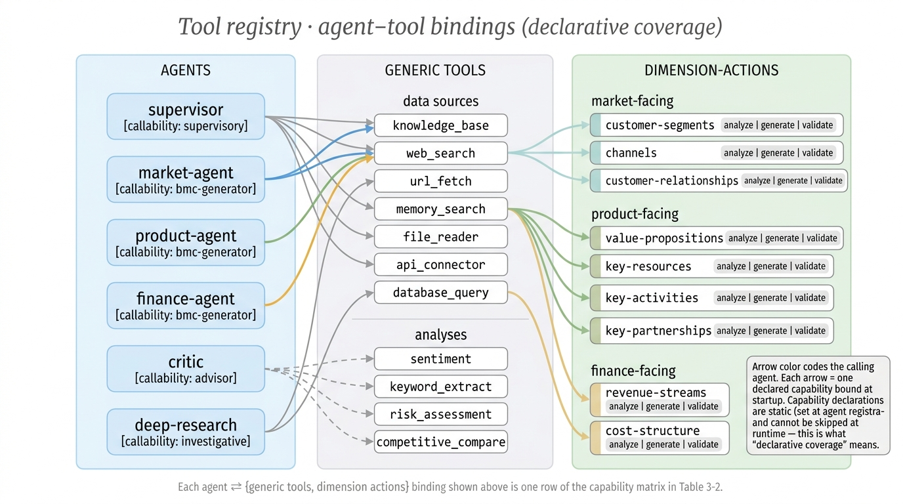
*Figure 3-4: Tool registry and agent–tool bindings. Three generator agents bind to disjoint dimension-action subsets — `market-agent` ⇢ CS/CH/CR, `product-agent` ⇢ VP/KR/KA/KP, `finance-agent` ⇢ RS/CO — over three action verbs (analyze, generate, validate).*

**Capability Registry.** The notion of an agent being bound to a typed set of tools follows the tool-learning literature surveyed by Qu et al. [42]. The generic tools fall into three functional groups: *data sources* that pull information into a reasoning step (knowledge-base retrieval, web search, URL fetch, file reading, outbound API and database access, and memory search); *analyses* that transform text into structured features (sentiment classification, keyword extraction, risk scoring, competitive comparison), and *control-output* primitives that emit canvas updates. Each tool is exposed as a typed function with a well-defined input and output schema, so that any tool can be invoked by any agent that is bound to it without further integration work.

Two design properties follow from the binding structure. First, *coverage is declarative*: an agent that has declared a generation capability for a specific canvas dimension cannot quietly omit that dimension from its output, since the corresponding analytical action is bound into the agent's tool surface at boot time. This is the structural mechanism behind the empirical coverage finding reported in the experiments chapter. Second, *tool surface stays bounded*: no single agent sees the entire registry, so each agent's prompt budget for tool schemas remains tractable even as the registry grows.

**The Declarative Coverage principle.** The first of the two properties above is the more important one for the argument of this work. It connects the design to the experimental result through a mechanical, not statistical, chain. An agent's capability list is read at startup, and the corresponding dimension-specific actions are injected into the tool surface presented to the language model at each invocation. The agent cannot complete its turn without exercising those actions, and their outputs land in the agent's slot of the shared state regardless of what the model's attention allocation would have chosen. The single-LLM baseline has no equivalent mechanism: when asked to fill nine cells, it leaves the same cell empty on every observed case. The coverage pattern is therefore best read as a difference between coverage by declaration and coverage by attention, rather than as a difference in model quality.

#### 3.2.2 Coordination Mechanism

This subsection covers the two mechanisms that turn the bound capabilities of the previous subsection into executed analytical work: the shared blackboard through which agents communicate, and the supervisor's conditional-edge routing together with the bounded adversarial review loop that handles cross-dimension conflicts.

**The blackboard.** Given the capability declarations above, the blackboard makes their execution observable at runtime. Each declared dimension maps to a specific slot, and the boot-time coverage check is verified against actual outputs after each round by inspecting slot contents — not by parsing free-form agent text. Capability declarations specify *what must be produced*; the blackboard specifies *where the production lands*.

**Reducers per slot.** Agents perceive the world exclusively through reads of the blackboard. The blackboard is composed of typed slots, each governed by a reducer that specifies how concurrent writes are combined. Node-like slots — the three dimension groups, edges, insights, conflicts — use a merge-by-identity reducer. Control-variable slots — round counter, supervisor directive, workspace context — use last-write-wins. The user's question and the retrieved evidence use plain replacement.

**Definition 1 (merge-by-identity).** Let two lists $L_1, L_2$ of nodes each carry a unique identifier. Their merge $L_1 \oplus L_2$ is the union deduplicated by identifier, with the later writer's value retained on collision. This reducer is what makes parallel fan-out correct: the three domain generators may write to their respective slots simultaneously without overwriting each other.

**Definition 2 (`BlackboardUpdate`).** Let $bs \in \mathit{BusinessState}$ with slot map $\sigma : \mathit{Slot} \to \mathit{Value}$ and reducer family $r : \mathit{Slot} \to (\mathit{Value}, \mathit{Value}) \to \mathit{Value}$. The state-update primitive is

$$\mathrm{Update}(bs,\ k \leftarrow v)\ =\ bs[\sigma[k] := r[k](\sigma[k],\ v)] \tag{2}$$

The reducer $r[k]$ is `mergeById` when $k \in \{\mathit{marketNodes},\ \mathit{productNodes},\ \mathit{financeNodes},\ \mathit{edges},\ \mathit{insights},\ \mathit{conflicts}\}$ and *last-write-wins* otherwise. This is the only state-mutation primitive in the system. Every agent output, critic verdict, synthesizer insight, and supervisor directive is routed through it. The replay property follows: given the same initial $bs_0$ and the same sequence of `Update` calls, the final state is identical, which is what makes the blackboard transcript a faithful audit log.

Each agent invocation under a given `traceId` corresponds to one OpenTelemetry root span. Every sub-invocation is a child span. The blackboard thus serves simultaneously as the agents' shared memory and as the system's audit log.

**Supervisor routing and bounded adversarial review.** Routing translates capability declarations into invocations. Every declared dimension corresponds to an agent that the supervisor is required to dispatch within the current round, which is the runtime guarantee that converts declarative coverage from a static property of the registry into an executed property of each conversation. The bounded adversarial review loop is the second-order guarantee: when the critic detects a cross-dimension conflict in the produced content, the loop forces the responsible declarations to be re-exercised under opposing pressure rather than allowing the conflict to silently pass through.

**Routing Decision.** The supervisor inspects each agent's declared `callability` and dispatches accordingly. Five callability classes are defined: `standalone-utility`, `standalone-bmc-generator`, `standalone-advisor-needs-bmc`, `debate-side`, and `debate-judge`. Definition 3 formalizes the dispatch step before Figure 3-5 sketches it visually.

**Definition 3 (`SupervisorDispatch`).** Let $\mathcal{A}$ be the agent registry of Table 3-1 and $c : \mathcal{A} \to \mathit{Callability}$ the capability map (one of the five classes above). Given current blackboard state $bs$, the supervisor returns a directive $d = (\mathit{intent},\ \mathit{activeAgents},\ \mathit{executionMode})$ where

$$\mathit{activeAgents}\ =\ \{ a \in \mathcal{A}\ \mid\ c(a) \in \mathrm{admissible}(\mathit{intent},\ bs.\mathit{round}) \} \tag{3}$$

and $\mathit{executionMode} \in \{\mathit{parallel},\ \mathit{sequence},\ \mathit{debate}\}$. For $bs.\mathit{round} = 0$ and $\mathit{intent} = \mathit{generate\_bmc}$, $\mathrm{admissible}$ is $\{\mathit{bmc\text{-}generator}\}$ and the mode is *parallel*. For $bs.\mathit{round} \geq 1$ and any high-severity conflict in $bs.\mathit{conflicts}$, $\mathrm{admissible}$ additionally contains $\{\mathit{debate\text{-}side},\ \mathit{debate\text{-}judge}\}$ and the mode is *debate*. Figure 3-5 visualizes the dispatch logic of this definition as a flowchart.

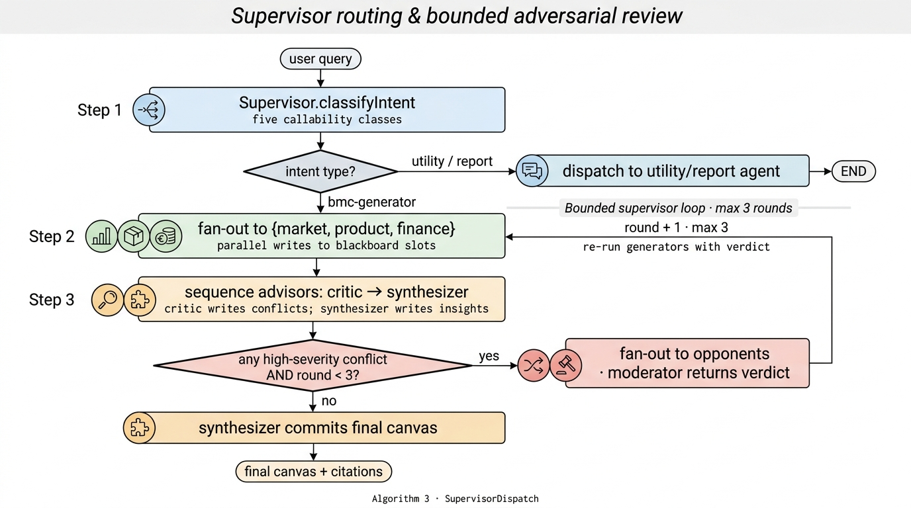
*Figure 3-5: Supervisor routing flowchart. The only cycle in the graph is the bounded supervisor loop, capped at three rounds and configurable through a runtime parameter.*

**Debate Trigger.** When the critic detects a `severity === 'high'` conflict and the `isDebateEnabled` feature flag is set, the system enters an adversarial review loop capped at three rounds (Figure 3-6, runtime-configurable within a small range).

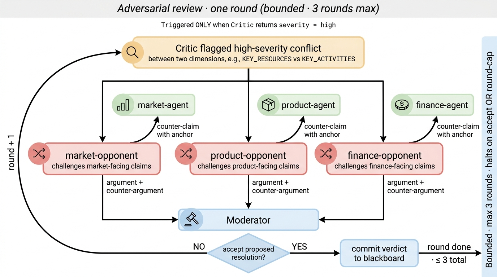
*Figure 3-6: One round of the adversarial review loop.*

Each round runs as follows: a proponent agent emits a position, the role-specific opponent challenges it with evidence-grounded counterarguments, and a moderator adjudicates with a structured JSON verdict (`resolved`, `rationale`, `revised_position`, `confidence`). The loop terminates on moderator acceptance or at the cap. In the next supervisor cycle, the relevant generator writes the resolved verdict back into its slot. In observed production traces conflicts typically resolve within a single round; the cap is reached only when the moderator returns a non-resolved verdict twice in succession.

**Observation 1.** The three-round cap is empirically necessary, not merely defensive: without it the median round count on contested cases exceeded eight in preliminary trials, with marginal score improvement below 0.1 points past round three.

**Human interruption at conflict-resolution boundaries.** The bounded review loop runs autonomously when the moderator returns a `resolved` verdict, but the design exposes one deliberate interruption boundary. When the critic raises a `severity === 'high'` conflict, the system pauses the supervisor's next dispatch and presents the conflict to the user before the debate cycle commits. The interruption is implemented as a single modal carrying the conflict reason, the critic's suggested repair, and three exclusive decision affordances: `accept` (commit the critic's verdict as-is), `revise` (commit the verdict with a user-supplied amendment), and `ignore` (mark the conflict resolved without modification). The user's decision is written back into the blackboard's `conflicts` slot using the same `Update` primitive as agent writes (Definition 2), so the audit log captures human decisions on the same trace as agent decisions. Low-severity conflicts surface as a non-blocking right-rail panel — they remain visible to the user but do not pause the pipeline. The interruption is therefore selective: it engages only at the severity threshold where silent resolution would cost the user agency over the contested cell. This is the property the system makes available that a single-LLM forward pass does not exhibit by construction.

#### 3.2.3 Output Stability and Provenance

This subsection covers the two mechanisms that protect the value of declarative coverage at the output side: structured-output handling at the parsing boundary, and a typed citation taxonomy that exposes the audit surface to the user.

**Structured output under adversarial inputs.** Structured-output stability protects declarative coverage at the parsing boundary: a coverage declaration is meaningful only when the agent's output can be reliably parsed back into its blackboard slot. Three mechanisms jointly stabilize the parsing path. The first is strict structured-output mode, which requests a schema-validated response whenever the expected output fits a small schema and eliminates the common failure of well-formed prose but malformed JSON. The second is a fence-tolerant fallback parser, used when strict mode is unavailable. It strips Markdown code fences and similar decoration before invoking JSON parsing, and is shared across all tool families. The third is a second-pass distillation that compresses each generator's two-to-three paragraph output into a few bullet points using a lightweight model, controlling downstream prompt length and protecting subsequent agents from verbose context.

**Citation provenance and lifecycle.** The citation lifecycle exposes the audit surface of declarative coverage. A reader can confirm not only that a dimension was produced, but that each claim within it traces back either to retrievable documentary evidence or to a typed system-internal artifact (a critic note, a synthesizer insight, a structural link). Coverage is thereby verifiable in two directions: the blackboard slot witnesses that the dimension was filled, and the citation on each claim witnesses the source of what fills it.

**Citation Taxonomy.** Table 3-3 lists the four classes of citation used in the system, organized by what produces them and how they are surfaced to the user. The taxonomy distinguishes documentary evidence (a retrieved knowledge-base chunk) from system-internal artifacts (a critic's conflict note, a synthesizer's cross-cell insight, a structural link between canvas cells). Each class is rendered as a typed interactive element on the canvas rather than as inline text, so the reader can distinguish a claim grounded in a source document from a claim grounded in the system's own reasoning.

**Table 3-3.** Citation classes and their interaction destinations.

| Class               | Producer        | Frontend behavior                                |
|---------------------|-----------------|--------------------------------------------------|
| documentary         | retrieval layer | opens an evidence drawer with the cited passage |
| structural          | BMC generators  | highlights the related canvas cell              |
| critique            | critic          | opens a review panel with the conflict detail   |
| insight             | synthesizer     | opens the corresponding cross-cell insight node |

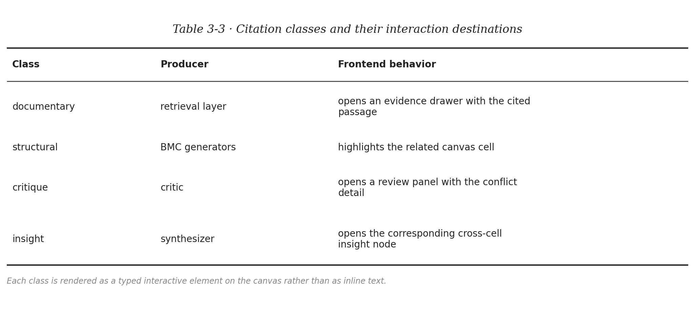

The four classes above are the citation tokens rendered as interactive elements on the canvas. The report-writer agent extends this set with two report-internal markers used inside its eight-section narrative output: `[[bmc:dimension]]` for a name-based pointer to a populated canvas cell, and `[[no-ref]]` to flag a claim as the agent's own inference rather than retrieved evidence. These two markers are scoped to report output and do not appear on the canvas itself.

A reverse-lookup query allows a user to open a piece of evidence and enumerate every claim on the canvas that cites it. Claims point at evidence, and evidence points at claims. Figure 3-7 shows the lifecycle end-to-end.

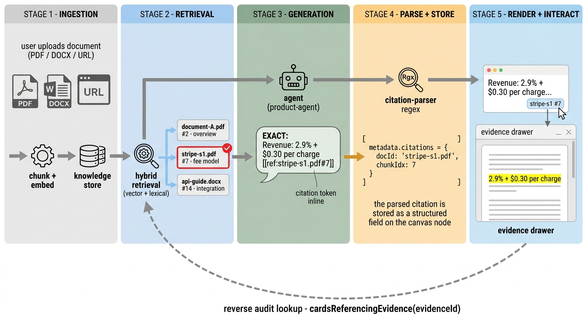
*Figure 3-7: Citation lifecycle end to end — ingest, chunk, embed, retrieve, inline token, parse, render chip, open evidence drawer. The dashed reverse arrow closes the audit loop: from any evidence chunk, enumerate every claim that cited it.*


#### 3.2.4 Memory and Evolution

Cross-conversation memory carries declarative coverage forward in time. User-skill traits, prior decisions, and previously settled dimensions feed back into supervisor routing in subsequent conversations, so the system does not re-derive coverage from scratch on every interaction. Instead, prior declarations and their satisfied outputs become first-class inputs to the next round of routing.

The shared blackboard holds state for a single conversation and is discarded when the conversation ends. To support cross-conversation evolution, the system maintains a durable memory layer recording distilled conversations, user-approved decisions, and inferred user traits. Agents consult it when the supervisor needs to know which decisions the user has already made or which customer segments the workspace has already explored. Access is through a dedicated retrieval tool that reuses the bilingual hybrid pipeline of §3.3.

The memory model is structured along three orthogonal axes that together determine how an item is stored, recalled, and aged.

**Scope.** Memory items are tagged at one of three scopes. *Session*-scoped items are visible only within one conversation. *Workspace*-scoped items are visible to every member of the same workspace. *User*-scoped items follow the user across workspaces. The scope is fixed at write time, but a workspace-scoped item can be promoted to user scope by the consolidation step described below.

**Kind.** Each item carries a kind label that determines what it represents. The two most common kinds are `summary` (a distilled conversation or canvas snapshot) and `decision` (a choice the user has explicitly approved). A third kind, `user-skill`, records inferred traits about how a particular user works, for example "prefers SMB customers" or "wants risk concerns surfaced early". Two further kinds, `insight` and `constraint`, are reserved for the synthesizer and the critic respectively.

**Importance × confidence.** Both axes are numerical scores in [0, 1]. *Importance* is set at write time and reflects how strongly the operator believes the item is worth recalling. *Confidence* is reinforced by re-use and decays with time when the item is not recalled. Retrieval weights the raw similarity score by importance and recency before returning results.

The memory lifecycle has three stages. *Capture* takes any conversation event (a chat turn, a canvas update, a user accept/reject) and records the corresponding item, deduplicating against earlier captures from the same trace. *Consolidate* runs at the end of a conversation and at scheduled intervals: it promotes a finished run into a workspace-level summary, extracts durable user traits from recent conversation summaries, promotes traits that recur across multiple workspaces from workspace scope to user scope, and decays the confidence of traits that have not been reinforced recently. *Reap* archives items whose confidence has fallen below a threshold. Archived items remain available for audit but are excluded from retrieval.

This three-stage lifecycle is the system's mechanism for *evolution*. A workspace that has run many conversations builds up a body of user-skill items that influence future supervisor routing and agent prompts. The mutation of memory is routed through the same `Update` primitive (Definition 2) that handles blackboard writes. The only difference from a blackboard slot is that memory items survive past the trace boundary.

**The Cross-Trace Persistence principle.** Three properties separate a memory item from a blackboard slot: a memory item *survives past trace boundaries*. Its scope is set at write time and can only be *widened* by consolidation, never narrowed, and its confidence *decays without reinforcement* while its importance is monotone. The first two are structural (they determine what a future conversation can see and who it can see it for), and the third turns memory into a self-pruning data structure: a trait that stops being reinforced eventually falls below the reaping threshold and disappears from retrieval, without an operator ever deciding it is stale. Together these three properties extend the replay property of the blackboard (Definition 2) across conversation boundaries while preventing the unbounded accumulation of low-confidence inferences that typically plagues long-lived agent memories.

#### 3.2.5 The Canvas Generation Pipeline

Algorithm 1 is the chronological view of declarative coverage. The same capabilities declared at startup in the agent profiles appear, one after another, as the invocations of this pipeline. The blackboard slots they target are the slots whose population at the end of the algorithm constitutes the produced canvas. Read in this way, the pipeline is the algorithmic statement of the principle articulated above: every declared dimension is dispatched, every dispatch lands in a known slot, and every claim within each slot carries a typed citation.

Algorithm 1 consolidates the mechanisms of this chapter into a single canonical pipeline, naming them in the order they execute. Memory reads appear implicitly as part of the supervisor's initial state assembly at line 1. The notation follows Definition 2 (`Update`) and Definition 3 (`SupervisorDispatch`).

```
Algorithm 1: BMC Generation Pipeline
Input:  q ∈ Question, W ∈ WorkspaceContext
Output: G ∈ CanvasGraph

 1.  bs    ← initialBusinessState(q, W)
 2.  d     ← SupervisorDispatch(bs)              // Definition 3
 3.  if d.intent ∈ {Q&A, summarize, deep_research}:
 4.      return UtilityRoute(d.target, bs)
 5.  evidence ← ParallelMap(g ∈ {market, product, finance},
                            hybridRetrieve(g.boundKBs, q))
 6.  bs    ← Update(bs, marketNodes  ← MarketAgent  (q, evidence, bs))
 7.  bs    ← Update(bs, productNodes ← ProductAgent (q, evidence, bs))
 8.  bs    ← Update(bs, financeNodes ← FinanceAgent (q, evidence, bs))
 9.  c     ← Critic(bs)
10.  while c.has_high_severity ∧ bs.round < MAX_ROUNDS:
11.      for each cf ∈ c.high_severity:
12.          o   ← Opponent[cf.domain]
13.          v   ← Moderator.judge(Proponent(cf), o(cf))
14.          bs  ← Update(bs, *Nodes ← v.revised_position)
15.      bs.round ← bs.round + 1
16.      c   ← Critic(bs)
17.  bs    ← Update(bs, insights ← Synthesizer(bs))
18.  G     ← CanvasBuilder(bs, citations(bs))
19.  Persist(G);  Publish(conversationProgress, G)
20.  return G
```

The pipeline maps onto the mechanisms of earlier subsections as follows. Step 2 invokes the supervisor's intent classifier and capability-driven dispatch. Steps 3–4 cover the utility-callability path. Step 5 issues parallel hybrid retrieval against the knowledge bases bound to each generator. Steps 6–8 are the three domain generators, each writing into its own slot of the shared state under the merge-by-identity reducer (Definition 1). Steps 9–16 are the critic-driven adversarial review loop bounded at three rounds. Step 17 invokes the synthesizer to derive cross-cell insights. Steps 18–19 produce the final canvas graph, attach citation metadata, persist the result, and push the delta to the frontend over a subscription channel.

Two observations on the algorithm's structure. First, every state mutation goes through the `Update` primitive (Definition 2), which is why the system is replayable from any blackboard snapshot. Second, the only cycle is the debate loop at lines 10–16. Outside of it, the execution graph is acyclic, which is why the supervisor's routing decisions are fully auditable from the trace log.

### 3.3 Bilingual Hybrid Retrieval

The pipeline invokes retrieval on every generator dispatch (Algorithm 1, step 5) and every memory read (line 1). Dense vector retrieval via `pgvector` and Reciprocal Rank Fusion [5] are reused unchanged. The additions of this work are (a) a Unicode-class-aware lexical tokenizer that handles bilingual Chinese-English content without language detection, (b) a safety-net post-filter that keeps the lexical channel alive when the dense channel fails, and (c) a deterministic local-hash fallback for the embedding service so that retrieval continues at degraded quality rather than halting on provider failure. Figure 3-8 shows the end-to-end pipeline.

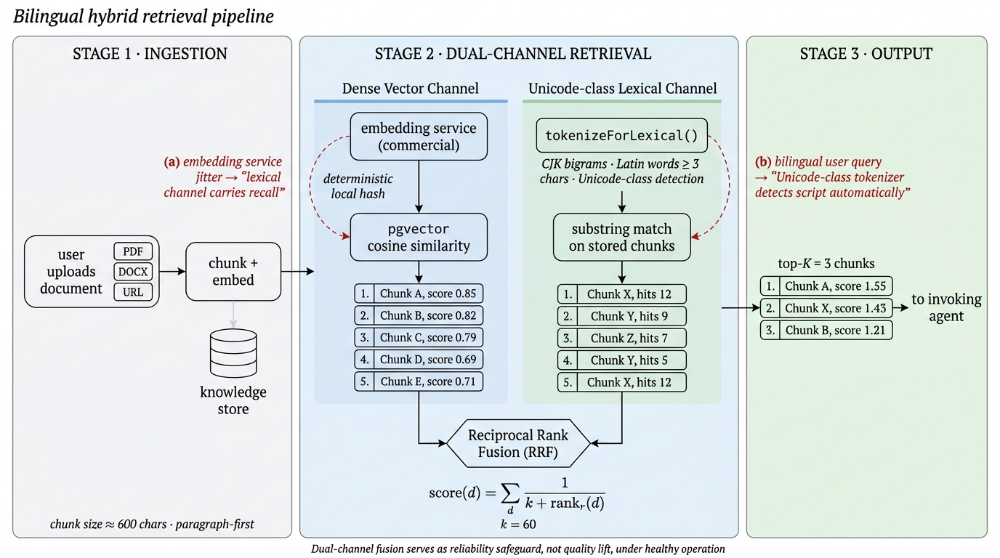
*Figure 3-8: Hybrid retrieval pipeline. Dashed line is the failure path: when the embedding API jitters, local-hash produces deterministic low-quality vectors and the lexical channel carries most of the recall.*

#### 3.3.1 Pipeline and Ingestion

Four ingestion paths are supported (text seed, URL fetch, file upload, administrative SQL). The URL path is guarded against SSRF and DNS-rebinding. The chunker is paragraph-first with a 600-character target and 80-character overlap. An ablation over {300, 600, 900, 1200} placed recall@5 maxima within 4 % of the 600 setting.

**Embedding with deterministic fallback.** Three remote embedding providers are supported, plus a deterministic local fallback used only when the remote provider fails (Table 3-4). The `local-hash` fallback uses the same Unicode-class tokenization as the lexical channel of the next subsection, builds a sparse 1 536-dimensional bag-of-tokens vector, and L2-normalizes it so cosine similarity remains well defined. Its quality is by construction far below any real embedding model. Its role is *availability*, not quality.

**Table 3-4.** Supported embedding providers and their operating characteristics.

| Provider               | Model                     | Dim   | Region notes                                     |
|------------------------|---------------------------|------:|--------------------------------------------------|
| Aliyun DashScope       | `text-embedding-v4`       | 1 536 | Default in mainland China; matches `VECTOR(1536)`|
| SiliconFlow            | `bge-m3`                  | 1 024 | Alternative; auto-padded to 1 536 dimensions     |
| OpenAI                 | `text-embedding-3-small`  | 1 536 | Used in international deployments only           |
| `local-hash` (offline) | deterministic hash-bag    | 1 536 | No network; lower retrieval quality; for availability|

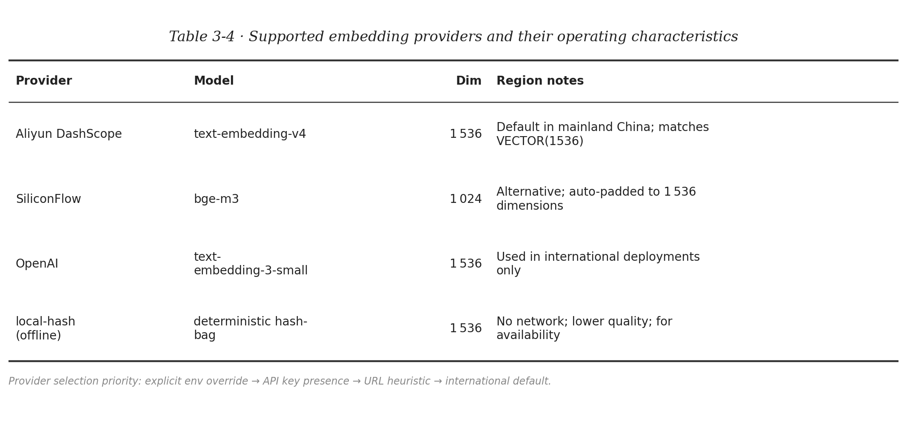

#### 3.3.2 Bilingual Tokenization and Rank Fusion

The lexical tokenizer makes three deliberate design choices that together support bilingual matching without language detection. Latin words are admitted only when they are at least three characters long, which discards high-frequency English stopwords without maintaining an explicit stopword list. Chinese text is segmented as bigrams rather than as unigrams, since unigram tokenization treats common single characters as independent tokens that are too frequent to discriminate, while two-character bigrams preserve short-phrase structure. The tokenizer further restricts itself to the Unicode range covering common CJK ideographs (approximately twenty thousand characters), on the ground that higher extensions account for a negligible fraction of tokens in the target corpus.

A whitespace-and-lowercase tokenizer fails entirely on Chinese, and a dictionary-based Chinese segmenter fails on English. The Unicode-class-based hybrid runs in a single linear pass with no language-detection step and produces a deduplicated set of length-bounded tokens. The resulting tokens are matched against the stored chunk content via a substring-match query. No additional database extension is required, and the lexical channel works on any database that already supports vector retrieval.

**RRF Fusion.** The dense and lexical rankers are fused under Reciprocal Rank Fusion, originally proposed by Cormack, Clarke, and Buettcher [5]:

$$\text{RRF}(d) = \sum_{r \in \mathcal{R}} \frac{1}{k + \text{rank}_r(d)} \tag{1}$$

with $k = 60$ as the canonical default (smaller $k$ sharpens top-rank weighting). RRF was chosen over weighted sum for two reasons. First, cosine similarity ∈ [−1, 1] and `lex_hits` ∈ [0, N] occupy incomparable scales. Weighted sum requires both score normalization and a hyperparameter for the weight, neither of which is portable across corpora. Second, RRF is normalization-free and gracefully tolerates single-ranker failure, when one ranker returns nothing, the other dominates the fused ranking without special-case code.

A post-filter applies to the cosine component: `cosine ≥ 0.55 OR lex_hits ≥ 2`. The disjunction is deliberate. The first clause is the precision floor under normal operation. The second clause is the safety net, a chunk with weak semantic match but strong lexical signal survives. That second clause is precisely what matters under embedding-API degradation.

Algorithm 2 specifies the end-to-end retrieval procedure for a single query, combining the design choices above.

```
Algorithm 2: Bilingual Hybrid Retrieval
Input:  q ∈ Query, KB ⊆ {chunks indexed in pgvector}, K ∈ ℕ (top-K, default 5)
Output: top-K chunks ranked by fused score

 1.  e ← Embed(q)                                       // remote provider, or local-hash on failure
 2.  R_dense ← TopK(KB, K · 4)
                where score = cosine(e, chunk.embedding)
 3.  T ← TokenizeForLexical(q)                         // CJK bigrams + Latin words ≥ 3 chars,
                                                         // restricted to common-CJK Unicode range
 4.  R_lex ← {c ∈ KB : |substring matches of T in c| ≥ 1},
                ranked by lex_hits descending
 5.  R_fused ← {}
 6.  for each c ∈ R_dense ∪ R_lex:
 7.      score(c) ← Σ_r 1 / (k + rank_r(c))            // RRF, k = 60
 8.      R_fused ← R_fused ∪ {(c, score(c))}
 9.  R_filtered ← {c ∈ R_fused : cosine(e, c.embedding) ≥ 0.55
                                  OR lex_hits(c) ≥ 2}   // safety-net post-filter
10.  return top-K of R_filtered by score
```

Steps 1 and 2 are the standard dense retrieval pipeline. Steps 3 and 4 are the Unicode-class lexical channel this work adds to handle bilingual input without language detection. Steps 5–8 are RRF fusion (Cormack et al. [5], unchanged). Step 9 is the safety-net post-filter that lets a chunk survive if either ranker considers it strong. Under healthy embedding service the dense channel saturates and the filter is dominated by its first clause; under jitter the embedding call at line 1 returns deterministic local-hash vectors, the dense channel collapses, and the second clause carries most of the recall — empirical confirmation follows in §3.4.2.

#### 3.3.3 Agent–KB Binding and Execution Trace

**Agent–KB auto-binding.**

Knowledge bases are not silently consumed by every agent. Each KB is explicitly bound to one or more target agents, and the relation is many-to-many: a compliance-reference KB may be shared by both `critic` and `product-agent`, and the `deep-research` agent may carry both an industry-trends KB and a workspace-private company-memory KB.

Each binding has an `auto_search` flag that distinguishes two semantic modes. When the flag is set, the runtime performs a hybrid retrieval against the KB on every invocation of the bound agent and prepends the top-K chunks to the agent's context. When the flag is unset, the binding is *available but opt-in*: the agent can still reference the KB through the `knowledge-base` tool, but no automatic pull happens. The auto-search mode mirrors the user's intuition that binding a KB to an agent should make the agent use it.

To prevent prompt-context blow-up, the mention router caps the retrieval budget per invocation at roughly three thousand characters of evidence (five bound KBs × three top chunks × two hundred characters per chunk). This bound is a hard guard against the unbounded context-growth failure mode observed in less constrained Agentic-RAG setups.

**End-to-end execution trace.** One canvas generation exercises the pipeline as follows: the supervisor classifies the prompt as canvas-generation intent and fans out to the three domain generators in parallel; each generator issues a hybrid retrieval against its bound KBs and emits its dimensions with inline citation tokens; the critic reads the three outputs under strict structured-output mode and returns a severity-classified conflict list; high-severity conflicts trigger the bounded adversarial review while low-severity ones surface as advisory chips; the synthesizer derives cross-cell insights; the canvas is persisted and the delta pushed to the frontend over the subscription channel. The evaluation in §3.4 exercises this same pipeline on every input — only case-specific evidence and per-dimension outputs change.

### 3.4 Experiments and Analysis

The experiments in this section test the architectural claim rather than constitute it. The architecture predicts that under any reasonably capable model the single-LLM baseline should leave the tail dimensions of the BMC template empty, while a system with per-agent capability bindings should cover every declared dimension. The prediction is gradient-shaped: on a strong model the single-LLM baseline already covers most dimensions on its own and the orchestration's lift compresses to *case-wise* and *structural-coverage* outcomes rather than aggregate mean. On a weaker model the baseline drops the tail dimensions consistently and the aggregate gap opens. Sections 3.4.2–3.4.4 test this gradient across retrieval reliability, output quality on two frontier-class backends, and mechanism ablation. The question concerning the canvas frontend is settled in Chapter 4.

#### 3.4.1 Experimental Setup

The reasoning core uses a heterogeneous language-model strategy in which a base-tier model serves the latency-sensitive paths (generators, supervisor, synthesizer), a reasoning-tier model serves the debate and utility paths, and a reasoning-thinking variant is reserved for the deep-research role. The exact model identifiers used in each run are documented alongside the raw benchmark reports referenced below. The embedding service is a 1 536-dimensional commercial provider with a deterministic local hash fallback used only under jitter injection. Persistence is a relational database with a vector extension. All canvases, citations, agent traces, and judge scores from every run are written to this store and recoverable from the raw report files.

**Baselines.** The single-LLM baseline (`gpt-solo` in raw reports) sends one templated prompt to one language model and parses the returned nine-cell canvas. It carries no retrieval, no agent decomposition, and no inter-step state — the configuration that existing AI-assisted canvas tools embody. The mechanism-ablation variants (`minimal`, `no-RAG`, `no-critic`, `no-debate`, `full`) selectively toggle retrieval grounding, the critic advisor, and the bounded debate loop within the multi-agent system. The retrieval evaluation has its own pure-vector baseline run under healthy and jitter-injected regimes.

**Dataset.** The headline evaluation runs on twelve YC seed-stage cases (Stripe, Airbnb, Replit, Pebble, Coursera, Notion, Coinbase, DoorDash, Twitch, Segment, Brex, Substack — vintages 2014–2024). Each case bundles a one-paragraph business question, a small knowledge base of company-relevant documents, and a ground-truth BMC manually constructed from the company's public materials. Six of the twelve (Stripe, Airbnb, Replit, Notion, Brex, Substack) form a validator subset reused for the design-ablation conditions, spanning the three BMC semantic families. The retrieval evaluation uses three knowledge bases and twenty BMC queries drawn from the same corpus.

**Metrics and judge.** The evaluation adopts the Agent-as-Judge protocol of Zhuge et al. 2024 [40], implemented with strict structured output. The general evaluation literature surveyed by Chang et al. [43] and the agent-specific survey of Yehudai et al. [41] argue for judge-based evaluation when human-rubric scoring becomes infeasible at scale. The protocol adopted here follows that recommendation. The judge is held constant across every run reported in this chapter — `<JUDGE_MODEL_NAME>`, chosen from a model family distinct from the systems under test to avoid same-family scoring bias. Each of the nine canvas dimensions is scored on a 0–3 ordinal scale: 0 if the dimension is absent or covers only must-not-cover concepts, 1 if it partially covers the must-cover concepts, 2 if it fully covers them with plausible specifics, 3 if it adds defensible non-obvious nuance beyond the ground truth. Per-canvas totals therefore range over 0–27. Any score difference is attributable to the system under test rather than to the judging path.

Before live runs the judge was calibrated against three degenerate inputs — question echo, null response, generic boilerplate — and all three returned near-floor scores in the 0–2 range, confirming that the rubric is anchored on must-cover concept presence rather than text quantity or surface form. The full calibration table is in the appendix.

#### 3.4.2 Retrieval Quality and Embedding-Service Jitter

The bilingual hybrid retriever recovers +28.4 % recall@5 over the pure-vector baseline when the embedding service degrades, and is indistinguishable from the baseline under healthy operation (Table 3-6). The subsection that follows establishes the result and the mechanism behind it.

This subsection asks whether the bilingual hybrid retriever offers any benefit over a pure-vector baseline. The retrieval evaluation runs on three knowledge bases and twenty BMC queries, comparing the two retrievers under healthy embedding service and under injected jitter that forces the system onto its deterministic local hash fallback. Under healthy operation, the dense channel saturates: top-1 retrieval is correct on every query (MRR = 1.0) and the lexical channel has no statistical room to add signal, so vector and hybrid are indistinguishable on recall@5, precision@5, and MRR. As shown in Table 3-6, the contrast appears once the embedding service is forced onto its deterministic local-hash fallback.

*Table 3-6: Retrieval under embedding-service jitter. Values: mean number of gold-relevant documents in top-5 over 20 queries (range not capped at 1).*

| Mode    | Mean #relevant in top-5 |
|---------|------------------------:|
| Vector  |                   1.514 |
| Hybrid  |    **1.944 (+28.4 %)**  |

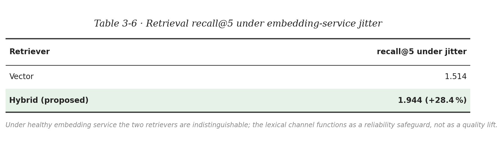

The lexical channel does not depend on the embedding service, so when the service degrades the dense channel collapses but the lexical channel retains its substring matches and carries most of the recall. The rank-fusion design therefore separates retrieval quality from retrieval reliability — the hybrid retriever acts as a reliability safeguard, not a quality lift.

#### 3.4.3 Quality Comparison

This subsection tests the §3.4 gradient prediction on two frontier-class backends under the Agent-as-Judge protocol of Zhuge et al. 2024 [40]. Following the trajectory-level evaluation recommendations of Yehudai et al. 2024 [41, §4.3] and Chang et al. [43], per-dimension Q-coverage and case-wise winning rate are reported alongside the aggregate mean to surface the structural finding the aggregate alone obscures.

**Primary backend (DeepSeek-V3, n = 12 YC cases).** On the stronger of the two backends, the two runners produce closely matched aggregate scores: `gpt-solo` averages `20.2` / 27 and `starlink` averages `20.8` / 27, a mean delta of `+0.6` points that sits within the judge's natural resolution at this sample size. Case-wise winning rates favor starlink at `8 / 12` against `3 / 12` for the baseline (`1` tied on Coursera), and a one-sided sign test on the `11` non-tied cases returns `p = 0.11` — a directional advantage that does not reach conventional significance at `n = 12`. The structural finding is sharper and lives outside the aggregate mean: starlink achieves full-9 dimension coverage on `12 / 12` cases against `0 / 12` for `gpt-solo`, and the `KEY_PARTNERSHIPS` blind spot in particular reproduces in `12 / 12` single-LLM cases and `0 / 12` multi-agent cases. Aggregate quality is comparable within noise; structural coverage is not. On a strong language model the declarative-coverage design contributes a *structural* lift — every required cell is filled — rather than a numerical mean delta.

*Table 3-7: Quality comparison across two frontier-class backends, n=12 YC cases each, same prompt and judge (deepseek-chat). Q-coverage = cases with all 9 BMC dimensions non-zero. KP-zero rate = fraction with `KEY_PARTNERSHIPS` empty (the canvas-tail blind spot).*

| Backend | Runner | Mean / 27 | Q-coverage (all-9 non-zero) | Case-wins | KP-zero rate |
|---|---|---:|:---:|---:|:---:|
| DeepSeek-V3 (strong) | gpt-solo | 20.2 | 0 / 12 | 3 / 12 | 12 / 12 |
| | starlink | 20.8 | **12 / 12** | **8 / 12** | **0 / 12** |
| MiniMax-M2.5 (mid) | gpt-solo | 8.4 | 1 / 12 | 1 / 12 | 12 / 12 |
| | starlink | **15.2** | **9 / 12** | **8 / 12** | **0 / 12** |

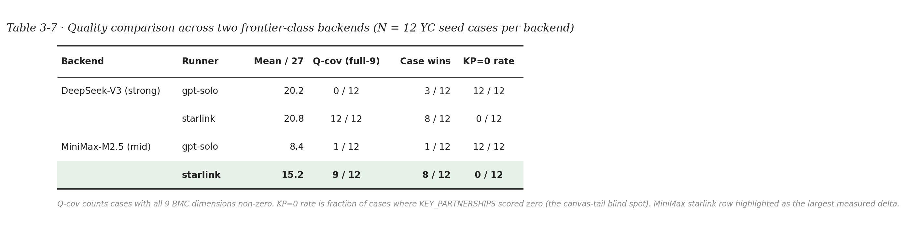

**Cross-backend gradient (MiniMax-M2.5, n = 12).** On the mid-capability backend the predicted gradient opens up. Starlink leads by `+6.8` points on aggregate mean and wins eight of twelve cases against one. The single-LLM baseline's failure mode is the canvas-tail blind spot the architecture was designed to repair: `KEY_PARTNERSHIPS`, `KEY_ACTIVITIES`, and `KEY_RESOURCES` are empty in the majority of `gpt-solo` cases (Q-coverage `1 / 12`), while the orchestration's per-agent capability binding recovers full coverage on `9 / 12` cases. Three cases (Coinbase, DoorDash, Twitch) record provider-side rate-limit cascade failures on both runners and are counted as ties. The interpretation is that the orchestration's contribution to rubric quality is a *gradient-conditional* lift that compensates more visibly when the underlying model's stochastic decoding policy under-allocates more aggressively to the BMC template tail — consistent with the coverage-repair mechanism rather than a uniform quality-multiplier.

**Discussion.** The two backends together support the coverage-repair gradient: on strong models the gap closes to within judge noise but starlink still wins more cases; on mid-capability models it opens to `+6.8` points driven by recovery of the canvas-tail dimensions the baseline systematically omits. Beyond rubric quality, the multi-agent system exposes process-layer properties the single-LLM baseline cannot exhibit by construction — observable inter-agent state, a bounded adversarial-review loop, HITL interruption hooks, and heterogeneous cost-tier dispatch. These are documented as design contributions in the architecture chapters rather than reported here as comparison dimensions, since the baseline has no analogue.

Four limitations qualify the evaluation: (i) single-family judge, no human-agreement κ; (ii) `n = 12` per backend — the case-wise sign test reaches only `p = 0.11`, so the Q-coverage finding (`12 / 12` vs `0 / 12`) is the strongest claim that survives at this sample size; (iii) scope restricted to frontier-class backends where multi-agent specialization is designed to be effective; (iv) architectural-property contributions are documented rather than benchmarked, since the single-LLM baseline cannot register on them by construction. Chapter 5 returns to these.

#### 3.4.4 Design Ablation

Three design choices admit a clean knock-out: retrieval grounding, the critic advisor, and the bounded adversarial-review loop. Toggled independently they yield five conditions — *minimal*, *no-RAG*, *no-critic*, *no-debate*, *full* — sharing the same language model, judge prompt, and six-case validator subset. The design predicts that retrieval grounding is the dominant must-cover driver (the rubric rewards specific factual concepts the retriever surfaces). The critic and debate loop are designed for conflict suppression rather than coverage, so removing either in isolation should leave the mean within noise but degrade worst-case behavior on cases where conflict-detection would have prevented a rubric violation. The data (Table 3-11) follow this signature.

*Table 3-11: Five-condition design ablation on the YC validator set (n = 6).*

| Condition | Stripe | Airbnb | Replit | Notion | Brex | Substack | Mean |
|-----------|-------:|-------:|-------:|-------:|-----:|---------:|-----:|
| minimal   |     24 |     21 |     20 |     20 |   21 |       20 | 21.00 |
| no-RAG    |     24 |     20 |     20 |     23 |   20 |       20 | 21.17 |
| full      |     23 |     21 |     21 |     23 |   23 |       20 | 21.83 |
| no-debate |     24 |     23 |     22 |     22 |   20 |       21 | 22.00 |
| no-critic |     24 |     23 |     21 |     21 |   24 |       20 | 22.17 |

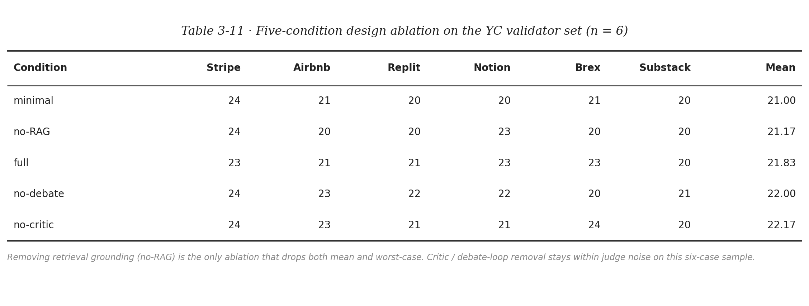

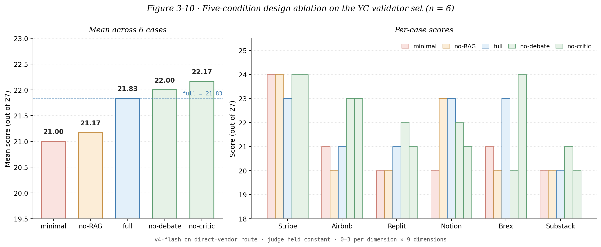
*Figure 3-10: Five-condition design ablation on the YC validator set. Only `no-RAG` drops both mean and worst-case; removing critic or debate alone stays within judge noise, consistent with their safety-not-coverage role.*

Three observations stand out. First, removing retrieval grounding drops the mean from 21.83 to 21.17 (−0.66 points, −3.0 %) and pulls the worst-case score down: this is the only ablation that hurts both ends of the distribution, consistent with the prediction that retrieval is the load-bearing channel for must-cover coverage. Second, removing the critic or the debate loop in isolation does not depress the mean on this six-case benchmark. If anything the mean nudges slightly upward (no-debate 22.00, no-critic 22.17), within the noise window of a six-case judge-scored evaluation. Third, the *minimal* condition lands at the bottom (21.00) and is dominated by every other condition, which confirms that the full pipeline is not zero-sum: each individual mechanism is replaceable at a small mean cost, but removing them all simultaneously is not.

The mid-range result for critic and debate is itself a finding. Both mechanisms target *consistency* violations rather than must-cover coverage. On a rubric that scores concept presence rather than internal consistency, their contribution is structurally invisible. The bounded ≤3-round design is therefore best read as a cost-bounded safety mechanism rather than a coverage booster — adding latency only in the worst case where conflict-suppression would otherwise have allowed a rubric violation through. A larger-scale evaluation against adversarial inputs would be the natural next step to expose the conflict-suppression contribution the current rubric does not measure.

### 3.5 Chapter Summary

This chapter presented two of the three pillars and reported the experiments that test the design. The multi-agent reasoning core realizes declarative coverage through twelve specialized agents on a shared blackboard, with a capability-bound supervisor, a bounded adversarial review loop, and a structured-output discipline at the parsing boundary. The bilingual hybrid retriever sits in support of the reasoning core, positioned as a reliability safeguard against embedding-service degradation rather than as a quality lift under healthy operation.

The experimental findings align with the design's gradient prediction: on the strong DeepSeek-V3 backend aggregate scores fall within judge resolution but single-LLM misses `KEY_PARTNERSHIPS` in `12 / 12` cases against full-9 coverage for the proposed system; on the mid-capability MiniMax-M2.5 backend the gap opens to `+6.8` aggregate points and `8 / 12` case wins. The retriever recovers most of the lost recall under jitter and is indistinguishable under healthy operation. The five-condition ablation locates retrieval as the load-bearing channel for must-cover coverage and the critic and debate loop as cost-bounded safety mechanisms.

The two gaps identified at the end of Chapter 2 — an end-to-end canvas-grounded multi-agent system with controlled evaluation, and a production recipe for structured output and hybrid retrieval under bilingual input — are addressed here. The third gap, end-user-visible multi-agent observability, is addressed in Chapter 4.

---

## CHAPTER 4: SYSTEM DESIGN AND DEVELOPMENT

This chapter details the third pillar introduced in Chapter 1 and the observability stack that exposes the coverage mechanism on the user-facing surface. It opens with the user-facing requirements that shaped the system, then describes the deployable system context — the monorepo, technology stack, persistence schema, and boot sequence — followed by the canvas-first frontend that addresses the canvas-audit question and the three-layer observability stack that addresses the user-visible-health aspect of the observability question.

### 4.1 Requirement Analysis

#### 4.1.1 Functional Requirements

1) The user can input a single business question, in Chinese or in English, and obtain an automatically generated canvas covering all nine dimensions.
2) The user can upload domain knowledge as documents in common office formats or as URLs, and can bind one or more knowledge bases to specific agents.
3) Every claim in the generated canvas is accompanied by a citation that links to the original document span, and the user can click any citation to inspect the source.
4) The user can also inspect, in reverse, every canvas cell that cites a given piece of evidence.
5) The system supports real-time streaming display of agent outputs and supports human-in-the-loop interruption and resumption of long-running conversations.
6) The user can switch between a free-form infinite canvas and a structured nine-cell grid layout for the same content.

#### 4.1.2 Non-Functional Requirements

1) The system responds to user interactions within one second on a warm path.
2) Full canvas generation completes within a small number of minutes.
3) The user interface exposes live system health without requiring manual log inspection.
4) Multi-tenant isolation is enforced at three independent layers and is verifiable from the audit log.
5) The system remains available, though at degraded retrieval quality, when external embedding services fail.
6) Continuous integration enforces zero lint warnings, full type checking, and a smoke-test suite as hard gates on every commit.

### 4.2 System Context

This section describes the deployable context of the system: the package layout, the technology stack, the persistence schema, and the boot sequence. The descriptions remain at the architectural level. Concrete library versions and configuration parameters are out of scope for the research argument. Figure 4-0 below decomposes the three-pillar overview (Figure 3-1) into five deployable layers — frontend, gateway, reasoning, knowledge, and persistence — each with a single clear runtime responsibility. The eight-hop request lifecycle (Figure 4-0b) traces one canonical interaction across these layers.


*Figure 4-0: Five-layer deployable architecture. Requests flow down. Subscription deltas flow up. Layer responsibilities are disjoint. No layer reaches across more than one boundary.*

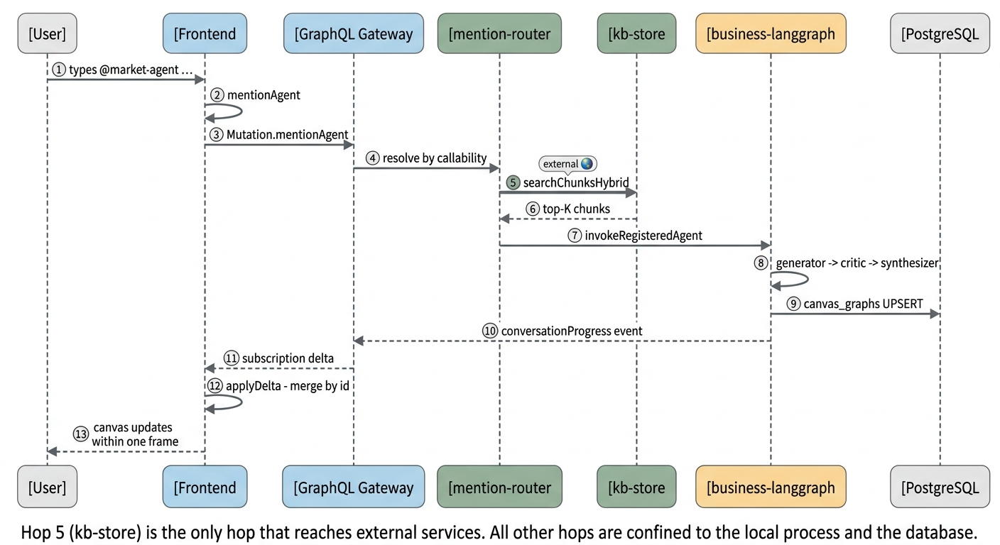
*Figure 4-0b: Eight-hop request lifecycle. Only hop 5 reaches external services (embedding API, KBs). All others stay within the local process and database.*

#### 4.2.1 Monorepo Layout and Technology Stack

The repository is organized as a workspace containing four mutually dependent packages: a canvas-based frontend, a multi-agent backend, a shared types library, and a small library of shared UI primitives. The shared types compile first. The runtime packages depend on them. There is no circular dependency. Table 4-1 enumerates the technology stack by layer.

**Table 4-1.** Technology stack by architectural layer.

| Layer         | Representative technologies                                                  |
|---------------|------------------------------------------------------------------------------|
| Frontend      | Next.js (App Router) · React 18 · React Flow (infinite canvas)               |
| UI            | Tailwind · Radix UI                                                          |
| Realtime      | GraphQL over WebSocket (subscription delta push)                             |
| Auth          | Third-party SSO                                                              |
| Backend       | Node.js · Express · Apollo Server · LangGraph                                |
| LLM providers | Multi-tier configuration (base, reasoning, reasoning-thinking)               |
| Embedding     | Commercial embedding service with deterministic local fallback               |
| Data          | PostgreSQL with vector extension · Redis (optional cache)                    |
| Deployment    | Docker Compose                                                               |
| Observability | OpenTelemetry · Prometheus-format export                                     |

#### 4.2.2 Persistence Schema

The schema groups into four functional domains across fourteen tables. Each table follows one principle (one writer, many readers), which simplifies audit logging and recovery. Figure 4-1 gives a simplified ER view.

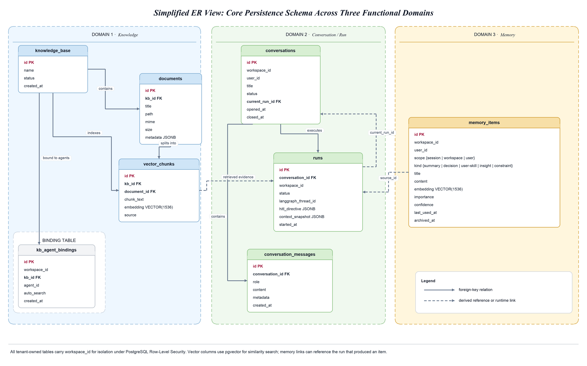
*Figure 4-1: Simplified ER view of the 14-table persistence schema. Four domains share a `workspace_id` column for tenant isolation, enforced by PostgreSQL Row Security.*

A representative optimization from a late development iteration is the introduction of a short-lived in-memory cache on workspace-metadata reads, which reduced repeated reads within the same multi-resolver request from many to one without correctness cost.

#### 4.2.3 Deployment and Boot Sequence

Deployment uses container orchestration: the database, cache, and backend services are launched together with health checks. Runtime configuration is via environment variables covering the database connection, the cache connection, model and embedding credentials, and feature flags that gate experimental paths. A separate edge layer provisions static templates and serves single-page-application fallback routing.

The boot sequence is intentionally strict (Figure 4-2).

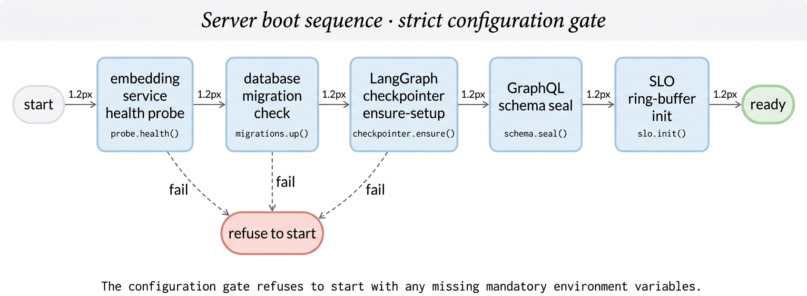
*Figure 4-2: Boot sequence. The configuration gate refuses to start with missing mandatory env vars, eliminating the "server is up but silently broken" failure mode.*

### 4.3 User-Facing Pipeline

The canvas renders declarative-coverage compliance cell by cell: each declared dimension occupies its own cell, each populated cell carries citation chips traceable to source documents, and any unsupported claim surfaces as an explicit unresolved marker rather than being silently dropped. The frontend is therefore not a separate concern from the coverage mechanism of Chapter 3 — it is the surface on which that mechanism becomes visible.

The pipeline traces six stages from one sentence to a cited canvas (one subsection each). Cross-cutting design mechanisms are factored into §4.4; the runtime observability stack follows in §4.5.

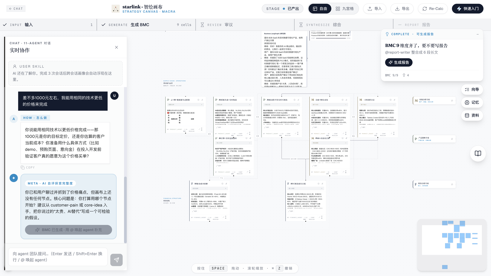
*Figure 4-3: Canvas viewport in freeform mode. The canvas is the primary work surface; chat dock, citation drawer, coach, memory, and KB tools sit as floating overlays around it.*

#### 4.3.1 Entry and Routing

The user enters through a single prompt-first surface (Figure 1-2). From there the default route is a free-form conversation with the Ideation Coach. The user may also open the knowledge-base path or explicitly invoke the optional seven-step wizard. Every route ultimately reaches the same canvas. The routes differ only in what preliminary context the canvas carries on arrival.

#### 4.3.2 Pre-Canvas: Knowledge Base and Coach

Two forms of pre-canvas context preparation are available before the supervisor's first dispatch, and they are independent: the user can use neither, either, or both. Knowledge-base ingestion prepares external evidence. The Coach helps the user clarify the business idea through conversation. Their outputs enter the first canvas dispatch through different paths: retrieval tools expose bound documents, while the conversation history carries user-confirmed context.

**Knowledge-base ingestion** exposes the four ingestion paths described earlier through a single ingestion dialog and binds the resulting KB to one or more agents. The binding is not cosmetic: it adds the KB to the bound agent's tool surface so that subsequent canvas dispatches consult the KB automatically, without an explicit retrieval call.

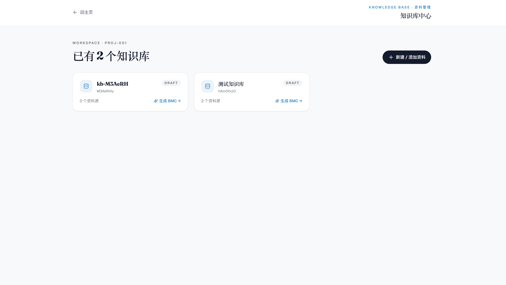
*Figure 4-3i: Knowledge-base management. Each card carries an id, source count, and a quick-action that binds the KB to a fresh canvas pipeline.*

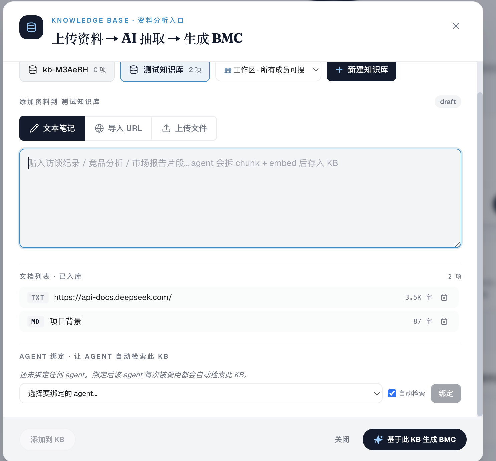
*Figure 4-3j: Knowledge ingestion + agent-binding modal. Three input tabs realise text-seed / URL-fetch / file-upload ingestion; a bottom-row toggle binds the KB to one or more agents so subsequent dispatches consult it automatically.*

**The Ideation Coach** is responsible for the earlier stage of business analysis: helping the user articulate a viable idea before any canvas dimension is generated. The Coach is implemented as a standalone reasoning service outside the LangGraph subgraph topology. Its main path is conversational because early ideation benefits from adaptive clarification rather than immediate cell generation.

The default **reflective mode** is event-driven and user-initiated. It receives a free-form canvas event or user message and returns one targeted follow-up question. The Coach reads recent dialogue, a compact canvas snapshot, dimension-coverage counts, and optional user-skill hints. It uses this context to deepen the current topic, rotate toward underexplored dimensions, avoid repeatedly probing a deflected topic, and shift from ideation to canvas inspection after BMC cells appear.

The **wizard mode** is an optional user-invoked fallback for users who prefer a predictable input path. It walks the user through seven fixed steps: core idea, customer pain, value angle, hypothesis, validation, revenue, and risk. A companion prefill component performs hybrid retrieval against bound knowledge bases and proposes answers where existing evidence covers a step. The user can accept, edit, or reject each proposal. At completion, the confirmed answers are serialized into a seven-part seed prompt for the multi-agent canvas pipeline. They are treated as user-confirmed assumptions and observations rather than external facts.

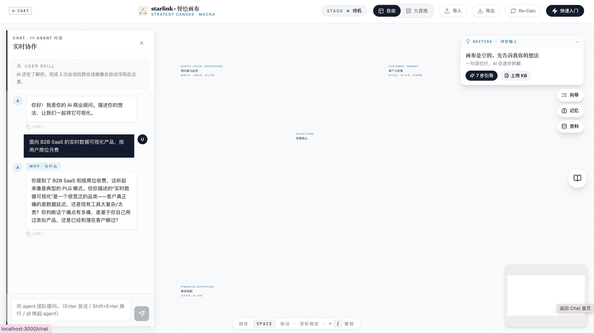
*Figure 4-4b: Coach reflective mode on an empty canvas. The chat dock surfaces a Socratic scaffold conditioned on cross-conversation user-skill traits; the top-right card offers entries into the wizard and knowledge-upload paths.*

The two modes hand off to the canvas core through the conversation boundary. In the default reflective path, accumulated exchanges provide context for later dispatch. In the optional wizard path, the seven confirmed answers are embedded in the seed prompt that starts the canvas pipeline. External evidence remains distinguishable from user assumptions and system inference. The Coach therefore improves the starting context without changing the downstream dimension checks.

#### 4.3.3 Canvas Dispatch

Once the user commits an idea, the supervisor's first dispatch fires. The fan-out itself is described in Algorithm 1 (lines 5–8). The user only sees its macro-state on the canvas (Figure 4-5). The dispatch runs without further user input until the canvas-render stage begins.

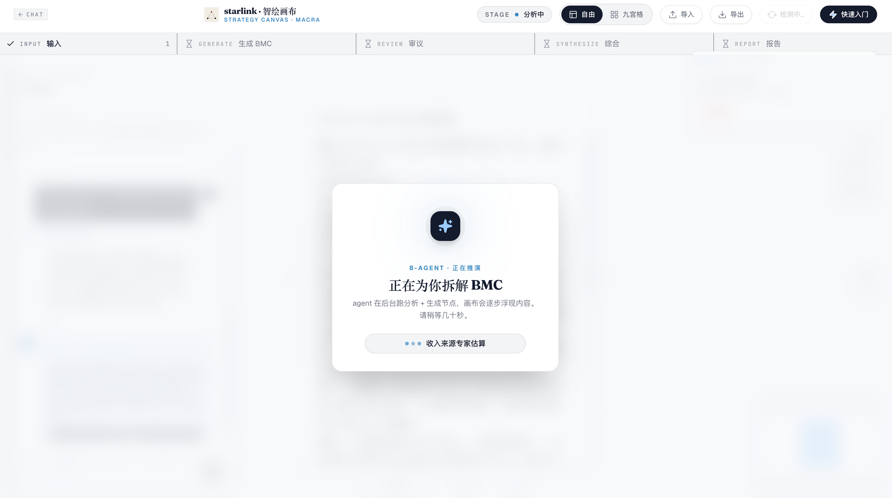
*Figure 4-5: Live state of the canvas during the parallel-fan-out phase. The macro-phase strip and centre modal report the count of concurrently executing agent subgraphs and surface generator-completion events as they arrive.*

A manual-override path is provided through the `@`-mention agent registry on the chat input (Figure 4-3g). The registry surfaces the four functional bands of Table 3-1 as keyboard-accessible autocomplete, letting the user call a specific agent directly — for instance, `@deep-research` for a single cell's evidence, or `@report-writer` to trigger the report stage explicitly.

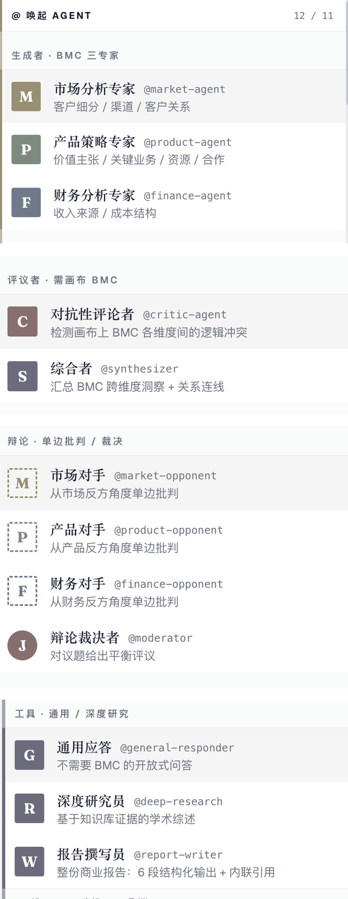
*Figure 4-3g: Agent registry exposed via the chat-dock `@` autocomplete. The four functional bands of Table 3-1 (generators, advisors, debate-side opponents, utilities) appear as keyboard-selectable agents.*

#### 4.3.4 Canvas Rendering

Generator outputs land as cards on the canvas (Figure 4-4a). The grid is declarative-coverage compliance made visible — the closed-canvas-tail finding in rendered form — and each card carries a byline footer naming its generator, so the capability bindings of Table 3-1 are traceable at the cell level rather than only at the agent registry.

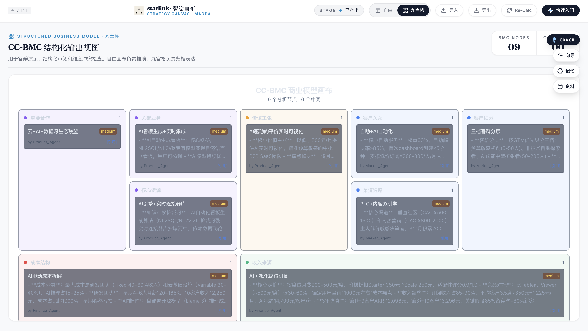
*Figure 4-4a: Populated nine-cell BMC grid from a complete pipeline run. Each card carries a generator byline; the node-count and conflict-count counters in the sub-header are the rendered form of the closed-canvas-tail finding.*

The in-grid card is a summary view. Each cell can be expanded into a per-cell detail drawer (Figure 4-3f) carrying the long-form `analyze`-action output that the summary card abbreviates. The drawer is the destination for cell-level review and editing.

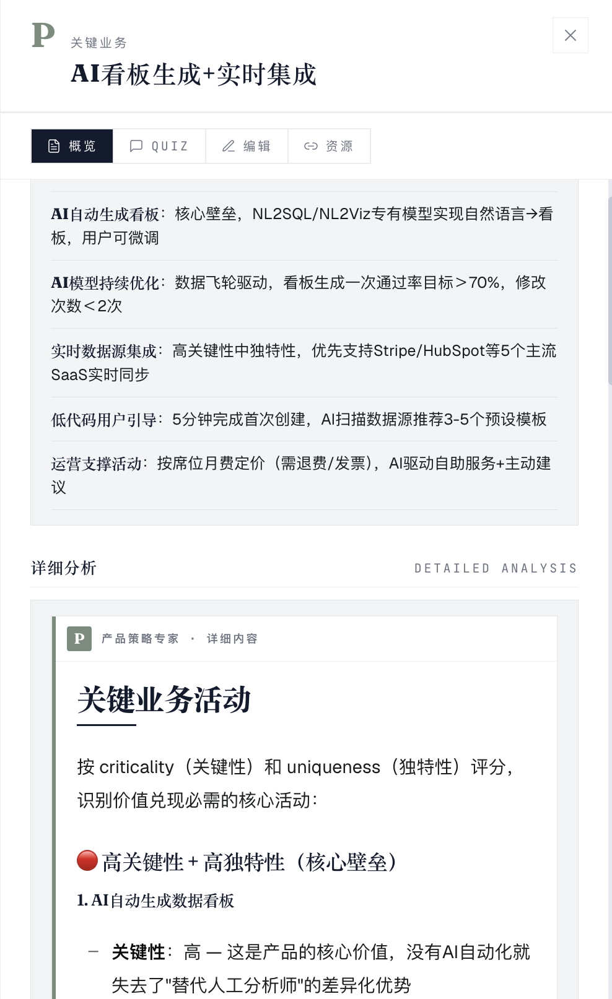
*Figure 4-3f: Per-cell detail drawer expanded on one BMC card. The body is the full analyst-grade rendering of the cell's bound generator output, with sub-sections from the typed action-verb output.*

#### 4.3.5 Report and Typed Citations

Once the canvas is populated, a session-summary card on the viewport surfaces the typed-citation counters in compact form and recommends `@report-writer` as the next dispatch (Figure 4-4c). The report-writer is dispatched on explicit user invocation rather than as a default tail of the canvas pipeline. It reads the full blackboard — the nine populated BMC cells, the critic's conflict log, the synthesizer's cross-cell insights, the supervisor trace, and any KB chunks the generators cited — and emits an eight-section investor-grade Markdown report (Executive Summary, Market, Product, Finance, Cross-Dimensional Analysis, Risk, Recommendation, Conclusion), typically 3,500–6,000 Chinese characters in length. Critic-flagged conflicts of medium or high severity are surfaced as their own subsection of Risk, so the report exposes the system's internal disagreements rather than smoothing them over. The output renders into a `report-card` primitive on the canvas that expands into a long-form document drawer for focused reading (Figure 4-3e).

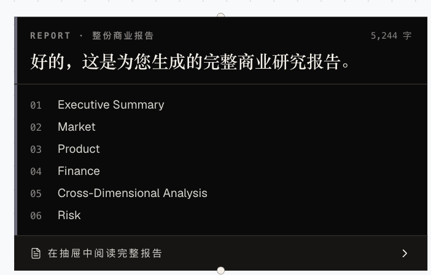
*Figure 4-4c: Report summary card produced by the report-writer. The eight-section TOC previews the long-form output; the in-card button opens the document drawer (Figure 4-3e).*


*Figure 4-3e: Report drawer surfacing the full report-writer output. The left rail is the section TOC; the right pane renders each section with the typed citation tokens of Figure 4-3k inline.*

The report body uses five typed-citation token classes inline (Figure 4-3k): the four canonical classes of Table 3-3 — `[[ref:docId#chunkId]]` for documentary evidence, `[[bmc:dimension]]` for structural references to populated canvas cells, `[[critic:conflictId]]` for critic-flagged conflicts, and `[[insight:nodeId]]` for synthesizer insights — plus a fifth report-internal marker, `[[no-ref]]`, used to flag claims the agent is offering as its own inference rather than retrieved evidence. The first four resolve to interactive chips that route the click into the corresponding canvas element through the chip-click mechanism described later. The `[[no-ref]]` marker renders as a non-interactive grey footnote, making the agent's epistemic posture legible without forcing every claim into a fictitious citation. The typed-citation taxonomy of Table 3-3 therefore ends up on the page as actual content rather than as an abstract claim.

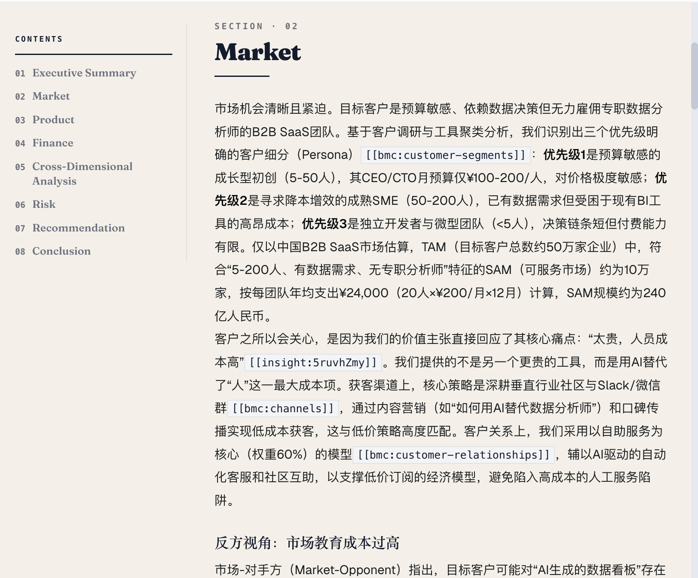
*Figure 4-3k: Typed citation tokens (`[[bmc:...]]`, `[[insight:...]]`, `[[ref:...]]`) rendered as clickable chips inline in the report body — the user-visible side of the typed-citation taxonomy.*

#### 4.3.6 Memory Persistence

At session close, the consolidate step promotes the trace into the long-term memory layer. The memory panel (Figure 4-3h) surfaces the three scopes and the kind axis of the memory model, together with per-item importance-and-confidence scores — bringing the memory model out from the backend and into the user's working surface.

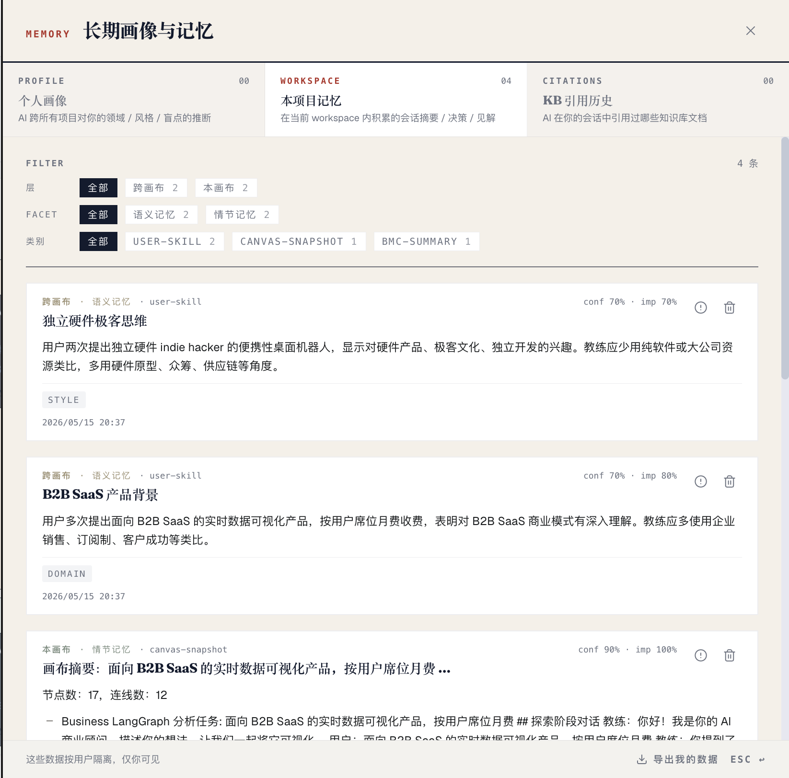
*Figure 4-3h: Memory panel. Three columns split user-scoped traits, workspace notes, and cited evidence; each item carries `conf` and `imp` scores, surfacing the importance-and-confidence model directly to the user.*

User-skill items are additionally exposed with explicit accept/reject feedback affordances (Figure 4-3l), so the user can reinforce or reject each inferred trait. The feedback signal is the explicit input to the confidence-decay mechanism — without it, the mechanism would have to rely on indirect signals such as re-use rate alone. The next session in the same workspace reads these items at supervisor-initialisation time, which is what makes Starlink behave differently for users it has previously seen.

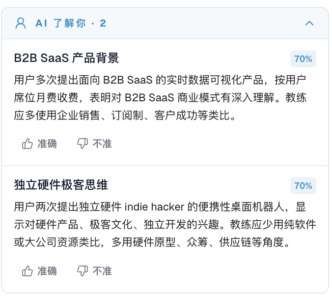
*Figure 4-3l: User-skill detail card. Each inferred trait carries a confidence score and an accept/reject feedback pair — the explicit reinforcement input to the confidence-decay mechanism.*

#### 4.3.7 Utility Agents Beyond the Canvas

Band 5 of Table 3-1 lists three utility agents that share the LangGraph topology with the canvas pipeline but do not write into canvas slots. Each is dispatched by the supervisor on an intent class that does not require BMC coverage, so they bypass the declarative-coverage machinery and run as one-round generators with their own structured-output contract. The report-writer, already detailed above, is the third of these. This subsection covers the other two.

**General responder.** Dispatched when the supervisor classifies the intent as free-form Q&A on an existing workspace — for example, a follow-up on a populated canvas cell or a side question against the bound knowledge bases. The general-responder is the in-LangGraph counterpart of the Ideation Coach: the Coach runs *outside* the LangGraph topology and *before* the canvas exists, while the general-responder runs *inside* the topology and *after* the canvas has been populated, reaching into the workspace's bound knowledge bases through its four-tool surface — `web-search`, `knowledge-base`, `memory-search`, `url-fetch`. Output is a short Markdown answer bounded at roughly 1,200 tokens with inline `[source]` annotations that route to the corresponding tool result.

**Deep researcher.** Dispatched by an explicit `@deep-research` mention or by the supervisor's intent classifier on extended-analysis requests (deep-dive or topic investigation). It shares the four-tool surface with the general-responder but emits a fixed two-section structured response: a *core conclusion* (1–3 sentences carrying the load-bearing judgment) followed by a *detailed analysis* (3–5 paragraphs of 80–200 Chinese characters each). Every claim is required to carry either a `[[ref:docId#chunkId]]` token or an explicit `[[no-ref]]` marker — the same citation discipline as the report-writer, applied at paragraph granularity rather than at section granularity. The fixed structure and citation discipline together make deep-research closer to a structured-summary generator than to a chat agent. It is the agent invoked when a user wants a researcher's answer rather than a chat partner's answer.

The three utility agents are therefore three distinct *structured output formats* against the same blackboard, not three flavors of free-form chat. None declares per-dimension capabilities, so none runs the coverage check or mutates canvas slots. Each reads the blackboard, runs its own tool-augmented reasoning, and emits a fresh structured artifact at the end.

**Adjacent pipelines (out of scope).** Four further user-facing pipelines run alongside but with weaker coupling to the canvas pipeline: an alternative orchestration loop that bypasses the supervisor, a cultural-simulations module for cross-cultural negotiation scenarios, a quiz-generation pipeline that produces review questions from any canvas node, and a translation service for bilingual content transformation. All four are standalone, do not write into the blackboard, and are out of scope for the empirical evaluation.

### 4.4 Design Mechanisms

The pipeline stages above rely on a set of cross-cutting design mechanisms — the visual identity, the dual-mode layout, the streaming merge under load, the layered floating UI, and the chip-click audit loop. This section pulls these out of any single stage and treats them as the design-level properties they are.

#### 4.4.1 Four Design Tensions

Four design tensions surfaced during early prototyping. The design decisions that follow respond to each.

1. *Structured semantics versus free arrangement.* The canvas is a fixed nine-cell semantic structure, but users prefer to arrange cards freely (for example, to compare several candidate value propositions side by side). This is resolved by supporting two view modes on the same content.
2. *Many agents writing into one viewport.* Multiple agents emit content into the canvas concurrently. Automatic layout must keep their output legible without erasing arrangements the user has already made.
3. *Streaming layout stability.* Streaming generation must not trigger a full re-layout on every incremental update. Updates must complete within a single frame budget.
4. *Layered floating UI.* Cells, edges, citation chips, drawers, the chat dock, modals, and the health indicator all coexist on a single viewport. Stacking order and anti-overlap rules must be deterministic.

#### 4.4.2 Editorial Boardroom Design Language

The visual identity is intentionally distinct from the prevailing AI-product aesthetic — a strategic-consulting boardroom rather than a chat interface. The system is realised as a small set of design tokens: a serif display face, a humanist sans body, a monospace face for numbers and identifiers, and an ink-on-paper palette with five tonal steps plus a single saturated accent. Five hard rules govern its uniform application:

1. *Borders, not soft shadows* — hierarchy through line weight, not blur or elevation.
2. *Monospaced kickers* for short uppercase region labels.
3. *Tabular numerals throughout*, so live-updating tables stay column-aligned.
4. *No gradients, no backdrop blur, no large corner radii* — common signals of generic generative-AI products.
5. *No prevailing-AI-product typefaces, no purple-gradient glassmorphism* — the two strongest markers of the chatbot aesthetic.

The result reads more like a print page than a chat panel. The single saturated accent is reserved for moments that genuinely demand the user's attention (a high-severity critic conflict, a human-in-the-loop blocking prompt).

#### 4.4.3 Dual-Mode Canvas and Visual Primitives

Two view modes share a single viewport — a freeform infinite canvas for divergent exploration, and a strict nine-cell grid for structured presentation. The same nodes are shared between modes. The toggle just swaps the layout strategy. In informal user observations, the freeform mode is preferred during exploration, the grid mode when presenting finished work.

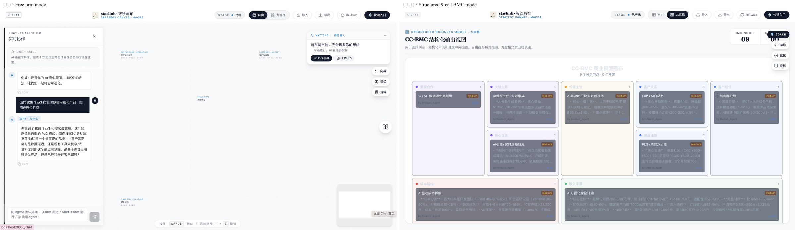
*Figure 4-3b: Dual-mode canvas on a single workspace. Left: freeform mode for divergent exploration (auto-layout). Right: structured nine-cell BMC mode for presentation. The same nodes are preserved across the toggle.*

The visual primitive set consists of nine node types (one per BMC cell, plus agent-avatar, insight-note, plan-node, canvas-note, data-source, report-card, conflict-alert, and canvas-image) and five edge classes (structural, conflict, suggestion, dependency, data-flow). Each class carries its own visual treatment, so a reader can identify the nature of any connection on the canvas without selecting it.

#### 4.4.4 Streaming Delta Merge and Floating UI

The hot path for streaming updates is a delta merge that combines incoming nodes with the current viewport state by identity. The merge completes within a single frame budget on viewports holding a typical canvas of a few hundred to a thousand nodes. A defensive variant of the merge protects against a transient subscription delivering an inconsistent snapshot: when an incoming snapshot has fewer nodes than the current state, it is treated as a union rather than as a replacement.

Eight floating components share the viewport: the chat dock, the citation panel, the per-cell detail drawer (Figure 4-3f), the ideation coach (Figure 4-4b), the agent-health indicator, the action bar, the knowledge-upload modal (Figure 4-3j), and the evidence drawer. Three anti-overlap mechanisms keep the viewport readable. When the citation panel opens, the coach column shifts to make room. When the viewport falls below a desktop-width threshold, the chat dock and the citation panel become mutually exclusive. Stacking order is layered so that critic-flagged conflict edges always float above the cells they relate.

#### 4.4.5 Citation as Interaction

A citation that an agent emits inline as a typed token is parsed into structured metadata, persisted with the canvas node, rendered as a clickable chip, and resolved on click back to the original passage in an evidence drawer. A defensive fallback covers the case where the local evidence cache misses, falling back to a live database lookup rather than showing an "evidence unavailable" placeholder. A reverse-lookup query closes the audit loop in the other direction: from any cited passage, the user can enumerate every canvas node that cites it.

The same citation token is therefore a single artifact threaded through the entire system — emitted, parsed, persisted, rendered, clicked — and the auditability claim of contribution C3 reduces to the requirement that this thread holds without breaks. The canvas itself is the audit surface. No separate explanation panel is needed.

### 4.5 Runtime Observability

The runtime observability stack is the operational counterpart of the declarative-coverage mechanism. It is what makes coverage continuously verifiable rather than merely declared once at startup. The stack is layered along three telemetry axes, supplemented by two on-canvas surfaces — the workflow stage strip and the per-agent runtime panel — that surface phase and per-agent state directly in the user's working environment.

#### 4.5.1 Three-Layer SLO Stack

Every declared capability has a corresponding telemetry stream at the tool layer. Every agent that holds such a capability has a corresponding stream at the subgraph layer. Every user interaction that should exercise a set of declared capabilities has a corresponding stream at the mention layer. An unexercised capability therefore produces an immediately visible anomaly somewhere in the stack.

The three nested granularities are:

```
Layer       Window           Question answered
tool        bounded recent   Which tool call is slow?
subgraph    bounded recent   Which agent invocation is slow?
mention     bounded recent   Which user interaction is slow?
```

Each layer maintains a bounded ring buffer of recent calls. An elevated error rate trips a degraded flag that propagates to the frontend health indicator. Error fingerprinting follows industry-standard conventions, grouping recurring failures so that a single root cause does not appear as many independent errors. Metrics are exported in two parallel formats to support different downstream tooling.

The motivation for three layers rather than one is operational. A flat per-call histogram answers whether the system is slow but does not answer which call, inside which agent, inside which user intent, is slow. Three layers allow an on-call engineer to drill from a user-reported slowness report to the user-mention layer, then to the subgraph layer, then to the tool layer, in a small number of steps. The agent-health indicator on the canvas surfaces this state to the end user at a regular cadence, with click-to-expand details for each agent. The motivation is straightforward: a slow agent should not be visually indistinguishable from a frozen interface.

Each dispatch row in the execution timeline is one event in this stack: agent identifier, elapsed time, one-line task description (Figure 4-3c). The same data structure powers the LangGraph checkpointer's replay capability — any past step can be reconstructed from the timeline alone.


*Figure 4-3c: One dispatch row from the streaming execution timeline. Each row carries an agent identifier, elapsed time, and a one-line task description; the same event is recoverable from the LangGraph checkpointer for replay.*

<!-- SCREENSHOT PENDING (required): Figure 4-4 · Agent-health indicator, click-expanded. Source: the AgentHealth chip rendered on the canvas viewport (apps/web/src/features/workspace/components/canvas-viewport.tsx and any agent-health overlay component). Recommended capture: 600×500 region showing the chip in the expanded state with at least 4-5 agents listed (supervisor, market-agent, product-agent, finance-agent, critic), each row showing p50 / p95 / error-rate / sample-count in monospace numerals. Filename: figures/screenshot-agent-health.png. Caption: "Figure 4-4: The agent-health indicator on the canvas, click-expanded to show per-agent telemetry (p50, p95, error rate, sample count). The same data structure feeds the three-layer SLO drill-down described above, so the surface on the canvas is the same data the operator sees in the observability console." -->

#### 4.5.2 Workflow Stage Strip

A five-stage horizontal strip pinned at the top of the canvas viewport surfaces the current macro-phase of the pipeline: `input`, `generate`, `review`, `synthesize`, `report`. Each stage carries a count badge populated from the current blackboard slot — `generate · 9 cells` after the three generators have written, `report · 2 reports` after the report-writer has emitted — so the user can see at a glance whether the present moment is producing canvas content, debating a conflict, or composing the final write-up. The derivation function is a pure projection over the workspace store snapshot, with no DOM access and no React hooks in the function body, which makes the strip's content unit-testable in isolation from rendering. The strip is the answer to the macro-phase question — "what is the pipeline doing right now?" — that the SLO stack's three layers do not by themselves answer.

#### 4.5.3 Per-Agent Runtime Panel

The agent-health indicator reports which agent's tools are slow or failing. A second on-canvas surface — a per-agent runtime panel, expandable as a sibling of the health chip — answers the complementary question of *what each agent contributed to the canvas*. It surfaces per-agent node counts, contribution timelines, and the workflow stage in which each agent's outputs landed. The panel and the health chip together cover the per-agent granularity from two angles: liveness (latency, errors) on one side, productivity (contributed nodes, contributed stage) on the other. The two macro surfaces (stage strip, runtime panel) and the three SLO layers (mention, subgraph, tool) together let an observer drill from "what is the pipeline doing right now?" to "what is each agent doing right now?" to "which tool call inside which agent is degraded?", without leaving the canvas.

### 4.6 Chapter Summary

This chapter presented the third pillar — the user-facing pipeline and its runtime observability — which is the surface on which the declarative-coverage mechanism becomes visible. Six functional and six non-functional requirements anchored the deployable context (a four-package monorepo, fourteen-table persistence schema, eight-hop request lifecycle). The user-facing pipeline was traced through six stages, from one-sentence entry to long-term memory persistence, and the cross-cutting design mechanisms — editorial-boardroom visual identity, dual-mode layout, streaming delta merge, layered floating UI, chip-click audit loop — were factored out so no stage repeats them. The runtime observability stack closed the chapter as three telemetry layers and two on-canvas drill-down surfaces, making any unexercised or failing capability a visible anomaly without manual log inspection.

---

## CHAPTER 5: CONCLUSION AND FUTURE WORK

### 5.1 Conclusion

This work designed and implemented Starlink, an end-to-end multi-agent workspace for business-canvas generation governed by a single principle — *declarative coverage*. When an artifact has a fixed set of dimensions that must all be produced, the principle holds that coverage should be enforced by capability declaration at system start-up rather than by the language model's attention during a single forward pass. The response to silent dimension omission is not stronger prompting; it is a mechanism that makes omission impossible.

The delivered system has three co-equal pillars and a three-layer observability stack. The multi-agent reasoning core realizes declarative coverage via supervisor routing, a shared blackboard, and a bounded adversarial review loop. The bilingual hybrid retrieval layer keeps each claim grounded even when the upstream embedding service degrades. The canvas-first interaction surface places artifact, evidence, and runtime health on a single workspace, with provenance traceable in both directions. The observability stack surfaces, at three nested granularities, which declared capabilities each agent is exercising — making the coverage mechanism a live signal on the canvas rather than a log-only invariant.

The empirical findings track the design's gradient prediction. On DeepSeek-V3 the aggregate rubric gap is within judge resolution (20.2 vs 20.8), but the single-LLM baseline leaves `KEY_PARTNERSHIPS` empty in `12 / 12` cases while the proposed system fills every cell. On MiniMax-M2.5 the gap widens to +6.8 aggregate points and 8 / 12 case-wise wins. Under embedding-service jitter the hybrid retriever recovers most of the lost recall. The experiments are evidence that the design works as predicted, not the source of the design argument.

Two observations close the work. First, on dimension coverage: per-dimension *quality* is often comparable to single-LLM; the difference is whether each dimension is attempted at all. For structured artifacts with known coverage contracts, *coverage by declaration rather than by attention* is the central analytical contribution of multi-agent orchestration here. Second, on interaction: as the implementation matured the canvas became the sole user-facing surface, with chat, evidence, wizard, knowledge management, and system health rendered as overlays. For domains where the analytical artifact is itself spatial and structured, a canvas-centered interface appears more natural than a stack of chat, dashboard, and report views.

Limitations are acknowledged. Streaming is section-level rather than token-level. Observability window state is process-local in multi-replica deployments. Multi-tenant isolation uses row-level security without row-level encryption. The case corpus is narrow (primarily software, SaaS, fintech) and the user study is small. The judge is single-family with no human-agreement κ on a subsample, and the empirical scope covers only two frontier-class backends. Broader cross-family and sub-frontier replication remain future work.

### 5.2 Future Work

Five concrete directions follow from the limitations above.

First, **token-level streaming** through an incremental citation parser would enable character-by-character rendering of canvas cards, removing a perceptual gap during long generations. The current parser expects complete strings. An incremental variant is non-trivial but tractable.

Second, **cross-lingual retrieval** beyond Chinese–English is the next natural step. The lexical tokenizer extends to other CJK scripts with modest adjustment, and the minimum-length parameter for Latin words is locale-specific and would benefit from per-locale tuning.

Third, **online agent reconfiguration** would allow prompt and capability edits to take effect without restarting the server, materially shortening the iteration loop for prompt engineering and capability tuning.

Fourth, **distillation through preference-based fine-tuning** using the evaluation protocol's scores as a reward signal would compress the multi-agent ensemble into a smaller specialist model that approximates the system's quality at lower latency, a potentially significant deployment improvement.

Fifth, **multi-user collaboration on the canvas** through conflict-free replicated data structures would allow several users to edit the analytical artifact concurrently. This direction is expected to surface a new class of design questions around concurrent agent invocations and conflict resolution between two users editing the same canvas cell while an agent rewrites it.

Two larger research directions are also identified. *Cross-LLM-family replication* (running the twelve-case benchmark on Claude, GPT, Gemini, and Llama variants) would strengthen the external validity of the `KEY_PARTNERSHIPS` finding. *Larger and more diverse corpora* (hardware companies, direct-to-consumer retail, B2B enterprise, deeptech) would test whether the dimension-coverage-blind-spot pattern generalizes beyond the software/SaaS/fintech sectors of the present study.

---

## REFERENCE

[1] A. Osterwalder and Y. Pigneur. *Business Model Generation: A Handbook for Visionaries, Game Changers, and Challengers.* John Wiley & Sons, 2010.

[2] CB Insights. *The Top 12 Reasons Startups Fail.* 2023.

[3] S. Yao, D. Yu, J. Zhao, et al. Tree of thoughts: deliberate problem solving with large language models. In *Advances in Neural Information Processing Systems (NeurIPS)*, volume 36, pages 11809–11822, 2023.

[4] X. Wang, J. Wei, D. Schuurmans, et al. Self-consistency improves chain of thought reasoning in language models. In *International Conference on Learning Representations (ICLR)*, 2023.

[5] D. Arnott and G. Pervan. A critical analysis of decision support systems research revisited: the rise of design science. *Journal of Information Technology*, 29(4):269–293, 2014.

[6] Organizational dashboard adoption study. *Decision Support Systems*, 2024.

[7] D. Sjödin, V. Parida, M. Palmié, and J. Wincent. How AI capabilities enable business model innovation: scaling AI through co-evolutionary processes and feedback loops. *Journal of Business Research*, 134:574–587, 2021.

[8] W. X. Zhao, K. Zhou, J. Li, et al. A survey of large language models. *arXiv preprint arXiv:2303.18223*, 2023.

[9] J. Huang and K. C.-C. Chang. Towards reasoning in large language models: a survey. In *Findings of the Association for Computational Linguistics: ACL 2023*, pages 1049–1065, 2023.

[10] A. Kühn, R. Joppen, F. Reinhart, et al. Analytics canvas: a framework for the design and specification of data analytics projects. *Procedia CIRP*, 70:162–167, 2018.

[11] M. Panzner, M. Meyer, S. von Enzberg, et al. Business-to-analytics canvas: translation of product planning-related business use cases into concrete data analytics tasks. *Procedia CIRP*, 109:580–585, 2022.

[12] A. Barredo Arrieta, N. Díaz-Rodríguez, J. Del Ser, et al. Explainable artificial intelligence (XAI): concepts, taxonomies, opportunities and challenges toward responsible AI. *Information Fusion*, 58:82–115, 2020.

[13] E. Kostopoulos, T. Spyrou, and G. Kakarontzas. Explainable artificial intelligence-based decision support systems: a recent review. *Information*, 15(11):706, 2024.

[14] M. Krumdick, R. Koncel-Kedziorski, V. Lai, et al. BizBench: a quantitative reasoning benchmark for business and finance. In *Proceedings of the 62nd Annual Meeting of the Association for Computational Linguistics (ACL)*, pages 8590–8617, 2024.

[15] P. Islam, A. Kannappan, D. Kiela, et al. FinanceBench: a new benchmark for financial question answering. *arXiv preprint arXiv:2311.11944*, 2023.

[16] Z. Tang, X. Wang, T. Chen, et al. FinanceReasoning: benchmarking financial numerical reasoning more credible, comprehensive and challenging. In *Proceedings of the 63rd Annual Meeting of the Association for Computational Linguistics (ACL)*, 2025.

[17] J. Wei, X. Wang, D. Schuurmans, et al. Chain-of-thought prompting elicits reasoning in large language models. In *Advances in Neural Information Processing Systems (NeurIPS)*, volume 35, pages 24824–24837, 2022.

[18] M. Besta, N. Blach, A. Kubicek, et al. Graph of thoughts: solving elaborate problems with large language models. In *Proceedings of the AAAI Conference on Artificial Intelligence*, volume 38, pages 17682–17690, 2024.

[19] S. Yao, J. Zhao, D. Yu, et al. ReAct: synergizing reasoning and acting in language models. In *International Conference on Learning Representations (ICLR)*, 2023.

[20] N. Shinn, F. Cassano, A. Gopinath, et al. Reflexion: language agents with verbal reinforcement learning. In *Advances in Neural Information Processing Systems (NeurIPS)*, volume 36, pages 8634–8652, 2023.

[21] L. Huang, W. Yu, W. Ma, et al. A survey on hallucination in large language models: principles, taxonomy, challenges, and open questions. *ACM Transactions on Information Systems*, 43(2):1–55, 2025.

[22] Y. Liu, Y. Yao, J.-F. Ton, et al. Trustworthy LLMs: a survey and guideline for evaluating large language models' alignment. *arXiv preprint arXiv:2308.05374*, 2023.

[23] T. Guo, X. Chen, Y. Wang, et al. Large language model based multi-agents: a survey of progress and challenges. In *Proceedings of the 33rd International Joint Conference on Artificial Intelligence (IJCAI)*, pages 8048–8057, 2024.

[24] J. Luo, W. Zhang, Y. Yuan, et al. Large language model agent: a survey on methodology, applications and challenges. *arXiv preprint arXiv:2503.21460*, 2025.

[25] G. Li, H. Hammoud, H. Itani, et al. CAMEL: communicative agents for "mind" exploration of large language model society. In *Advances in Neural Information Processing Systems (NeurIPS)*, volume 36, pages 51991–52008, 2023.

[26] Q. Wu, G. Bansal, J. Zhang, et al. AutoGen: enabling next-gen LLM applications via multi-agent conversations. In *First Conference on Language Modeling (COLM)*, 2024.

[27] S. Hong, M. Zhuge, J. Chen, et al. MetaGPT: meta programming for a multi-agent collaborative framework. In *International Conference on Learning Representations (ICLR)*, 2024.

[28] A. Fourney, G. Bansal, H. Mozannar, et al. Magentic-One: a generalist multi-agent system for solving complex tasks. *arXiv preprint arXiv:2411.04468*, 2024.

[29] L. Luo, D. P. Pan, J. Zhu, M. Zhou, and P. Hui. Meflex: a multi-agent scaffolding system for entrepreneurial ideation iteration via nonlinear business plan writing. *arXiv preprint arXiv:2602.15631*, 2026.

[30] A. Amirkhani and A. H. Barshooi. Consensus in multi-agent systems: a review. *Artificial Intelligence Review*, 55(5):3897–3935, 2022.

[31] P. Lewis, E. Perez, A. Piktus, et al. Retrieval-augmented generation for knowledge-intensive NLP tasks. In *Advances in Neural Information Processing Systems (NeurIPS)*, volume 33, pages 9459–9474, 2020.

[32] Y. Gao, Y. Xiong, X. Gao, et al. Retrieval-augmented generation for large language models: a survey. *arXiv preprint arXiv:2312.10997*, 2023.

[33] H. Yu, A. Gan, K. Zhang, et al. Evaluation of retrieval-augmented generation: a survey. In *CCF Conference on Big Data*, pages 102–120. Springer, 2024.

[34] A. Singh, A. Ehtesham, S. Kumar, et al. Agentic retrieval-augmented generation: a survey on agentic RAG. *arXiv preprint arXiv:2501.09136*, 2025.

[35] G. V. Cormack, C. L. A. Clarke, and S. Büttcher. Reciprocal rank fusion outperforms condorcet and individual rank learning methods. In *Proceedings of the 32nd International ACM SIGIR Conference on Research and Development in Information Retrieval*, pages 758–759, 2009.

[36] J. Z. Pan, S. Razniewski, J.-C. Kalo, et al. Large language models and knowledge graphs: opportunities and challenges. *Transactions on Graph Data and Knowledge*, 1(1):2:1–2:38, 2023.

[37] S. Ibrahim, A. Hamdy, and E. Selim. A survey on augmenting knowledge graphs with large language models. *Journal of Big Data*, 11(1):169, 2024.

[38] J. J. Thomas and K. A. Cook. A visual analytics agenda. *IEEE Computer Graphics and Applications*, 26(1):10–13, 2006.

[39] J. Wang, S. Liu, and W. Zhang. Visual analytics for machine learning: a data perspective survey. *IEEE Transactions on Visualization and Computer Graphics*, 30(12):7637–7656, 2024.

[40] R. Luera, R. A. Rossi, A. Siu, et al. Survey of user interface design and interaction techniques in generative AI applications. *arXiv preprint arXiv:2410.22370*, 2024.

[41] A. Yehudai, L. Eden, A. Li, et al. Survey on evaluation of LLM-based agents. *arXiv preprint arXiv:2503.16416*, 2025.

[42] C. Qu, S. Dai, X. Wei, et al. Tool learning with large language models: a survey. *Frontiers of Computer Science*, 19(8):198343, 2025.

[43] Y. Chang, X. Wang, J. Wang, et al. A survey on evaluation of large language models. *ACM Transactions on Intelligent Systems and Technology*, 15(3):1–45, 2024.
## ACKNOWLEDGMENT

The author wishes to thank the advisors and reviewers who patiently read earlier drafts and pushed back on the central framing of this work, in particular on the framing of the bilingual hybrid retriever as a *reliability* safeguard rather than a quality lift. The author thanks the contributors to the open-source ecosystem on which Starlink rests (LangGraph, React Flow, pgvector, DeepSeek, and many others). Finally, the author thanks the early-stage founders who informally tested the system on their own business questions and provided the candid feedback that shaped the canvas-first design choice. All errors and remaining infelicities are the author's own.

---

## Figures

- **Figure 1-1**, Workflow comparison: single-LLM vs Starlink
- **Figure 2-1**, Three broad generations of business decision-support systems
- **Figure 2-A**, MetaGPT system overview, from Hong et al. [27]
- **Figure 2-2**, Five multi-agent frameworks ordered by coverage-enforcement strategy
- **Figure 2-B**, Three RAG paradigms, from Gao et al. [32]
- **Figure 3-1**, Three-pillar overview of Starlink
- **Figure 4-0**, Five-layer deployable architecture
- **Figure 4-0b**, Eight-hop request lifecycle
- **Figure 3-3**, Twelve-agent topology
- **Figure 3-4**, Tool registry and agent–tool bindings
- **Figure 3-5**, Supervisor routing flowchart
- **Figure 3-6**, Adversarial debate, one round
- **Figure 3-7**, Citation lifecycle
- **Figure 3-8**, Hybrid retrieval pipeline
- **Figure 3-9**, Per-case YC results, head-to-head
- **Figure 3-10**, Five-condition design ablation, mean and per-case
- **Figure 4-1**, 14-table persistence ER
- **Figure 4-2**, Server boot sequence
- **Figure 4-3**, Canvas viewport with floating overlays
- **Figure 4-3b**, Dual-mode canvas: grid vs free-form
- **Figure 4-3c**, Streaming execution timeline event
- **Figure 4-3e**, Report drawer with typed citation chips
- **Figure 4-3f**, Per-cell detail drawer
- **Figure 4-3g**, Agent registry @-mention dropdown
- **Figure 4-3h**, Long-term memory panel
- **Figure 4-3i**, Knowledge base management UI
- **Figure 4-3j**, KB ingestion + agent binding modal
- **Figure 4-3k**, Typed citation tokens in the rendered report
- **Figure 4-3l**, User-skill items inferred by the Coach
- **Figure 4-4**, Agent-health indicator, expanded *(screenshot, pending)*
- **Figure 4-4a**, Populated nine-cell BMC grid
- **Figure 4-4b**, Ideation Coach wizard activation
- **Figure 4-4c**, READY summary card
- **Figure 4-5**, Live parallel dispatch on the canvas

---

*This manuscript reflects the terminal state of the system implementation. The empirical figures derive from the benchmark reports in the project's evaluation pipeline.*
