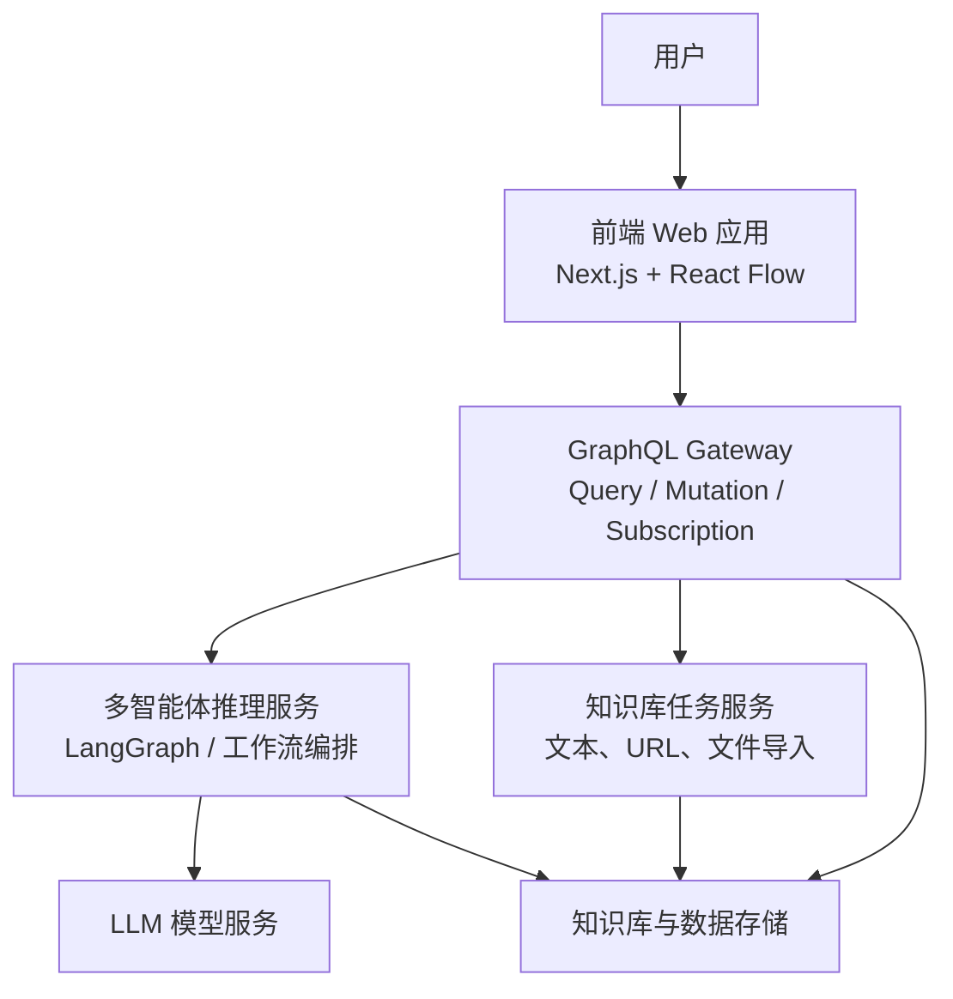
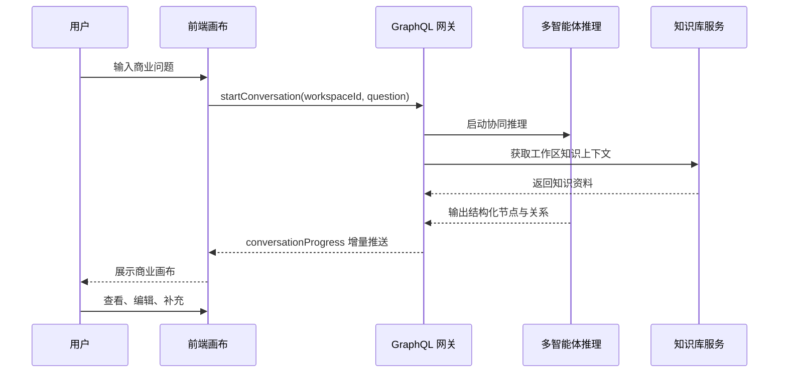

# 基于多智能体协同的生成式商业画布系统的设计与实现

## 一、项目背景与目标

随着生成式人工智能技术的发展，大语言模型在文本生成、智能问答和知识归纳等任务中表现出较强能力，并逐步进入商业分析、方案策划和辅助决策等应用场景[5-6]。然而，在复杂商业问题中，单一大语言模型仍然存在推理深度不足、分析维度覆盖不全、输出结构不稳定以及结果不易解释等问题[7-9][26-27]。尤其在商业模式分析场景下，问题往往并不是“给出一个答案”这么简单，而是需要在客户、产品、渠道、资源、成本、收益和风险之间建立多维关联，并对这些关联进行解释、比较和调整。单一模型虽然能够生成看似完整的文字结论，但其内部推理过程通常不可见，输出结果也缺乏明确的结构边界，难以直接支撑进一步的决策推演。

从应用需求来看，商业决策支持本身就是一个强调多源信息整合、分析过程透明和结果可执行性的研究领域[2-3]。传统商业分析更多依赖文档、表格和线性报告，这种形式难以直观展示商业模式中不同维度之间的关系，也不利于用户对分析过程进行持续修正与迭代。商业模式画布及其衍生的分析画布框架表明，将复杂业务问题转化为结构化要素并以可视化方式呈现，能够显著提高问题拆解和方案表达的清晰度[1][21-22]；而可视化分析研究进一步指出，复杂问题求解过程更适合通过交互式图形结构进行理解和追踪[4][17-19]。因此，若仅依靠普通对话式 AI 输出，用户虽然能够获得建议，但难以从整体结构上理解问题，也难以基于已有分析结果继续开展交互式推演。

基于上述背景，本课题拟在现有项目基础上，设计并实现一个基于多智能体协同的生成式商业画布系统。系统以前端可视化商业画布为交互载体，以 GraphQL 网关为统一调度入口，以多智能体协同推理机制为核心分析引擎，并结合工作区知识库对分析过程进行上下文增强。通过将市场、产品、财务、风险等分析任务分配给不同智能体，并以结构化节点和关系连线的方式在画布上动态呈现结果，系统将形成“问题输入—分析生成—画布展示—用户修正”的闭环流程。该课题的本质目标，不仅是提高生成结果的内容质量，更是提高商业分析过程的结构化程度、透明程度和交互效率，从而为 AI 支持下的商业模式创新与决策辅助提供一种更具可解释性的实现路径[20]。

基于上述分析可以看出，本课题并不是单纯地将大语言模型接入商业分析流程，而是试图回答一个更完整的问题：当商业决策支持任务同时要求分析深度、知识约束、结构表达与持续交互时，生成式系统应当采用何种组织方式才能真正具备实用价值。围绕这一核心问题，本课题将研究目标具体分解为以下三个方面：

1. 设计一个面向商业决策支持场景的多智能体协同推理机制，提高复杂商业问题的分析深度和维度覆盖能力。
2. 构建基于知识增强的商业分析链路，使系统能够结合工作区知识、导入资料和业务上下文生成更具针对性的结果。
3. 实现基于 React Flow 的可视化商业画布系统，将分析结果转化为可浏览、可理解、可迭代的结构化画布。

## 二、本项目的研究内容以及拟解决的主要问题

### 2.1 研究内容

本课题围绕“商业决策支持 + LLM 推理 + 多智能体协同 + 知识增强 + 可视化交互”五个方面展开研究，具体内容如下。

#### （1）商业决策支持场景建模

本课题首先从商业模式分析和创业方案论证场景出发，研究如何将商业问题抽象为结构化分析任务。重点围绕客户、产品、渠道、资源、成本、收益和风险等关键商业维度，建立适合生成式分析系统处理的问题框架。该部分研究以商业模式画布、分析画布及商业分析研究为基础，强调将业务问题转换为可建模、可分解、可交互的分析对象[1][3][21-22]。其意义在于明确系统分析对象的边界，使后续的推理机制和画布表达不只是技术堆叠，而是围绕真实商业问题展开。

#### （2）基于 LLM 的商业分析推理机制

研究大语言模型在商业分析任务中的适配方式，设计适用于商业画布生成的提示词策略、输出格式和中间推理约束机制，使模型输出不仅具有文本表达能力，还能够满足结构化建模和系统消费的要求。该部分将综合借鉴大语言模型综述、推理研究以及基于思维链的提示方法，重点不在于让模型生成更长的内容，而在于让模型生成更稳定、更可解析、更适合后续系统处理的结果[5-9][24-25][27]。

#### （3）多智能体协同分析机制

针对商业问题多维复杂的特点，研究多智能体协同分析机制。系统将市场、产品、财务、风险等不同职能抽象为不同智能体角色，通过任务分工、阶段性汇总和统一调度，实现比单一模型更完整的商业分析过程。同时，该部分还关注智能体之间的信息共享和交叉校验机制，使协同过程不仅是并行生成，而是具有一定的互补性和约束性。该研究内容主要以 CAMEL、AutoGen、MetaGPT 以及多智能体综述研究为理论基础，并吸收多智能体一致性与协作控制相关思想[10-14][23]。

#### （4）知识增强机制

研究工作区知识库、文本种子、URL 导入和文件导入等知识接入方式，使系统能够在商业分析过程中利用外部资料和历史信息，对生成过程进行上下文增强，提高结果的业务相关性和可信度。该部分重点解决“模型能说”和“模型说得对、说得贴合场景”之间的差距问题，其方法基础来自检索增强生成与 Agentic RAG 相关研究[15-16][28]。

#### （5）可视化商业画布交互

研究基于无限画布的交互设计方法，使用 React Flow 将商业分析结果转化为节点、连线和详情面板等可视化元素，使用户能够更直观地观察商业维度之间的关系，并对分析结果进行查看、补充和修正。相比单纯的聊天式界面，可视化交互更强调结构展示、路径追踪和局部修改，更符合商业分析任务对解释性和迭代性的要求。该部分研究同时参考生成式 AI 界面设计、可视化分析和可解释人工智能等相关成果[4][17-19]。

### 2.2 拟解决的主要问题

围绕上述研究内容，本课题拟重点解决以下几个问题。这些问题并非相互孤立，而是沿着“问题提出—方法设计—系统落地”的路径逐层展开：

1. 单一大语言模型难以完整覆盖复杂商业问题的多个分析维度，如何通过多智能体协同提升分析深度与完整性。
2. 商业分析结果通常以自然语言形式输出，如何将其稳定转换为结构化画布节点，避免字段缺失和表达混乱。
3. 商业分析高度依赖场景上下文，如何将工作区知识和导入资料有效接入推理过程，提高结果针对性。
4. 商业问题的逻辑关系和潜在冲突较难通过普通文本直接呈现，如何利用可视化画布增强结果的可解释性与交互性。
5. 前端交互、后端调度、多智能体推理和知识服务之间存在多模块协同需求，如何构建完整、稳定、可扩展的系统闭环。

### 2.3 课题总体逻辑链条

本课题的总体逻辑链条可进一步细化为六个相互衔接的环节。

第一，现实需求构成课题起点。商业决策支持任务并不满足于获得一段语言描述，而是要求系统能够对复杂业务问题进行拆解、组织、解释和迭代。因此，课题的起点不是“如何让模型生成内容”，而是“如何让系统支撑复杂商业分析过程”。

第二，现有方法的局限构成问题来源。单一大语言模型虽然具有较强的文本生成能力，但在复杂商业分析任务中往往只能形成线性输出，难以同时满足多维分析、知识依赖、结构表达和交互修正等要求[5-9][26-27]。这说明课题的核心矛盾不在于模型能否回答问题，而在于其回答方式是否适合决策支持场景。

第三，研究问题由上述矛盾进一步明确。既然商业分析具有多维特征，而单一模型又难以全面覆盖，那么就需要研究如何对复杂任务进行角色分工；既然商业分析依赖具体上下文，那么就需要研究如何将知识资料纳入分析过程；既然结果不仅要“能看”，还要“能用”，那么就需要研究如何把生成结果转化为结构化对象并在可视化界面中表达。

第四，解决思路由此形成。本课题据此提出“多智能体协同 + 知识增强 + 结构化生成 + 可视化交互”的总体方案：利用多智能体协同机制提升分析深度，利用知识增强机制控制输出边界，利用结构化生成机制确保结果可计算、可渲染，利用画布化交互提升解释性和用户参与度。

第五，系统实现是对研究思路的工程化落地。前端以商业画布承担交互与表达任务，GraphQL 网关负责统一编排，推理层负责多智能体协同分析，知识服务层负责上下文支撑，最终将商业问题转化为可视化、可追踪、可迭代的分析图谱。也就是说，系统架构并不是技术模块的简单拼接，而是对前述研究问题的逐项回应。

第六，系统验证构成逻辑闭环。课题最终将通过系统实现与功能验证来证明：多智能体协同是否能够提高分析完整性，知识增强是否能够提高结果贴合度，可视化画布是否能够提高解释性与交互效率。如果这些目标得到验证，就说明本课题提出的方案在理论与工程两方面均具备一定可行性。

因此，本课题的总体逻辑可以概括为：

商业决策支持场景提出结构化、可解释、可交互的分析需求  
→ 单一大语言模型难以有效满足复杂商业分析任务  
→ 需要将任务分解、多源知识约束和结果结构化表达纳入统一系统方案  
→ 形成“多智能体协同 + 知识增强 + 画布交互”的研究路径  
→ 通过系统实现构建闭环式生成式商业决策支持系统  
→ 通过功能与效果验证证明方案的合理性与应用价值。

如果将上述逻辑进一步凝练，可以表述为：

> 本课题从商业决策支持场景对结构化分析、知识支撑和交互式解释的实际需求出发，针对单一大语言模型在复杂商业分析中存在的深度不足、上下文不足和结果表达能力不足问题，提出一种融合多智能体协同、知识增强、结构化生成与可视化商业画布交互的系统方案，并通过系统实现与验证证明其在商业分析中的可行性与应用价值[2-5][10-19]。

## 三、本项目的关键技术实现

前述逻辑链决定了本课题不能只停留在概念层面的方案描述，而必须落实为与问题一一对应的关键技术实现。换言之，第三部分的各项技术不是并列罗列，而是分别对应前文提出的几个核心矛盾：多维任务如何协同、生成结果如何结构化、上下文如何注入、分析结果如何解释、系统链路如何闭环。

### 3.1 多智能体协同推理机制

本课题的核心技术之一是多智能体协同推理机制。系统将商业分析任务拆解为多个不同职能的分析角色，例如市场分析、产品规划、财务评估和风险识别等，使不同智能体能够围绕各自职责展开分析，再由统一的编排逻辑对结果进行汇总。相较于单一模型直接输出整份商业分析报告，这种方式更适合处理具有多维结构和复杂约束的商业问题[10-14]。

在实现思路上，本课题强调“分工 + 共享 + 汇总”的协同模式。一方面，不同智能体各自面向不同商业维度进行专业化分析；另一方面，各智能体的阶段性结果需要进入共享状态空间，供后续智能体参考和修正。这样可以避免各角色分析结果彼此割裂，也使系统更接近任务书中提出的黑板模型思想。必要时，还可以加入质询型或批评型智能体，对已有结论进行冲突检测和补充说明，从而提高系统的分析严谨性。该机制在方法层面与多智能体协同、反馈强化和一致性控制研究具有一致性[14][23-25]。

### 3.2 LLM 推理与结构化生成

为了使后续画布渲染能够稳定进行，系统不仅要求模型生成分析内容，还要求模型生成可结构化消费的结果。也就是说，模型输出需要被映射为统一的节点、边和元数据格式。这一过程既依赖提示词设计，也依赖后端对结果的校验与规范化处理，从而保证分析结果能够顺利进入可视化层[5-9][27]。

这一部分的关键难点在于：大语言模型天然擅长生成连续文本，但商业画布系统需要的是边界清晰、语义明确、字段稳定的结构化对象。因此，系统不能只把模型当作“写作工具”，而需要把它作为“结构化分析部件”来使用。只有解决这一问题，多智能体输出才能稳定进入前端画布、知识模块和后续验证流程。

### 3.3 知识增强机制

知识增强是提高系统可靠性的重要手段。系统通过工作区知识库、文本种子、URL 导入和文件导入等方式沉淀商业背景资料和外部信息，使模型在分析过程中能够参考具体上下文，而不是只给出泛化回答。知识增强机制的意义在于让商业分析更贴合具体项目，而非停留在通用建议层面[15-16][28]。

从方法论上看，知识增强并不是对生成结果的简单补充，而是对分析边界的主动约束。商业问题往往与具体行业、具体市场和具体资源条件相关，如果模型缺乏场景化信息，其输出就容易显得“合理但空泛”。因此，知识增强模块既承担资料管理功能，也承担事实支撑和上下文限定功能，是系统可信性的重要来源。

### 3.4 可视化商业画布表达

本课题采用可视化商业画布作为结果表达与交互载体。通过将商业分析内容呈现为节点、连线、说明信息和详情抽屉，系统能够以图形化方式展示不同商业维度之间的逻辑联系和潜在冲突。这种方式既增强了可解释性，也使用户能够在已有分析结果基础上进一步修改、扩展和验证[4][17-19]。

画布化表达的价值在于，它将“结论”转化为了“结构”。用户看到的不再是一段已经完成的文本，而是一个可被浏览、可被拆解、可被继续追问的商业分析空间。这种交互方式更加符合复杂问题求解过程中的认知需求，也能为后续系统扩展提供更清晰的数据组织形式。

### 3.5 前后端闭环集成

为了保证系统能够端到端运行，本课题采用前后端分离架构，并以 GraphQL 网关作为统一调度中枢。前端负责商业画布展示与交互，后端负责问题处理、推理编排、结构化输出和事件推送。通过这种方式，系统能够形成从问题输入到画布展示的完整闭环。

选择 GraphQL 作为中间层的原因在于，本系统既需要一次性获取初始图谱，又需要接收分析过程中的增量更新。相较于传统 REST 接口，GraphQL 更便于统一组织查询、变更和订阅语义，也更适合支撑“画布初始加载 + 生成过程流式推进”的交互模式。该分层设计也有助于把用户交互层、推理层和知识层解耦，提高系统的可扩展性与可维护性。

## 四、系统设计与开发

如果说第三部分回答的是“采用什么方法解决问题”，那么第四部分回答的就是“这些方法如何在系统中被组织和实现”。因此，本部分的系统设计并非附属性说明，而是研究思路在工程层面的具体展开。

### 4.1 系统总体架构

系统总体架构包括前端可视化层、GraphQL 网关层、多智能体推理层、知识服务层和数据存储层。前端使用 Next.js 与 React Flow 构建商业画布界面；GraphQL 网关负责统一处理查询、变更和订阅事件；多智能体推理层负责生成结构化商业分析；知识服务层负责知识库的创建、导入和状态管理；数据存储层负责持久化业务数据和知识资料。

这种分层方式体现了“交互层、编排层、分析层、知识层、存储层”相互分工的设计思想。前端聚焦用户体验和结构表达，网关承担服务编排和状态连接职责，推理层负责生成分析结果，知识层提供外部上下文支撑，存储层保证系统状态可追踪、可复用。该架构既满足当前课题实现需求，也为后续功能扩展保留了空间。

### 4.2 技术路线设计

本课题的技术路线以商业问题输入为起点，以画布生成和用户修正为终点。系统首先完成任务理解与问题分解，再通过多智能体协同和知识增强完成分析过程，随后将输出结果转化为结构化实体，最终在前端商业画布中进行渲染与交互。

### 4.3 系统业务流程

系统的运行流程如下：用户输入商业问题后，前端通过 GraphQL 接口触发分析流程；网关调用多智能体推理服务，并结合知识服务提供上下文支持；后端将分析结果整理为结构化节点与关系，再通过订阅机制向前端推送增量更新；最终前端渲染完整商业画布，供用户进一步查看和修正。

### 4.4 开发基础与实现条件

本课题依托当前项目已有基础开展。现有项目已经具备以下实现条件：

1. 基于 Next.js 和 React Flow 的前端画布原型。
2. 基于 GraphQL 的统一数据接口与订阅更新机制。
3. 面向多智能体分析的后端推理原型。
4. 支持文本、URL 和文件导入的知识库服务。
5. 使用 TypeScript 和 Monorepo 组织方式的工程基础。

这些条件说明本课题不是从零开始，而是在已有系统基础上开展功能深化和研究抽象，因此具备较强的开发可行性。与此同时，现有系统已经包含前端交互原型、服务端接口和知识模块基础，这使得本课题能够将更多精力放在协同机制设计、结构化生成和系统逻辑闭环上，而不是耗费在基础工程搭建上。

## 五、项目总结

本课题面向商业决策支持场景，围绕单一大语言模型在复杂商业分析中存在的深度不足、结构化不足和可解释性不足问题，提出基于多智能体协同、知识增强和可视化交互的生成式商业画布系统方案。该系统的核心思想不是直接生成一段商业分析文字，而是将商业问题转化为可被分解、可被协同、可被展示和可被修正的系统流程。换言之，本课题既关注生成结果本身，也关注生成过程的组织方式与用户参与方式。

从研究内容上看，本课题同时覆盖商业决策支持、LLM 推理、多智能体协同、知识增强和可视化交互五个方面；从工程实现上看，本课题通过前端画布、GraphQL 网关、推理服务和知识服务的协同，构建一个完整的端到端闭环系统；从预期效果上看，本课题希望证明这种方案能够提高商业分析的结构化程度、可解释性和交互效率。其研究价值不仅在于实现一个可运行的系统原型，更在于探索生成式 AI 在垂直商业场景中的一种较为完整的系统形态，为后续相关研究和应用提供可参考的设计思路。

## 六、参考文献

[1] Osterwalder A, Pigneur Y. Business Model Generation: A Handbook for Visionaries, Game Changers, and Challengers[M]. Hoboken: Wiley, 2010.

[2] Arnott D, Pervan G. A critical analysis of decision support systems research revisited: the rise of design science[J]. Journal of Information Technology, 2014, 29(4): 269-293.

[3] Yin J, Fernandez V. A systematic review on business analytics[J]. Journal of Industrial Engineering and Management, 2020, 13(2): 283-297.

[4] Thomas J J, Cook K A. A Visual Analytics Agenda[M]. Piscataway: IEEE Computer Society, 2006.

[5] Zhao W X, Zhou K, Li J, et al. A Survey of Large Language Models[EB/OL]. arXiv:2303.18223, 2023.

[6] Huang J, Chang K C-C. Towards Reasoning in Large Language Models: A Survey[C]//Findings of the Association for Computational Linguistics: ACL 2023. Toronto: Association for Computational Linguistics, 2023: 1049-1065.

[7] Wei J, Wang X, Schuurmans D, et al. Chain-of-Thought Prompting Elicits Reasoning in Large Language Models[J]. Advances in Neural Information Processing Systems, 2022, 35: 24824-24837.

[8] Wang X, Wei J, Schuurmans D, et al. Self-Consistency Improves Chain of Thought Reasoning in Language Models[C]//International Conference on Learning Representations. Kigali: OpenReview.net, 2023.

[9] Yao S, Yu D, Zhao J, et al. Tree of Thoughts: Deliberate Problem Solving with Large Language Models[J]. Advances in Neural Information Processing Systems, 2023, 36: 11809-11822.

[10] Li G, Hammoud H A A K, Itani H, et al. CAMEL: Communicative Agents for “Mind” Exploration of Large Language Model Society[J]. Advances in Neural Information Processing Systems, 2023, 36: 51991-52008.

[11] Wu Q, Bansal G, Zhang J, et al. AutoGen: Enabling Next-Gen LLM Applications via Multi-Agent Conversation[C/OL]//Proceedings of the First Conference on Language Modeling. 2024.

[12] Hong S, Zhuge M, Chen J, et al. MetaGPT: Meta Programming for A Multi-Agent Collaborative Framework[C/OL]//International Conference on Learning Representations. 2024.

[13] Guo T, Chen X, Wang Y, et al. Large Language Model Based Multi-Agents: A Survey of Progress and Challenges[C]//Proceedings of the Thirty-Third International Joint Conference on Artificial Intelligence. 2024: 8048-8057.

[14] Chen S, Liu Y, Han W, Zhang W, Liu T. A Survey on LLM-based Multi-Agent System: Recent Advances and New Frontiers in Application[EB/OL]. arXiv:2412.17481, 2025.

[15] Gao Y, Xiong Y, Gao X, et al. Retrieval-Augmented Generation for Large Language Models: A Survey[EB/OL]. arXiv:2312.10997, 2024.

[16] Singh A, Ehtesham A, Kumar S, Khoei T T. Agentic Retrieval-Augmented Generation: A Survey on Agentic RAG[EB/OL]. arXiv:2501.09136, 2025.

[17] Luera R, et al. Survey of User Interface Design and Interaction Techniques in Generative AI Applications[EB/OL]. arXiv:2410.22370, 2024.

[18] Wang J, Liu S, Zhang W. Visual Analytics for Machine Learning: A Data Perspective Survey[J]. IEEE Transactions on Visualization and Computer Graphics, 2024, 30(12): 7637-7656.

[19] Barredo Arrieta A, Díaz-Rodríguez N, Del Ser J, et al. Explainable Artificial Intelligence (XAI): Concepts, taxonomies, opportunities and challenges toward responsible AI[J]. Information Fusion, 2020, 58: 82-115.

[20] Sjödin D, Parida V, Palmié M, Wincent J. How AI capabilities enable business model innovation: Scaling AI through co-evolutionary processes and feedback loops[J]. Journal of Business Research, 2021, 134: 574-587.

[21] Kühn A, Joppen R, Reinhart F, et al. Analytics Canvas: A Framework for the Design and Specification of Data Analytics Projects[J]. Procedia CIRP, 2018, 70: 162-167.

[22] Panzner M, Meyer M, von Enzberg S, Dumitrescu R. Business-to-Analytics Canvas: Translation of Product Planning-Related Business Use Cases into Concrete Data Analytics Tasks[J]. Procedia CIRP, 2022, 109: 580-585.

[23] Amirkhani A, Barshooi A H. Consensus in Multi-Agent Systems: A Review[J]. Artificial Intelligence Review, 2022, 55(5): 3897-3935.

[24] Yao S, Zhao J, Yu D, et al. ReAct: Synergizing Reasoning and Acting in Language Models[C/OL]//International Conference on Learning Representations. 2023.

[25] Shinn N, Cassano F, Gopinath A, Narasimhan K, Yao S. Reflexion: Language Agents with Verbal Reinforcement Learning[J]. Advances in Neural Information Processing Systems, 2023, 36: 8634-8652.

[26] Liu Y, Yao Y, Li P, et al. Trustworthy LLMs: A Survey and Guideline for Evaluating Large Language Models’ Alignment[EB/OL]. arXiv:2308.05374, 2024.

[27] Besta M, Blach N, Kubicek A, et al. Graph of Thoughts: Solving Elaborate Problems with Large Language Models[J]. Proceedings of the AAAI Conference on Artificial Intelligence, 2024, 38(16): 17682-17690.

[28] Pan J Z, Vetere G, Gomez-Perez J M, Wu H. Large Language Models and Knowledge Graphs: Opportunities and Challenges[J]. Transactions on Graph Data and Knowledge, 2023, 1(1): 2:1-2:38.
