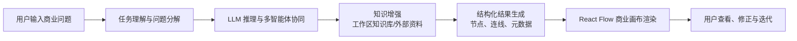
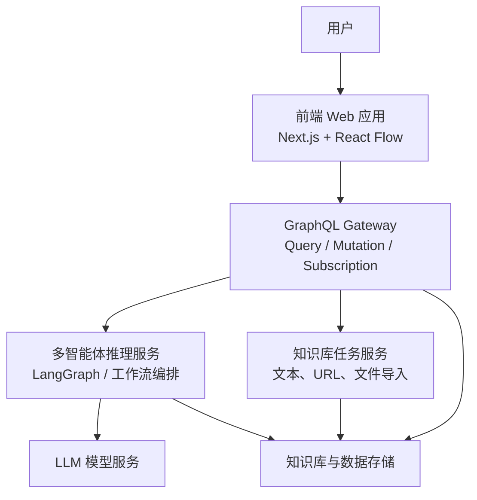
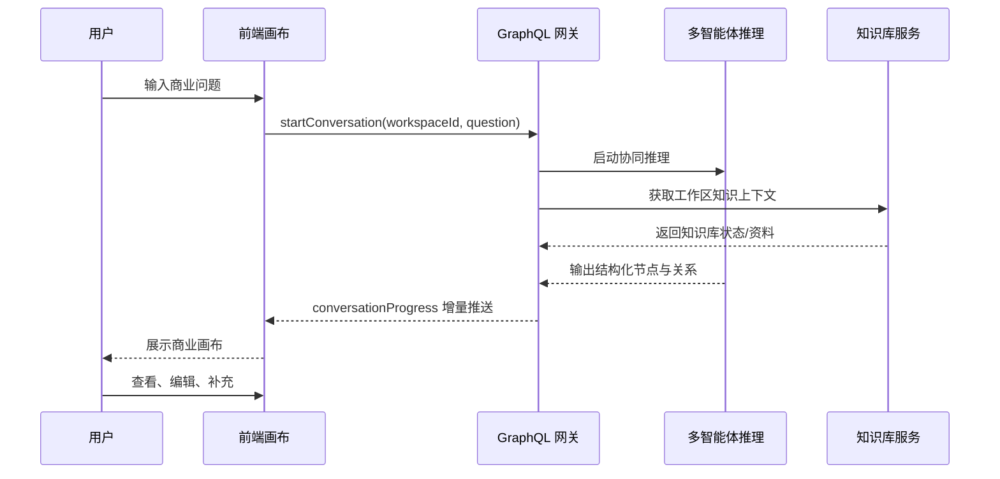

# 基于多智能体协同的生成式商业画布系统的设计与实现

> 说明：本稿基于当前项目 `Starlink / Branching Chat` 的现有实现整理，适合作为毕业设计开题报告初稿。正式提交时可按学校模板将对应段落拆分填入。

## 一、课题研究背景与意义

随着生成式人工智能技术的发展，大语言模型已经在文本生成、问答辅助和知识归纳等场景中表现出较强能力。然而，在商业模式分析、创业方案设计和复杂决策支持等任务中，单一大语言模型仍然存在推理链条不稳定、分析维度覆盖不全、结论可解释性不足和交互方式不够直观等问题。传统的商业分析通常依赖线性文档、表格或口头讨论，难以同时呈现“问题背景、分析过程、维度关系、冲突点与行动建议”之间的关联。

商业决策支持场景具有信息来源多、分析维度复杂、逻辑关联强的特点。若仅依赖普通对话式生成结果，用户很难对模型的分析过程进行追踪、修正和验证。因此，有必要将大语言模型的推理能力、多智能体协同机制、知识增强手段以及可视化交互技术结合起来，形成面向商业场景的生成式决策支持系统。

本课题拟在现有项目基础上，设计并实现一个基于多智能体协同的生成式商业画布系统。系统以前端可视化商业画布为交互载体，以 GraphQL 网关为系统中枢，以多智能体协同推理链路为核心分析引擎，并结合工作区知识库对模型输出进行增强与约束。通过将市场、产品、财务、风险等分析任务分配给不同智能体，并以节点化、关系化的方式在画布中展示结果，系统能够提升商业分析的结构化程度、可解释性和交互效率。

本课题的研究意义主要体现在以下三个方面：

1. 在理论层面，探索多智能体协同与商业决策支持场景的结合方式，为垂直领域生成式应用提供参考。
2. 在方法层面，将 LLM 推理、多智能体分工、知识增强和可视化交互整合为一个闭环系统，改善单一模型输出不稳定的问题。
3. 在应用层面，为商业模式分析、创业项目论证和方案评估提供一种更直观、更具可追溯性的系统实现方式。

## 二、国内外研究现状

### 2.1 商业决策支持研究现状

决策支持系统长期以来是信息系统研究的重要方向。传统 DSS 强调数据处理、模型分析和人机协同，但在复杂商业场景中，系统输出往往以表格、规则或静态报告为主，缺乏生成式交互能力。近年来，随着大语言模型的发展，研究者开始尝试将自然语言交互引入决策支持流程，使用户能够通过问题驱动的方式获得分析建议。但纯文本输出形式仍然不利于复杂业务逻辑的层次化表达，也不利于团队协同讨论。

商业画布作为商业模式分析的经典工具，具有结构清晰、维度明确、表达直观等优势。Osterwalder 等提出的 Business Model Canvas 为商业分析提供了标准化框架，也为本课题提供了重要理论基础。将商业画布与 AI 生成能力结合，是提升决策支持系统实用性的一个重要方向。

### 2.2 大语言模型推理研究现状

大语言模型在自然语言理解与生成方面取得了显著进展，但在复杂推理任务中仍然存在幻觉、推理链断裂、结论缺乏约束等问题。为此，研究者提出了 Chain-of-Thought、Self-Consistency、Tree-of-Thoughts 等方法，尝试提升模型的推理稳定性和复杂问题处理能力。这些研究表明，合理设计中间推理步骤和结构化输出机制，有助于提升复杂任务求解效果。

不过，在面向具体商业问题时，仅靠单次文本推理往往难以同时覆盖市场、价值主张、渠道、收入和成本等多个维度。因此，需要将复杂任务拆解为多个更清晰的子任务，并采用模块化方式组织推理过程。

### 2.3 多智能体协同研究现状

多智能体协同是近年来生成式 AI 应用的重要研究方向。CAMEL、AutoGen、MetaGPT、LangGraph 等框架分别从角色分工、对话式协同、软件工程流程模拟和图结构编排等角度，推动了多智能体系统的发展。相关研究表明，多智能体机制能够通过任务分工、交叉校验和阶段化编排，提高复杂任务的求解深度与可靠性。

在商业分析场景中，不同角色智能体可以分别承担市场调研、产品规划、财务测算和风险识别等职能，这与现实中的业务分析流程具有较强一致性。因此，多智能体机制具备较好的场景适配性。但如何让多智能体输出能够稳定映射为可视化结构，并服务于用户后续交互，仍然是需要解决的问题。

### 2.4 知识增强研究现状

知识增强的核心目标是将外部知识或领域数据引入大模型生成过程，降低模型幻觉，提高输出与场景的贴合度。常见方式包括检索增强生成、领域知识库约束、文档导入与结构化知识沉淀等。对于商业决策支持任务而言，若系统能够引入项目文档、行业资料、历史案例或工作区内部沉淀内容，则生成结果会更具针对性与可信度。

当前很多生成式系统已引入知识库，但多数仍停留在问答或摘要层面，尚未充分与可视化分析结果结合。因此，如何让知识增强能力真正服务于商业画布生成，是本课题的重要研究内容之一。

### 2.5 可视化交互研究现状

可视化分析强调通过图形化方式辅助用户理解复杂信息结构。React Flow 等前端图谱画布技术的发展，使基于节点和连线的交互界面更容易落地。与线性对话相比，基于画布的交互方式更适合展示商业分析中的多维关系、推理分支和潜在冲突。

现有多数 LLM 产品仍以聊天框为核心交互模式，缺少对复杂思维结构的可视化表达。将可视化画布与多智能体生成结果结合，可以增强系统的解释性和用户可控性，也是本课题的工程创新点之一。

### 2.6 小结

综上，现有研究已经在商业决策支持、大语言模型推理、多智能体协同、知识增强和可视化分析等方面提供了较好的理论和方法基础，但将这些能力整合为“生成式商业画布系统”的研究与实现仍较少。特别是在商业场景下，如何形成“用户提问 - 多智能体分析 - 知识增强支撑 - 画布可视化呈现 - 用户进一步修正”的闭环系统，仍具有较大的研究和实践价值。

## 三、主要任务与研究内容

### 3.1 主要任务

本课题的主要任务包括以下三个方面：

1. 设计并实现面向商业决策支持场景的多智能体协同推理机制，构建市场、产品、财务、风险等角色的分工与协作流程。
2. 设计并实现基于知识增强的 LLM 商业分析能力，将工作区知识库、外部资料导入与结构化结果生成结合起来，提高分析结果的针对性与可信度。
3. 设计并实现基于 React Flow 的可视化商业画布交互系统，并完成前后端闭环集成与系统验证。

### 3.2 研究内容

结合本课题定位与当前项目基础，研究内容按以下五个板块展开。

#### （1）商业决策支持

围绕创业项目论证、商业模式分析和方案评估等典型场景，研究生成式系统在商业决策支持中的应用方式。重点分析商业问题的结构化特征，将客户细分、价值主张、渠道通路、收入来源、成本结构等商业画布核心要素纳入统一分析框架。

#### （2）LLM 推理

研究大语言模型在商业分析任务中的使用方式，设计适用于商业画布生成的提示词策略、结构化输出格式与中间推理约束，提升模型输出的完整性和一致性。系统将面向节点化画布结果定义统一数据结构，为前端渲染和后端持久化提供基础。

#### （3）多智能体协同

研究多智能体协同机制在本系统中的应用。系统将不同商业分析职责拆分为多个智能体角色，并基于图式流程编排思想设计其调用顺序、状态流转与结果汇总方式，以增强复杂问题的分析深度与维度覆盖度。

#### （4）知识增强

研究工作区知识库在系统中的组织和接入方式，通过文本种子、URL 导入、文件导入等方式沉淀领域资料，为后续商业分析提供外部上下文支持。知识增强模块的目标是降低模型幻觉，提升分析结果与具体业务背景的贴合程度。

#### （5）可视化交互

研究基于无限画布的交互系统设计，使用 React Flow 实现商业分析结果的节点化呈现、关系展示和动态更新。通过节点、边和详情面板等形式，将多智能体的输出转化为可浏览、可理解、可扩展的商业分析画布。

### 3.3 课题逻辑链

为了使本课题的研究思路更加清晰，可以将整体逻辑链概括为“场景需求驱动问题提出，问题导向方法设计，方法落到系统实现，系统再通过实验验证其有效性”的完整链条。具体可分为以下五层。

#### （1）从应用场景出发提出研究问题

本课题首先立足于商业决策支持这一应用场景。商业模式分析、创业方案论证和业务规划往往涉及客户、产品、渠道、成本、收益和风险等多个维度，这些维度之间存在明显的关联关系与约束关系。传统线性文档和普通对话式 AI 输出虽然能够给出建议，但难以同时满足以下需求：一是多维信息的系统化拆解，二是复杂推理过程的可追溯表达，三是分析结论的可视化展示与后续交互修正。

因此，课题的第一个核心问题就被明确为：如何面向商业决策支持场景，构建一种既具有生成能力、又具备结构化表达和交互能力的系统。

#### （2）从现有方法不足中提炼研究矛盾

在明确场景需求后，需要进一步分析现有技术为什么不能直接满足需求。单一大语言模型虽然能够根据用户问题生成看似完整的商业建议，但通常存在以下不足：

1. 推理深度有限，难以同时兼顾市场、产品、财务和风险等多个维度。
2. 输出结果通常以自然语言段落为主，不利于结构化建模和前端系统消费。
3. 模型缺乏稳定的外部知识支撑时，容易产生泛化回答或事实漂移。
4. 聊天式界面难以直观展示商业维度之间的关系、冲突与推演过程。

由此可见，本课题真正要解决的研究矛盾是：商业决策支持任务本身具有多维、关联、动态和可解释性要求，而单一 LLM 输出机制通常是单步、线性、弱约束和弱交互的，两者之间存在明显不匹配。

#### （3）围绕研究矛盾提出总体解决思路

针对上述矛盾，本课题提出的总体思路是：以多智能体协同机制提升分析深度，以知识增强机制提升输出可靠性，以结构化节点表示提升结果可计算性，以可视化商业画布提升展示与交互能力，并以统一网关机制将各模块组织为闭环系统。

这条思路对应的因果链为：

1. 因为商业问题具有多维特征，所以需要将复杂任务拆解给多个角色智能体分别处理。
2. 因为单一模型输出容易泛化和漂移，所以需要引入知识增强模块提供业务上下文。
3. 因为自然语言结果难以直接进入前端画布，所以需要把推理结果转换为结构化节点、边和元数据。
4. 因为用户不仅需要“得到答案”，还需要“理解答案、修正答案、继续追问”，所以需要可视化商业画布作为交互载体。
5. 因为系统包含前端、推理和知识库多个模块，所以需要以 GraphQL 网关为统一编排中枢，实现数据和状态的闭环流动。

也就是说，本课题不是单纯研究“怎样让模型回答一个商业问题”，而是研究“怎样把商业问题转化为一个可以被多智能体分析、被知识增强约束、被前端画布表达、并能被用户持续交互的系统过程”。

#### （4）将总体思路分解为可实现的系统方案

在系统实现层面，上述总体思路将被进一步拆分为四个可落地模块。

1. 商业问题理解与任务分解模块  
系统接收用户输入后，首先识别任务类型和分析目标，并将问题拆解为适合不同智能体处理的子任务。

2. 多智能体协同推理模块  
市场、产品、财务、风险等不同角色的智能体围绕各自职责展开分析，再由统一编排逻辑进行汇总与整合。

3. 知识增强与结构化生成模块  
系统结合工作区知识库或外部导入资料，对分析过程进行上下文补充，并将输出统一映射为画布节点和关系结构。

4. 可视化商业画布交互模块  
前端将结构化结果渲染为节点化商业画布，用户可以查看维度分布、节点详情、关系连线和潜在冲突，从而形成对分析结果的理解和进一步修正。

这样一来，课题中的“研究问题”就被映射为了“系统模块”，而“系统模块”又可以进一步映射为“毕业设计可完成的具体工作内容”。

#### （5）通过实验与验证闭合研究链条

最后，为了证明本课题提出的方案具有实际价值，还需要建立与研究目标相对应的验证方式。验证思路主要包括以下三个层面：

1. 功能验证  
验证系统是否能够完成从用户问题输入到商业画布生成的完整链路，是否具备多智能体协同、知识导入、结构化生成与可视化展示等核心功能。

2. 效果验证  
验证多智能体协同机制是否能够比单一模型输出覆盖更多商业维度，知识增强是否能够提升结果与具体业务背景的贴合度，可视化画布是否能够增强用户对分析过程的理解。

3. 工程验证  
验证系统在前后端联动、GraphQL 订阅更新、节点结构一致性和模块可扩展性方面是否满足软件工程实现要求。

至此，本课题的完整逻辑链可以概括为：

商业决策支持场景对结构化、可解释和可交互分析提出需求  
→ 单一 LLM 难以满足复杂商业分析任务  
→ 引入多智能体协同、知识增强和结构化生成机制  
→ 通过 GraphQL 网关与可视化画布实现系统闭环  
→ 通过功能、效果和工程三类验证证明方案可行。

如果进一步压缩为一句话，则可以表述为：

> 本课题从商业决策支持的实际需求出发，针对单一大语言模型在复杂商业分析中存在的深度不足、结构化不足和可解释性不足问题，提出一种融合多智能体协同、知识增强与可视化画布交互的生成式商业画布系统，并通过系统实现与实验验证其有效性与可行性。

## 四、拟解决的关键问题

本课题拟重点解决以下问题：

1. 如何将复杂商业分析任务合理拆解为多个智能体协同处理的子任务，并保证整体流程可控。
2. 如何让 LLM 输出稳定转换为结构化商业画布节点，减少字段缺失、格式不一致和内容漂移问题。
3. 如何将知识库导入内容有效接入分析过程，使生成结果能够结合具体业务背景，而非停留在泛化回答层面。
4. 如何通过可视化画布表达商业维度之间的关联关系与潜在冲突，提高分析过程的可解释性。
5. 如何打通前端交互、GraphQL 网关、推理引擎和知识库服务，形成完整的系统闭环。

## 五、研究方法与技术路线

### 5.1 研究方法

本课题将采用文献研究法、系统分析法、原型设计法和工程实现法开展研究。

1. 文献研究法：梳理商业决策支持、多智能体系统、LLM 推理、知识增强和可视化分析等领域的研究成果。
2. 系统分析法：分析商业模式生成任务的业务流程与交互需求，抽象系统模块边界与数据流转关系。
3. 原型设计法：基于现有项目逐步构建系统原型，对多智能体协同和画布交互进行迭代验证。
4. 工程实现法：采用前后端分离架构完成系统开发，并结合测试手段对关键功能进行验证。

### 5.2 技术路线

本课题的技术路线如下：首先从商业问题输入出发，对问题进行任务识别与场景理解；随后由多智能体协同机制完成分维度分析，并结合知识增强模块引入工作区上下文；之后将分析结果转换为结构化节点与关系；最后在前端可视化画布中进行渲染、交互和动态更新，形成从问题到画布的闭环链路。

### 5.3 系统总体框架

系统总体上采用前后端分离与网关聚合相结合的架构。前端负责商业画布展示与用户交互，GraphQL 网关负责统一编排前后端数据接口，多智能体推理服务负责商业分析生成，知识库服务负责资料导入与上下文管理。

### 5.4 关键业务流程

本系统的关键业务流程包括：用户提交商业问题；GraphQL 网关触发分析流程；多智能体对市场、产品、财务等维度进行协同推理；系统按统一结构输出画布节点和边；前端基于订阅机制接收增量更新并渲染画布；用户进一步查看详情、发现问题并触发下一轮分析。

## 六、系统设计方案

### 6.1 前端可视化交互设计

前端采用 Next.js 作为应用框架，使用 React Flow 构建商业画布界面。系统通过节点与连线展示商业分析结果，支持不同类型节点的呈现与后续扩展。节点不仅承载文本内容，也承载所属维度、来源智能体、置信度和标签等元信息，从而增强结果解释能力。

### 6.2 后端服务设计

后端以 GraphQL Gateway 作为统一入口，负责处理 `workspaceGraph` 查询、`startConversation` 变更以及 `conversationProgress` 订阅事件。此设计有利于前端以统一方式获取初始图谱与增量结果，也便于后续扩展更多业务模块。

### 6.3 多智能体协同推理设计

系统基于多智能体协同思想，将商业分析任务拆解为市场、产品、财务、风险等不同角色。每个角色分别聚焦其专业维度进行分析，再由统一编排逻辑对结果进行汇总、结构化与输出。相较于单一模型直接生成完整商业画布，该方式更适合复杂商业问题的逐层展开。

### 6.4 知识增强设计

系统在工作区内建设知识库模块，支持文本种子、URL 以及文件资料的导入，并通过发布流程沉淀为可复用的知识基础。知识增强模块的作用不是单纯存储资料，而是为商业分析过程提供上下文支撑，使结果更加贴合具体业务背景。

## 七、可行性分析

### 7.1 技术可行性

当前项目已经具备较好的实现基础：前端已采用 Next.js 与 React Flow 构建画布交互；后端已具备 GraphQL 网关与订阅机制；项目中已存在多智能体推理服务原型；知识库模块已支持创建、导入、发布和状态查询等能力。因此，本课题具备较强的技术落地基础。

### 7.2 理论可行性

本课题参考了商业画布、决策支持系统、多智能体协同和大语言模型推理等相关研究成果，理论依据较为充分。任务书给出的参考文献也为后续文献综述和方法论设计提供了支撑。

### 7.3 工程可行性

项目采用 Monorepo 结构组织前端、服务端和共享类型，模块边界清晰，便于后续迭代。前后端均使用 TypeScript，有利于数据结构统一和工程维护。测试与文档基础也相对完整，能够支撑毕业设计周期内的持续开发和验证。

## 八、预期创新点

1. 将多智能体协同推理机制引入商业画布生成场景，增强商业分析的多维度覆盖能力。
2. 将知识增强模块与商业画布生成过程结合，提升输出结果与具体业务背景之间的匹配程度。
3. 将商业分析结果以可视化画布形式呈现，而非停留在普通文本层面，提高系统可解释性和用户交互效率。
4. 构建“用户提问 - 多智能体推理 - 知识增强 - 画布展示 - 用户修正”的闭环式生成式商业决策支持系统。

## 九、进度安排

根据任务书安排，课题计划分三个阶段推进：

1. 2026 年 3 月 13 日前：完成文献综述、开题报告和外文翻译的定稿提交。
2. 2026 年 4 月 24 日前：完成系统主要模块的编码、联调与初步测试。
3. 2026 年 6 月 12 日前：完成毕业论文、系统完善、测试总结和相关材料的最终提交。

## 十、预期成果

本课题的预期成果包括：

1. 一套基于多智能体协同的生成式商业画布系统原型。
2. 一套支持知识增强与可视化展示的商业分析流程。
3. 一份毕业设计论文，系统总结设计思路、实现过程与测试结果。
4. 与论文配套的系统架构图、技术路线图和业务流程图。

## 十一、参考文献

[1] Osterwalder A, Pigneur Y. Business Model Generation: A Handbook for Visionaries, Game Changers, and Challengers[M]. Hoboken: Wiley, 2010.

[2] Arnott D, Pervan G. A critical analysis of decision support systems research revisited: the rise of design science[J]. Journal of Information Technology, 2014, 29(4): 269-293.

[3] Yin J, Fernandez V. A systematic review on business analytics[J]. Journal of Industrial Engineering and Management, 2020, 13(2): 283-297.

[4] Thomas J J, Cook K A. A Visual Analytics Agenda[M]. Piscataway: IEEE Computer Society, 2006.

[5] Li G, Hammoud H A A K, Itani H, et al. CAMEL: communicative agents for “mind” exploration of large language model society[EB/OL]. arXiv:2303.17760, 2023.

[6] Wu Q, Bansal G, Zhang J, et al. AutoGen: enabling next-gen LLM applications via multi-agent conversation[EB/OL]. arXiv:2308.08155, 2024.

[7] Hong S, Zhuge M, Chen J, et al. MetaGPT: meta programming for a multi-agent collaborative framework[EB/OL]. arXiv:2308.00352, 2023.

[8] Guo T, Chen X, Wang Y, et al. Large language model based multi-agents: a survey of progress and challenges[EB/OL]. arXiv:2402.01680, 2024.

[9] Wang X, Wei J, Schuurmans D, et al. Self-consistency improves chain of thought reasoning in language models[C]//International Conference on Learning Representations. 2023.

[10] Yao S, Yu D, Zhao J, et al. Tree of thoughts: deliberate problem solving with large language models[C]//Advances in Neural Information Processing Systems. 2023.

[11] Shinn N, Cassano F, Berman E, et al. Reflexion: language agents with verbal reinforcement learning[EB/OL]. arXiv:2303.11366, 2023.

[12] Lewis P, Perez E, Piktus A, et al. Retrieval-Augmented Generation for Knowledge-Intensive NLP Tasks[C]//Advances in Neural Information Processing Systems. 2020.

## 十二、使用建议

如果你的学校模板栏目与本稿不完全一致，建议按下面方式拆分：

1. “研究背景与意义”对应本稿第一部分。
2. “国内外研究现状”对应本稿第二部分。
3. “主要任务与研究内容”对应本稿第三部分。
4. “拟解决的问题、研究方法、技术路线”对应本稿第四、第五部分。
5. “可行性分析、进度安排、预期成果”对应本稿第七至第十部分。
6. 三张 Mermaid 图可分别作为“系统总体框架图”“技术路线图”“业务流程图”使用；若学校模板不能直接插入 Mermaid，可后续转绘为 Visio、draw.io 或 PPT 图形。
